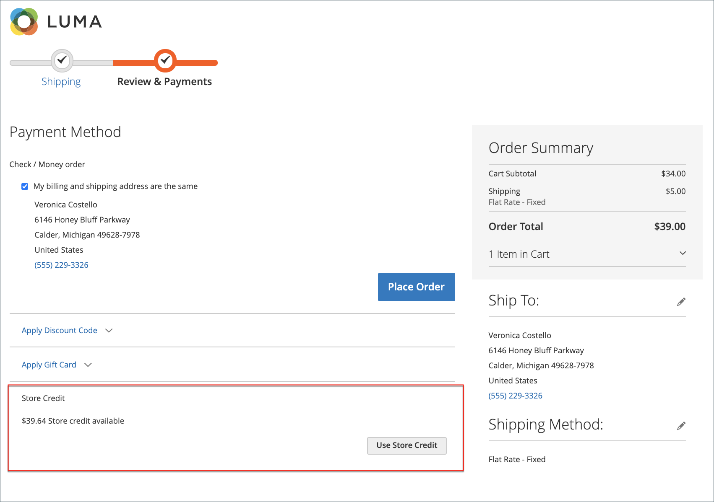

# Erstattungen im Dashboard des Kundenkontos

{{ee-feature}}

Wenn eine Rückerstattung für eine Bestellung erteilt wurde, können Kunden die mit der Bestellung verbundenen Rückerstattungsinformationen in ihrem Konto-Dashboard anzeigen. Wenn Sie die Option [!UICONTROL _Store Credit History to Customers anzeigen_] für die [Konfiguration von Store Credit](../customers/credit-configure.md) aktiviert haben, können Kunden auch auf den Verlauf ihres [Store Credit](../customers/store-credit.md) zugreifen.

## Anzeigen einer Rückerstattung an die Storefront

1. Über die Storefront meldet sich der Kunde bei seinem Konto an.

1. Lokalisiert ihre Reihenfolge mit einer der folgenden Methoden:

   * Suchen Sie die Bestellung in der Liste der **letzten Bestellungen** und klicken Sie auf **[!UICONTROL View]**.
   * Wählen Sie im linken Bereich **[!UICONTROL My Orders]** aus. Suchen Sie dann die Reihenfolge in der Liste und klicken Sie auf **[!UICONTROL View]**.

1. Der Kunde klickt auf den Tab **[!UICONTROL Refunds]** , um die Details der Rückerstattung anzuzeigen.

   {width="700" zoomable="yes"}

## Anzeigen des Kontostands und des Verlaufs des Storefront

Methode 1: **Über das Dashboard des Kundenkontos**

1. Über die Storefront meldet sich der Kunde bei seinem Konto an.

1. Wenn die Rückerstattung auf die Speicherung von Gutschriften angewendet wurde, wählt im linken Bereich die Option &quot;**[!UICONTROL Store Credit]**&quot;.

1. Der Betrag, der dem Store-Guthaben zurückerstattet wurde, erscheint in der Liste mit Datum und Uhrzeit der Aktion.

   {width="700" zoomable="yes"}

   >[!INFO]
   >
   >Die Seite &quot;Kreditkarte speichern&quot;enthält auch einen Link, über den der Kunde eine [Geschenkkarte](../stores-purchase/product-gift-card-workflow.md#check-status-and-balance-of-the-gift-card) einlösen kann.

Methode 2: **von der Seite _Überprüfung und Zahlungen_**

1. Der Kunde fügt dem Warenkorb ein Produkt hinzu.

2. Fahren Sie mit der Seite _Checkout_ fort.

3. Übergibt den Schritt **[!UICONTROL Shipping]** .

4. Wenn die Speichergutschrift verfügbar ist, klickt der Kunde auf **[!UICONTROL Use Store Credit]**.

   {width="700" zoomable="yes"}

5. Wenn der Kunde seine Meinung zur Verwendung des Store-Guthabens ändert, klickt im Abschnitt _Bestellzusammenfassung_ auf **[!UICONTROL Remove]** .

## Zahlungsaktionen im Admin

Sie können Zahlungsaktionen für Ihre spezifische [Zahlungsmethode](../configuration-reference/sales/payment-methods.md) konfigurieren. Jede Zahlungsmethode verfügt über einen anderen Satz von Zahlungsaktionen.

| Zahlungsaktion | Beschreibung |
|--- |---|
| [!UICONTROL Capture Online] | Wenn die Rechnung übermittelt wird, erfasst das System die Zahlung vom Zahlungseingang des Drittanbieters. Ein Admin-Benutzer kann dann ein Kreditmemo erstellen und die Rechnung löschen. |
| [!UICONTROL Capture Offline] | Wenn die Rechnung übermittelt wird, erfasst das System die Zahlung nicht. Es wird davon ausgegangen, dass die Zahlung direkt über das Gateway erfasst wird und die Zahlung nicht über Adobe Commerce erfasst werden kann. Ein Admin-Benutzer kann dann ein Kreditmemo erstellen, die Rechnung jedoch nicht annullieren. (Obwohl die Bestellung eine Online-Zahlung verwendet hat, ist die Rechnung im Wesentlichen eine Offline-Rechnung.) |
| [!UICONTROL Not Capture] | Wenn die Rechnung übermittelt wird, erfasst das System die Zahlung nicht. Es wird davon ausgegangen, dass die Zahlung später über Adobe Commerce erfasst wird. Die ausgefüllte Rechnung enthält die Schaltfläche [!UICONTROL _Capture_] . Vor der Erfassung können Sie die Rechnung stornieren. Nach der Erfassung können Sie ein Kreditmemo erstellen und die Rechnung annullieren. |

{style="table-layout:auto"}

>[!WARNING]
>
>Wählen Sie die Option [!UICONTROL _Nicht erfassen_] aus, es sei denn, Sie sind sicher, dass Sie die Zahlung später über Adobe Commerce erfassen werden. Sie können kein Kreditmemo erstellen, bis die Zahlung mithilfe der Schaltfläche [!UICONTROL _Erfassen_] erfasst wurde.
