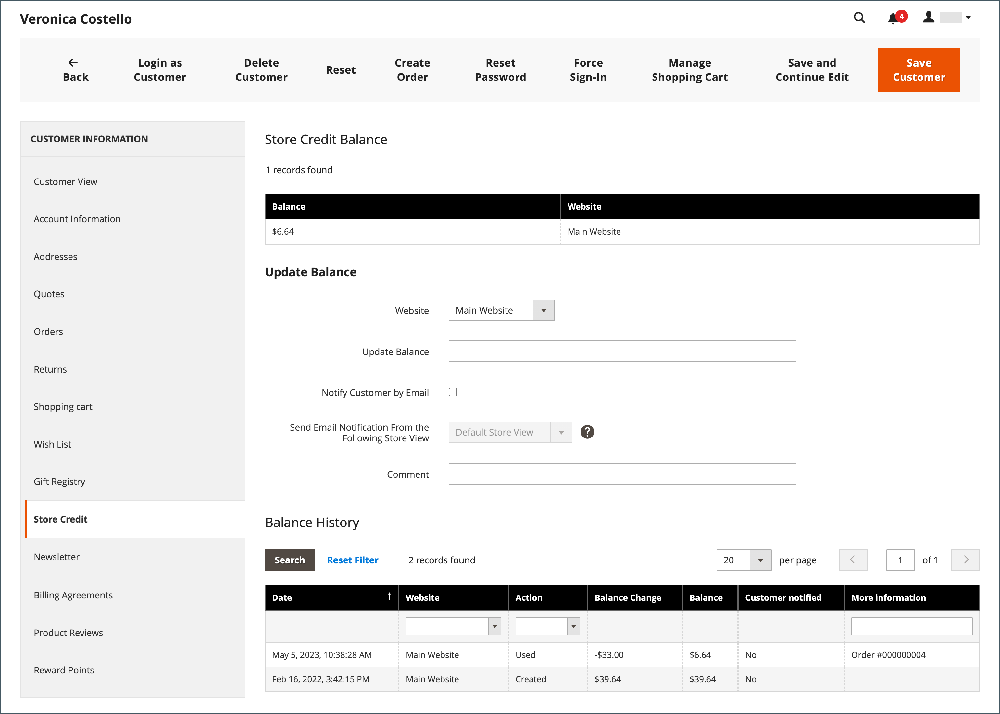
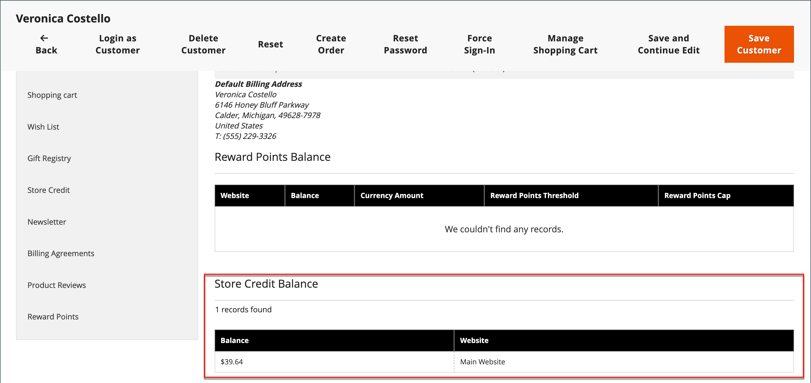

# Store-Guthaben anwenden

{{ee-feature}}

Shop-Administratoren können den Guthabensaldo und die Historie aus dem Kundenkonto einsehen und auch eine Shop-Gutschrift auf einen Kauf anwenden.

{width="600" zoomable="yes"}

## Kreditsaldo anzeigen

1. Navigieren Sie in der _Admin_-Seitenleiste zu **[!UICONTROL Customers]** > **[!UICONTROL All Customers]**.

1. Suchen Sie den Kunden im Raster.

1. Klicken Sie in _Spalte_ Aktion **[!UICONTROL Edit]** auf.

1. Scrollen Sie _[!UICONTROL Customer View]_&#x200B;Seite und zeigen Sie die **[!UICONTROL Store Credit Balance]**&#x200B;unten an.

{width="600" zoomable="yes"}

## Aktualisieren des Speicherkreditsaldos

1. Navigieren Sie in _Admin_-Seitenleiste zu **[!UICONTROL Customers]** > _Vorgänge_ > **[!UICONTROL All Customers]**.

1. Suchen Sie den Kunden im Raster.

1. Klicken Sie in _Spalte_ Aktion **[!UICONTROL Edit]** auf.

1. Wählen Sie im linken Bedienfeld **[!UICONTROL Store Credit]** aus.

1. Wählen Sie die Website (Storefront) aus, die Sie mit dem Saldo verknüpfen möchten.

1. Geben Sie **[!UICONTROL Update Balance]** den neuen Wert ein.

1. Um den Kunden über die Saldoaktualisierung zu informieren, aktivieren Sie das Kontrollkästchen **[!UICONTROL Notify Customer by Email]** und wählen Sie die Shop-Ansicht aus **[!UICONTROL Send Email Notification From the Following Store View]**.

1. Geben Sie eine **[!UICONTROL Comment]** über die Änderung ein.

1. Wenn die Aktualisierungen abgeschlossen sind, klicken Sie auf **[!UICONTROL Save and Continue Edit]** oder **[!UICONTROL Save Customer]**.

Der aktualisierte Saldo sollte in **[!UICONTROL Balance History]** angezeigt werden.

## Anwenden eines Guthabens auf eine Bestellung als Store-Administrator

Als Store-Administrator können Sie verschiedene Dinge im Namen eines Kunden tun, einschließlich der Abgabe von Bestellungen. Wenn Sie [eine Bestellung erstellen](../stores-purchase/customer-account-create-order.md) können Sie ein dem Kunden geschuldetes Filialguthaben zuordnen. Der verfügbare Saldo wird im Abschnitt _Zahlungs- und Versandinformationen_ angezeigt. Aktivieren Sie das Kontrollkästchen &quot;**[!UICONTROL Use Store Credit]**&quot;, um den Saldo anzuwenden, oder einen Teil des Saldos, wenn die Bestellsumme kleiner ist.

{width="500" zoomable="yes"}

## Warenkorb-Guthaben während des Checkouts anwenden

Wenn ein Guthaben für die Website vorhanden ist, kann der Kunde eine Gutschrift auf den Bestellsaldo anwenden, bevor er die Bestellung in der Storefront aufgibt.

1. Der Kunde zeigt den Betrag des verfügbaren Speicherguthabens an.

   Während des Schritts _Überprüfen und_&quot; wird der verfügbare Betrag unter &quot;_[!UICONTROL Store Credit]_&quot; angezeigt.

1. Um den Betrag auf die Bestellung anzuwenden, klicken Sie auf **[!UICONTROL Use Store Credit]**.

   >[!INFO]
   >
   >Die Bestellsumme wird neu berechnet, und der Betrag der angewendeten Speichergutschrift wird im _[!UICONTROL Order Summary]_&#x200B;angezeigt.

   {width="700" zoomable="yes"}

1. Wenn Sie bereit sind, klicken Sie auf **[!UICONTROL Place Order]**.
