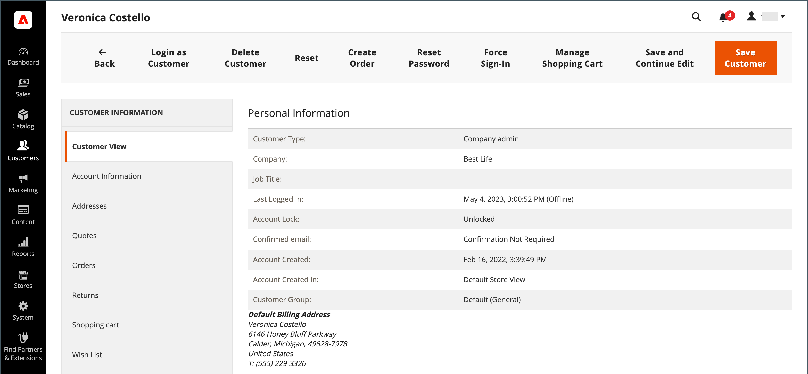

# Kundenprofil aktualisieren

Das linke Bedienfeld der _[!UICONTROL Customer Information]_enthält Informationen über Kundenaktivität, Adressen, Bestellstatistiken, aktuelle Bestellungen, den Inhalt des Warenkorbs, Produktbewertungen und Newsletter-Abonnements.

{width="700" zoomable="yes"}

## Bearbeiten eines Kundenkontos

Methode 1: **_Schnellbearbeitung_**

1. Aktivieren Sie in der ersten Spalte das Kontrollkästchen des Kundenkontos, das bearbeitet werden soll.

1. Setzen Sie die **[!UICONTROL Actions]** auf `Edit`.

   >[!INFO]
   >
   >Der Wert jedes Werts, der aktualisiert werden kann, wird in einem Textfeld angezeigt. Nur einige Werte des ausgewählten Kundendatensatzes können über das Raster bearbeitet werden.

   {width="700" zoomable="yes"}

1. Aktualisieren Sie bei Bedarf einen der folgenden Werte:

   * **[!UICONTROL Email]**
   * **[!UICONTROL Web Site]**
   * **[!UICONTROL Tax/VAT Number]**
   * **[!UICONTROL Gender]**

1. Klicken Sie auf **[!UICONTROL Save]**.

Methode 2: **_Vollständige Bearbeitung_**

1. Suchen Sie im Raster den Kundendatensatz, der bearbeitet werden soll.

1. Klicken Sie in _Spalte_ Aktionen“ ganz rechts auf **[!UICONTROL Edit]**.

1. Nehmen Sie die erforderlichen Änderungen an den Unternehmensinformationen vor.

   >[!INFO]
   >
   >Weitere Informationen finden Sie unter [Kundenprofil aktualisieren](../customers/update-account.md).

1. Klicken Sie abschließend auf **[!UICONTROL Save Customer]**.

>[!INFO]
>
>Wenn Sie alle Änderungen vor dem Speichern rückgängig machen möchten, klicken Sie in der oberen Symbolleiste auf **[!UICONTROL Reset]** , um alle Änderungen an der zuletzt gespeicherten Version rückgängig zu machen.

## Kundeninformationen

### [!UICONTROL Customer View]

Die _Kundenansicht_ enthält Informationen zum Kunden, einschließlich **[!UICONTROL Personal Information]**, **[!UICONTROL Reward Points Balance]** und **[!UICONTROL Store Credit Balance]**.

### [!UICONTROL Account Information]

Die Registerkarte [Kontoinformationen](../customers/account-dashboard-account-information.md) enthält detaillierte Informationen zum Kunden, bei denen ein Admin-Benutzer persönliche Informationen, E-Mail-Adressen, Unterstützung beim Remote-Shopping, Geburtsdatum und Kunden an eine Website oder ein Unternehmen anhängen kann.

### [!UICONTROL Addresses]

Die Registerkarte [Adressen](../customers/account-dashboard-address-book.md) enthält die standardmäßigen Abrechnungs- und Versandadressen des Kunden sowie alle weiteren Adressen, die er häufig verwendet.

### [!UICONTROL Orders]

Das Raster [Bestellungen](../stores-purchase/orders.md) enthält eine Liste aller aktuellen Kundenbestellungen. Der Administrator kann deren Fortschritt verfolgen.

### [!UICONTROL Returns]

{{ee-feature}}

Auf [ Registerkarte ](../stores-purchase/returns.md)Rückgaben“ werden die aktuellen zurückgegebenen Kundenanfragen aufgelistet.

### [!UICONTROL Shopping cart]

Auf [ Registerkarte ](../stores-purchase/cart.md)Warenkorb“ werden Produkte angezeigt, die sich derzeit im Warenkorb befinden. Aus irgendeinem Grund wurde der Kauf jedoch nicht abgeschlossen.

### [!UICONTROL Wish List]

Eine [Wunschliste](../stores-purchase/wishlists.md) zeigt eine Liste von Produkten an, die ein Kunde später in den Warenkorb legen kann.

### [!UICONTROL Gift Registry]

{{ee-feature}}

Im Abschnitt [Geschenkregistrierung](../merchandising-promotions/gift-registry-storefront.md) werden die aktuellen Geschenkregistrierungen des Kunden und das zugehörige Ereignis aufgelistet.

### [!UICONTROL Store Credit]

{{ee-feature}}

Auf [ Registerkarte ](../customers/store-credit.md)Store-Guthaben) wird ein Betrag angezeigt, der in einem Kundenkonto wiederhergestellt wurde. Der Administrator kann diesen Wert verwalten.

### [!UICONTROL Newsletter]

Die [Newsletter](../merchandising-promotions/newsletters.md) zeigt alle E-Mails an, die an den aktuellen Kunden gesendet wurden.

### [!UICONTROL Billing Agreements]

Auf [ Registerkarte ](../stores-purchase/paypal-billing-agreements.md)Abrechnungsvereinbarungen“ werden alle PayPal-Abrechnungsvereinbarungen zwischen dem Geschäft und dem Kunden aufgeführt.

### [!UICONTROL Product Reviews]

Auf [ Registerkarte ](../catalog/settings-advanced-product-reviews.md)Produktbewertungen“ werden alle von diesem Kunden gesendeten Überprüfungen angezeigt.

### [!UICONTROL Reward Points]

{{ee-feature}}

Der Abschnitt [Belohnungspunkte](../merchandising-promotions/rewards-loyalty.md) zeigt den aktuellen Saldo der Belohnungspunkte des Kunden. Ein Administrator kann diesen Wert verwalten.

## Schaltflächenleiste

| Schaltfläche | Beschreibung |
|----------|--------------|
| **[!UICONTROL Back]** | Kehrt zur Seite Kunden zurück, ohne die Änderungen zu speichern. |
| **[!UICONTROL Login as Customer]** | Ermöglicht dem Händler die Anmeldung als Kunde. |
| **[!UICONTROL Delete Customer]** | Löscht das Kundenkonto. |
| **[!UICONTROL Reset]** | Setzt alle nicht gespeicherten Änderungen im Kundenformular auf ihre vorherigen Werte zurück. |
| **[!UICONTROL Create Order]** | [Erstellt eine Bestellung](../stores-purchase/customer-account-create-order.md) die mit dem Kundenkonto verknüpft ist. |
| **[!UICONTROL Reset Password]** | Setzt das Passwort des Kunden zurück. |
| **[!UICONTROL Force Sign-In]** | Löscht die Token, die mit dem Kennwort des Kunden verknüpft sind, und gewährt dem Administrator Zugriff auf das Konto. |
| **[!UICONTROL Manage Shopping Cart]** | Ermöglicht den Zugriff auf den Warenkorb eines Kunden. |
| **[!UICONTROL Save and Continue Edit]** | Speichert Änderungen und lässt das Kundenkonto offen. |
| **[!UICONTROL Save Customer]** | Speichert Änderungen und schließt das Kundenkonto. |

{style="table-layout:auto"}
