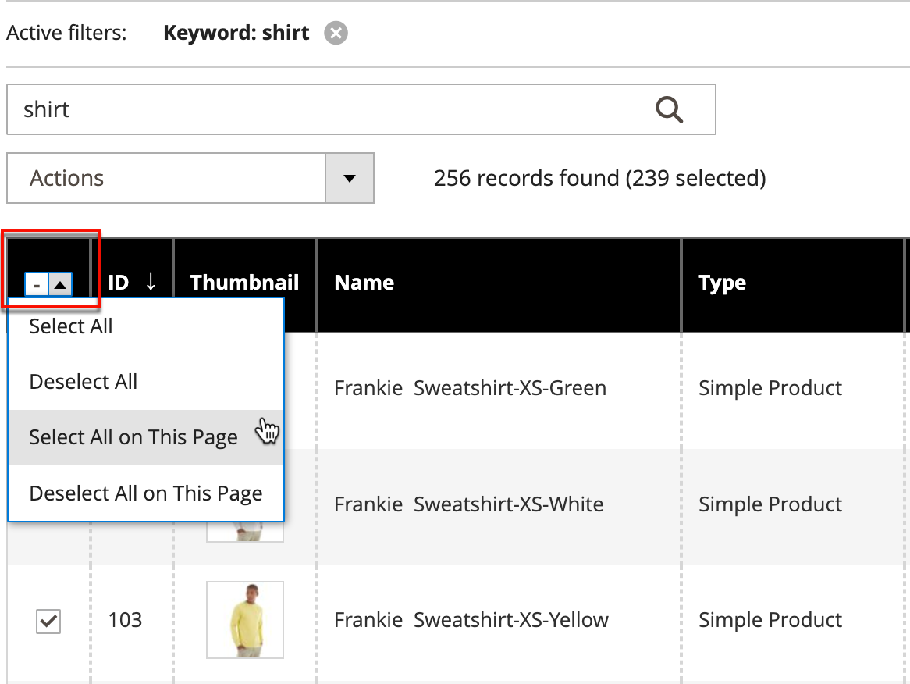

# Aktionssteuerung

Beim Arbeiten mit einer Auflistung von Datensätzen im Raster können Sie das Aktionssteuerelement verwenden, um einen Vorgang auf einen oder mehrere Datensätze anzuwenden. Das Aktionssteuerelement listet jeden Vorgang auf, der für den spezifischen Datentyp verfügbar ist. Beispielsweise können Sie das Aktionssteuerelement verwenden, um die Attribute ausgewählter Produkte zu aktualisieren, den Status von `Disabled` in `Enabled` zu ändern oder Datensätze aus der Datenbank zu löschen.

Sie können so viele Änderungen wie nötig vornehmen und dann die Datensätze in einem einzigen Schritt aktualisieren. Es ist viel effizienter, als die Einstellungen für jedes Produkt einzeln zu ändern. Das Anwenden von Änderungen auf einen Datensatz-Batch ist ein asynchroner Vorgang, der im Hintergrund ausgeführt wird, damit Sie in der Admin weiterarbeiten können, ohne auf den Abschluss des Vorgangs zu warten. Wenn die Aufgabe abgeschlossen ist, wird eine Meldung angezeigt.

Die Auswahl der verfügbaren Aktionen variiert je nach Liste. Je nach ausgewählter Aktion werden möglicherweise zusätzliche Optionen angezeigt. Wenn Sie beispielsweise den Status einer Gruppe von Datensätzen ändern, wird neben dem Aktionssteuerelement ein _[!UICONTROL Status]_&#x200B;mit zusätzlichen Optionen angezeigt.

## Schritt 1: Datensätze auswählen

Das Kontrollkästchen in der ersten Spalte der Liste identifiziert jeden Datensatz, der eine Zielgruppe für die Aktion ist. Die [Filtersteuerelemente](admin-grid-controls.md) können verwendet werden, um die Liste auf die Datensätze einzugrenzen, die für die Aktion ausgewählt werden sollen.

1. Stellen Sie bei Bedarf die Filter oben in jeder Spalte so ein, dass nur die Datensätze angezeigt werden, die Sie einbeziehen möchten.

1. Aktivieren Sie das Kontrollkästchen jedes Datensatzes, der Ziel der Aktion ist, oder verwenden Sie die Spaltenauswahl, um eine Massenauswahl auszuwählen.

{width="500"}

## Schritt 2: Eine Aktion auf ausgewählte Datensätze anwenden

1. Legen Sie das **[!UICONTROL Actions]** auf den Vorgang fest, den Sie anwenden möchten.

   **_example:_** Attribute aktualisieren

   - Aktivieren Sie in der Liste das Kontrollkästchen jedes zu aktualisierenden Datensatzes.

   - Setzen Sie das **[!UICONTROL Actions]** auf `Update Attributes`.

     {width="450"}

   - Klicken Sie auf **[!UICONTROL Submit]**.

     Auf der Seite Attribute aktualisieren werden alle verfügbaren Attribute aufgelistet, sortiert nach Gruppe im Bereich links.

     {width="700" zoomable="yes"}

   - Aktivieren Sie das Kontrollkästchen **[!UICONTROL Change]** neben jedem Attribut und nehmen Sie die erforderlichen Änderungen vor.

   - Klicken Sie auf **[!UICONTROL Save]** , um die Attribute für die Gruppe der ausgewählten Datensätze zu aktualisieren.

1. Klicken Sie abschließend auf **[!UICONTROL Submit]**.

## Kontrollkästchen-Aktionen

| Aktion | Beschreibung |
|--- |--- |
| [!UICONTROL Select All] | Aktiviert das Kontrollkästchen aller Datensätze in der Liste. |
| [!UICONTROL Unselect All] | Löscht das Kontrollkästchen für alle Datensätze in der Liste. |
| [!UICONTROL Select All on This Page] | Markiert das Kontrollkästchen der auf der aktuellen Seite angezeigten Datensätze. |
| [!UICONTROL Deselect All on This Page] | Löscht das Kontrollkästchen für die auf der aktuellen Seite angezeigten Datensätze. |

{style="table-layout:auto"}
