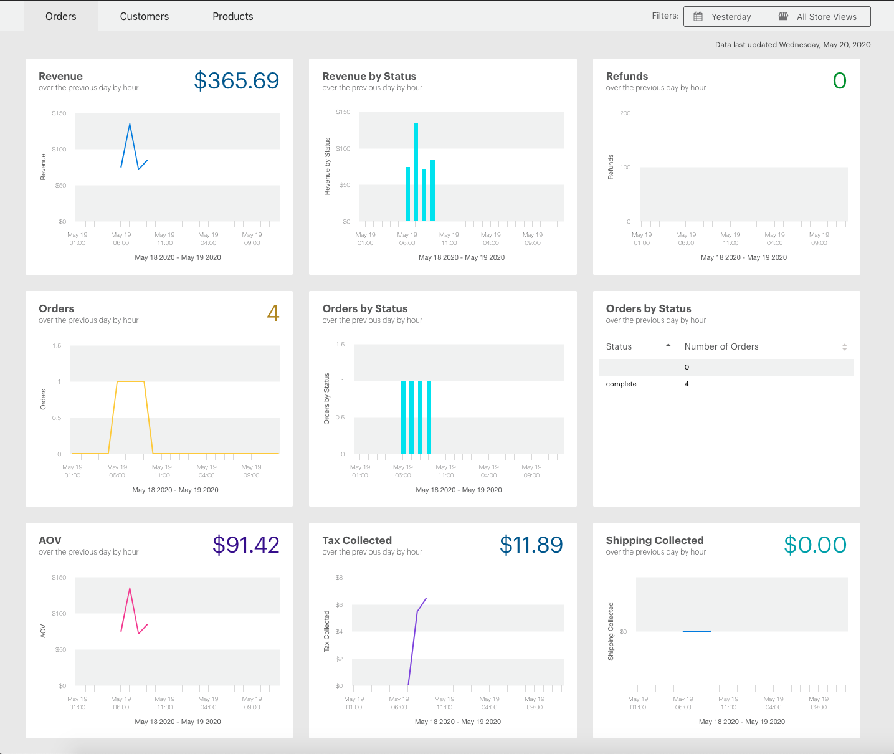
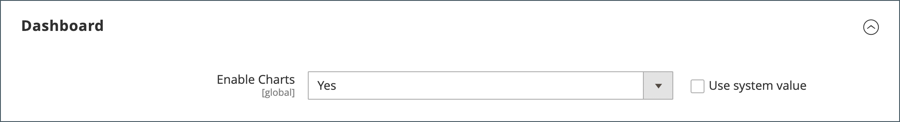
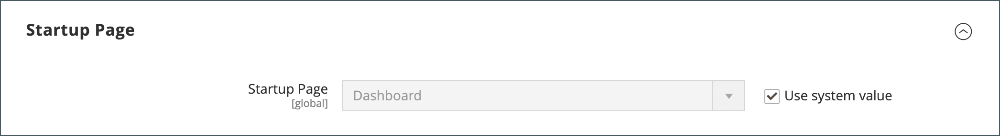
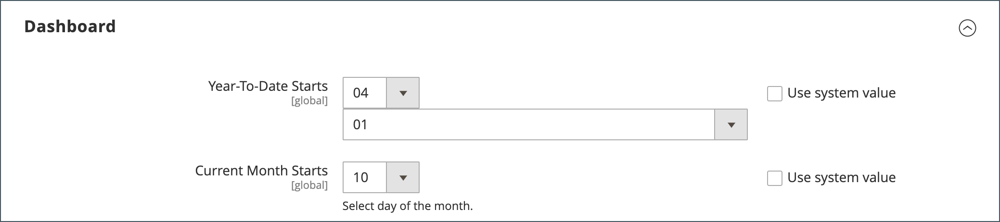
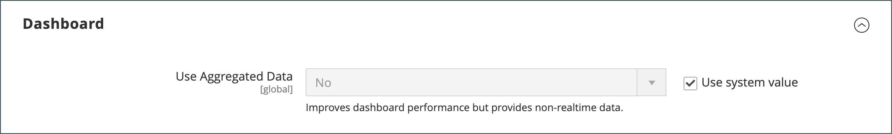

# Admin-Dashboard

Das Dashboard ist normalerweise die erste Seite, die angezeigt wird, wenn Sie sich bei _Admin_ anmelden, und kann einen Echtzeitüberblick über Verkäufe und Kundenaktivität bieten. Die Dashboard-Daten enthalten eine Momentaufnahme der lebenslangen Verkäufe, des durchschnittlichen Bestellbetrags, der letzten Bestellungen und der Suchbegriffe. Das Diagramm zeigt abgeschlossene Bestellungen und Beträge für den ausgewählten Datumsbereich und kann entweder aus dynamischen, Echtzeitdaten oder aggregierten historischen Daten generiert werden. Die Registerkarten unten bieten schnelle Berichte über Ihre meistverkauften Produkte, die am häufigsten angezeigten Produkte, neue Kunden und Kunden, die am meisten gekauft haben.

Wenn Sie eine erhebliche Datenmenge verarbeiten müssen, kann das Diagramm deaktiviert werden, um die Leistung zu verbessern. Das Dashboard im folgenden Beispiel ist für die Verwendung von Echtzeitdaten konfiguriert und zeigt abgeschlossene Bestellungen nach Stunde für die letzten 24 Stunden an. Das Diagramm wird für jede abgeschlossene Bestellung aktualisiert.

{zoomable="yes"}

[Erweiterte Berichterstellung](business-intelligence.md#advanced-reporting) zeigt ein personalisiertes Dashboard an, das auf Ihren Produkt-, Auftrags- und Kundendaten basiert.

{zoomable="yes"}

## Dashboard konfigurieren

1. Wechseln Sie in _Admin_-Seitenleiste zu **[!UICONTROL Stores]** > _[!UICONTROL Settings]_>**[!UICONTROL Configuration]**&#x200B;und nehmen Sie eine der folgenden Einstellungen vor.

1. Wenn die Konfiguration abgeschlossen ist, klicken Sie auf **[!UICONTROL Save Config]**.

1. Klicken Sie nach dem Speichern der Änderungen auf **[!UICONTROL Cache Management]** und aktualisieren Sie jeden ungültigen Cache.

### Aktivieren von Diagrammen

Wenn Sie eine große Datenmenge verarbeiten müssen, können Sie die Anzeige des Diagramms deaktivieren, um die Leistung zu verbessern. Wenn diese Option nicht aktiviert ist, wird anstelle des Diagramms die Meldung „Keine Daten gefunden“ angezeigt, obwohl die unten stehenden Zusammenfassungssummen weiterhin generiert werden.

1. Wählen Sie im linken Navigationsbereich unter **[!UICONTROL Advanced]** die Option **[!UICONTROL Admin]** aus.

1. Erweitern Sie bei Bedarf den Abschnitt **[!UICONTROL Dashboard]** .

   {width="600"}

1. Um den Standardwert zu ändern, deaktivieren Sie das Kontrollkästchen **[!UICONTROL Use system value]** .

1. Legen Sie **Diagramme aktivieren** auf `Yes` fest.

Weitere Informationen zu den Admin-Konfigurationsoptionen finden Sie im [Konfigurationsreferenzhandbuch](../configuration-reference/advanced/admin.md).

### Ändern der Startseite

Das Dashboard ist die standardmäßige [Startseite](../configuration-reference/advanced/admin.md) für Admins. Sie können jedoch auch eine andere Startseite konfigurieren.

1. Wenn Sie die Admin-Konfigurationsoptionen noch nicht geöffnet haben, wählen Sie **[!UICONTROL Admin]** unter _[!UICONTROL Advanced]_&#x200B;im linken Navigationsbereich aus.

1. Klicken Sie, um den Abschnitt **Startseite** zu erweitern.

   {width="600"}

1. Deaktivieren Sie das Kontrollkästchen **[!UICONTROL Use system value]** und wählen Sie die **Startseite** aus, die angezeigt werden soll, wenn Sie sich bei Admin anmelden.

### Startdaten auswählen

1. Wählen Sie im linken Navigationsbereich unter **[!UICONTROL General]** die Option **Berichte**.

1. Erweitern Sie auf der Seite den Abschnitt **[!UICONTROL Dashboard]** .

1. Deaktivieren Sie die **[!UICONTROL Use system value]** Kontrollkästchen für die Datumseinstellungen und führen Sie folgende Schritte aus:

   - Legen Sie **Jahr bis dato beginnt** auf **Monat** und **Tag**.

   - Legen Sie **Aktueller Monat beginnt** auf den **Tag** fest.

   {width="600"}

Weitere Informationen zu den [!UICONTROL Reports] Konfigurationsoptionen finden Sie im [_Konfigurationshandbuch_](../configuration-reference/general/reports.md).

### Konfigurieren der Datenquelle

Das Dashboard-Diagramm kann in Echtzeit oder mithilfe historischer, aggregierter Daten generiert werden. Wenn die Leistung ein Problem darstellt, können Sie die Geschwindigkeit mithilfe aggregierter Daten erhöhen.

1. Klicken Sie im linken Navigationsbereich auf zum Erweitern **Verkauf** und wählen Sie darunter **Verkauf** aus.

1. Erweitern Sie auf der Seite den Abschnitt **[!UICONTROL Dashboard]** .

   {width="600"}

1. Deaktivieren Sie das Kontrollkästchen **[!UICONTROL Use system value]** und setzen Sie **[!UICONTROL Use Aggregated Data]** auf einen der folgenden Werte:

   - Wählen Sie für historische, aggregierte Daten &quot;`Yes`&quot;.
   - Wählen Sie für Echtzeitdaten &quot;`No`&quot;.

## Diagrammabschnitte

| Abschnitt | Beschreibung |
|--- |--- |
| [!UICONTROL Orders] | Auf dieser Registerkarte wird ein Echtzeitdiagramm aller abgeschlossenen Bestellungen für die aktuelle Shop-Ansicht und den angegebenen Zeitraum angezeigt. |
| [!UICONTROL Amounts] | Auf dieser Registerkarte wird ein Echtzeitdiagramm aller abgeschlossenen Bestellbeträge für die aktuelle Shop-Ansicht und den angegebenen Zeitraum angezeigt. |
| [!UICONTROL Time Range] | Bestimmt die Daten, die im Diagramm dargestellt werden, sowie die Summen unten. Optionen: `Last 7 Days` / `Current Month` / `YTD` / `2YTD` |
| [!UICONTROL Summary Totals] | Die Gesamtsummen für Umsatz, Steuer, Versand und Menge unterhalb des Diagramms basieren auf den Diagrammdaten und der Einstellung des aktuellen Zeitbereichs. |

{style="table-layout:auto"}

## Momentaufnahmen-Daten

| Abschnitt | Beschreibung |
|--- |--- |
| [!UICONTROL Lifetime Sales] | Die aggregierten Gesamtverkäufe während der Lebensdauer des Stores. |
| [!UICONTROL Average Order] | Der durchschnittliche Bestellbetrag während der Lebensdauer des Stores. |
| [!UICONTROL Last Orders] | Eine Zusammenfassung der letzten fünf aufgegebenen Bestellungen. |
| [!UICONTROL Last Search Terms] | Die letzten fünf Suchbegriffe. |
| [!UICONTROL Top Search Terms] | Die fünf häufigsten Suchbegriffe. |

{style="table-layout:auto"}

## Berichtregisterkarten

| Abschnitt | Beschreibung |
|--- |--- |
| [!UICONTROL Bestsellers] | Die fünf meistverkauften Produkte während des angegebenen Zeitraums. |
| [!UICONTROL Most Viewed Products] | Die fünf Produkte haben sich während des angegebenen Zeitraums am häufigsten angesehen. |
| [!UICONTROL New Customers] | Die letzten fünf Kunden, die sich während des angegebenen Zeitraums für ein Konto registriert haben. |
| [!UICONTROL Customers] | Die letzten fünf Kunden mit einer Bestellung, deren Verarbeitung innerhalb des angegebenen Zeitraums abgeschlossen wurde. |

{style="table-layout:auto"}

## Dashboard-Schaltflächen

| Schaltfläche | Beschreibung |
|--- |--- |
| [!UICONTROL Reload Data] | Aktualisiert Dashboard-Daten. |
| [!UICONTROL Go to Advanced Reporting] | Zeigt ein personalisiertes Dashboard mit dynamischen Diagrammen und Berichten an, die auf Ihren Produkt-, Auftrags- und Kundendaten basieren. Weitere Informationen finden Sie unter [Erweiterte Berichterstellung](business-intelligence.md#advanced-reporting). |

{style="table-layout:auto"}
