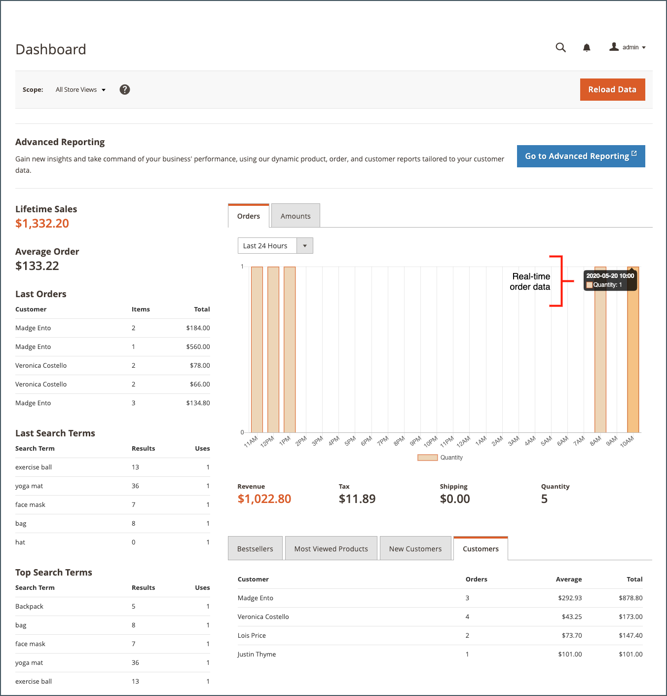

# Admin-Dashboard

Das Dashboard ist normalerweise die erste Seite, die bei der Anmeldung bei der _Admin_ und bietet einen Echtzeitüberblick über Vertrieb und Kundenaktivität. Dashboard-Daten liefern eine Momentaufnahme der Lebensdauerverkäufe, der durchschnittlichen Bestellmenge, der letzten Bestellungen und Suchbegriffe. Das Diagramm zeigt abgeschlossene Bestellungen und Beträge für den ausgewählten Datumsbereich an und kann entweder aus dynamischen, Echtzeit- oder historischen aggregierten Daten generiert werden. Die Registerkarten am unteren Rand bieten schnelle Berichte zu Ihren am besten verkauften Produkten, den am häufigsten angezeigten Produkten, neuen Kunden und Kunden, die am häufigsten gekauft haben.

Wenn Sie eine erhebliche Menge an zu verarbeitenden Daten haben, kann das Diagramm zur Leistungsverbesserung deaktiviert werden. Das Dashboard im folgenden Beispiel ist so konfiguriert, dass Echtzeitdaten verwendet werden. Es zeigt abgeschlossene Bestellungen nach Stunde für die letzten 24 Stunden an. Das Diagramm wird für jede abgeschlossene Bestellung aktualisiert.

{zoomable=&quot;yes&quot;}

[Fortschrittliche Berichterstellung](business-intelligence.md#advanced-reporting) zeigt ein personalisiertes Dashboard basierend auf Ihren Produkt-, Bestell- und Kundendaten an.

{zoomable=&quot;yes&quot;}

## Dashboard konfigurieren

1. Im _Admin_ Seitenleiste, navigieren Sie zu **[!UICONTROL Stores]** > _[!UICONTROL Settings]_>**[!UICONTROL Configuration]**und führen Sie eine der folgenden Einstellungen aus.

1. Klicken Sie nach Abschluss der Konfiguration auf **[!UICONTROL Save Config]**.

1. Klicken Sie nach dem Speichern der Änderungen auf **[!UICONTROL Cache Management]** und aktualisieren Sie jeden ungültigen Cache.

### Grafiken aktivieren

Wenn Sie eine große Datenmenge verarbeiten müssen, können Sie die Anzeige der Grafik deaktivieren, um die Leistung zu verbessern. Wenn die Option nicht aktiviert ist, wird anstelle der Grafik die Meldung &quot;Keine Daten gefunden&quot;angezeigt, obwohl die Summen der Zusammenfassung unten noch generiert werden.

1. Im linken Navigationsbereich unter **[!UICONTROL Advanced]** auswählen **[!UICONTROL Admin]**.

1. Erweitern Sie bei Bedarf die **[!UICONTROL Dashboard]** Abschnitt.

   {width="600"}

1. Um den Standardwert zu ändern, löschen Sie die **[!UICONTROL Use system value]** aktivieren.

1. Satz **Diagramme aktivieren** nach `Yes`.

Weitere Informationen zu den Admin-Konfigurationsoptionen finden Sie unter [Konfigurationshandbuch](../configuration-reference/advanced/admin.md).

### Startseite ändern

Das Dashboard ist die Standardeinstellung [Startseite](../configuration-reference/advanced/admin.md) für den Administrator, obwohl Sie eine andere Startseite konfigurieren können.

1. Wenn Sie die Admin-Konfigurationsoptionen noch nicht geöffnet haben, wählen Sie **[!UICONTROL Admin]** under _[!UICONTROL Advanced]_im linken Navigationsbereich.

1. Klicken Sie auf , um die **Startseite** Abschnitt.

   {width="600"}

1. Löschen Sie die **[!UICONTROL Use system value]** aktivieren und wählen Sie die **Startseite** die bei der Anmeldung beim Administrator angezeigt werden sollen.

### Startdatum auswählen

1. Im linken Navigationsbereich unter **[!UICONTROL General]** auswählen **Berichte**.

1. Erweitern Sie auf der Seite die **[!UICONTROL Dashboard]** Abschnitt.

1. Löschen Sie die **[!UICONTROL Use system value]** Kontrollkästchen für die Datumseinstellungen und gehen Sie wie folgt vor:

   - Satz **Start im Jahr** der **Monat** und **Tag**.

   - Satz **Aktuelle Monatsstarts** der **Tag**.

   {width="600"}

Weitere Informationen zum [!UICONTROL Reports] Konfigurationsoptionen, siehe [_Konfigurationshandbuch_](../configuration-reference/general/reports.md).

### Konfigurieren der Datenquelle

Das Dashboard-Diagramm kann in Echtzeit oder mithilfe von historischen, aggregierten Daten erstellt werden. Wenn die Leistung ein Problem darstellt, können Sie die Dinge durch die Verwendung aggregierter Daten beschleunigen.

1. Klicken Sie im linken Navigationsbereich auf zum Erweitern **Vertrieb** und wählen **Vertrieb** darunter.

1. Erweitern Sie auf der Seite die **[!UICONTROL Dashboard]** Abschnitt.

   {width="600"}

1. Löschen Sie die **[!UICONTROL Use system value]** Kontrollkästchen und festlegen **[!UICONTROL Use Aggregated Data]** auf einen der folgenden Werte zu:

   - Für historische, aggregierte Daten wählen Sie `Yes`.
   - Wählen Sie für Echtzeitdaten `No`.

## Diagrammabschnitte

| Abschnitt | Beschreibung |
|--- |--- |
| [!UICONTROL Orders] | Auf dieser Registerkarte wird ein Echtzeit-Diagramm aller abgeschlossenen Bestellungen für die aktuelle Store-Ansicht und den angegebenen Zeitraum angezeigt. |
| [!UICONTROL Amounts] | Auf dieser Registerkarte wird ein Echtzeit-Diagramm mit allen abgeschlossenen Bestellmengen für die aktuelle Store-Ansicht und den angegebenen Zeitraum angezeigt. |
| [!UICONTROL Time Range] | Bestimmt die Daten, die in den unten stehenden Summen der Grafik und Zusammenfassung dargestellt werden. Optionen: `Last 7 Days` / `Current Month` / `YTD` / `2YTD` |
| [!UICONTROL Summary Totals] | Die Gesamtsummen für Umsatz, Steuern, Versand und Menge unter dem Diagramm basieren auf den Diagrammdaten und der aktuellen Zeitbereichseinstellung. |

{style="table-layout:auto"}

## Momentaufnahmen-Daten

| Abschnitt | Beschreibung |
|--- |--- |
| [!UICONTROL Lifetime Sales] | Die aggregierten Gesamtverkäufe während der Lebensdauer des Stores. |
| [!UICONTROL Average Order] | Die durchschnittliche Bestellmenge während der Lebensdauer des Stores. |
| [!UICONTROL Last Orders] | Eine Zusammenfassung der letzten fünf aufgegebenen Bestellungen. |
| [!UICONTROL Last Search Terms] | Die letzten fünf Suchbegriffe. |
| [!UICONTROL Top Search Terms] | Die fünf häufigsten Suchbegriffe. |

{style="table-layout:auto"}

## Berichtregisterkarten

| Abschnitt | Beschreibung |
|--- |--- |
| [!UICONTROL Bestsellers] | Die fünf am besten verkauften Produkte im angegebenen Zeitraum. |
| [!UICONTROL Most Viewed Products] | Die fünf Produkte wurden im angegebenen Zeitraum am häufigsten angezeigt. |
| [!UICONTROL New Customers] | Die letzten fünf Kunden, die sich im angegebenen Zeitraum für ein Konto angemeldet haben. |
| [!UICONTROL Customers] | Die letzten fünf Kunden mit einer Bestellung, die die Verarbeitung im angegebenen Zeitraum abgeschlossen hat. |

{style="table-layout:auto"}

## Dashboard-Schaltfläche

| Schaltfläche | Beschreibung |
|--- |--- |
| [!UICONTROL Reload Data] | Aktualisiert Dashboard-Daten. |
| [!UICONTROL Go to Advanced Reporting] | Zeigt ein personalisiertes Dashboard mit dynamischen Diagrammen und Berichten an, die auf Ihren Produkt-, Bestell- und Kundendaten basieren. Eine ausführlichere Analyse finden Sie unter [Fortschrittliche Berichterstellung](business-intelligence.md#advanced-reporting). |

{style="table-layout:auto"}
