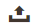

# Administratorraster-Steuerelemente

Admin-Seiten, die Daten verwalten, zeigen eine Sammlung von Datensätzen in einem Raster an. Die Steuerelemente am oberen Rand jeder Spalte können zum Sortieren der Daten verwendet werden. Die aktuelle Sortierreihenfolge wird durch einen aufsteigenden oder absteigenden Pfeil in der Spaltenüberschrift angezeigt. Sie können angeben, welche Spalten im Raster angezeigt werden, und sie an verschiedene Positionen ziehen. Sie können auch verschiedene Spaltenanordnungen als Ansichten speichern, die später verwendet werden können. Die Spalte **[!UICONTROL Action]** listet Vorgänge auf, die auf einen einzelnen Datensatz angewendet werden können. Darüber hinaus können Datumsangaben aus der aktuellen Ansicht der meisten Raster in eine CSV- oder [-](../systems/data-csv.md) exportiert werden.

{width="700" zoomable="yes"}

## Sortieren der Liste

1. Klicken Sie auf eine beliebige Spaltenüberschrift.

   Der Pfeil zeigt die aktuelle Reihenfolge als aufsteigend oder absteigend an.

1. Verwenden Sie die Steuerelemente für die Paginierung, um zusätzliche Seiten in der Auflistung anzuzeigen.

   {width="300"}

## Paginieren der Liste

1. Legen Sie das **[!UICONTROL Pagination]**-Steuerelement auf die Anzahl der Datensätze fest, die pro Seite angezeigt werden sollen.

1. Klicken Sie auf **[!UICONTROL Next]** und **[!UICONTROL Previous]** Sie, um durch die Liste zu blättern, oder geben Sie einen bestimmten **[!UICONTROL Page Number]** ein.

## Filtern der Liste

1. Klicken Sie auf **[!UICONTROL Filters]**.

1. Füllen Sie so viele Filter wie nötig aus, um den zu suchenden Datensatz zu beschreiben.

1. Klicken Sie auf **[!UICONTROL Apply Filters]**.

   {width="700" zoomable="yes"}

## Daten exportieren

1. Wählen Sie die Datensätze aus, die Sie exportieren möchten.

   >[!NOTE]
   >
   >Produktdaten können nicht aus dem Raster exportiert werden. Weitere Informationen finden Sie unter [Exportieren](../systems/data-export.md).

1. Wählen Sie _Menü_ Export) oben rechts eines der folgenden Dateiformate aus:

   - `CSV`
   - `Excel XML`

   {width="700" zoomable="yes"}

1. Klicken Sie auf **[!UICONTROL Export]**.

1. Suchen Sie die heruntergeladene Datei der exportierten Daten an dem Speicherort, der von Ihrem Browser für Downloads verwendet wird.

## Rasterlayout

Die Auswahl der Spalten und ihre Reihenfolge im Raster können nach Ihren Wünschen geändert und als _Ansicht“ gespeichert_. Sie können steuern, welche Attribute im Raster unter der Konfiguration der einzelnen Attribute angezeigt werden. Wenn im Produktraster viele Attribute angezeigt werden, kann sich dies auf die Ladezeit und Leistung des Admins auswirken.

{width="700" zoomable="yes"}

### Spaltenauswahl ändern

1. Klicken Sie oben rechts auf das Steuerelement _Spalten_ ().

1. Ändern Sie die Spaltenauswahl:

   - Aktivieren Sie das Kontrollkästchen einer beliebigen Spalte, die Sie dem Raster hinzufügen möchten.
   - Deaktivieren Sie das Kontrollkästchen für alle Spalten, die Sie aus dem Raster entfernen möchten.
   - Um zur Standardrasteransicht zurückzukehren, klicken Sie auf **[!UICONTROL Reset]**.

Scrollen Sie nach unten, um alle verfügbaren Spalten anzuzeigen.

### Spalte verschieben

1. Klicken Sie auf die Spaltenüberschrift und halten Sie die Maustaste gedrückt.

1. Ziehen Sie die Spalte an die neue Position und lassen Sie sie los.

### Speichern einer Rasteransicht

1. Klicken Sie auf das _View_-Steuerelement .

1. Klicken Sie auf **[!UICONTROL Save Current View]**.

1. Geben Sie einen **[!UICONTROL name]** für die Ansicht ein.

1. Um alle Änderungen zu speichern, klicken Sie auf _Pfeil_ ().

   Der Name der Ansicht wird jetzt als aktuelle Ansicht angezeigt.

### Ändern der Rasteransicht

1. Klicken Sie auf _Steuerelement_ Ansicht).

1. Führen Sie einen der folgenden Schritte aus:

   - Um eine andere Ansicht zu verwenden, klicken Sie auf den Namen der Ansicht.
   - Um den Namen einer Ansicht zu ändern, klicken Sie auf das Symbol _Bearbeiten_ () und aktualisieren Sie den Namen.
   - Um eine Ansicht zu löschen, klicken Sie auf das Symbol _Bearbeiten_ () und dann auf das Symbol _Löschen_ ().
