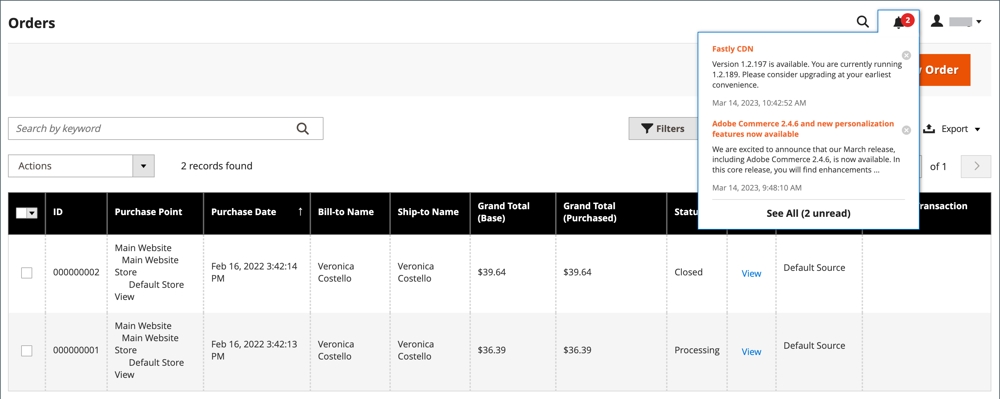
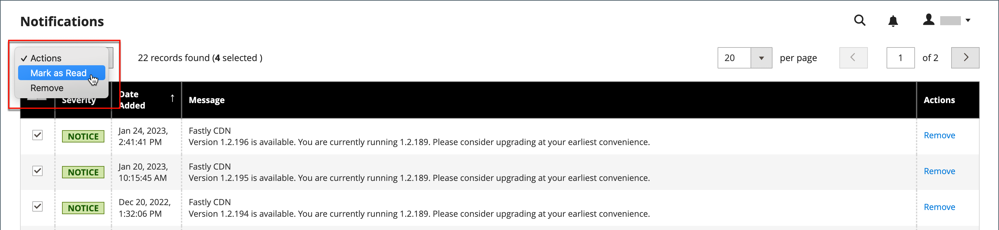
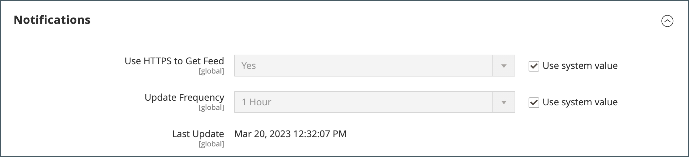

# Posteingang für Admin-Nachrichten

Ihr Store erhält regelmäßig Nachrichten von Adobe. Die Meldungen werden nach Wichtigkeit bewertet und können sich auf Systemaktualisierungen, Patches, neue Versionen, geplante Wartungsarbeiten oder bevorstehende Ereignisse beziehen. Das Glockensymbol in der Kopfzeile gibt die Anzahl der ungelesenen Nachrichten in Ihrem Posteingang an.

{width="700" zoomable="yes"}

Auf der Seite _[!UICONTROL Notifications]_werden alle Nachrichten nach Datum geordnet aufgelistet. Die_[!UICONTROL Action]_ können verwendet werden, um einzelne Nachrichten als gelesen zu markieren, detailliertere Informationen anzuzeigen oder die Nachricht aus dem Posteingang zu entfernen.

Die Konfiguration bestimmt, wie oft der Posteingang aktualisiert wird und wie die Nachrichten zugestellt werden. Wenn der Administrator Ihres Stores über eine sichere URL verfügt, müssen Benachrichtigungen über HTTPS gesendet werden.

## Neue eingehende Nachrichten anzeigen

1. Klicken Sie auf das Symbol **[!UICONTROL Notification]** in der Kopfzeile und lesen Sie die Zusammenfassung.

1. Führen Sie einen der folgenden Schritte aus:

   - Klicken Sie ggf. auf die Meldung, um den vollständigen Text anzuzeigen.
   - Um die Nachricht zu löschen, klicken Sie auf das Löschsymbol rechts neben der Nachricht.
   - Um die vollständige Benachrichtigungsliste anzuzeigen, klicken Sie auf **[!UICONTROL See All]**.

## Beheben einer kritischen Nachricht

Führen Sie für eine Nachricht von kritischer Bedeutung einen der folgenden Schritte aus:

- Klicken Sie auf **[!UICONTROL Read Details]**.
- Klicken Sie auf **[!UICONTROL Close]**, um den Warnhinweis zu schließen, aber die Nachricht aktiv zu lassen.

## Verwalten von Benachrichtigungen

1. Führen Sie einen der folgenden Schritte aus, um die Seite Benachrichtigungen zu öffnen:

   - Klicken Sie auf das Symbol **[!UICONTROL Notification]** in der Kopfzeile. Wenn eine oder mehrere neue Nachrichten angezeigt werden, klicken Sie auf **[!UICONTROL See All]**.

   - Navigieren Sie in _Admin_-Seitenleiste zu **[!UICONTROL System]** > _[!UICONTROL Other Settings]_>**[!UICONTROL Notifications]**.

1. Führen Sie in der Spalte **[!UICONTROL Action]** einen der folgenden Schritte aus:

   - Weitere Informationen erhalten Sie, wenn Sie auf **[!UICONTROL Read Details]** klicken, um die verknüpfte Seite in einem neuen Fenster zu öffnen.

   - Um die Nachricht in Ihrem Posteingang zu belassen, klicken Sie auf **[!UICONTROL Mark As Read]**.

     {width="700" zoomable="yes"}

   - Um die Nachricht zu löschen, klicken Sie auf **[!UICONTROL Remove]**.

1. Um eine Aktion auf mehrere Nachrichten anzuwenden, führen Sie einen der folgenden Schritte aus:

   - Aktivieren Sie das Kontrollkästchen in der ersten Spalte für jede zu verwaltende Nachricht.
   - Um mehrere Nachrichten auszuwählen, legen Sie das **[!UICONTROL Mass Actions]** nach Bedarf fest.

1. Legen Sie das **[!UICONTROL Actions]**-Steuerelement auf eine der folgenden Einstellungen fest:

   - `Mark as Read`
   - `Remove`

1. Klicken Sie auf **[!UICONTROL Submit]** , um den Vorgang abzuschließen.

## Konfigurieren von Benachrichtigungen

1. Navigieren Sie in _Admin_-Seitenleiste zu **[!UICONTROL Stores]** > _[!UICONTROL Settings]_>**[!UICONTROL Configuration]**.

1. Erweitern Sie im linken Navigationsbereich **[!UICONTROL Advanced]** und wählen Sie **[!UICONTROL System]**.

1. Erweitern Sie  den Abschnitt **[!UICONTROL Notifications]** .

   {width="600"}

1. Wenn der Admin Ihres Stores über eine [sichere URL](../stores-purchase/store-urls.md) läuft, setzen Sie **[!UICONTROL Use HTTPS to Get Feed]** auf `Yes`.

1. Legen Sie **[!UICONTROL Update Frequency]** fest, um festzulegen, wie oft Ihr Posteingang aktualisiert wird.

   Das Intervall kann zwischen 1 und 24 Stunden liegen.

1. Klicken Sie abschließend auf **[!UICONTROL Save Config]**.

Weitere Informationen zu den [!UICONTROL System] Konfigurationsoptionen finden Sie im [_Konfigurationshandbuch_](../configuration-reference/advanced/system.md).
