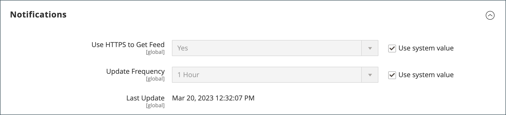

# Admin-Nachrichten-Posteingang

Ihr Geschäft erhält regelmäßig Nachrichten von Adobe. Die Nachrichten werden nach Wichtigkeit bewertet und können sich auf Systemaktualisierungen, Patches, neue Versionen, geplante Wartung oder bevorstehende Ereignisse beziehen. Das Glockensymbol in der Kopfzeile gibt die Anzahl der ungelesenen Nachrichten in Ihrem Posteingang an.

{width="700" zoomable="yes"}

Auf der Seite _[!UICONTROL Notifications]_werden alle Nachrichten nach Datum sortiert. Mit den Befehlen_[!UICONTROL Action]_ können einzelne Nachrichten als gelesen markiert, detailliertere Informationen angezeigt oder die Nachricht aus dem Posteingang entfernt werden.

Die Konfiguration bestimmt, wie oft der Posteingang aktualisiert wird und wie die Nachrichten zugestellt werden. Wenn Ihr Store-Administrator über eine sichere URL verfügt, müssen Benachrichtigungen über HTTPS bereitgestellt werden.

## Neue eingehende Nachrichten anzeigen

1. Klicken Sie auf das Symbol &quot;**[!UICONTROL Notification]**&quot; in der Kopfzeile und lesen Sie die Zusammenfassung.

1. Führen Sie einen der folgenden Schritte aus:

   - Klicken Sie bei Bedarf auf die Nachricht, um den Volltext anzuzeigen.
   - Um die Nachricht zu löschen, klicken Sie auf das Löschsymbol rechts neben der Nachricht.
   - Um die vollständige Liste der Benachrichtigungen anzuzeigen, klicken Sie auf **[!UICONTROL See All]**.

## Kritische Nachricht beheben

Führen Sie für eine wichtige Nachricht einen der folgenden Schritte aus:

- Klicken Sie auf **[!UICONTROL Read Details]**.
- Um das Warnhinweisfeld zu schließen, die Nachricht jedoch aktiv zu halten, klicken Sie auf **[!UICONTROL Close]**.

## Benachrichtigungen verwalten

1. Führen Sie einen der folgenden Schritte aus, um die Seite Benachrichtigungen zu öffnen:

   - Klicken Sie in der Kopfzeile auf das Symbol &quot;**[!UICONTROL Notification]**&quot;. Wenn eine oder mehrere neue Nachrichten angezeigt werden, klicken Sie auf **[!UICONTROL See All]**.

   - Wechseln Sie in der Seitenleiste _Admin_ zu **[!UICONTROL System]** > _[!UICONTROL Other Settings]_>**[!UICONTROL Notifications]**.

1. Führen Sie in der Spalte **[!UICONTROL Action]** einen der folgenden Schritte aus:

   - Klicken Sie für weitere Informationen auf **[!UICONTROL Read Details]** , um die verknüpfte Seite in einem neuen Fenster zu öffnen.

   - Um die Nachricht in Ihrem Posteingang zu behalten, klicken Sie auf **[!UICONTROL Mark As Read]**.

     {width="700" zoomable="yes"}

   - Um die Nachricht zu löschen, klicken Sie auf **[!UICONTROL Remove]**.

1. Um eine Aktion auf mehrere Nachrichten anzuwenden, führen Sie einen der folgenden Schritte aus:

   - Aktivieren Sie das Kontrollkästchen in der ersten Spalte für jede Nachricht, die verwaltet werden soll.
   - Um mehrere Nachrichten auszuwählen, legen Sie das Steuerelement **[!UICONTROL Mass Actions]** nach Bedarf fest.

1. Setzen Sie das Steuerelement **[!UICONTROL Actions]** auf einen der folgenden Werte:

   - `Mark as Read`
   - `Remove`

1. Klicken Sie auf **[!UICONTROL Submit]** , um den Vorgang abzuschließen.

## Benachrichtigungen konfigurieren

1. Wechseln Sie in der Seitenleiste _Admin_ zu **[!UICONTROL Stores]** > _[!UICONTROL Settings]_>**[!UICONTROL Configuration]**.

1. Erweitern Sie im linken Navigationsbereich den Eintrag **[!UICONTROL Advanced]** und wählen Sie **[!UICONTROL System]**.

1. Erweitern Sie den Abschnitt **[!UICONTROL Notifications]** .

   {width="600"}

1. Wenn Ihr Store-Administrator über eine [sichere URL](../stores-purchase/store-urls.md) ausgeführt wird, setzen Sie **[!UICONTROL Use HTTPS to Get Feed]** auf `Yes`.

1. Legen Sie **[!UICONTROL Update Frequency]** fest, um festzulegen, wie oft Ihr Posteingang aktualisiert wird.

   Das Intervall kann zwischen 1 und 24 Stunden betragen.

1. Klicken Sie nach Abschluss des Vorgangs auf **[!UICONTROL Save Config]**.

Weitere Informationen zu den [!UICONTROL System] -Konfigurationsoptionen finden Sie im [_Konfigurationshandbuch_](../configuration-reference/advanced/system.md).
