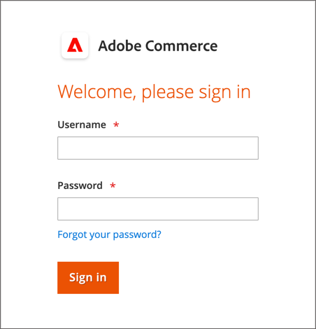

# Ihr Admin-Konto

Das primäre Administratorkonto wurde während der Installation eingerichtet und kann anfängliche Platzhalterinformationen oder Beispieldateninformationen enthalten. Der vorgesehene Inhaber dieses Kontos kann den Benutzernamen und das Kennwort personalisieren und den Vornamen, Nachnamen und die E-Mail-Adresse jederzeit aktualisieren. Dieses Konto, ein _Superuser_ mit allen Berechtigungen standardmäßig erstellt die Regel die für das Unternehmen benötigten Admin-Benutzerkonten.

- Siehe [Benutzer erstellen](../systems/permissions-users-all.md#create-a-user) für Informationen zum Hinzufügen oder Bearbeiten von Benutzern.

- Siehe [Berechtigungen](../systems/permissions.md) und [Benutzerrollen](../systems/permissions-user-roles.md) für Informationen zu Admin- und Benutzerrollen.

{{ims-admin-note}}

## Admin-Anmeldung

Die [!DNL Commerce] _Admin_ ist durch mehrere Ebenen von Sicherheitsmaßnahmen geschützt, um den unbefugten Zugriff auf Ihre Store-, Bestell- und Kundendaten zu verhindern. Beim ersten Anmelden bei der _Admin_ müssen Sie Ihren Benutzernamen und Ihr Passwort eingeben und [Zweifaktorauthentifizierung](../systems/security-two-factor-authentication.md) (2FA).

Je nach Konfiguration Ihres Stores kann es zu einer [CAPTCHA](../systems/security-google-recaptcha.md) Herausforderung zu lösen, z. B. Eingabe einer Reihe von Tastaturzeichen, Lösung eines Puzzles oder Klicken auf eine Reihe von Bildern mit einem gemeinsamen Thema. Mit diesen Tests können Sie anstelle eines automatisierten Bots als Mensch identifiziert werden.

Für zusätzliche Sicherheit können Sie festlegen, welche Teile der _Admin_ jeder Benutzer [Berechtigung](../systems/permissions.md) , um auf zuzugreifen, und auch die Anzahl der [Anmeldeversuche](../configuration-reference/advanced/admin.md). Standardmäßig ist das Konto nach sechs Versuchen gesperrt. Der Benutzer muss einige Minuten warten, bevor er es erneut versucht. [Gesperrte Konten](../systems/permissions-users-all.md#locked-users) kann auch von der _Admin_.

>[!NOTE]
>
>Beim ersten Anmelden bei der _Admin_, werden Sie aufgefordert, _Datenerfassung zur Admin-Nutzung zulassen_. Siehe [Datenerfassung verwenden](admin.md#usage-data-collection) für weitere Informationen.

{width="400"}

### Schritt 1: Zweifaktorauthentifizierung einrichten

Bevor Sie sich bei der _Admin_ Ihres Stores müssen Sie über eine Zwei-Faktor-Authentifizierungslösung verfügen, die eingerichtet und einsatzbereit ist. Weitere Informationen zum Authentifizierungsprozess, der von den einzelnen Lösungen verwendet wird, finden Sie unter [Zweifaktorauthentifizierung verwenden](../systems/security-two-factor-authentication-use.md). Standardmäßig ist [!DNL Commerce] unterstützt [Google Authenticator][1].

Fragen Sie Ihre [!DNL Commerce] Systemadministrator, welche 2FA-Lösungen für den Store unterstützt werden. Schließen Sie dann die Einrichtung Ihrer bevorzugten 2FA-Lösung gemäß den Anweisungen des Providers ab.

### Schritt 2: Anmelden bei Admin

1. Geben Sie die _Admin_ URL, die während der [!DNL Commerce] Installation.

   Die Standardeinstellung _Admin_ URL sieht ungefähr so aus: `https://www.yourdomain.com/your-custom-admin-domain`.

   >[!NOTE]
   >
   >Obwohl diese Dokumentation `admin` als Basis-URL in den meisten Beispielen verwenden, wird empfohlen, eine eindeutige und schwer zu erraten [benutzerspezifische URL](../stores-purchase/store-urls.md) für die _Admin_ Ihres Ladens.

   Sie können ein Lesezeichen für die Seite hinzufügen oder einen Tastaturbefehl auf Ihrem Desktop speichern, um einfachen Zugriff zu erhalten.

1. Geben Sie Ihre _Admin_ **[!UICONTROL Username]** und **[!UICONTROL Password]**.

1. (Optional) Wenn ein CAPTCHA für Ihren Store aktiviert ist, befolgen Sie die Anweisungen auf dem Bildschirm, um das Problem zu lösen.

   Weitere Informationen finden Sie unter [CAPTCHA](../systems/security-captcha.md) und [reCAPTCHA](../systems/security-google-recaptcha.md).

1. Klicken **[!UICONTROL Sign in]**.

   Wenn Sie sich zum ersten Mal bei der _Admin_ aus dem Konto eine E-Mail mit einem Link zu Konfigurationsanweisungen erhalten.

### Schritt 3: Abschließen der 2FA-Konfiguration

Das folgende Beispiel zeigt, wie Sie Ihre _Admin_ -Konto mit Google Authenticator.

1. Wenn der QR-Code angezeigt wird, verwenden Sie eine der folgenden Methoden, um den Code zu erfassen und den Google Authenticator mit Ihrem _Admin_ -Konto.

   {width="400"}

   - Erfassen von QR-Code mit einem Smartphone

     Starten Sie auf Ihrem Smartphone den Google Authenticator. Tippen Sie auf _Pluszeichen_ (+) in der oberen rechten Ecke der App. Tippen Sie dann unten auf dem Bildschirm auf **[!UICONTROL Scan Barcode]** und ein Bild des QR-Codes.

   - Erfassen von QR-Code aus dem Browser

     Wenn Google Authenticator als Erweiterung in Ihrem Browser installiert ist, klicken Sie auf die **Authenticator** in der Symbolleiste und erfassen Sie die Seite.

   - Manuelles Eingeben von QR-Code

     Kopieren Sie die Textzeichenfolge unterhalb des QR-Codes. Starten Sie Google Authenticator entweder mit Ihrem Smartphone oder Browser und klicken Sie auf das Pluszeichen (+). Wählen Sie anschließend **[!UICONTROL Manual Entry]**. under **[!UICONTROL Account]** eingeben, geben Sie die E-Mail-Adresse ein, die Ihrer _Admin_ Konto erstellen und die QR-Code-Zeichenfolge in die **[!UICONTROL Key]** -Feld.

1. So melden Sie sich bei _Admin_ mit Zweifaktorauthentifizierung geben Sie den sechsstelligen Code, den der Google Authenticator generiert hat, in das Feld **[!UICONTROL Authenticator code]** und klicken Sie dann auf **[!UICONTROL Confirm]**.

   {width="400"}

## Passwort zurücksetzen

Die Wiederverwendung der vier letzten Passwörter, die dem Konto zugewiesen wurden, ist nicht zulässig.

1. Geben Sie die **[!UICONTROL Email Address]** , das mit der _Admin_ -Konto.

   {width="400"}

1. Klicken **[!UICONTROL Retrieve Password]**.

   Wenn ein Konto mit der E-Mail-Adresse verknüpft ist, wird eine E-Mail gesendet, um Ihr Passwort zurückzusetzen.

   >[!NOTE]
   >
   >Ein _Admin_ Das Kennwort muss mindestens sieben Zeichen lang sein und sowohl Buchstaben als auch Zahlen enthalten. Siehe [Konfiguration _Admin_ Sicherheit](../systems/security-admin.md) für Informationen zu Passwortoptionen.

## Abmelden vom Administrator

1. Klicken Sie oben rechts auf die _Konto_ ().

1. Klicken **[!UICONTROL Sign Out]**.

   {width="700" zoomable="yes"}

Die _[!UICONTROL Sign In]_zeigt eine Meldung an, dass Sie abgemeldet sind. Abmelden von der_ Admin _wann immer Sie Ihren Computer unbeaufsichtigt lassen.

## Kontoinformationen bearbeiten

1. Klicken Sie auf _Konto_ ().

1. Klicken **[!UICONTROL Account Setting]**.

   {width="700" zoomable="yes"}

1. Nehmen Sie die erforderlichen Änderungen an Ihren Kontoinformationen vor.

   Wenn Sie Ihre Anmeldedaten ändern, stellen Sie sicher, dass Sie sie an einem sicheren Ort speichern.

1. Geben Sie Ihr aktuelles Kontokennwort ein.

1. Klicken **[!UICONTROL Save Account]**.

## Mehrere Administratoranmeldungen zulassen

Der Administrator bietet Zugriff auf die Verwaltung der Funktionen für Bestellungen, Kunden, Produkte, Versand und Zahlungen. Die Standardkonfiguration ist so eingestellt, dass mehrere Anmeldungen für ein Admin-Benutzerkonto als Best Practice für die Sicherheit deaktiviert werden. Sie können diese Einstellung jedoch ändern, damit Admin-Benutzer von mehreren Geräten aus angemeldet werden können, um Ihre geschäftlichen Workflows aufzunehmen.

1. Im _Admin_ Seitenleiste, navigieren Sie zu **[!UICONTROL Stores]** > _[!UICONTROL Settings]_>**[!UICONTROL Configuration]**.

1. Erweitern Sie im linken Navigationsbereich **[!UICONTROL Advanced]** und wählen **[!UICONTROL Admin]**.

1. Erweitern  die **[!UICONTROL Security]** Abschnitt.

1. Für **Kontofreigabe für Administratoren** auswählen `Yes`.

   {width="700" zoomable="yes"}

1. Klicken **[!UICONTROL Save Config]**.

## Legen Sie die Anmeldenamen der Admin-Benutzer so fest, dass zwischen Groß- und Kleinschreibung unterschieden wird

1. Im _Admin_ Seitenleiste, navigieren Sie zu **[!UICONTROL Stores]** > _[!UICONTROL Settings]_>**[!UICONTROL Configuration]**.

1. Erweitern Sie im linken Navigationsbereich **[!UICONTROL Advanced]** und wählen **[!UICONTROL Admin]**.

1. Erweitern  die **[!UICONTROL Security]** Abschnitt.

1. Legen Sie die **[!UICONTROL Login is Case Sensitive]** -Feld zu `Yes`.

1. Klicken **[!UICONTROL Save Config]**.

[1]: https://play.google.com/store/apps/details?id=com.google.android.apps.authenticator2&amp;hl=en_US
