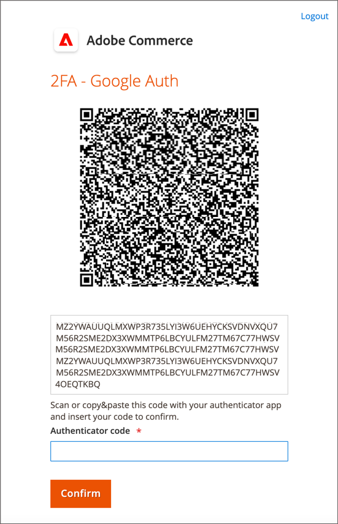

# Ihr Admin-Konto

Das primäre Admin-Konto wurde ursprünglich während der Installation eingerichtet und kann anfängliche Platzhalterinformationen oder Beispieldateninformationen enthalten. Der festgelegte Besitzer dieses Kontos kann den Benutzernamen und das Kennwort personalisieren und den Vornamen, Nachnamen und die E-Mail-Adresse jederzeit aktualisieren. Dieses Konto, _Superuser_ mit standardmäßig allen Berechtigungen, erstellt in der Regel die für das Unternehmen erforderlichen Admin-Benutzerkonten.

- Informationen [&#x200B; Hinzufügen oder Bearbeiten von Benutzern finden &#x200B;](../systems/permissions-users-all.md#create-a-user) unter „Benutzer erstellen“.

- Informationen [&#x200B; Admin](../systems/permissions.md) und Benutzerrollen finden [&#x200B; unter &#x200B;](../systems/permissions-user-roles.md)Berechtigungen“.

{{ims-admin-note}}

## Admin-Anmeldung

Der [!DNL Commerce] _Admin_ ist durch mehrere Sicherheitsmaßnahmen geschützt, um einen unbefugten Zugriff auf Ihre Store-, Auftrags- und Kundendaten zu verhindern. Bei der ersten Anmeldung bei _Admin_ müssen Sie Ihren Benutzernamen und Ihr Kennwort eingeben und die [Zwei-Faktor-Authentifizierung](../systems/security-two-factor-authentication.md) (2FA) einrichten.

Je nach Konfiguration Ihres Stores kann eine [CAPTCHA](../systems/security-google-recaptcha.md)-Herausforderung gelöst werden, z. B. das Eingeben einer Reihe von Tastaturzeichen, das Lösen eines Puzzles oder das Klicken auf eine Reihe von Bildern mit einem gemeinsamen Thema. Diese Tests sind so konzipiert, dass Sie als Mensch identifiziert werden, und nicht als automatisierter Bot.

Aus Sicherheitsgründen können Sie festlegen, auf welche Teile des _Admin_ jeder Benutzer [Berechtigung](../systems/permissions.md) zugreifen kann, und auch die Anzahl der [Anmeldeversuche](../configuration-reference/advanced/admin.md) begrenzen. Standardmäßig wird das Konto nach sechs Versuchen gesperrt und der/die Benutzende muss einige Minuten warten, bevor er/sie es erneut versucht. [Gesperrte Konten](../systems/permissions-users-all.md#locked-users) können auch über die _Admin_ zurückgesetzt werden.

>[!NOTE]
>
>Wenn Sie sich zum ersten Mal bei _Admin_ anmelden, werden Sie aufgefordert, die Datenerfassung _Admin-Nutzung zulassen_. Weitere Informationen [&#x200B; Sie unter &#x200B;](admin.md#usage-data-collection)Nutzungsdatenerfassung“.

{width="400"}

### Schritt 1: Einrichten der Zwei-Faktor-Authentifizierung

Bevor Sie sich beim _Administrator_ Ihres Geschäfts anmelden können, müssen Sie eine Zwei-Faktor-Authentifizierungslösung eingerichtet haben, die einsatzbereit ist. Weitere Informationen zum Authentifizierungsprozess, der von den einzelnen Lösungen verwendet wird, finden Sie unter [Verwenden der Zwei-Faktor-Authentifizierung](../systems/security-two-factor-authentication-use.md). Standardmäßig unterstützt [!DNL Commerce] [Google Authenticator][1].

Fragen Sie Ihren [!DNL Commerce] Systemadministrator, welche 2FA-Lösungen für den Store unterstützt werden. Schließen Sie dann die Einrichtung Ihrer bevorzugten 2FA-Lösung gemäß den Anweisungen des Anbieters ab.

### Schritt 2: Beim Administrator anmelden

1. Geben Sie die _Admin_-URL ein, die während der [!DNL Commerce]-Installation angegeben wurde.

   Die standardmäßige _Admin_-URL sieht in etwa wie `https://www.yourdomain.com/your-custom-admin-domain` aus.

   >[!NOTE]
   >
   >Obwohl diese Dokumentation in den meisten Beispielen `admin` als Basis-URL verwendet, wird empfohlen, eine eindeutige und schwer zu erratende [benutzerdefinierte URL](../stores-purchase/store-urls.md) für den _Administrator_ Ihres Stores auszuwählen.

   Sie können ein Lesezeichen für die Seite hinzufügen oder eine Verknüpfung auf Ihrem Desktop speichern, um den Zugriff zu erleichtern.

1. Geben Sie Ihre _Admin_-**[!UICONTROL Username]** und -**[!UICONTROL Password]** ein.

1. (Optional) Wenn ein CAPTCHA für Ihren Store aktiviert ist, befolgen Sie die Anweisungen auf dem Bildschirm, um die Herausforderung zu lösen.

   Weitere Informationen finden Sie unter [CAPTCHA](../systems/security-captcha.md) und [reCAPTCHA](../systems/security-google-recaptcha.md).

1. Klicken Sie auf **[!UICONTROL Sign in]**.

   Wenn Sie sich zum ersten Mal über das Konto bei _Admin_ anmelden, sollten Sie eine E-Mail mit einem Link zu Konfigurationsanweisungen erhalten.

### Schritt 3: Abschließen der 2FA-Konfiguration

Das folgende Beispiel zeigt, wie Sie Ihr _Admin“-_ mit Google Authenticator koppeln.

1. Wenn der QR-Code angezeigt wird, verwenden Sie eine der folgenden Methoden, um den Code zu erfassen und Google Authenticator mit Ihrem _Admin_-Konto zu verbinden.

   {width="400"}

   - Erfassen von QR-Code mit einem Smartphone

     Starten Sie auf Ihrem Smartphone Google Authenticator. Tippen Sie auf _Pluszeichen_ (+) in der oberen rechten Ecke der App. Tippen Sie dann unten auf dem Bildschirm auf **[!UICONTROL Scan Barcode]** und machen Sie ein Foto des QR-Codes.

   - QR-Code vom Browser erfassen

     Wenn Google Authenticator als Erweiterung in Ihrem Browser installiert ist, klicken Sie auf das Symbol **Authenticator** in der Symbolleiste und erfassen Sie die Seite.

   - QR-Code manuell eingeben

     Kopieren Sie die Zeichenfolge unter den QR-Code. Starten Sie Google Authenticator entweder mit Ihrem Smartphone oder Browser und klicken Sie auf das Pluszeichen (+). Wählen Sie dann **[!UICONTROL Manual Entry]**. Geben Sie unter **[!UICONTROL Account]** die E-Mail-Adresse ein, die mit Ihrem _Admin_-Konto verknüpft ist, und fügen Sie die QR-Code-Zeichenfolge in das Feld **[!UICONTROL Key]** ein.

1. Um sich bei _Admin_ mit Zwei-Faktor-Authentifizierung anzumelden, geben Sie den sechsstelligen Code, der von Google Authenticator generiert wurde, in das Feld **[!UICONTROL Authenticator code]** ein und klicken Sie dann auf **[!UICONTROL Confirm]**.

   {width="400"}

## Passwort zurücksetzen

Die Wiederverwendung der letzten vier Kennwörter, die dem Konto zugewiesen wurden, ist nicht zulässig.

1. Geben Sie die **[!UICONTROL Email Address]** ein, die mit dem Konto _admin_ verknüpft ist.

   {width="400"}

1. Klicken Sie auf **[!UICONTROL Retrieve Password]**.

   Wenn der E-Mail-Adresse ein Konto zugeordnet ist, wird eine E-Mail gesendet, um Ihr Kennwort zurückzusetzen.

   >[!NOTE]
   >
   >Ein _Admin_-Kennwort muss mindestens sieben Zeichen lang sein und sowohl Buchstaben als auch Zahlen enthalten. Informationen [&#x200B; Kennwortoptionen finden Sie unter _Admin_-](../systems/security-admin.md) konfigurieren.

## Melden Sie sich bei Admin ab

1. Klicken Sie oben rechts auf das Symbol _Konto_ ().

1. Klicken Sie auf **[!UICONTROL Sign Out]**.

   {width="700" zoomable="yes"}

Auf der Seite _[!UICONTROL Sign In]_&#x200B;wird eine Meldung angezeigt, dass Sie abgemeldet sind. Melden Sie sich von der_ Admin _ab, wenn Sie Ihren Computer unbeaufsichtigt lassen.

## Kontoinformationen bearbeiten

1. Klicken Sie auf _Symbol_ Konto).

1. Klicken Sie auf **[!UICONTROL Account Setting]**.

   {width="700" zoomable="yes"}

1. Nehmen Sie die erforderlichen Änderungen an Ihren Kontoinformationen vor.

   Wenn Sie Ihre Anmeldedaten ändern, stellen Sie sicher, dass Sie sie an einem sicheren Ort speichern.

1. Geben Sie Ihr aktuelles Kontokennwort ein.

1. Klicken Sie auf **[!UICONTROL Save Account]**.

## Mehrere Admin-Anmeldungen zulassen

Der Administrator bietet Zugriff zur Verwaltung der Funktionen für Bestellungen, Kunden, Produkte, Versand und Zahlungen. Als Best Practice für die Sicherheit wird in der Standardkonfiguration festgelegt, dass mehrere Anmeldungen für ein Admin-Benutzerkonto nicht zulässig sind. Sie können diese Einstellung jedoch ändern, damit sich Admin-Benutzer von mehreren Geräten aus anmelden können, um Ihre Unternehmens-Workflows zu unterstützen.

1. Navigieren Sie in _Admin_-Seitenleiste zu **[!UICONTROL Stores]** > _[!UICONTROL Settings]_>**[!UICONTROL Configuration]**.

1. Erweitern Sie im linken Navigationsbereich **[!UICONTROL Advanced]** und wählen Sie **[!UICONTROL Admin]**.

1. Erweitern Sie  den Abschnitt **[!UICONTROL Security]** .

1. Wählen Sie **Admin-Kontofreigabe** die Option `Yes` aus.

   {width="700" zoomable="yes"}

1. Klicken Sie auf **[!UICONTROL Save Config]**.

## Admin-Benutzernamen unter Berücksichtigung der Groß-/Kleinschreibung festlegen

1. Navigieren Sie in _Admin_-Seitenleiste zu **[!UICONTROL Stores]** > _[!UICONTROL Settings]_>**[!UICONTROL Configuration]**.

1. Erweitern Sie im linken Navigationsbereich **[!UICONTROL Advanced]** und wählen Sie **[!UICONTROL Admin]**.

1. Erweitern Sie  den Abschnitt **[!UICONTROL Security]** .

1. Legen Sie das Feld **[!UICONTROL Login is Case Sensitive]** auf `Yes` fest.

1. Klicken Sie auf **[!UICONTROL Save Config]**.

[1]: https://play.google.com/store/apps/details?id=com.google.android.apps.authenticator2&hl=en_US

## Gewährleistung eines sicheren Zugriffs auf den Administrator

Um die Sicherheit Ihres Administrators zu gewährleisten, führen Sie regelmäßige Audits von Benutzern und Rollen mit Administratorzugriff durch.

Darüber hinaus sollten Sie [die Konfiguration der Admin-Basis](https://experienceleague.adobe.com/de/docs/commerce-admin/config/advanced/admin#admin-base-url)URL aktualisieren, um den standardmäßigen `/admin`-Endpunkt in einen benutzerdefinierten Pfad zu ändern. Die Konfiguration eines benutzerdefinierten Pfads bietet die folgenden Sicherheitsvorteile:

**Erweiterte Sicherheit**: Der standardmäßige „Admin“-Pfad ist weithin bekannt und wird oft von böswilligen Akteuren verwendet, die Brute-Force-Angriffe durchführen. Durch die Änderung in einen eindeutigen, benutzerdefinierten Wert verringern Sie das Risiko nicht autorisierter Zugriffsversuche erheblich.

**Geringere Sicherheitslücken**: Automatisierte Bots suchen häufig nach allgemeinen Pfaden wie „admin“, um Sicherheitslücken auszunutzen. Ein benutzerdefinierter Pfad erschwert es diesen Bots, Ihre Admin-Anmeldeseite zu finden, wodurch die Wahrscheinlichkeit von Angriffen reduziert wird.

**Verbesserter Datenschutz**: Ein benutzerdefinierter Admin-Pfad fügt eine zusätzliche Ebene der Unklarheit hinzu, wodurch es potenziellen Angreifern erschwert wird, Ihre Admin-Anmeldeseite zu identifizieren und anzusprechen.

**Einhaltung von Best Practices**: Die Befolgung von Best Practices für die Sicherheit, wie z. B. die Anpassung des Administratorpfads, zeigt einen proaktiven Ansatz zum Schutz Ihrer E-Commerce-Site und Kundendaten.

>[!NOTE]
>
>Wenn ein Verstoß vermutet wird, entfernen Sie alle unbekannten Admin-Benutzer und setzen Sie alle Admin-Kennwörter zurück. Überprüfen Sie [Sicherheits-Aktionsplan](https://experienceleague.adobe.com/de/docs/commerce-admin/systems/security/security) auf weitere Schritte.
