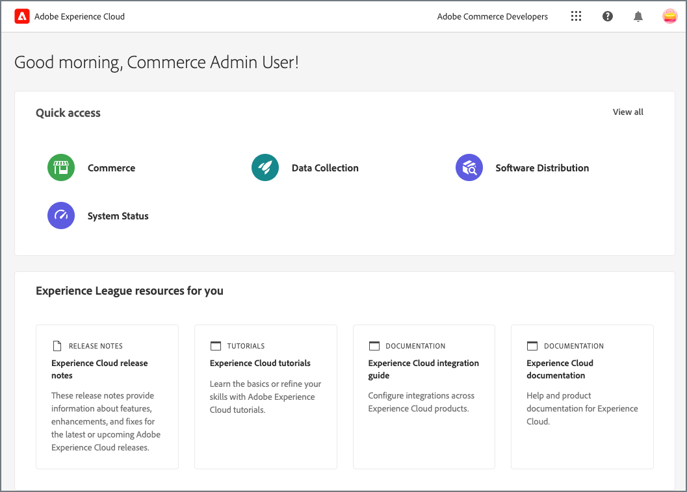
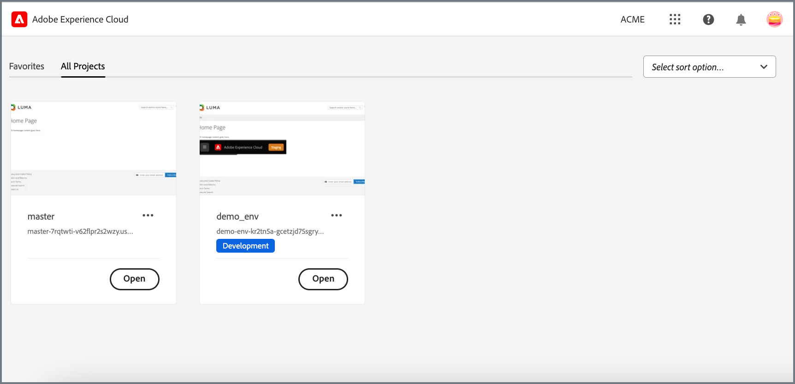

# Konfigurieren der Experience Cloud-Integration mit Commerce Admin

Beginnen Sie mit der Experience Cloud-Integration mit Commerce Admin, indem Sie das Commerce-Programm so konfigurieren, dass es die Erweiterungen Commerce Admin Unified Experience und Commerce Events verwendet.


## Voraussetzungen

- Adobe Commerce muss für die Verwendung der [Adobe IMS-Authentifizierung“ konfiguriert ](../getting-started/adobe-ims-config.md)
- Kontobereitstellung und -berechtigungen: Administratoren müssen über ein [Adobe-Geschäftsprofil ](https://helpx.adobe.com/enterprise/kb/introducing-adobe-profiles.html#:~:text=Adobe%20profiles%20help%20you%20manage,under%20the%20same%20email%20address) Zugriff auf die folgenden Ressourcen verfügen, um die Experience Cloud-Integration zu konfigurieren:
   - [Adobe Admin Console](https://helpx.adobe.com/enterprise/admin-guide.html) - Hinzufügen und Verwalten von Adobe-Benutzer- und -Entwicklerkonten für das Unternehmen
   - [Adobe Developer Console](https://developer.adobe.com/developer-console/docs/guides/getting-started/)—Entwickler- oder Systemadministratorzugriff zum Erstellen von App Builder-Projekten und zum Generieren der Verbindungsanmeldeinformationen und der Projektkonfiguration für die Verwendung des Adobe I/O Events-Services
   - [Commerce in einem Cloud-Infrastrukturprojekt](https://experienceleague.adobe.com/docs/commerce-cloud-service/start/onboarding.html#get-started-with-the-project-web-interface)—Installieren Sie die erforderlichen Module und konfigurieren Sie den Commerce-Anwendungsserver mithilfe der Adobe Commerce-CLI
   - [Commerce Admin](https://experienceleague.adobe.com/docs/commerce-admin/start/guide-overview.html): Aktualisieren der Store-Konfiguration und Verwalten von Commerce-Benutzerkonten

## Konfigurationsübersicht

Aktivieren Sie die Integration, indem Sie die folgenden Aufgaben ausführen:

1. [Überprüfen Sie die Commerce-Umgebung und die Anwendungskonfiguration](#check-the-commerce-environment-and-application-configuration).

1. [Aktivieren Sie die Commerce Admin Unified Experience-Erweiterung](#enable-the-commerce-admin-unified-experience-extension).

1. [Einrichten von Adobe I/O Events für Commerce](#set-up-adobe-io-events).

1. [Testen Sie die Integration](#test-the-integration).

## Überprüfen der Commerce-Umgebung und der Anwendungskonfiguration

Bevor Sie die Experience Cloud-Integration konfigurieren, überprüfen Sie, ob Ihr Projekt und Ihre Commerce-Anwendung die Anforderungen erfüllen.

1. Wechseln Sie auf Ihrer lokalen Workstation in das Projektverzeichnis für Ihr Commerce-Projekt.

1. Checken Sie die Umgebungsverzweigung für die Instanz aus, die mit Experience Cloud integriert werden soll.

1. Stellen Sie sicher, dass Adobe IMS aktiviert ist.

   - Verwenden Sie die [SSH-Zugriffs-URL](https://experienceleague.adobe.com/docs/commerce-cloud-service/user-guide/develop/secure-connections.html) für die Umgebung, um eine Verbindung zum Commerce-Anwendungsserver herzustellen.

   - Verwenden Sie in der Befehlszeile die Adobe Commerce-CLI, um den IMS-Modulstatus zu überprüfen.

     ```bash
     bin/magento admin:adobe-ims:status
     ```

   Wenn das Modul nicht aktiviert ist, aktivieren [aktivieren Sie es mithilfe der Organisation und der Anmeldeinformationen für das IMS-Integrationsprojekt](../getting-started/adobe-ims-config.md#step-3-enable-the-adminadobeims-module).

1. Vergewissern Sie sich, dass sich der Admin-Benutzer mit seiner Adobe ID bei Commerce Admin anmelden kann.

   - Navigieren Sie zur Commerce Admin-URL.

   - Wenn Sie angemeldet sind, melden Sie sich ab.

   - Stellen Sie sicher, dass der Administrator umgeleitet wird, um sich mit seiner Adobe ID anzumelden.

     {width="600" zoomable="yes"}

1. Überprüfen Sie im Cloud-Projektverzeichnis auf Ihrer lokalen Workstation, ob die Commerce Admin Unified Experience-Erweiterung installiert ist.

   ```bash
   composer show *unified-experience*
   ```

   Wenn die Erweiterung installiert ist, gibt Composer den Namen und die Beschreibung der Erweiterung zurück.

   ```
   magento/module-unified-experience <version> Commerce module responsible for integration with Adobe Experience Cloud
   ```

   Wenn die Erweiterung nicht installiert ist, verwenden Sie Composer, um sie zu installieren. Übertragen Sie dann die Änderungen und stellen Sie die Cloud-Umgebung erneut bereit.

   ```
   composer require magento/module-unified-experience
   composer update
   ```

## Einheitliches Erlebnis für Commerce Admin aktivieren

Aktivieren Sie die Commerce Admin Unified Experience-Erweiterung und melden Sie sich über Experience Cloud an.

>[!NOTE]
>
>Diese Anweisungen zeigen, wie ein Commerce Cloud-Projekt-Administrator die Erweiterung mithilfe der Adobe Commerce-CLI aktivieren kann. Commerce-Admin-Benutzer können die Erweiterung auch aktivieren, indem sie die [Konfigurationseinstellungen des Commerce Stores aktualisieren](admin-unified-experience-integration-manage.md#from-the-commerce-admin).

1. Verwenden Sie im Stammverzeichnis Ihrer Cloud-Projektumgebung auf Ihrer lokalen Workstation das [magento-cloud-CLI-Tool](https://experienceleague.adobe.com/docs/commerce-cloud-service/user-guide/dev-tools/cloud-cli/cloud-cli-overview.html), um sich beim Commerce-Anwendungs-Server anzumelden.

   ```bash
   magento-cloud ssh
   ```

1. Aktivieren der `magento/module-unified-experience`-Erweiterung über die Adobe Commerce-CLI:

   ```bash
   bin/magento config:set admin/unified_experience/enabled 1
   Admin Unified Experience integration is enabled
   ```

1. Löschen Sie den Cache.

   ```bash
   bin/magento cache:clean
   ```

## Einrichten von Adobe I/O Events für Commerce

Wenn die Experience Cloud-Integration aktiviert ist, sendet der Adobe I/O Events-Service Commerce-Ereignisdaten an Experience Cloud, um den Administratorzugriff auf Commerce-Projekte zu verwalten. Die Diensteinrichtung erfordert die Aktivierung der Erweiterung &quot;Adobe I/O Events for Commerce&quot; (`magento/commerce-eventing`) und die Konfiguration des Adobe I/O Events-Dienstes in der Admin Console.

### Commerce-Ereignisse aktivieren

Aktivieren Sie die Commerce Events-Erweiterung (`magento/commerce-eventing`), um benutzerdefinierte Ereignisdaten von der Commerce-Anwendung an den Adobe I/O Events-Service zu senden.

>[!NOTE]
>
>Bei Commerce 2.4.6 und höher ist die Commerce Events-Erweiterung standardmäßig installiert. Verwenden Sie für Commerce-Projekte mit Commerce 2.4.5 zunächst Composer, um [die Erweiterung zu installieren](https://developer.adobe.com/commerce/extensibility/events/installation/#install-adobe-io-modules-on-commerce) und aktivieren Sie sie dann.

1. Fügen Sie in Ihrer lokalen Commerce-Projektentwicklungsumgebung der `.magento.env.yaml`-Datei die folgende Konfiguration hinzu.

   ```yaml
   stage:
     global:
       ENABLE_EVENTING: true
     deploy:
       CRON_CONSUMERS_RUNNER:
         cron_run: true
         max_messages: 0
         consumers: []
   ```

1. Hinzufügen, Übertragen und Bereitstellen der aktualisierten `.magento.env.yaml file` in die Cloud-Umgebung.

>[!TIP]
>
>Weitere Informationen zum Konfigurieren und Verwalten von Umgebungsvariablen mithilfe der `.magento.env.yaml` finden Sie unter [Konfigurieren von Umgebungsvariablen für die Bereitstellung](https://experienceleague.adobe.com/docs/commerce-cloud-service/user-guide/configure/env/configure-env-yaml.html).

### Konfigurieren der Commerce-Ereignisintegration

Konfigurieren Sie die Commerce-Ereignisintegration, indem Sie die folgenden Aufgaben ausführen. Detaillierte Anweisungen finden Sie in der Entwicklerdokumentation zu [Adobe I/O Events ](https://developer.adobe.com/commerce/extensibility/events/project-setup/) Commerce.

1. [Erstellen eines App Builder-Projekts](https://developer.adobe.com/commerce/extensibility/events/project-setup/) um Ereignisdaten von der Commerce-Instanz zu erhalten.

   Sie benötigen Anmeldedaten und Konfigurationsdaten aus dem App Builder-Projekt, um die Integration in Commerce Admin zu konfigurieren.

1. Konfigurieren Sie Adobe Commerce für die Verwendung von Adobe I/O Events.

   - [Aktualisieren Sie die Store-Konfigurationseinstellungen für den Adobe I/O Events-Service](https://developer.adobe.com/commerce/extensibility/events/configure-commerce/#begin-configuring-events-on-commerce).

   - [Konfigurieren eines Ereignisanbieters zum Senden von Commerce-Ereignissen](https://developer.adobe.com/commerce/extensibility/events/configure-commerce/#create-an-event-provider-and-complete-the-commerce-configuration).

1. [Aktualisieren Sie das App Builder-Projekt, um Ereignisdaten von der Commerce-Instanz zu erhalten](https://developer.adobe.com/commerce/extensibility/events/configure-commerce/#subscribe-and-register-events).

   Melden Sie sich nicht an und abonnieren Sie keine Ereignisse aus der Commerce-Instanz. Die Ereignisregistrierung wird an das App Builder-Projekt übergeben, wenn Sie den Ereignisanbieter für die Commerce-Anwendung konfigurieren.

   Nachdem Sie den Ereignisanbieter mit dem App Builder-Projekt verbunden haben, abonnieren Sie das `observer.uex_commerce_instance_update`-Ereignis und speichern Sie die Änderungen.

1. Um die Verbindung herzustellen, senden Sie ein -Ereignis über den Ereignisanbieter an den Verbraucher.

   - Verwenden Sie in der Befehlszeile im lokalen Cloud-Projektverzeichnis [SSH, um eine Verbindung zum Commerce-Anwendungsserver herzustellen](https://experienceleague.adobe.com/docs/commerce-cloud-service/user-guide/develop/secure-connections.html#connect-to-a-remote-environment).

     ```bash
     magento-cloud ssh
     ```

   - Senden Sie Ereignisdaten, indem Sie den Status der einheitlichen Admin-Erlebniserweiterung mithilfe der Adobe Commerce-CLI überprüfen.

     ```bash
     bin/magento bin/magento admin:uex:status
     ```

### Testen der Integration

Vergewissern Sie sich, dass sich ein Commerce-Administrator bei Experience Cloud anmelden kann, um verfügbare Commerce-Projekte anzuzeigen und auf die Admin- und Storefront für jedes Projekt zuzugreifen.

1. [Melden Sie sich bei Experience Cloud an](https://experiencecloud.adobe.com/library) indem Sie die Adobe ID und das mit der Commerce-Instanz verknüpfte Unternehmen verwenden.

   {width="600" zoomable="yes"}

1. Anzeigen verfügbarer Commerce-Projekte durch Auswahl von **[!UICONTROL Commerce]**.

   {width="600" zoomable="yes"}

1. Öffnen Sie den Administrator für eine Instanz, indem Sie **[!UICONTROL Open]** auswählen.

   {width="600" zoomable="yes"}

1. Stellen Sie sicher, dass Sie Admin-Aufgaben erwartungsgemäß ausführen können.

   Workflows in der Commerce Admin sollten demselben Prozess folgen. Wenn nach der Aktivierung der Experience Cloud-Integration Workflow-Änderungen oder -Fehler auftreten, wenden Sie sich an Ihren Commerce-Systemadministrator oder [ Sie ein Adobe-Support-Ticket](https://experienceleague.adobe.com/docs/commerce-knowledge-base/kb/help-center-guide/magento-help-center-user-guide.html#submit-ticket).

Überprüfen Sie nach der Konfiguration der Experience Cloud-Integration, ob Administratorkonten für den Zugriff auf Commerce-Projekte über Experience Cloud korrekt bereitgestellt wurden. Siehe [Verwalten von Admin-](/help/getting-started/admin-unified-experience-integration-manage.md#manage-admin-user-accounts).
