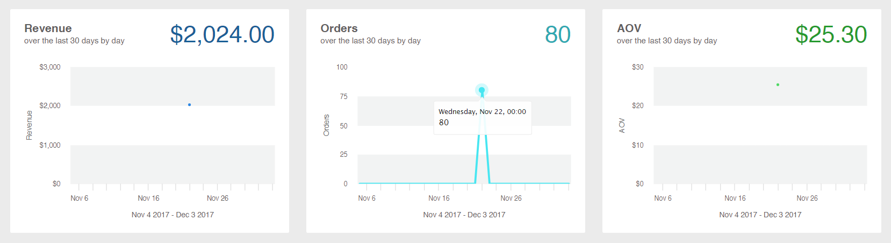

# [!DNL Commerce Intelligence]

Verwenden Sie Commerce Intelligence-Tools, um die insight zu erhalten, die für fundierte Geschäftsentscheidungen verwendet wird.

## [!DNL Commerce Intelligence]

Wenn Sie ein [!DNL Commerce Intelligence] über Adobe aktivieren, erhalten Sie Zugriff auf fünf Dashboards mit etwa 70 Berichten. Diese Berichte bieten Einblicke in Ihre Daten und beantworten Fragen wie: „Wie wachsen meine Bestellungen von Monat zu Monat?“, „Wer sind meine treuesten Kunden?“ und „Funktioniert meine Couponstrategie?“ Ausführliche Informationen zu diesem Toolset finden Sie im [Commerce Intelligence-Benutzerhandbuch](https://experienceleague.adobe.com/docs/commerce-business-intelligence/mbi/guide-overview.html).

## [!DNL Advanced Reporting]

[!DNL Advanced Reporting] ist in Adobe Commerce und Magento Open Source enthalten. Mit dieser Funktion erhalten Sie Zugriff auf eine Suite dynamischer Berichte, die auf Ihren Produkt-, Auftrags- und Kundendaten basieren, und zwar mit einem personalisierten Dashboard, das auf Ihre Geschäftsanforderungen zugeschnitten ist. Während [!DNL Advanced Reporting] [!DNL Commerce Intelligence] für die Analyse verwendet, benötigen Sie kein Commerce Intelligence-Konto, um [!DNL Advanced Reporting] verwenden zu können.

Technische Informationen finden Sie im [[!DNL Advanced Reporting]](https://developer.adobe.com/commerce/php/development/advanced-reporting/){:target="_blank"} Thema in der Entwicklerdokumentation.

>[!NOTE]
>
>Aufgrund von Kompatibilitätsproblemen mit [!DNL Adobe Commerce Intelligence] kann Commerce das erweiterte Reporting mit dem AWS S3-Bucket als Medium für die Quelldatendatei in [!DNL Commerce Intelligence] vorübergehend nicht unterstützen.

{width="700"}

### Anforderungen

* Die Website muss auf einem öffentlichen Webserver ausgeführt werden.

* Die Domain muss über ein gültiges Sicherheitszertifikat (SSL) verfügen.

* [!DNL Commerce] muss ohne Fehler erfolgreich installiert oder aktualisiert worden sein.

* In der [!DNL Commerce] für [Store-URLs](../stores-purchase/store-urls.md) muss die **[!UICONTROL Base URL (Secure)]** für die Store-Ansicht auf die sichere URL verweisen. Beispiel: `https://yourdomain.com`.

* In der [!DNL Commerce] für Store-URLs müssen **[!UICONTROL Use Secure URLs on Storefront]** und **[!UICONTROL Use Secure URLs in Admin]** auf `Yes` gesetzt werden.

* [[!DNL Commerce] crontab](https://experienceleague.adobe.com/docs/commerce-operations/configuration-guide/cli/configure-cron-jobs.html) wird erstellt und Cron-Aufträge werden auf dem installierten Server ausgeführt.

>[!NOTE]
>
>[!DNL Advanced Reporting] können nur mit [!DNL Commerce] Anlagen verwendet werden, die ständig eine einzige [Basiswährung“ ](../stores-purchase/currency-configuration.md).


### Schritt 1: [!DNL Advanced Reporting] aktivieren

In der [!DNL Commerce]-Konfiguration ist [[!DNL Advanced Reporting]](../configuration-reference/general/advanced-reporting.md) standardmäßig aktiviert und startet automatisch, wenn cron [konfiguriert](../configuration-reference/advanced/system.md) ausgeführt wird. Ein Versuch, das Abonnement einzurichten, wird zu Beginn jeder Stunde innerhalb der nächsten 24 Stunden bis zum Erfolg gestartet. Der Abonnementstatus ist „Ausstehend“, bis das Abonnement erfolgreich eingerichtet wurde.

1. Navigieren Sie in _Admin_-Seitenleiste zu **[!UICONTROL Stores]** > _[!UICONTROL Settings]_>**[!UICONTROL Configuration]**.

1. Wählen Sie im linken Navigationsbereich, in dem die **[!UICONTROL General]** erweitert ist, **[!UICONTROL Advanced Reporting]** aus und führen Sie folgende Schritte aus:

   * Stellen Sie sicher, dass **[!UICONTROL Advanced Reporting Service]** auf `Enable` (Standardeinstellung) gesetzt ist.

   * Legen Sie für die **[!UICONTROL Time of day to send data]** die Stunde, Minute und Sekunde fest (entsprechend einer 24-Stunden-Uhrzeit), bis zu der der Service aktualisierte Daten aus Ihrem Store erhalten soll. Standardmäßig werden die Daten um 2:00 :00 gesendet.

   * Wählen Sie unter **[!UICONTROL Industry Data]** die **[!UICONTROL Industry]** aus, die Ihr Unternehmen am besten beschreibt.

   {width="400"}

1. Klicken Sie abschließend auf **[!UICONTROL Save Config]**.

1. Wenn Sie dazu aufgefordert werden, klicken Sie oben auf der Seite in der Meldung auf **[[!UICONTROL Cache Management]](../systems/cache-management.md)** und aktualisieren Sie alle ungültigen Caches.

1. Warten Sie über Nacht oder bis zum Zeitpunkt des nächsten geplanten Updates. Überprüfen Sie dann den Status Ihres Abonnements. Wenn der Status immer noch _Ausstehend_ ist, stellen Sie sicher, dass Ihre Installation alle Anforderungen erfüllt.

### Schritt 2: [!DNL Advanced Reporting]

1. Führen Sie einen der folgenden Schritte aus:

   * Wählen Sie in der _Admin_-Seitenleiste **[!UICONTROL Dashboard]** aus. Klicken Sie dann auf **[!UICONTROL Go to Advanced Reporting]**.
   * Navigieren Sie in _Admin_-Seitenleiste zu **[!UICONTROL Reports]** > _[!UICONTROL Business Intelligence]_>**[!UICONTROL Advanced Reporting]**.

   Das [!DNL Advanced Reporting]-Dashboard bietet eine schnelle Zusammenfassung Ihrer Bestellungen, Kunden und Produkte. Scrollen Sie nach unten, um das vollständige Dashboard anzuzeigen.

1. Um eine bessere Ansicht der Daten zu erhalten, legen Sie die **[!UICONTROL Filters]** oben rechts auf den Zeitraum und die Speicheransicht fest, die Sie in den Bericht aufnehmen möchten. Gehen Sie dann wie folgt vor:

   * Zeigen Sie mit der Maus auf einen beliebigen Datenpunkt, um weitere Informationen anzuzeigen.
   * Um alle Dashboard-Berichte anzuzeigen, klicken Sie auf jede Registerkarte.

   {width="600" zoomable="yes"}

## Zugriff [!DNL Advanced Reporting] Datenressourcen

Klicken Sie oben rechts im Dashboard Erweiterte Berichterstellung auf **[!UICONTROL Additional Resources]**.

{width="600" zoomable="yes"}

## Fehlerbehebung

Wenn Sie die 404-Meldung „Seite nicht gefunden“ erhalten, überprüfen Sie, ob Ihr Store die Anforderungen für [!DNL Advanced Reporting] erfüllt. Befolgen Sie dann die Anweisungen, um sicherzustellen, dass die Integration installiert ist.

### Überprüfen, ob die Integration aktiv ist

1. Navigieren Sie in _Admin_-Seitenleiste zu **[!UICONTROL System]** > _[!UICONTROL Extensions]_>**[!UICONTROL Integration]**.

1. Stellen Sie sicher, dass die **[!UICONTROL Magento Analytics user]** Integration in der Liste angezeigt wird und die **[!UICONTROL Status]** `Active` ist.

1. Um den Benutzer wiederherzustellen, klicken Sie auf **[!UICONTROL Reauthorize]** und führen Sie folgende Schritte aus:

   {width="600"}

   * Wenn Sie dazu aufgefordert werden, klicken Sie auf **[!UICONTROL Reauthorize]** , um den Zugriff auf die API-Ressourcen zu genehmigen.

     {width="600"}

   * Überprüfen Sie, ob die Liste der Integrations-Token für Erweiterungen vollständig ist. Klicken Sie dann auf **Fertig**.

     {width="600"}

1. Suchen Sie nach der Meldung, die anzeigt, dass der `Magento Analytics user` erneut autorisiert wurde.

1. Warten Sie über Nacht oder bis zum Zeitpunkt des nächsten geplanten Updates.

### Einzel-Basiswährung überprüfen

[!DNL Advanced Reporting] können nur mit [!DNL Commerce] Anlagen verwendet werden, die seit der Installation nur [ (](../stores-purchase/currency-configuration.md)) verwendet haben. Das Ergebnis ist, dass in der Historie alle Bestellungen dieselbe Basiswährung verwenden. [!DNL Advanced Reporting] funktioniert nicht, wenn Sie zu irgendeinem Zeitpunkt Ihre Basiswährung geändert haben und Bestellungen in Ihrem Verlauf mit unterschiedlichen Basiswährungen verarbeitet wurden.

Um festzustellen, ob Ihr Store mehrere Basiswährungen hat, können Sie Ihre [!DNL Commerce]-Datenbank über die Befehlszeile mit dem folgenden MySQL-Beispiel abfragen. Möglicherweise müssen Sie die Tabellennamen ändern, damit sie Ihrer Datenstruktur entsprechen:

```sql
select distinct base_currency_code from sales_order;
```

### Datendiskrepanz

Wenn Sie bemerken, dass die `Data last updated...` Beschriftung das Datum vom Vortag und nicht das heutige anzeigt, kann es zu einer Verzögerung von bis zu einem Tag bei den Aktualisierungen der erweiterten Berichte kommen. Diese Verzögerung ist auf eine größere Warteschlangengröße als erwartet zurückzuführen.

## Dashboard-Berichte

**[!UICONTROL Orders]**

| Feld | Beschreibung |
|--- |--- |
| [!UICONTROL Revenue] | Zeigt alle Umsätze an, die von der Shop-Ansicht während des definierten Zeitraums empfangen wurden. |
| [!UICONTROL Orders] | Zeigt alle Bestellungen an, die während des definierten Zeitraums über die Store-Ansicht aufgegeben wurden. |
| [!UICONTROL AOV] | Zeigt den durchschnittlichen Bestellwert, der während des definierten Zeitraums über die Store-Ansicht platziert wurde. |
| [!UICONTROL Refunds] | Zeigt alle Rückerstattungen an, die über die Store-Ansicht während des definierten Zeitraums verarbeitet wurden. |
| [!UICONTROL Tax Collected] | Zeigt alle Steuern an, die über die Store-Ansicht während des definierten Zeitraums eingezogen wurden. |
| [!UICONTROL Shipping Collected] | Zeigt alle Versandkosten an, die über die Shop-Ansicht während des definierten Zeitraums erfasst wurden. |
| [!UICONTROL Orders by Status] | Zeigt die Anzahl der Bestellungen nach Status für die Store-Ansicht während des definierten Zeitraums an. |
| [!UICONTROL Orders by Status] | Listet eine Zusammenfassung der Anzahl der Bestellungen nach Status auf. |
| [!UICONTROL Coupon Usage] | Listet alle Couponcodes und die Anzahl der Benutzer pro Kunde auf, die während des definierten Zeitraums über die Store-Ansicht eingelöst wurden. |
| [!UICONTROL Orders and Revenue by Billing Region] | Listet die Anzahl der Bestellungen und den Umsatz nach Region für die Store-Ansicht während des definierten Zeitraums auf. |
| [!UICONTROL Tax Collected by Billing Region] | Listet den Steuerbetrag auf, der für die Store-Ansicht während des definierten Zeitraums nach Region eingezogen wurde. |
| [!UICONTROL Shipping Fees Collected by Shipping Region] | Listet die Versandkosten auf, die nach Region für die Shop-Ansicht während des definierten Zeitraums erhoben werden. |

{style="table-layout:auto"}

**[!UICONTROL Customers]**

| Feld | Beschreibung |
|--- |--- |
| [!UICONTROL Unique Customers] | Zeigt die Anzahl der eindeutigen Kundenkonten an, die mit der Store-Ansicht während des definierten Zeitraums verknüpft sind. |
| [!UICONTROL New Registered Accounts] | Zeigt die Anzahl der neuen Kundenkonten an, die in dem definierten Zeitraum in der Store-Ansicht registriert wurden. |
| [!UICONTROL Top Coupon Users] | Listet die wichtigsten Couponbenutzer nach Kunden-ID und die Anzahl der Bestellungen mit Coupons für die Store-Ansicht während des definierten Zeitraums auf. |
| [!UICONTROL Customer KPI Table] | Listet die Anzahl der Bestellungen, den Umsatz und den durchschnittlichen Bestellwert nach Kunden-ID für die Store-Ansicht während des definierten Zeitraums auf. |

{style="table-layout:auto"}

**[!UICONTROL Products]**

| Feld | Beschreibung |
|--- |--- |
| [!UICONTROL Quantity of Products Sold] | Zeigt die Anzahl der Produkte an, die während des definierten Zeitraums über die Store-Ansicht verkauft wurden. |
| [!UICONTROL Products Added to Wishlists] | Listet alle Produkte auf, die während des definierten Zeitraums über die Store-Ansicht zu Wunschlisten hinzugefügt wurden. |
| [!UICONTROL Best Selling Products by Quantity] | Listet die meistverkauften Produkte und die Menge auf, die in der Store-Ansicht während des definierten Zeitraums verkauft wurden. |
| [!UICONTROL Best Selling Products by Revenue] | Listet die meistverkauften Produkte und den Umsatz auf, die durch den Verkauf des Produkts über die Store-Ansicht während des definierten Zeitraums generiert wurden. |

{style="table-layout:auto"}
