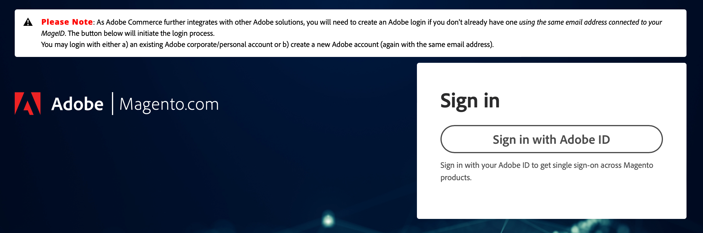

# Zugriff auf [!DNL Commerce] account

Ihre [!DNL Commerce] -Konto verfügt über eine separate Anmeldung von Ihrem Store-Administrator. Sie können auf dieses Konto über die [!DNL Commerce] Website oder von Ihrem Store-Administrator aus. Im Dashboard Ihrer [!DNL Commerce] -Konto, finden Sie Informationen zu den von Ihnen erworbenen Produkten und Dienstleistungen sowie Ihre Kontakt- und Rechnungsinformationen. Einige Informationen sind nur für Lizenzinhaber sichtbar.

![Ihre [!DNL Commerce] account](./assets/home-acct.png){width="700"}

>[!NOTE]
>
>Nachdem Sie Ihr Konto erstellt haben, sollten Sie die Zwei-Faktor-Authentifizierung (TFA) verwenden, um [Ihr Konto sichern](commerce-account-secure.md).

## Melden Sie sich bei Ihrer [!DNL Commerce] account

Für den Zugriff auf ein Commerce-Konto ist eine Adobe ID erforderlich. Wenn Sie bereits über ein Commerce-Konto verfügen, aber nicht über ein Adobe ID verfügen, können Sie während des Anmeldevorgangs eines erstellen.

>[!WARNING]
>
>Verwenden Sie die E-Mail-Adresse, die mit Ihrem vorhandenen Commerce-Konto MAGEID verknüpft ist. Durch Verwendung einer anderen E-Mail-Adresse wird eine MAGEID erstellt.

1. Navigieren Sie zu [[!DNL Commerce] site](https://account.magento.com/customer/account/login/).

1. Klicken **[!UICONTROL Sign in with Adobe ID]**.

   {width="700"}

1. Geben Sie Ihre E-Mail-Adresse ein und klicken Sie auf **[!UICONTROL Continue]**.

   >[!TIP]
   >
   >Wenn Sie eine E-Mail-Adresse verwendet haben, die mit einem vorhandenen Commerce-Konto-MAGEID verknüpft ist, wird diese automatisch vom Anmeldeprozess mit Ihrer Adobe ID verknüpft.

## Erstellen Sie eine [!DNL Commerce] account

Jeder kann kostenlos eine [!DNL Commerce] -Konto. Die E-Mail-Adresse, die Sie zum Erstellen eines Commerce-Kontos verwenden, kann nur mit einem Konto verknüpft werden.

>[!NOTE]
>
>Verwenden Sie eine Adobe ID, um ein Commerce-Konto zu erstellen und darauf zuzugreifen. Wenn Sie nicht über eine Adobe ID verfügen, können Sie während der Kontoerstellung eine erstellen. Wenn Sie bereits über ein Commerce-Konto verfügen, aber kein Adobe ID haben, finden Sie weitere Informationen unter [bei einem Commerce-Konto anmelden](#log-in-to-your-dnl-commerce-account).

1. Navigieren Sie zu [[!DNL Commerce] site](https://account.magento.com/customer/account/login/).

1. Klicken **[!UICONTROL Sign in with Adobe ID]**.

1. Klicken **[!UICONTROL Create an account]**.

   {width="700"}

1. Füllen Sie das Anmeldeformular aus.

   {width="700"}

1. Klicken **[!UICONTROL Create account]**.

1. Geben Sie den an Ihre E-Mail-Adresse gesendeten Verifizierungscode ein.

   {width="700"}

## Passwort zurücksetzen

1. Navigieren Sie zu [[!DNL Commerce] site](https://account.magento.com/customer/account/login/).

1. Klicken **[!UICONTROL Sign in with Adobe ID]**.

1. Klicken **[!UICONTROL Get help signing in]**.

   {width="700"}

1. Klicken **[!UICONTROL Reset your password]**.

   {width="700"}

1. Geben Sie Ihre E-Mail-Adresse ein.

1. Klicken **[!UICONTROL Continue]**.
