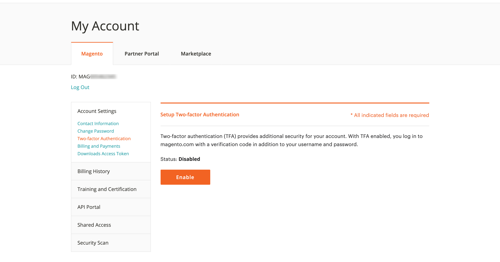

# Sichern Sie Ihr [!DNL Commerce]-Konto.

Die Zwei-Faktor-Authentifizierung (TFA oder 2FA) ist eine zusätzliche Sicherheitsebene, um Ihr [!DNL Commerce]-Konto besser vor unbefugtem Zugriff zu schützen. Um den Anmeldevorgang abzuschließen, benötigt TFA zusätzlich zu den standardmäßigen Benutzernamen- und Kennwortberechtigungen einen _zweiten Faktor_. Dieser zweite Faktor besteht aus temporären Verifikationscodes, die kontinuierlich von einer auf Ihrem Mobilgerät installierten TFA-Anwendung generiert und mit Ihrem [!DNL Commerce] -Konto gepaart werden.

Wenn TFA aktiviert ist, ist Ihr Konto sicherer. Ein nicht autorisierter Benutzer kann sich nur anmelden, wenn er sowohl über Ihren Benutzernamen und Ihr Passwort (erster Faktor) als auch über einen gültigen Verifizierungscode aus der TFA-Anwendung auf Ihrem persönlichen Gerät (zweiter Faktor) verfügt.

>[!NOTE]
>
>Die Zwei-Faktor-Authentifizierung, die den _Administrator_ Ihres Stores schützt, verfügt über eine separate Einrichtung. Weitere Informationen finden Sie unter [Zweifaktorauthentifizierung](../systems/security-two-factor-authentication.md).

## Bevor Sie beginnen

Um TFA verwenden zu können, muss auf Ihrem persönlichen Gerät (wie Smartphone, Tablet, Computer) eine TFA-Anwendung installiert sein. Es gibt viele verfügbare Optionen, aber einige beliebte und kostenlose Optionen sind:

- Google Authenticator (iOS, Android™, BlackBerry®)

- Authy (iOS, Android™)

- Microsoft® Authenticator (iOS, Android™, Windows Phone)

## Zweifaktorauthentifizierung aktivieren

1. Melden Sie sich bei Ihrem [[!DNL Commerce] Konto][1]{:target=&quot;_blank&quot;} an.

1. Wählen Sie im linken Navigationsbereich **[!UICONTROL Account Settings]** und dann **[!UICONTROL Two-factor Authentication]** aus.

   {width="600" zoomable="yes"}

1. Wählen Sie **[!UICONTROL Enable]** aus, um den zweifakultativen Authentifizierungs-Setup zu starten.

1. Geben Sie den **[!UICONTROL Verification Code]** ein, der an Ihre E-Mail gesendet wird, und wählen Sie **[!UICONTROL Verify Code]** aus, um fortzufahren.

   {width="400"}

1. Öffnen Sie die Zwei-Faktor-Authentifizierungsanwendung, die Sie auf Ihr persönliches Gerät heruntergeladen und installiert haben.

1. Verwenden Sie im [!UICONTROL SETUP TWO-FACTOR AUTHENTICATION]-Formular die **[!UICONTROL Setup Code]**, um Ihrer TFA-Anwendung Adobe Commerce hinzuzufügen.

   {width="400"}

   Sie können den Code hinzufügen, indem Sie den QR-Code mithilfe der TFA-Anwendung scannen oder manuell eingeben. Dieser Code verknüpft Ihre TFA-Anwendung mit Ihrem [!DNL Commerce]-Konto und ermöglicht es den Berechtigungen, die TFA-App zu generieren, um Verifikationscodes für den sicheren Kontozugriff zu generieren.

1. Schließen Sie das Setup ab.

   - Geben Sie im Formular [!UICONTROL SETUP TWO FACTOR-AUTHENTICATION] den Verifizierungscode aus Ihrer zweifakultativen Authentifizierungsanwendung ein.

   - Wählen Sie **[!UICONTROL Verify Code]** aus.

   >[!NOTE]
   >
   >Aus Sicherheitsgründen laufen die Verifizierungscodes in Ihrer TFA-Anwendung kontinuierlich ab und regenerieren sie. **_Verwenden Sie immer_** den derzeit angezeigten Code.

1. Speichern Sie die **[!UICONTROL Recovery Codes]** an einem sicheren und zugänglichen Ort.

   {width="400"}

   Wenn Sie bei der Anmeldung bei Ihrem [!DNL Commerce] -Konto keinen Verifizierungscode bereitstellen können, müssen Sie einen Wiederherstellungscode verwenden, um wieder Zugriff auf das Konto zu erhalten.

   Jeder Wiederherstellungscode kann nur einmal verwendet werden, Sie können jedoch [neue ](#generate-new-recovery-codes) generieren. Bei Wiederherstellungscodes wird zwischen Groß- und Kleinschreibung unterschieden.

1. Aktivieren Sie das Bestätigungs-Kontrollkästchen und wählen Sie **[!UICONTROL Submit]** aus, um fortzufahren.

1. Um sicherzustellen, dass Sie den Zugriff auf Ihr Konto wiederherstellen können, geben Sie einen **[!UICONTROL Recovery Email]** ein.

   Diese E-Mail-Adresse ist erforderlich, wenn Sie keinen Verifizierungscode aus Ihrer zweifakultativen Authentifizierungsanwendung generieren können und keinen Zugriff auf einen nicht verwendeten vorgenerierten Wiederherstellungscode haben.

   Einmal alle 24 Stunden können Sie einen temporären Recovery-Code generieren und an Ihre dafür vorgesehene Recovery-E-Mail-Adresse senden. Verwenden Sie diesen Code, um wieder Zugriff auf das Konto zu erhalten.

   >[!IMPORTANT]
   >
   >Gewähren Sie Zugriff auf Ihr Recovery-E-Mail-Konto. Andernfalls können Sie keine temporären Wiederherstellungscodes verwenden, die an dieses Konto gesendet werden.

   {width="400"}

1. Aktivieren Sie das Bestätigungs-Kontrollkästchen und wählen Sie &quot;**[!UICONTROL Submit]**&quot;, um den zweidimensionalen Authentifizierungs-Setup abzuschließen.

   - Eine Benachrichtigung wird an die mit Ihrem [!DNL Commerce] -Konto verknüpfte E-Mail-Adresse gesendet, um zu bestätigen, dass Sie die Zwei-Faktor-Authentifizierung erfolgreich aktiviert haben.

   - Eine Benachrichtigung wird an Ihr Recovery-E-Mail-Konto gesendet, um die Konfiguration zu bestätigen.

>[!TIP]
>
>Wenn Sie Ihr persönliches Gerät verlieren oder ein neues erhalten, können Sie [Ihre zweifakultative Authentifizierungs-App](#change-your-two-factor-authentication-application) ändern und neue Wiederherstellungscodes generieren.

## Anmelden mit einem Verifizierungscode

1. Wechseln Sie zur [!DNL Commerce] [Kontoanmeldung][1]{:target=&quot;_blank&quot;}.

1. Geben Sie Ihren Benutzernamen und Ihr Passwort ein und wählen Sie dann **[!UICONTROL Login]** aus.

1. Geben Sie bei Aufforderung die **[!UICONTROL Verification Code]** ein, die in Ihrer zweifakultativen Authentifizierungsanwendung angezeigt wird.

   {width="600"}

1. Wählen Sie **[!UICONTROL Submit]** aus, um den Anmeldevorgang abzuschließen.

## Anmelden mit einem Wiederherstellungscode

1. Wechseln Sie zur [!DNL Commerce] [Kontoanmeldung][1]{:target=&quot;_blank&quot;}.

1. Geben Sie Ihren Benutzernamen und Ihr Passwort ein und wählen Sie dann **[!UICONTROL Login]** aus.

1. Wählen Sie **[!UICONTROL Use recovery code]** aus, um die Überprüfungscode-Eingabeaufforderung zu umgehen.

1. Geben Sie einen nicht verwendeten **[!UICONTROL Recovery Code]** ein, wenn Sie dazu aufgefordert werden.

   {width="600"}

1. Wählen Sie **[!UICONTROL Submit]** aus, um den Anmeldevorgang abzuschließen.

## Melden Sie sich mit Ihrer Recovery-E-Mail an

1. Melden Sie sich bei Ihrem [[!DNL Commerce] Konto][1]{:target=&quot;_blank&quot;} an.

1. Geben Sie Ihren Benutzernamen und Ihr Passwort ein und wählen Sie dann **[!UICONTROL Login]** aus.

1. Wählen Sie **[!UICONTROL Use recovery code]** aus, um die Überprüfungscode-Eingabeaufforderung zu umgehen.

1. Um einen temporären Wiederherstellungscode per E-Mail zu erhalten, wählen Sie den Link **[!UICONTROL recovery email]** aus.

   {width="600"}

1. Öffnen Sie Ihr Recovery-E-Mail-Konto, um den temporären Code abzurufen, und geben Sie dann den Code in die vorgesehenen Felder ein.

1. Wählen Sie **[!UICONTROL Submit]** aus, um den Anmeldevorgang abzuschließen.

Nachdem Sie einen temporären Wiederherstellungscode für den Zugriff auf Ihr Konto verwendet haben, generieren Sie [neue Wiederherstellungscodes](#generate-new-recovery-codes) und speichern Sie sie, um weitere Probleme beim Zugriff auf das Konto zu vermeiden.

## Wiederherstellungscodes anzeigen

1. Wechseln Sie zur [!DNL Commerce] [Kontoanmeldung][1]{:target=&quot;_blank&quot;}.

1. Geben Sie Ihren Benutzernamen und Ihr Passwort ein und wählen Sie dann **[!UICONTROL Login]** aus.

1. Schließen Sie den Anmeldevorgang mit einer der beiden zuvor beschriebenen Authentifizierungsmethoden ab.

1. Wählen Sie im linken Navigationsbereich **[!UICONTROL Account Settings]** und dann **[!UICONTROL Two-factor Authentication]** aus.

   {width="600" zoomable="yes"}

1. Um Ihre vorgenerierten Wiederherstellungscodes anzuzeigen, wählen Sie **Wiederherstellungscodes anzeigen** aus.

1. Geben Sie den **[!UICONTROL Verification Code]** ein, der an Ihre E-Mail gesendet wird, und wählen Sie **[!UICONTROL Verify Code]** aus, um fortzufahren.

   {width="400"}

1. Speichern Sie die **Wiederherstellungscodes** an einem sicheren und zugänglichen Ort.

   Wenn Sie keinen Verifizierungscode für die Anmeldung bei Ihrem [!DNL Commerce]-Konto bereitstellen können, ist die Verwendung eines Wiederherstellungscodes die einzige Möglichkeit, den Kontozugriff wiederherzustellen.

   Jeder Wiederherstellungscode ist nur einmal verwendet, Sie können jedoch immer [neue ](#generate-new-recovery-codes) generieren. Bei Wiederherstellungscodes wird zwischen Groß- und Kleinschreibung unterschieden.

   {width="400"}

1. Aktivieren Sie das Bestätigungs-Kontrollkästchen und wählen Sie **[!UICONTROL Submit]** aus, um das Dialogfeld zu schließen.

## Generieren neuer Wiederherstellungscodes

1. Wechseln Sie zur [!DNL Commerce] [Kontoanmeldung][1]{:target=&quot;_blank&quot;}.

1. Geben Sie Ihren Benutzernamen und Ihr Passwort ein und wählen Sie dann **[!UICONTROL Login]** aus.

1. Schließen Sie den Anmeldevorgang mit einer der beiden zuvor beschriebenen Authentifizierungsmethoden ab.

1. Wählen Sie im linken Navigationsbereich **[!UICONTROL Account Settings]** und dann **[!UICONTROL Two-factor Authentication]** aus.

1. Um neue vorab generierte Wiederherstellungscodes zu generieren, wählen Sie **Neue Wiederherstellungscodes generieren**.

1. Geben Sie den **[!UICONTROL Verification Code]** ein, der an Ihre E-Mail gesendet wird, und wählen Sie **[!UICONTROL Verify Code]** aus, um fortzufahren.

1. Speichern Sie die **Wiederherstellungscodes** an einem sicheren und zugänglichen Ort.

   Wenn Sie beim Anmelden bei Ihrem [!DNL Commerce] -Konto keinen Verifizierungscode bereitstellen können, ist die Verwendung eines Wiederherstellungscodes die einzige Möglichkeit, den Kontozugriff wiederherzustellen.

   Alle zuvor generierten Wiederherstellungscodes werden jetzt ungültig gemacht und sollten verworfen werden (nur der aktuelle Satz der generierten Wiederherstellungscodes funktioniert). Bei Wiederherstellungscodes wird zwischen Groß- und Kleinschreibung unterschieden.

1. Aktivieren Sie das Bestätigungs-Kontrollkästchen und wählen Sie **[!UICONTROL Submit]** aus, um das Dialogfeld zu schließen.

## Wiederherstellungs-E-Mail ändern

1. Wechseln Sie zur [!DNL Commerce] [Kontoanmeldung][1]{:target=&quot;_blank&quot;}.

1. Geben Sie Ihren Benutzernamen und Ihr Passwort ein und wählen Sie dann **[!UICONTROL Login]** aus.

1. Schließen Sie den Anmeldevorgang mit einer der beiden zuvor beschriebenen Authentifizierungsmethoden ab.

1. Wählen Sie im linken Navigationsbereich **[!UICONTROL Account Settings]** und dann **[!UICONTROL Two-factor Authentication]** aus.

1. Wählen Sie **Change Recovery Email** aus, um die Wiederherstellungs-E-Mail in der Datei für Ihr Konto zu ändern.

1. Geben Sie den **[!UICONTROL Verification Code]** ein, der an Ihre E-Mail gesendet wird, und wählen Sie **[!UICONTROL Verify Code]** aus, um fortzufahren.

1. Um sicherzustellen, dass Sie den Zugriff auf Ihr Konto wiederherstellen können, geben Sie eine **E-Mail zur Wiederherstellung** ein.

   Diese E-Mail-Adresse ist erforderlich, wenn Sie keinen Verifizierungscode aus Ihrer zweifakultativen Authentifizierungsanwendung generieren können und keinen Zugriff auf einen nicht verwendeten vorgenerierten Wiederherstellungscode haben.

   Einmal alle 24 Stunden können Sie einen temporären Recovery-Code generieren und an Ihre dafür vorgesehene Recovery-E-Mail-Adresse senden. Sie können diesen Code verwenden, um wieder Zugriff auf das Konto zu erhalten.

   >[!IMPORTANT]
   >
   >Gewähren Sie Zugriff auf Ihr Recovery-E-Mail-Konto. Andernfalls können Sie keine temporären Wiederherstellungscodes verwenden, die an dieses Konto gesendet werden.

1. Aktivieren Sie das Bestätigungs-Kontrollkästchen und wählen Sie **[!UICONTROL Submit]** aus, um das Dialogfeld zu schließen.

   Das System sendet eine E-Mail-Benachrichtigung an die Wiederherstellungs-E-Mail, die Sie zur Bestätigung der E-Mail-Adresse, die sich in einer Datei befindet, als E-Mail zur Wiederherstellung temporärer Wiederherstellungs-Codes bestimmt haben.

## Zweifaktorbasierte Authentifizierungsanwendung ändern

1. Wechseln Sie zur [!DNL Commerce] [Kontoanmeldung][1]{:target=&quot;_blank&quot;}.

1. Geben Sie Ihren Benutzernamen und Ihr Passwort ein und wählen Sie dann **[!UICONTROL Login]** aus.

1. Schließen Sie den Anmeldevorgang mit einer der beiden zuvor beschriebenen Authentifizierungsmethoden ab.

1. Wählen Sie im linken Navigationsbereich **[!UICONTROL Account Settings]** und dann **[!UICONTROL Two-factor Authentication]** aus.

1. Wählen Sie **Change TFA Application** aus, um eine andere TFA-Anwendung mit Ihrem magento.com -Konto zu verwenden.

1. Geben Sie den **[!UICONTROL Verification Code]** ein, der an Ihre E-Mail gesendet wird, und wählen Sie **[!UICONTROL Verify Code]** aus, um fortzufahren.

1. Öffnen Sie die Zwei-Faktor-Authentifizierungsanwendung auf Ihrem persönlichen Gerät.

1. Geben Sie den **Einrichtungscode** in Ihre Zwei-Faktor-Authentifizierungsanwendung ein.

   Sie können den Code hinzufügen, indem Sie den QR-Code mithilfe der TFA-Anwendung scannen oder manuell eingeben. Mit diesem Code wird Ihre TFA-Anwendung mit Ihrem [!DNL Commerce] -Konto verknüpft und ermöglicht es den Berechtigungen für die TFA-App, Überprüfungscodes für den sicheren Kontozugriff zu generieren.

   >[!NOTE]
   >
   >Aus Sicherheitsgründen laufen die Verifizierungscodes in Ihrer TFA-Anwendung kontinuierlich ab und regenerieren sie. **_Verwenden Sie immer_** den derzeit angezeigten Code.

1. Wenn Ihre TFA-Anwendung jetzt mit Ihrem [!DNL Commerce]-Konto gepaart wird, geben Sie den in Ihrer TFA-Anwendung angezeigten **[!UICONTROL Verification Code]** ein und wählen Sie **[!UICONTROL Verify Code]** aus, um fortzufahren.

1. Speichern Sie die **Wiederherstellungscodes** an einem sicheren und zugänglichen Ort.

   Wenn Sie beim Anmelden bei Ihrem [!DNL Commerce] -Konto keinen Verifizierungscode bereitstellen können, können Sie nur einen Wiederherstellungscode verwenden, um den Kontozugriff wiederherzustellen.

   Jeder Wiederherstellungscode ist nur einmal verwendet, Sie können jedoch immer [neue ](#generate-new-recovery-codes) generieren. Bei Wiederherstellungscodes wird zwischen Groß- und Kleinschreibung unterschieden. Bei Wiederherstellungscodes wird zwischen Groß- und Kleinschreibung unterschieden.

1. Aktivieren Sie das zu bestätigen Kontrollkästchen und wählen Sie **[!UICONTROL Submit]** aus, um fortzufahren.

1. Um sicherzustellen, dass Sie den Zugriff auf Ihr Konto wiederherstellen können, geben Sie eine **E-Mail zur Wiederherstellung** ein.

   Diese E-Mail-Adresse ist erforderlich, wenn Sie keinen Verifizierungscode aus Ihrer zweifakultativen Authentifizierungsanwendung generieren können und keinen Zugriff auf einen nicht verwendeten vorgenerierten Wiederherstellungscode haben.

   Einmal alle 24 Stunden können Sie einen temporären Recovery-Code generieren und an Ihre dafür vorgesehene Recovery-E-Mail-Adresse senden. Verwenden Sie diesen Code, um wieder Zugriff auf das Konto zu erhalten.

   >[!IMPORTANT]
   >
   >Gewähren Sie Zugriff auf Ihr Recovery-E-Mail-Konto. Andernfalls können Sie keine temporären Wiederherstellungscodes verwenden, die an dieses Konto gesendet werden.

1. Aktivieren Sie das Bestätigungs-Kontrollkästchen und wählen Sie &quot;**[!UICONTROL Submit]**&quot;, um den zweidimensionalen Authentifizierungs-Setup abzuschließen.

   Eine E-Mail-Benachrichtigung wird an die Wiederherstellungs-E-Mail gesendet, mit der Sie bestätigt haben, dass eine bestimmte E-Mail-Adresse als E-Mail zur Wiederherstellung eines temporären Wiederherstellungscodes in einer Datei gespeichert ist.

## Zwei-Faktor-Authentifizierung deaktivieren

>[!IMPORTANT]
>
>Wenn Ihre Sicherheitsrichtlinie für Unternehmen eine Authentifizierung mit mehreren Faktoren für Adobe Commerce-Konten erfordert, können Sie die Authentifizierung mit zwei Faktoren nicht deaktivieren.

1. Wechseln Sie zur [!DNL Commerce] [Kontoanmeldung][1]{:target=&quot;_blank&quot;}.

1. Geben Sie Ihren Benutzernamen und Ihr Passwort ein und wählen Sie dann **[!UICONTROL Login]** aus.

1. Schließen Sie den Anmeldevorgang mit einer der beiden zuvor beschriebenen Authentifizierungsmethoden ab.

1. Wählen Sie im linken Navigationsfenster **[!UICONTROL Account Settings]** und dann unter dem Namen **[!UICONTROL Two-factor Authentication]** aus.

1. Wählen Sie **[!UICONTROL Disable]** aus, um den TFA-Deaktivierungsprozess zu starten.

1. Geben Sie den **[!UICONTROL Verification Code]** ein, der an Ihre E-Mail gesendet wird, und wählen Sie **[!UICONTROL Verify Code]** aus, um fortzufahren.

1. Aktivieren Sie das Bestätigungs-Kontrollkästchen und wählen Sie **[!UICONTROL Submit]** aus, um die Deaktivierung für die Zwei-Faktor-Authentifizierung abzuschließen.

   Das System sendet eine E-Mail-Bestätigung, die angibt, dass TFA in Ihrem [!DNL Commerce] -Konto deaktiviert wurde.

   {width="400"}

[1]: https://account.magento.com/customer/account/login
