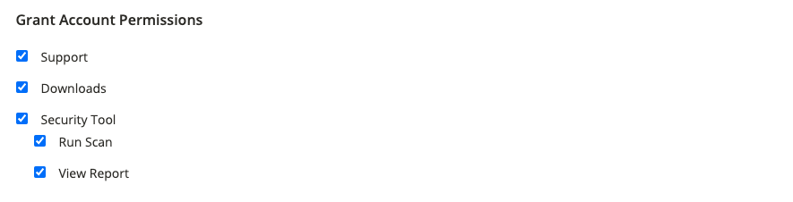

# [!DNL Commerce] freigeben

Ihr [!DNL Commerce]-Konto enthält Informationen, die Sie vertrauenswürdigen Mitarbeitern und Dienstleistern zur Verfügung stellen können, die Sie bei der Verwaltung Ihrer Site unterstützen. Als primärer Kontoinhaber sind Sie berechtigt, anderen [!DNL Commerce] Kontoinhabern eingeschränkten Zugriff zu gewähren. Freigegebener Zugriff kann widerrufen, aber nicht von einem Benutzer auf einen anderen übertragen werden.

Das [!DNL Commerce] Support-Team hat keinen Zugriff auf das Konto und kann keinen gemeinsamen Zugriff für Sie einrichten. Nur der Inhaber des primären Kontos mit entsprechenden Berechtigungen kann freigegebenen Zugriff einrichten. Wenn Sie den Kontozugriff freigeben, bleiben alle sensiblen Informationen, wie z. B. Ihr Rechnungsverlauf oder Kreditkarteninformationen, geschützt und stehen anderen Benutzern nie zur Verfügung.

>[!NOTE]
>
>Alle Aktionen, die von Benutzern mit gemeinsamem Zugriff durchgeführt werden, liegen in der alleinigen Verantwortung des Inhabers des primären Kontos. Adobe übernimmt keine Verantwortung für Aktionen von Benutzenden, die gemeinsamen Zugriff auf Ihr Konto haben.

{width="600" zoomable="yes"}

## Freigegebenes Konto einrichten

1. Bevor Sie beginnen, rufen Sie die folgenden Informationen vom [!DNL Commerce] Konto des **neuen Empfängers mit gemeinsamem Zugriff** ab:

   - Der Benutzer muss sich bereits unter account.adobe.com für ein Konto registriert haben und über account.magento.com angemeldet sein. Weitere [ finden Sie unter „Erstellen ](https://experienceleague.adobe.com/en/docs/commerce-admin/start/commerce-account/commerce-account-create#create-a-commerce-account) Commerce-Kontos“.
   - Der `MAGE ID/Account ID (MAG00XXXXXXX)` wird in der linken oberen Ecke der Registerkarte _[!UICONTROL Magento]_&#x200B;direkt über dem Link **Abmelden**&#x200B;angezeigt.
   - Die `Email`, die mit dem Konto verknüpft ist.

1. Melden Sie sich bei Ihrem [[!DNL Commerce] Konto](commerce-account-create.md) an.

1. Klicken Sie im linken Navigationsbereich auf **[!UICONTROL Shared Access]**.

1. Klicken Sie auf **[!UICONTROL Add New User]**.

   {width="600" zoomable="yes"}

1. Gehen Sie unter [!UICONTROL _New User Information]_ wie folgt vor:

   - Geben Sie die **[!UICONTROL Account ID]** aus dem [!DNL Commerce] Konto des neuen Benutzers ein.
   - Geben Sie die **[!UICONTROL Email]**-Adresse ein, die mit dem [!DNL Commerce] des neuen Benutzers verknüpft ist.

   {width="600"}

1. Gehen Sie unter _[!UICONTROL Shared Information]_&#x200B;wie folgt vor:

   - Um das freigegebene Konto zu identifizieren, geben Sie einen **[!UICONTROL Share Name]** ein. Dieser Name dient als interne Referenz und ist nur für Sie und die Person sichtbar, für die Sie Ihr Konto freigeben.

     Es empfiehlt sich, den Namen Ihres Unternehmens als [!UICONTROL Share Name] zu verwenden. Verwenden Sie keinen Namen, der mit `CLOUD SHARED ACCESS FROM MAG XYX` beginnt.
   - Wenn Sie Ihre persönlichen Kontaktinformationen für den neuen Benutzer freigeben möchten, geben Sie **[!UICONTROL Your Email]** und **[!UICONTROL Your Phone]** ein.

1. Aktivieren Sie unter _[!UICONTROL Grant Account Permissions]_&#x200B;das Kontrollkästchen jedes [!DNL Commerce] Produkts und Services, das Sie freigeben möchten.

   {width="600"}

1. Klicken Sie auf **[!UICONTROL Create Shared Access]**.

   Die Informationen zum neuen Benutzer werden im Abschnitt _[!UICONTROL Manage Permissions]_&#x200B;der Seite Freigegebener Zugriff angezeigt, und dem neuen Benutzer wird eine E-Mail-Einladung mit Anweisungen für den Zugriff auf das freigegebene Konto gesendet.

   {width="600" zoomable="yes"}

>[!NOTE]
>
>Es ist nicht erforderlich, den Zugriff auf die _[!UICONTROL Security Tool]_&#x200B;freizugeben. Jeder Benutzer mit einer MAGE-ID kann das Sicherheits-Scan-Tool mit seinem eigenen Konto einrichten. Sie benötigen lediglich die erforderlichen Berechtigungen, um Änderungen an der Site vorzunehmen und die Eigentümerschaft der Domain mit einer der [erforderlichen Methoden](https://experienceleague.adobe.com/en/docs/commerce-admin/systems/security/security-scan) zu überprüfen.

## Zugreifen auf ein freigegebenes Konto

Die folgenden Anweisungen sind aus der Sicht eines freigegebenen Benutzers geschrieben, der eine Einladung zu einem freigegebenen Konto erhält.

1. Wenn Sie eine Einladung zu einem freigegebenen Konto erhalten, befolgen Sie die Anweisungen in der E-Mail, um sich bei Ihrem eigenen [!DNL Commerce]-Konto anzumelden.

   Das linke Navigationsfenster Ihres Kontos weist eine neue Registerkarte _[!UICONTROL Shared with me]_&#x200B;auf. Das&#x200B;_[!UICONTROL Switch Accounts]_-Steuerelement in der oberen rechten Ecke verfügt über Optionen zum `My Account` und den Namen des freigegebenen Kontos.

   {width="600" zoomable="yes"}

   >[!NOTE]
   >
   >   Wenn das _[!UICONTROL Switch Accounts]_&#x200B;nicht angezeigt wird, wenden Sie sich an den primären Kontoinhaber und bestätigen Sie, dass er Ihre richtigen [Kontoinformationen](#set-up-a-shared-account) eingegeben hat.

1. Um Zugriff auf das freigegebene Konto zu erhalten, legen Sie **[!UICONTROL Switch Accounts]** auf den Namen des freigegebenen Kontos fest.

   {width="600" zoomable="yes"}

   Das freigegebene Konto zeigt eine Willkommensnachricht und Kontaktinformationen an. Der linke Navigationsbereich enthält nur die Elemente, die Sie verwenden dürfen.

1. Um das freigegebene Konto mit dem Hilfezentrum zu verbinden, klicken Sie im linken Navigationsbereich des freigegebenen Kontos auf **[!UICONTROL Support]** .

   {width="600" zoomable="yes"}

   Sie können das [Adobe Commerce Help Center](https://experienceleague.adobe.com/en/docs/commerce-knowledge-base/kb/overview) über das freigegebene Konto nach Artikeln und Informationen zur Fehlerbehebung suchen, Patches für bekannte Probleme suchen und Support-Tickets erstellen.

   >[!NOTE]
   >
   >Um nach Erhalt des gemeinsamen Zugriffs [einen Support-Fall senden](https://experienceleague.adobe.com/en/docs/commerce-knowledge-base/kb/help-center-guide/magento-help-center-user-guide#support-case) auf Experience League zu aktivieren, müssen Sie zunächst den Organisationsnamen, der auf „([!DNL Commerce])“ endet, in der linken Spalte auswählen.

1. Um zu Ihrem eigenen Konto zurückzukehren, klicken Sie auf **Zurück** in Ihren Browser-Steuerelementen und legen Sie **[!UICONTROL Switch Accounts]** auf `My Account` fest.

## Freigegebenen Zugriff widerrufen

1. Melden Sie sich bei Ihrem Commerce-Konto an.

1. Klicken Sie im linken Navigationsbereich auf **[!UICONTROL Shared Access]**.

1. Suchen Sie unter _[!UICONTROL Managing Users & Permissions]_&#x200B;das zu widerrufende Konto und klicken Sie auf **[!UICONTROL Delete]**.

   >[!NOTE]
   >
   > Wenn **[!UICONTROL Delete]** nicht angezeigt wird, überprüfen Sie, ob die **[!UICONTROL Share Name]** das Namensmuster `Cloud Shared Access from MAG0XYZ` enthält. Wenn das Konto dieses [Namensmuster aufweist und nicht gelöscht werden kann](https://experienceleague.adobe.com/en/docs/commerce-knowledge-base/kb/help-center-guide/magento-help-center-user-guide#remove-cloud-shared-access-users) liegt dies daran, dass der freigegebene Zugriff von einer API und nicht direkt aus dem [Commerce-Konto erstellt ](https://account.magento.com/).
   > 
   > Wenn sie nicht gelöscht werden kann, lassen Sie einfach den Kontoinhaber das Konto mit gemeinsamem Zugriff ändern und unter Kontoberechtigungen erteilen jedes Element deaktivieren. Nach diesem Update kann der Benutzer nicht mehr auf Kontoressourcen zugreifen.
   > 
   >
   > Stellen Sie außerdem sicher, dass Benutzer aus dem Projekt entfernt werden, sodass sie keine E-Mail-Benachrichtigungen mehr erhalten: [Ehemalige Team-Mitglieder erhalten E-Mails zur Cloud-Benachrichtigung von Adobe Commerce](https://experienceleague.adobe.com/en/docs/commerce-knowledge-base/kb/troubleshooting/miscellaneous/former-teammembers-receive-cloud-notification-emails)

1. Wenn Sie zum Bestätigen aufgefordert werden, klicken Sie auf **[!UICONTROL Delete User]**.

>[!NOTE]
>
>Sie können keine Benutzer mit dem Freigabenamen _Cloud Shared Access von MAG[XYZ)]_ dieser Benutzeroberfläche löschen. Siehe [Löschen von Benutzern, denen über ein Cloud-Projekt gemeinsamer Zugriff gewährt wurde?](https://experienceleague.adobe.com/en/docs/commerce-knowledge-base/kb/help-center-guide/magento-help-center-user-guide#remove-cloud-shared-access-users).

## Verwandtes Lesen

[Fehlerbehebung beim freigegebenen Zugriff](https://experienceleague.adobe.com/en/docs/commerce-knowledge-base/kb/troubleshooting/miscellaneous/shared-access-troubleshooting)

