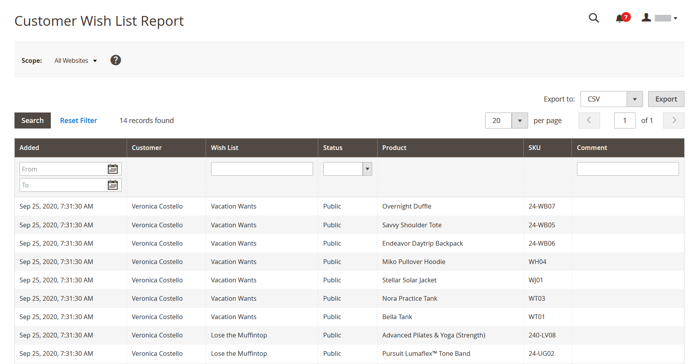

# Kundenberichte

Kundenberichte liefern insight in eine Kundenaktivität während eines bestimmten Zeitraums oder Datumsbereichs.

## [!UICONTROL Order Total Report]

Die [!UICONTROL Order Total Report] zeigt Kundenaufträge für ein bestimmtes Zeitintervall oder einen bestimmten Datumsbereich an. Der Bericht enthält die Anzahl der Bestellungen pro Kunde, den durchschnittlichen Bestellbetrag und den Gesamtbetrag.

Navigieren Sie in _Admin_-Seitenleiste zu **[!UICONTROL Reports]** > _[!UICONTROL Customers]_>**[!UICONTROL Order Total]**.

{width="600"}

### Workspace-Steuerelemente

| Kontrolle | Beschreibung |
|--- |--- |
| [!UICONTROL From / To] | Wird verwendet, um eine Suche nach den Bestellungen anhand des Start- und Enddatums zu definieren. |
| [!UICONTROL Show By] | Definiert die Granularität der Aufteilung des Bestelldatensatzes. Optionen: `Month` / `Day` / `Year` |
| [!UICONTROL Refresh] | Aktualisiert das Raster auf die angegebenen Filter. |
| [!UICONTROL Export] | Exportiert die ausgewählten Datensätze als CSV- oder Excel-XML-Datei. |
| [!UICONTROL Scope] | Wird zum Festlegen der Site oder des Speichers verwendet, für die der Bericht generiert wird. |

{style="table-layout:auto"}

### Spaltenbeschreibungen

| Spalte | Beschreibung |
|--- |--- |
| [!UICONTROL Interval] | Das gesamte Bestellintervall, nach `Month` / `Day` / `Year`. |
| [!UICONTROL Customer] | Der Name des Kunden, der die Bestellungen aufgegeben hat. |
| [!UICONTROL Orders] | Die Anzahl der Bestellungen für das angegebene Intervall. |
| [!UICONTROL Average] | Durchschnittlicher Bestellbetrag. Dieser Betrag wird immer für Produktpreise (**Steuern) berechnet** auch wenn Katalogproduktpreise, Bestellzwischensumme und Bestellsumme Steuern enthalten. Daher unterscheidet sich der im Bericht angezeigte Betrag von dem in den Bestelldetails angezeigten Betrag, wenn die Bestellsummen Steuern enthalten. |
| [!UICONTROL Total] | Die Summe aller Bestellungen für den Zeitraum. Dieser Betrag wird immer für Produktpreise (**Steuern) berechnet** auch wenn Katalogproduktpreise, Bestellzwischensumme und Bestellsumme Steuern enthalten. Infolgedessen unterscheidet sich der im Bericht angezeigte Gesamtbetrag von dem in den Bestelldetails angezeigten Betrag, wenn die Bestellsummen Steuern enthalten. |

{style="table-layout:auto"}

## [!UICONTROL Order Count Report]

Die [!UICONTROL Order Count Report] zeigt die Anzahl der Bestellungen pro Kunde für ein bestimmtes Zeitintervall oder einen bestimmten Datumsbereich an. Der Bericht enthält die Anzahl der Bestellungen pro Kunde, den durchschnittlichen Bestellbetrag und den Gesamtbetrag.

Navigieren Sie in _Admin_-Seitenleiste zu **[!UICONTROL Reports]** > _[!UICONTROL Customers]_>**[!UICONTROL Order Count]**.

{width="600"}

### Workspace-Steuerelemente

| Kontrolle | Beschreibung |
|--- |--- |
| [!UICONTROL From / To] | Wird verwendet, um eine Suche nach den Bestellungen anhand des Start- und Enddatums zu definieren. |
| [!UICONTROL Show By] | Definiert die Granularität der Aufteilung des Bestelldatensatzes. Optionen: `Month` / `Day` / `Year` |
| [!UICONTROL Refresh] | Aktualisiert das Raster auf die angegebenen Filter. |
| [!UICONTROL Export] | Exportiert die ausgewählten Datensätze als CSV- oder Excel-XML-Datei. |
| [!UICONTROL Scope] | Wird zum Festlegen der Site oder des Speichers verwendet, für die der Bericht generiert wird. |

{style="table-layout:auto"}

### Spaltenbeschreibungen

| Spalte | Beschreibung |
|--- |--- |
| [!UICONTROL Interval] | Das Intervall der Bestellanzahl, `Month` / `Day` / `Year`. |
| [!UICONTROL Customer] | Der Kunde, der die Bestellung aufgegeben hat. |
| [!UICONTROL Orders] | Die Anzahl der Bestellungen für das angegebene Intervall. |
| [!UICONTROL Average] | Durchschnittlicher Bestellbetrag. Dieser Betrag wird immer für Produktpreise (**Steuern) berechnet** auch wenn Katalogproduktpreise, Bestellzwischensumme und Bestellsumme Steuern enthalten. Daher unterscheidet sich der im Bericht angezeigte Betrag von dem in den Bestelldetails angezeigten Betrag, wenn die Bestellsummen Steuern enthalten. |
| [!UICONTROL Total] | Die Summe aller Bestellungen für den Zeitraum. Dieser Betrag wird immer für Produktpreise (**Steuern) berechnet** auch wenn Katalogproduktpreise, Bestellzwischensumme und Bestellsumme Steuern enthalten. Infolgedessen unterscheidet sich der im Bericht angezeigte Gesamtbetrag von dem in den Bestelldetails angezeigten Betrag, wenn die Bestellsummen Aufgaben enthalten. |

{style="table-layout:auto"}

## [!UICONTROL New Accounts Report]

Das [!UICONTROL New Accounts Report] zeigt die Anzahl der neuen Kundenkonten an, die während eines bestimmten Zeitintervalls oder Datumsbereichs geöffnet wurden.

Navigieren Sie in _Admin_-Seitenleiste zu **[!UICONTROL Reports]** > _[!UICONTROL Customers]_>**[!UICONTROL New]**.

{width="600"}

### Workspace-Steuerelemente

| Kontrolle | Beschreibung |
|--- |--- |
| [!UICONTROL From / To] | Wird verwendet, um eine Suche nach neuen Konten basierend auf dem Start- und Enddatum zu definieren. |
| [!UICONTROL Show By] | Definiert die Granularität der Aufteilung des Bestelldatensatzes. Optionen: Monat/Tag/Jahr |
| [!UICONTROL Refresh] | Aktualisiert das Raster auf die angegebenen Filter. |
| [!UICONTROL Export] | Exportiert die ausgewählten Datensätze als CSV- oder Excel-XML-Datei. |
| [!UICONTROL Scope] | Wird zum Festlegen der Site oder des Speichers verwendet, für die der Bericht generiert wird. |

{style="table-layout:auto"}

### Spaltenbeschreibungen

| Spalte | Beschreibung |
|--- |--- |
| [!UICONTROL Interval] | Intervall für die Erstellung eines neuen Kontos nach Monat/Tag/Jahr. |
| [!UICONTROL New Accounts] | Die Anzahl der in einem bestimmten Intervall neu erstellten Konten. |

{style="table-layout:auto"}

## [!UICONTROL Customer Wish List Report]

[!BADGE Nur PaaS]{type=Informative url="https://experienceleague.adobe.com/de/docs/commerce/user-guides/product-solutions" tooltip="Gilt nur für Adobe Commerce in Cloud-Projekten (von Adobe verwaltete PaaS-Infrastruktur) und lokale Projekte."}

 (nur Adobe Commerce)

Die [!UICONTROL Customer Wish List Report] enthält Informationen zu Kundenwunschlisten.

Navigieren Sie in _Admin_-Seitenleiste zu **[!UICONTROL Reports]** > _[!UICONTROL Customers]_>**[!UICONTROL Wish Lists]**.

{width="600"}

### Workspace-Steuerelemente

| Kontrolle | Beschreibung |
|--- |--- |
| [!UICONTROL Scope] | Wird zum Festlegen der Site oder des Speichers verwendet, für die der Bericht generiert wird. |
| [!UICONTROL Search] | Startet eine Suche nach den angegebenen Parametern. |
| [!UICONTROL Reset Filter] | Startet ein Zurücksetzen aller Suchparameter. |
| [!UICONTROL Per Page] | Legt die Anzahl der auf einer einzelnen Seite angezeigten Datensätze fest. |
| [!UICONTROL Export] | Exportiert die ausgewählten Datensätze als CSV- oder Excel-XML-Datei. |
| [!UICONTROL From / To] | Wird verwendet, um anhand des Start- und Enddatums eine Suche nach den Wunschlisten zu definieren. |
| [!UICONTROL Wishlist] | Startet eine Wunschzettelsuche nach Namen. |
| [!UICONTROL Status] | Der Status der Wunschliste. Optionen: `Private` / `Public` |
| [!UICONTROL Comment] | Startet eine Suche nach Text in der Wunschliste Kommentare. |

{style="table-layout:auto"}

### Spaltenbeschreibungen

| Spalte | Beschreibung |
|--- |--- |
| [!UICONTROL Added] | Datum der Erstellung der Wunschliste. |
| [!UICONTROL Customer] | Vor- und Nachname des Kunden, der die Wunschliste erstellt hat. |
| [!UICONTROL Wishlist] | Name der Wunschliste. |
| [!UICONTROL Status] | Der Status der Wunschliste. Optionen: `Private` / `Public` |
| [!UICONTROL Product] | Name des Produkts, das der Wunschliste hinzugefügt wurde. |
| [!UICONTROL SKU] | Artikelnummer des Produkts, das der Wunschliste hinzugefügt wurde. |
| [!UICONTROL Comment] | Der Kommentartext, der beim Erstellen der Wunschliste eingegeben wurde. |

{style="table-layout:auto"}

## [!UICONTROL Customer Segment Report]

 (nur Adobe Commerce)

Die [!UICONTROL Customer Segment Report] enthält Informationen zur Anzahl der Kundinnen und Kunden in jedem Segment.

Navigieren Sie in _Admin_-Seitenleiste zu **[!UICONTROL Reports]** > _[!UICONTROL Customers]_>**[!UICONTROL Segments]**.

{width="600"}

### Workspace-Steuerelemente

| Kontrolle | Beschreibung |
|--- |--- |
| [!UICONTROL Search] | Startet eine Suche nach den angegebenen Parametern. |
| [!UICONTROL Reset Filter] | Startet ein Zurücksetzen aller Suchparameter. |
| [!UICONTROL Action] | Startet die Anzeige von Segmenten nach Parametern. Optionen: `Action` / `View Combined Report` |
| [!UICONTROL Per Page] | Legt die Anzahl der auf einer einzelnen Seite angezeigten Datensätze fest. |

{style="table-layout:auto"}

### Spaltenbeschreibungen

| Spalte | Beschreibung |
|--- |--- |
| [!UICONTROL ID] | Eine eindeutige numerische Kennung, die jedem Segment zugewiesen ist. |
| [!UICONTROL Segment] | Segmentname. |
| [!UICONTROL Status] | Segmentstatus. Optionen: `Active` / `Inactive` |
| [!UICONTROL Website] | Website, der das Segment zugewiesen ist. |
| [!UICONTROL Customers] | Anzahl der dem Segment zugewiesenen Kunden. |

{style="table-layout:auto"}
