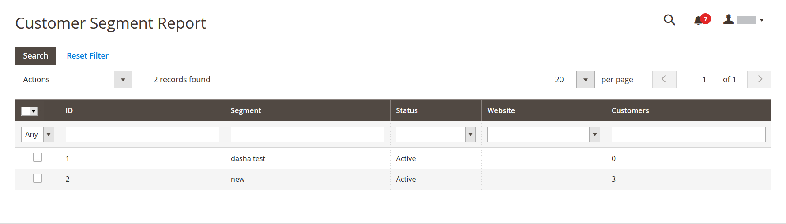

# Kundenberichte

Kundenberichte bieten Einblicke in Kundenaktivitäten während eines bestimmten Zeitraums oder Datumsbereichs.

## [!UICONTROL Order Total Report]

Die [!UICONTROL Order Total Report] zeigt Kundenaufträge für einen bestimmten Zeitraum oder Datumsbereich an. Der Bericht enthält die Anzahl der Bestellungen pro Kunde, den durchschnittlichen Bestellbetrag und den Gesamtbetrag.

Im _Admin_ Seitenleiste, navigieren Sie zu **[!UICONTROL Reports]** > _[!UICONTROL Customers]_>**[!UICONTROL Order Total]**.

{width="600"}

### Workspace-Steuerelemente

| Kontrolle | Beschreibung |
|--- |--- |
| [!UICONTROL From / To] | Wird verwendet, um eine Suche für die Bestellungen basierend auf dem Start- und Enddatum zu definieren. |
| [!UICONTROL Show By] | Definiert die Granularität der Aufspaltung von Bestelldatensätzen. Optionen: `Month` / `Day` / `Year` |
| [!UICONTROL Refresh] | Aktualisiert das Raster auf die angegebenen Filter. |
| [!UICONTROL Export] | Exportiert die ausgewählten Datensätze als CSV- oder Excel-XML-Datei. |
| [!UICONTROL Scope] | Wird zum Festlegen der Site oder des Stores verwendet, für die der Bericht generiert wird. |

{style="table-layout:auto"}

### Spaltenbeschreibungen

| Spalte | Beschreibung |
|--- |--- |
| [!UICONTROL Interval] | Das Gesamtbestellungsintervall nach `Month` / `Day` / `Year`. |
| [!UICONTROL Customer] | Der Name des Kunden, der die Bestellungen aufgegeben hat. |
| [!UICONTROL Orders] | Die Anzahl der Bestellungen für das angegebene Intervall. |
| [!UICONTROL Average] | Durchschnittlicher Bestellbetrag. Dieser Betrag wird immer für die Produktpreise berechnet **ohne Steuern** auch wenn die Preise der Katalogprodukte, die Zwischensumme der Bestellungen und die Gesamtbestellsumme Steuern enthalten. Daher unterscheidet sich der im Bericht angezeigte Betrag von dem in den Bestelldetails angegebenen Betrag, wenn die Bestellsummen Steuern enthalten. |
| [!UICONTROL Total] | Die Summe aller Bestellungen für den Zeitraum. Dieser Betrag wird immer für die Produktpreise berechnet **ohne Steuern** auch wenn die Preise der Katalogprodukte, die Zwischensumme der Bestellungen und die Gesamtbestellsumme Steuern enthalten. Daher unterscheidet sich die im Bericht angezeigte Summe von dem in den Bestelldetails angezeigten Betrag, wenn die Bestellsummen Steuern enthalten. |

{style="table-layout:auto"}

## [!UICONTROL Order Count Report]

Die [!UICONTROL Order Count Report] zeigt die Anzahl der Bestellungen pro Kunde für einen bestimmten Zeitraum oder Datumsbereich an. Der Bericht enthält die Anzahl der Bestellungen pro Kunde, den durchschnittlichen Bestellbetrag und den Gesamtbetrag.

Im _Admin_ Seitenleiste, navigieren Sie zu **[!UICONTROL Reports]** > _[!UICONTROL Customers]_>**[!UICONTROL Order Count]**.

{width="600"}

### Workspace-Steuerelemente

| Kontrolle | Beschreibung |
|--- |--- |
| [!UICONTROL From / To] | Wird verwendet, um eine Suche für die Bestellungen basierend auf dem Start- und Enddatum zu definieren. |
| [!UICONTROL Show By] | Definiert die Granularität der Aufspaltung von Bestelldatensätzen. Optionen: `Month` / `Day` / `Year` |
| [!UICONTROL Refresh] | Aktualisiert das Raster auf die angegebenen Filter. |
| [!UICONTROL Export] | Exportiert die ausgewählten Datensätze als CSV- oder Excel-XML-Datei. |
| [!UICONTROL Scope] | Wird zum Festlegen der Site oder des Stores verwendet, für die der Bericht generiert wird. |

{style="table-layout:auto"}

### Spaltenbeschreibungen

| Spalte | Beschreibung |
|--- |--- |
| [!UICONTROL Interval] | Das Bestellzählungsintervall, nach `Month` / `Day` / `Year`. |
| [!UICONTROL Customer] | Der Kunde, der die Bestellung aufgegeben hat. |
| [!UICONTROL Orders] | Die Anzahl der Bestellungen für das angegebene Intervall. |
| [!UICONTROL Average] | Durchschnittlicher Bestellbetrag. Dieser Betrag wird immer für die Produktpreise berechnet **ohne Steuern** auch wenn die Preise der Katalogprodukte, die Zwischensumme der Bestellungen und die Gesamtbestellsumme Steuern enthalten. Daher unterscheidet sich der im Bericht angezeigte Betrag von dem in den Bestelldetails angegebenen Betrag, wenn die Bestellsummen Steuern enthalten. |
| [!UICONTROL Total] | Die Summe aller Bestellungen für den Zeitraum. Dieser Betrag wird immer für die Produktpreise berechnet **ohne Steuern** auch wenn die Preise der Katalogprodukte, die Zwischensumme der Bestellungen und die Gesamtbestellsumme Steuern enthalten. Infolgedessen unterscheidet sich die im Bericht angezeigte Summe von dem in den Bestelldetails angezeigten Betrag, wenn die Bestellsummen Tas enthalten. |

{style="table-layout:auto"}

## [!UICONTROL New Accounts Report]

Die [!UICONTROL New Accounts Report] zeigt die Anzahl neuer Kundenkonten an, die in einem bestimmten Zeitintervall oder Datumsbereich geöffnet wurden.

Im _Admin_ Seitenleiste, navigieren Sie zu **[!UICONTROL Reports]** > _[!UICONTROL Customers]_>**[!UICONTROL New]**.

{width="600"}

### Workspace-Steuerelemente

| Kontrolle | Beschreibung |
|--- |--- |
| [!UICONTROL From / To] | Wird verwendet, um eine Suche für die neuen Konten basierend auf dem Start- und Enddatum zu definieren. |
| [!UICONTROL Show By] | Definiert die Granularität der Aufspaltung von Bestelldatensätzen. Optionen: Monat/Tag/Jahr |
| [!UICONTROL Refresh] | Aktualisiert das Raster auf die angegebenen Filter. |
| [!UICONTROL Export] | Exportiert die ausgewählten Datensätze als CSV- oder Excel-XML-Datei. |
| [!UICONTROL Scope] | Wird zum Festlegen der Site oder des Stores verwendet, für die der Bericht generiert wird. |

{style="table-layout:auto"}

### Spaltenbeschreibungen

| Spalte | Beschreibung |
|--- |--- |
| [!UICONTROL Interval] | Neues Konto-Erstellungsintervall nach Monat/Tag/Jahr. |
| [!UICONTROL New Accounts] | Die Anzahl neuer Konten, die in einem bestimmten Intervall erstellt wurden. |

{style="table-layout:auto"}

## [!UICONTROL Customer Wish List Report]

 (Nur Adobe Commerce)

Die [!UICONTROL Customer Wish List Report] enthält Informationen zu Kundenwunschlisten.

Im _Admin_ Seitenleiste, navigieren Sie zu **[!UICONTROL Reports]** > _[!UICONTROL Customers]_>**[!UICONTROL Wish Lists]**.

{width="600"}

### Workspace-Steuerelemente

| Kontrolle | Beschreibung |
|--- |--- |
| [!UICONTROL Scope] | Wird zum Festlegen der Site oder des Stores verwendet, für die der Bericht generiert wird. |
| [!UICONTROL Search] | Startet eine Suche nach den angegebenen Parametern. |
| [!UICONTROL Reset Filter] | Startet ein Zurücksetzen aller Suchparameter. |
| [!UICONTROL Per Page] | Legt die Anzahl der auf einer Seite angezeigten Datensätze fest. |
| [!UICONTROL Export] | Exportiert die ausgewählten Datensätze als CSV- oder Excel-XML-Datei. |
| [!UICONTROL From / To] | Wird verwendet, um basierend auf dem Start- und Enddatum eine Suche nach den Wunschlisten zu definieren. |
| [!UICONTROL Wishlist] | Startet eine Suche nach Namen in der Wunschliste. |
| [!UICONTROL Status] | Der Status der Wunschliste. Optionen: `Private` / `Public` |
| [!UICONTROL Comment] | Startet eine Suche nach Text in den Kommentaren zur Wunschliste. |

{style="table-layout:auto"}

### Spaltenbeschreibungen

| Spalte | Beschreibung |
|--- |--- |
| [!UICONTROL Added] | Datum der Erstellung der Wunschliste. |
| [!UICONTROL Customer] | Vor- und Nachname des Kunden, der die Wunschliste erstellt hat. |
| [!UICONTROL Wishlist] | Name der Wunschliste. |
| [!UICONTROL Status] | Der Status der Wunschliste. Optionen: `Private` / `Public` |
| [!UICONTROL Product] | Name des Erzeugnisses, das der Wunschliste hinzugefügt wurde. |
| [!UICONTROL SKU] | SKU des Produkts, das der Wunschliste hinzugefügt wurde. |
| [!UICONTROL Comment] | Der Kommentar-Text, der bei der Erstellung der Wunschliste eingegeben wurde. |

{style="table-layout:auto"}

## [!UICONTROL Customer Segment Report]

 (Nur Adobe Commerce)

Die [!UICONTROL Customer Segment Report] liefert Informationen über die Anzahl der Kunden in jedem Segment.

Im _Admin_ Seitenleiste, navigieren Sie zu **[!UICONTROL Reports]** > _[!UICONTROL Customers]_>**[!UICONTROL Segments]**.

{width="600"}

### Workspace-Steuerelemente

| Kontrolle | Beschreibung |
|--- |--- |
| [!UICONTROL Search] | Startet eine Suche nach den angegebenen Parametern. |
| [!UICONTROL Reset Filter] | Startet ein Zurücksetzen aller Suchparameter. |
| [!UICONTROL Action] | Startet die Anzeige von Segmenten nach Parametern. Optionen: `Action` / `View Combined Report` |
| [!UICONTROL Per Page] | Legt die Anzahl der auf einer Seite angezeigten Datensätze fest. |

{style="table-layout:auto"}

### Spaltenbeschreibungen

| Spalte | Beschreibung |
|--- |--- |
| [!UICONTROL ID] | Eine eindeutige numerische Kennung, die jedem Segment zugewiesen wird. |
| [!UICONTROL Segment] | Segmentname. |
| [!UICONTROL Status] | Segmentstatus. Optionen: `Active` / `Inactive` |
| [!UICONTROL Website] | Website, der das Segment zugewiesen ist. |
| [!UICONTROL Customers] | Anzahl der dem Segment zugewiesenen Kunden. |

{style="table-layout:auto"}
