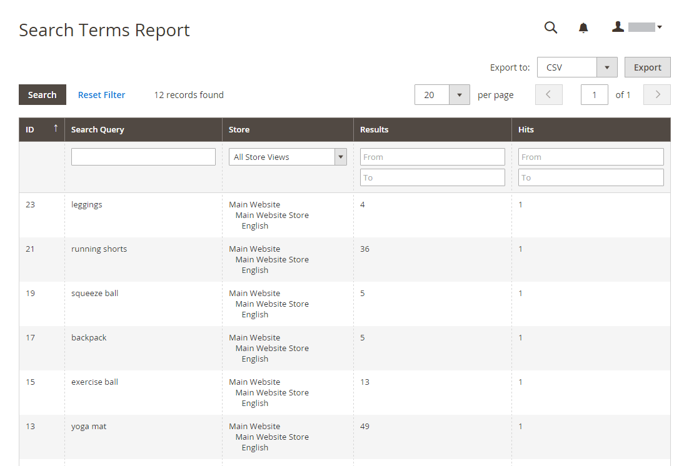
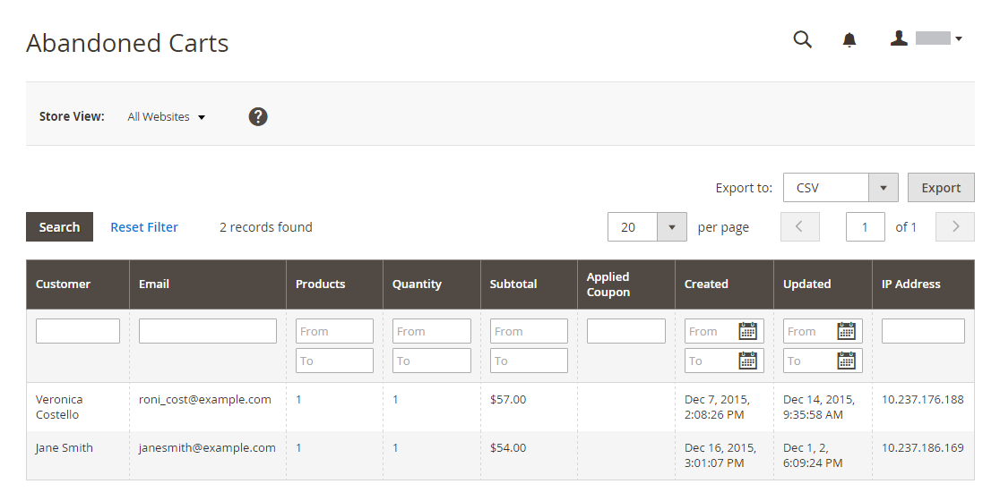

# Marketing-Berichte

Marketing-Berichte enthalten Informationen zum Status von Warenkörben, zur Verwendung von Suchbegriffen und zur Übertragung von Newslettern.

## [!UICONTROL Products in Cart]

Der [!UICONTROL Products in Cart] Bericht enthält eine Liste aller Produkte, die sich derzeit in Warenkörben befinden. Sie enthält den Namen und Preis jedes Artikels, die Anzahl der Warenkörbe mit dem Artikel und die Anzahl der Bestellungen jedes Artikels.

{width="600"}

## [!UICONTROL Search Terms Report]

[!BADGE Nur PaaS]{type=Informative url="https://experienceleague.adobe.com/en/docs/commerce/user-guides/product-solutions" tooltip="Gilt nur für Adobe Commerce in Cloud-Projekten (von Adobe verwaltete PaaS-Infrastruktur) und lokale Projekte."}

Der [Suchbegriffe](../catalog/search-terms.md#search-terms-report)-Bericht zeigt an, wonach Ihre Kunden in jeder Shop-Ansicht suchen. Der Bericht enthält die Anzahl der übereinstimmenden Elemente, die im Katalog gefunden wurden, und die Häufigkeit, mit der der Suchbegriff verwendet wurde.

{width="600"}

## [!UICONTROL Abandoned Carts]

Der [!UICONTROL Abandoned Carts]-Bericht listet alle registrierten Kunden auf, die ihren Warenkorb noch nicht abgelaufen haben. Der Bericht enthält den Kundennamen und die E-Mail-Adresse, die Anzahl der Produkte im Warenkorb und die Zwischensumme, das Erstellungsdatum und das Datum der letzten Aktualisierung.

{width="600"}

## [!UICONTROL Newsletter Problems Report]

[!BADGE Nur PaaS]{type=Informative url="https://experienceleague.adobe.com/en/docs/commerce/user-guides/product-solutions" tooltip="Gilt nur für Adobe Commerce in Cloud-Projekten (von Adobe verwaltete PaaS-Infrastruktur) und lokale Projekte."}

Die [!UICONTROL Newsletter Problems Report] enthält Informationen zu allen Newsletter-Warteschlangen, die nicht erfolgreich übertragen werden konnten. Der Bericht enthält den Namen jedes Abonnenten, das Datum und den Betreff der Warteschlange sowie Informationen zum Fehler.

{width="600"}
