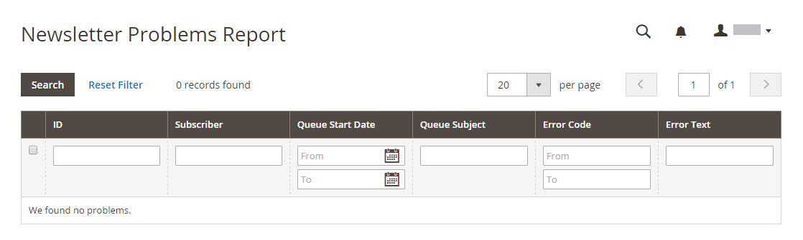

# Marketing-Berichte

Marketing-Berichte enthalten Informationen zum Status von Warenkörben, zur Verwendung von Suchbegriffen und zu Newsletterübertragungen.

## [!UICONTROL Products in Cart]

Die [!UICONTROL Products in Cart] enthält eine Liste aller Produkte, die sich derzeit in Warenkörben befinden. Er enthält den Namen und den Preis jedes Artikels, die Anzahl der Warenkörbe mit dem Artikel und die Anzahl der Bestellungen jedes Artikels.

{width="600"}

## [!UICONTROL Search Terms Report]

Die [Suchbegriffe](../catalog/search-terms.md#search-terms-report) zeigt an, wonach Ihre Kunden in jeder Store-Ansicht suchen. Der Bericht enthält die Anzahl der übereinstimmenden Elemente, die im Katalog gefunden wurden, und wie oft der Suchbegriff verwendet wurde.

{width="600"}

## [!UICONTROL Abandoned Carts]

Die [!UICONTROL Abandoned Carts] enthält alle registrierten Kunden, die ihren Warenkorb abgebrochen haben und noch nicht abgelaufen sind. Der Bericht enthält den Kundennamen und die E-Mail-Adresse, die Anzahl der Produkte im Warenkorb und die Zwischensumme, das Erstellungsdatum und das Datum der letzten Aktualisierung.

{width="600"}

## [!UICONTROL Newsletter Problems Report]

Die [!UICONTROL Newsletter Problems Report] enthält Informationen zu einer Newsletter-Warteschlange, die nicht erfolgreich übertragen werden konnte. Der Bericht enthält den Namen jedes Abonnenten, das Datum der Warteschlange und den Betreff sowie Informationen zum Fehler.

{width="600"}
