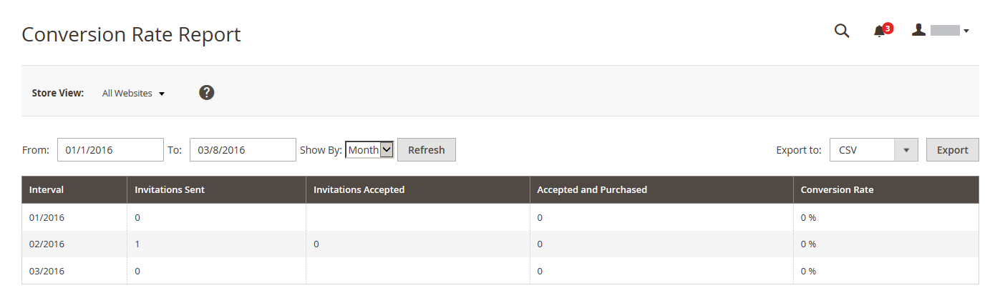

# Berichte zum privaten Verkauf

{{ee-feature}}

Die Berichte zum Privatverkauf enthalten Informationen zu [Veranstaltungen und Privatverkäufen](../merchandising-promotions/events-private-sales.md).

## [!UICONTROL Invitations Report]

Die [!UICONTROL Invitations Report] zeigt die Anzahl der [Einladungen](../merchandising-promotions/invitations.md), die während des angegebenen Zeitraums gesendet wurden, sowie die Anzahl der akzeptierten und verworfenen Einladungen.

Navigieren Sie in _Admin_-Seitenleiste zu **[!UICONTROL Reports]** > _[!UICONTROL Private Sales]_>**[!UICONTROL Invitations]**.

{width="600"}

## [!UICONTROL Invited Customers Report]

Die [!UICONTROL Invited Customers Report] zeigt alle Kunden, denen Einladungen zu einem Privatverkauf oder einer Veranstaltung gesendet wurden. Sie enthält den Namen und die E-Mail-Adresse, die Kundengruppe, die Anzahl der gesendeten Einladungen und die akzeptierte Nummer.

Navigieren Sie in _Admin_-Seitenleiste zu **[!UICONTROL Reports]** > _[!UICONTROL Private Sales]_>**[!UICONTROL Invited Customers]**.

{width="600"}

## [!UICONTROL Conversion Rate Report]

Im [!UICONTROL Conversion Rate Report] wird die Anzahl der gesendeten und angenommenen Einladungen, die Anzahl der Einladungen, die zu einem Kauf geführt haben, und die Konversionsrate als Prozentsatz angezeigt.

Navigieren Sie in _Admin_-Seitenleiste zu **[!UICONTROL Reports]** > _[!UICONTROL Private Sales]_>**[!UICONTROL Conversions]**.

{width="600"}
