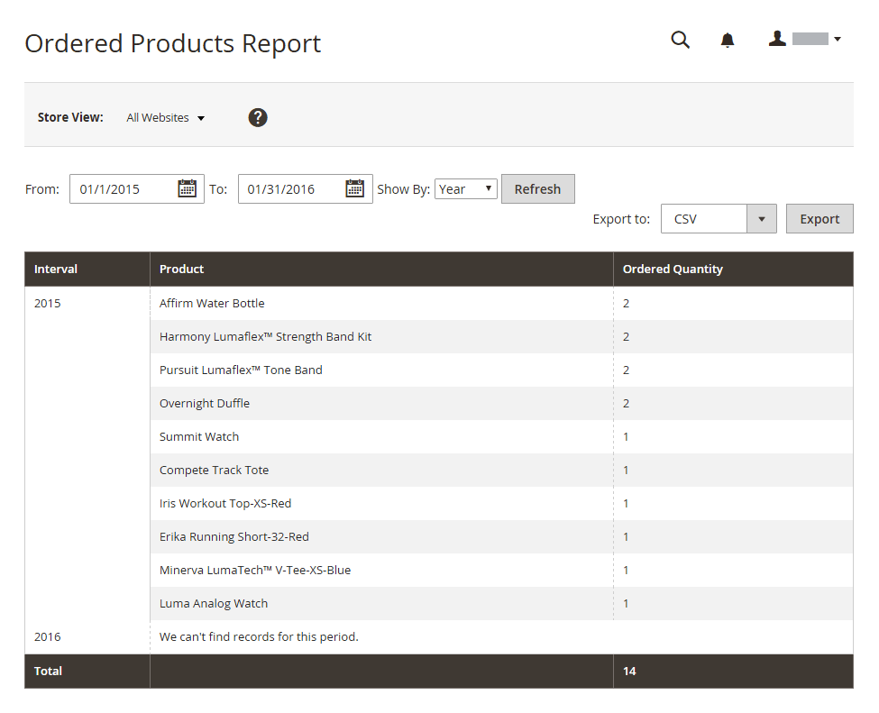

# Produktberichte

Die Produktberichte enthalten insight zu angezeigten und bestellten Produkten, Bestsellern, Lagerbeständen und Downloads.

## [!UICONTROL Product Views Report]

[!BADGE Nur PaaS]{type=Informative url="https://experienceleague.adobe.com/de/docs/commerce/user-guides/product-solutions" tooltip="Gilt nur für Adobe Commerce in Cloud-Projekten (von Adobe verwaltete PaaS-Infrastruktur) und lokale Projekte."}

Die [!UICONTROL Product Views Report] zeigt die Produkte an, die während eines Zeitintervalls oder Datumsbereichs angezeigt wurden. Der Bericht enthält den Produktnamen, den Preis und die Anzahl der Ansichten.

Navigieren Sie in _Admin_-Seitenleiste zu **[!UICONTROL Reports]** > _[!UICONTROL Products]_>**[!UICONTROL Views]**.

{width="600"}

## [!UICONTROL Bestsellers Report]

Die [!UICONTROL Bestsellers Report] zeigt die fünf meistverkauften fünf während eines Zeitintervalls oder Datumsbereichs an. Der Bericht enthält den Produktnamen, den Preis und die bestellte Menge.

Navigieren Sie in _Admin_-Seitenleiste zu **[!UICONTROL Reports]** > _[!UICONTROL Products]_>**[!UICONTROL Bestsellers]**.

{width="600"}

## [!UICONTROL Low Stock Report]

Die [!UICONTROL Low Stock Report] listet alle Produkte mit Lagerbeständen innerhalb eines bestimmten Bereichs auf. Wenn [[!DNL Inventory Management]](../inventory-management/introduction.md) aktiviert ist, enthält der Bericht niedrige Lagerbestände pro Quelle mit dem aufgelisteten Quellcode.

Navigieren Sie in _Admin_-Seitenleiste zu **[!UICONTROL Reports]** > _[!UICONTROL Products]_>**[!UICONTROL Low Stock]**.

{width="600"}

## [!UICONTROL Ordered Products Report]

Die [!UICONTROL Ordered Products Report] listet alle Produkte auf, die für ein bestimmtes Zeitintervall oder einen bestimmten Datumsbereich bestellt wurden. Der Bericht enthält den Produktnamen und die bestellte Menge.

Navigieren Sie in _Admin_-Seitenleiste zu **[!UICONTROL Reports]** > _[!UICONTROL Products]_>**[!UICONTROL Ordered]**.

{width="600"}

## [!UICONTROL Downloads Report]

[!BADGE Nur PaaS]{type=Informative url="https://experienceleague.adobe.com/de/docs/commerce/user-guides/product-solutions" tooltip="Gilt nur für Adobe Commerce in Cloud-Projekten (von Adobe verwaltete PaaS-Infrastruktur) und lokale Projekte."}

Die [!UICONTROL Downloads Report] listet alle Downloads während des angegebenen Zeitintervalls oder Datumsbereichs auf. Der Bericht enthält den Produktnamen, den Download-Link und die SKU mit der Anzahl der Käufe und Downloads.

Navigieren Sie in _Admin_-Seitenleiste zu **[!UICONTROL Reports]** > _[!UICONTROL Products]_>**[!UICONTROL Downloaded]**.

{width="600"}
