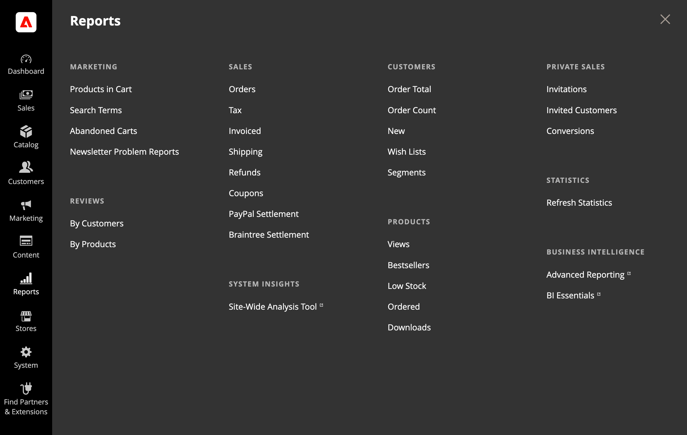

# Menü [!UICONTROL Reports]

Adobe Commerce bietet eine große Auswahl an Berichten, um Sie über Ihre Marketing-Maßnahmen, Verkaufsprodukte und Kundenaktivitäten auf dem Laufenden zu halten. Das Menü Berichte bietet einfachen Zugriff auf aktuelle Informationen zu Ihren Verkäufen, Produkten, Kunden und Aktionen.

{width="600"}

## Anzeigen des [!UICONTROL Reports]

Wählen Sie in der _Admin_-Seitenleiste **[!UICONTROL Reports]** aus.

## Menüoptionen

### [!UICONTROL Marketing]

Eine Auswahl an [Marketing-Berichten](marketing-reports.md) einschließlich Produkten im Warenkorb, Suchbegriffen, Transaktionsabbrüchen und Problemberichten im Newsletter.

### [!UICONTROL Reviews]

Die Auswahl von [Prüfungsberichten](review-reports.md) umfasst Nach Kunde und Nach Produkt.

### [!UICONTROL Sales]

Die Auswahl von [Verkaufsberichten](sales-reports.md) umfasst Bestellungen, Steuer, Fakturiert, Versand, Rückerstattungen, Gutscheine und Abrechnungsberichte für PayPal und Braintree.

### [!UICONTROL System Insights]

(Nur Adobe Commerce) Die [[!DNL Site-Wide Analysis Tool]](https://experienceleague.adobe.com/docs/commerce-operations/tools/site-wide-analysis-tool/access.html?lang=de) bietet Systemeinblicke für Installationen von Adobe Commerce auf Cloud-Infrastrukturen mit 24/7-Echtzeit-Leistungsüberwachung, Berichten und Empfehlungen.

### [!UICONTROL Customers]

(Nur Adobe Commerce) Die Auswahl von [Kundenberichten](customer-reports.md) umfasst Bestellsumme, Bestellkonto, Neu, Wunschlisten und Segmente.

### [!UICONTROL Products]

Die Auswahl an [Produktberichten](product-reports.md) umfasst Ansichten, Bestseller, Geringe Lagerbestände, Bestellt und Downloads.

### [!UICONTROL Private Sales]

(Nur Adobe Commerce) Die Auswahl von Berichten für [Privatverkäufe und -veranstaltungen](private-sales-reports.md) umfasst Einladungen, eingeladene Kunden und Konversionen.

### [!UICONTROL Statistics]

[Statistik](sales-reports.md#refresh-statistics) ist ein Tool, das die Leistungsauswirkungen der Berichterstellung durch die Berechnung und Speicherung statistischer Daten reduziert. Anstatt die Statistiken jedes Mal neu zu berechnen, wenn ein Bericht generiert wird, werden die gespeicherten Statistiken verwendet, bis Sie die Statistiken aktualisieren.

### [!DNL Commerce Intelligence]

Integrierte [[!DNL Commerce Intelligence]](business-intelligence.md)-Tools bieten die Einblicke, die Sie für strategische Geschäftsentscheidungen benötigen.
