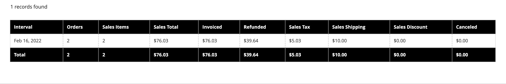

# Verkaufsberichte

Die Auswahl der Verkaufsberichte umfasst Bestellungen, Steuer, Fakturiert, Versand, Rückerstattungen, Gutscheine und PayPal-Abrechnung.

## Berichtsfilter

Sie können einen Verkaufsbericht für eine ganze Website oder für einen Store generieren. Die Verkaufsberichte können nach Zeitintervall, Datum und Status gefiltert werden.

{width="600"}

Um einen Verkaufsbericht zu filtern, legen Sie die folgenden Optionen fest:

| Option | Beschreibung |
|--- |--- |
| [!UICONTROL Date Used] | Legt die für den Bericht zu verwendenden Daten fest. |
| [!UICONTROL Period] | Der Zeitraum, für den die Daten verwendet werden: Tag/Monat/Jahr. |
| [!UICONTROL From/To] | Wird verwendet, um Suchdaten nach Start- und Enddatum zu definieren. |
| [!UICONTROL Order Status] | Zeigt den Bestellstatus an |
| [!UICONTROL Empty Rows] | Gibt an, ob dem Bericht leere Zeilen hinzugefügt werden sollen. |

## [!UICONTROL Orders Report]

Die [!UICONTROL Orders Report] enthält die Anzahl der aufgegebenen und stornierten Bestellungen mit Gesamtsummen für Verkäufe, fakturierten Beträgen, Rückerstattungen, eingenommenen Steuern, Versandkosten und Rabatten.

1. Navigieren Sie in _Admin_-Seitenleiste zu **[!UICONTROL Reports]** > _[!UICONTROL Sales]_>**[!UICONTROL Orders]**.

1. Wählen Sie im Abschnitt **[!UICONTROL Filter]** die Optionen für den Berichtszeitraum und den Bestellstatus aus, die zum Ausfüllen des Berichts verwendet werden.

1. Klicken Sie auf **[!UICONTROL Show Report]**.

{width="600"}

## [!UICONTROL Tax Report]

Die [!UICONTROL Tax Report] enthält die angewendete Steuerregel, den Steuersatz, die Anzahl der Bestellungen und den Betrag der erhobenen Steuer.

1. Navigieren Sie in _Admin_-Seitenleiste zu **[!UICONTROL Reports]** > _[!UICONTROL Sales]_>**[!UICONTROL Tax]**.

1. Wählen Sie im Abschnitt **[!UICONTROL Filter]** die Optionen für den Berichtszeitraum und den Bestellstatus aus, die zum Ausfüllen des Berichts verwendet werden.

1. Klicken Sie auf **[!UICONTROL Show Report]**.

{width="600"}

## [!UICONTROL Invoice Report]

Die [!UICONTROL Invoice Report] umfasst die Anzahl der Bestellungen und Rechnungen während des Zeitraums mit fakturierten, bezahlten und nicht bezahlten Beträgen.

1. Navigieren Sie in _Admin_-Seitenleiste zu **[!UICONTROL Reports]** > _[!UICONTROL Sales]_>**[!UICONTROL Invoiced]**.

1. Wählen Sie im Abschnitt **[!UICONTROL Filter]** die Optionen für den Berichtszeitraum und den Bestellstatus aus, die zum Ausfüllen des Berichts verwendet werden.

1. Klicken Sie auf **[!UICONTROL Show Report]**.

{width="600"}

## [!UICONTROL Shipping Report]

Die [!UICONTROL Shipping Report] enthält die Anzahl der Bestellungen für den verwendeten Spediteur oder die verwendete Versandart, einschließlich der Beträge für Gesamtverkäufe und Gesamtversand.

1. Navigieren Sie in _Admin_-Seitenleiste zu **[!UICONTROL Reports]** > _[!UICONTROL Sales]_>**[!UICONTROL Shipping]**.

1. Wählen Sie im Abschnitt **[!UICONTROL Filter]** die Optionen für den Berichtszeitraum und den Bestellstatus aus, die zum Ausfüllen des Berichts verwendet werden.

1. Klicken Sie auf **[!UICONTROL Show Report]**.

{width="600"}

## [!UICONTROL Refunds Report]

Die [!UICONTROL Refunds Report] enthält die Anzahl der zurückerstatteten Bestellungen und den Gesamtbetrag, der online und offline zurückerstattet wurde.

1. Navigieren Sie in _Admin_-Seitenleiste zu **[!UICONTROL Reports]** > _[!UICONTROL Sales]_>**[!UICONTROL Refunds]**.

1. Wählen Sie im Abschnitt **[!UICONTROL Filter]** die Optionen für den Berichtszeitraum und den Bestellstatus aus, die zum Ausfüllen des Berichts verwendet werden.

1. Klicken Sie auf **[!UICONTROL Show Report]**.

{width="600"}

## [!UICONTROL Coupons Report]

Die [!UICONTROL Coupons Report] enthält jeden Couponcode, der während des angegebenen Zeitintervalls verwendet wurde, die zugehörige Preisregel und die Anzahl der verwendeten Fälle, mit Summen und Zwischensummen für Verkäufe und Rabatte.

1. Navigieren Sie in _Admin_-Seitenleiste zu **[!UICONTROL Reports]** > _[!UICONTROL Sales]_>**[!UICONTROL Coupons]**.

1. Wählen Sie im Abschnitt **[!UICONTROL Filter]** die Optionen für den Berichtszeitraum und den Bestellstatus aus, die zum Ausfüllen des Berichts verwendet werden.

1. Klicken Sie auf **[!UICONTROL Show Report]**.

Weitere Informationen zur Verwendung des [!UICONTROL Coupons Report] zum Erfassen von Daten für Ihre Promotion-Kampagnen finden Sie [Berichte zu Coupons](../merchandising-promotions/price-rules-cart-coupon.md#coupons-report) im _Merchandising und Promotions-Handbuch_.

<!---  need coupon data  -->

## [!UICONTROL PayPal Settlement Reports]

Die Seite [PayPal-]&quot; enthält den Ereignistyp, z. B. eine Debitkartentransaktion, das Start- und Enddatum, den Bruttobetrag und die zugehörigen Gebühren. Der Bericht kann automatisch mit den neuesten Daten von PayPal aktualisiert werden. Es gibt Filteroptionen für Datumsbereich, Händlerkonto, Transaktions-ID, Rechnungsnummer oder PayPal-Referenz-ID.

Navigieren Sie in _Admin_-Seitenleiste zu **[!UICONTROL Reports]** > _[!UICONTROL Sales]_>**[!UICONTROL PayPal Settlement]**.

{width="600"}

Weitere Informationen zur Verwendung der [!UICONTROL PayPal Settlement Reports] zum Abrufen von Informationen zu jeder PayPal-Transaktion, die sich auf die Abrechnung von Geldern auswirkt, finden Sie unter [PayPal-Abrechnungsberichte](../stores-purchase/paypal-settlement-reports.md) im _Stores and Purchase Experience Guide_.

## [!UICONTROL Braintree Settlement Report]

Die Abrechnungsauswertung für [Braintree](../stores-purchase/braintree.md) kann nach Erstellungsdatum, Betrag, Status, Transaktionsart, Zahlungsart, Transaktions-ID, Auftrags-ID, PayPal-Zahlungs-ID, Typ, Händlerkonto-ID oder Abrechnungsstapel-ID gefiltert werden. Die Auswertung enthält die Transaktions-ID, Auftrags-ID, PayPal-Zahlungs-ID, Art, Erstellungsdatum, Betrag, Abrechnungscode, Status, Abrechnungsantwort, Kostenerstattungs-IDs, Händlerkonto-ID, Abrechnungsstapel-ID und Währung.

Navigieren Sie in _Admin_-Seitenleiste zu **[!UICONTROL Reports]** > _[!UICONTROL Sales]_>**[!UICONTROL Braintree Settlement]**.

<!---  need a Braintree connection to update report screen -->

## Berichte exportieren

1. Um den Bericht zu exportieren, wählen Sie den Dateityp aus: `Excel XML` oder `CSV`

1. Klicken Sie auf **[!UICONTROL Export]**.

## Statistiken aktualisieren

[!BADGE Nur PaaS]{type=Informative url="https://experienceleague.adobe.com/en/docs/commerce/user-guides/product-solutions" tooltip="Gilt nur für Adobe Commerce in Cloud-Projekten (von Adobe verwaltete PaaS-Infrastruktur) und lokale Projekte."}

Um die Leistungsauswirkungen der Erstellung von Verkaufsberichten zu reduzieren, berechnet und speichert [!DNL Commerce] die erforderlichen Statistiken für jeden Bericht. Anstatt die Statistiken jedes Mal neu zu berechnen, wenn ein Bericht generiert wird, werden die gespeicherten Statistiken verwendet, es sei denn, Sie aktualisieren die Statistiken. Um die neuesten Daten einzubeziehen, müssen die Berichtsstatistiken aktualisiert werden, bevor ein Verkaufsbericht generiert wird.

{width="700"}

1. Navigieren Sie in _Admin_-Seitenleiste zu **[!UICONTROL Reports]** > _[!UICONTROL Statistics]_>**[!UICONTROL Refresh Statistics]**.

1. Aktivieren Sie in der Liste das Kontrollkästchen für jeden zu aktualisierenden Bericht.

1. Legen Sie das **[!UICONTROL Actions]**-Steuerelement auf eine der folgenden Einstellungen fest:

   - `Refresh Lifetime Statistics`
   - `Refresh Statistics for the Last Day`

1. Klicken Sie auf **[!UICONTROL Submit]**.
