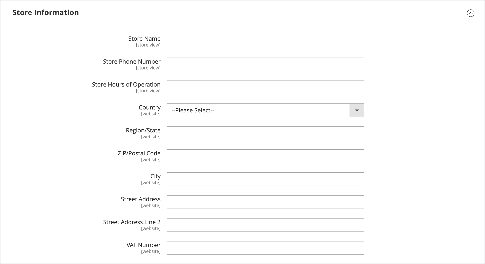
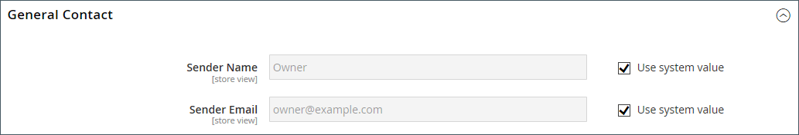

# Store-Details

Zu den grundlegenden Informationen für Ihren Store gehören der Name und die Adresse des Stores, die Telefonnummer und die E-Mail-Adresse, die in E-Mail-Nachrichten, Rechnungen und anderen Nachrichten an Ihre Kunden angezeigt werden.

{width="900" zoomable="yes"}

## [!UICONTROL Store Information]

Der Abschnitt _[!UICONTROL Store Information]_&#x200B;enthält die grundlegenden Informationen, die auf den Verkaufsbelegen und in anderen Mitteilungen angezeigt werden.

1. Navigieren Sie in _Admin_-Seitenleiste zu **[!UICONTROL Stores]** > _[!UICONTROL Settings]_>**[!UICONTROL Configuration]**.

1. Wählen Sie im linken Navigationsbereich unter **[!UICONTROL General]** die Option **[!UICONTROL General]** aus.

1. Erweitern Sie  den Abschnitt **[!UICONTROL Store Information]** .

   {width="700"}

1. Legen Sie die Optionen entsprechend Ihren Store-Details fest:

   - Geben Sie die **[!UICONTROL Store Name]** ein, die Sie in allen Kommunikationen verwenden möchten.

   - Geben Sie die **[!UICONTROL Store Phone Number]** in der gewünschten Formatierung ein.

   - Geben Sie **[!UICONTROL Store Hours of Operation]** die Öffnungszeiten Ihres Geschäfts ein. Beispiel: `Mon - Fri, 9-5, Sat 9-noon PST`.

   - Wählen Sie die **[!UICONTROL Country]** aus, in der sich Ihr Unternehmen befindet.

   - Wählen Sie die **[!UICONTROL Region/State]** mit dem Land aus.

   - Geben Sie die **[!UICONTROL Store Address]** ein. Wenn die Adresse lang ist, fahren Sie mit der Adresse in **Speicheradresse Zeile 2** fort.

   - Geben Sie bei Bedarf den **[!UICONTROL VAT Number]** Ihres Geschäfts ein.

     Um die Zahl zu überprüfen, klicken Sie auf die Schaltfläche **[!UICONTROL Validate VAT Number]**. Weitere Informationen finden Sie unter [Validierung der MwSt.-ID](../stores-purchase/vat.md#vat-id-validation).

1. Klicken Sie abschließend auf **[!UICONTROL Save Config]**.

Weitere Informationen zu den Konfigurationsoptionen für Store-Informationen finden Sie im [_Konfigurationshandbuch_](../configuration-reference/general/general.md#store-information).

## [!UICONTROL Locale Options]

Das Gebietsschema bestimmt die vielen Einstellungen, die im gesamten Store verwendet werden. Einige davon sind:

- Sprache
- Land
- Steuersatz
- Währung
- Preis
- Zahlenformat

Die Einstellung „Gebietsschema“ bestimmt die Zeitzone und Sprache für jeden Store und identifiziert die Wochentage in dem Bereich.

1. Navigieren Sie in _Admin_-Seitenleiste zu **[!UICONTROL Stores]** > _[!UICONTROL Settings]_>**[!UICONTROL Configuration]**.

1. Wählen Sie im linken Navigationsbereich unter **[!UICONTROL General]** die Option **[!UICONTROL General]** aus.

1. Erweitern Sie  den Abschnitt **[!UICONTROL Locale Options]** .

   {width="700"}

1. Wählen Sie Ihre **[!UICONTROL Timezone]** aus der Liste aus.

1. Legen Sie **[!UICONTROL Locale]** auf die Store-Sprache fest.

1. Legen Sie **[!UICONTROL Weight Unit]** auf die Maßeinheit fest, die normalerweise für Sendungen aus Ihrem Gebietsschema verwendet wird.

1. Legen Sie **[!UICONTROL First Day of the Week]** auf den Tag fest, der als erster Wochentag in Ihrer Region gilt.

1. Wählen Sie in der Liste **[!UICONTROL Weekend Days]** die Tage aus, die auf ein Wochenende in Ihrer Region fallen.

   Zur Auswahl mehrerer Tage halten Sie die Strg-Taste (PC) bzw. die Befehlstaste (Mac) gedrückt und klicken auf die einzelnen Elemente.

1. Klicken Sie abschließend auf **[!UICONTROL Save Config]**.

Weitere Informationen zu den Gebietsschema-Konfigurationsoptionen finden Sie im [Konfigurationsreferenzhandbuch](../configuration-reference/general/general.md#locale-options).

## [!UICONTROL State Options]

In vielen Ländern ist der Bundesstaat, die Provinz oder die Region ein erforderlicher Teil einer Postanschrift. Diese Informationen werden für Versand- und Rechnungsinformationen, zur Berechnung von Steuersätzen usw. verwendet. Für Länder, in denen der Status nicht erforderlich ist, kann das Feld vollständig aus der Adresse ausgelassen oder als optionales Feld eingefügt werden.

Da die Standardadressformate von Land zu Land variieren, können Sie auch die Vorlage bearbeiten, mit der die Adresse für Rechnungen, Lieferscheine und Versandaufkleber formatiert wird.

1. Navigieren Sie in _Admin_-Seitenleiste zu **[!UICONTROL Stores]** > _[!UICONTROL Settings]_>**[!UICONTROL Configuration]**.

1. Wählen Sie im linken Navigationsbereich unter **[!UICONTROL General]** die Option **[!UICONTROL General]** aus.

1. Erweitern Sie  den Abschnitt **[!UICONTROL State Options]** .

   {width="700"}

1. Verwenden Sie die **[!UICONTROL State is required for]** Liste, um jedes Land auszuwählen, für das Region/Staat ein erforderlicher Eintrag ist.

1. Legen Sie **[!UICONTROL Allow to Choose State if it is Optional for Country]** auf eine der folgenden Einstellungen fest:

   `Yes` - In Ländern, in denen das Feld „Bundesland“ nicht erforderlich ist, wird das Feld „Bundesland“ als optionaler Eintrag einbezogen.

   `No` - In Ländern, in denen das Feld „Bundesstaat“ nicht erforderlich ist, lässt es das Feld „Bundesstaat“ aus.

1. Klicken Sie abschließend auf **[!UICONTROL Save Config]**.

Weitere Informationen zu den Statuskonfigurationsoptionen finden Sie im [Konfigurationshandbuch](../configuration-reference/general/general.md#state-options).

## [!UICONTROL Country Options]

Die Länderoptionen geben das Land an, in dem Ihr Unternehmen ansässig ist, sowie die Länder, aus denen Sie die Zahlung akzeptieren.

### Länderoptionen für den Store festlegen

1. Navigieren Sie in _Admin_-Seitenleiste zu **[!UICONTROL Stores]** > _[!UICONTROL Settings]_>**[!UICONTROL Configuration]**.

1. Wählen Sie im linken Navigationsbereich unter **[!UICONTROL General]** die Option **[!UICONTROL General]** aus.

1. Erweitern Sie  den Abschnitt **[!UICONTROL Country Options]** .

   >[!NOTE]
   >
   >Deaktivieren Sie bei Bedarf das Kontrollkästchen **[!UICONTROL Use system value]** für jede Einstellung, die Sie ändern möchten.

   {width="700"}

1. Wählen Sie die **[!UICONTROL Default Country]** aus, in der sich Ihr Unternehmen befindet.

1. Wählen Sie in der Liste **[!UICONTROL Allow Countries]** jedes Land aus, aus dem Sie Bestellungen annehmen.

   Standardmäßig werden alle Länder in der Liste ausgewählt. Zur Auswahl mehrerer Länder halten Sie die Strg-Taste (PC) bzw. die Befehlstaste (Mac) gedrückt und klicken auf die einzelnen Elemente.

1. Verwenden Sie die **[!UICONTROL Zip/Postal Code is Optional for]** Liste, um jedes Land auszuwählen, in dem Sie Geschäfte tätigen, für die keine Postleitzahl als Teil der Straßenadresse angegeben werden muss.

1. Wählen Sie in der **[!UICONTROL European Union Countries]** Liste jedes Land in der EU aus, in dem Sie Geschäfte tätigen.

   Standardmäßig werden alle EU-Länder ausgewählt. Zur Auswahl der gewünschten Länder halten Sie die Strg-Taste (PC) bzw. die Befehlstaste (Mac) gedrückt und klicken auf die einzelnen Elemente.

1. Wählen Sie in der Liste &quot;**[!UICONTROL Top Destinations]**&quot; die primären Länder aus, in denen Sie den Verkauf anstreben.

1. Klicken Sie abschließend auf **[!UICONTROL Save Config]**.

### Länderoptionen für bestimmte Versandmethode festlegen

Sie können auch den Versand in bestimmte Länder für jede verfügbare [Versandmethode](../stores-purchase/delivery.md) (UPS, FedEx usw.) konfigurieren.

1. Navigieren Sie in _Admin_-Seitenleiste zu **[!UICONTROL Stores]** > _[!UICONTROL Settings]_>**[!UICONTROL Configuration]**.

1. Erweitern Sie im linken Navigationsbereich **[!UICONTROL Sales]** und wählen Sie **[!UICONTROL Delivery Methods]**.

1. Wählen Sie den Spediteur aus, auf den Sie bestimmte Länder anwenden möchten.

1. Deaktivieren Sie **[!UICONTROL Ship to Applicable Countries]** das Kontrollkästchen **[!UICONTROL Use system value]** und wählen Sie die Option **[!UICONTROL Specific Countries]** aus.

1. Wählen Sie in der Liste **[!UICONTROL Top Destinations]** die primären Länder aus, die Sie für den Versand auswählen möchten.

   {width="700"}

1. Klicken Sie abschließend auf **[!UICONTROL Save Config]**.

### Fehlerbehebung bei Ressourcen

Hilfe bei der Fehlerbehebung bei Konfigurationsproblemen in Ländern finden Sie in den folgenden Artikeln der [!DNL Commerce]-Support-Wissensdatenbank:

- [Hinzufügen eines Landes](https://experienceleague.adobe.com/docs/commerce-knowledge-base/kb/how-to/how-to-add-a-new-country-to-magento-2.html)

## [!UICONTROL Merchant Location]

[!BADGE Nur PaaS]{type=Informative url="https://experienceleague.adobe.com/en/docs/commerce/user-guides/product-solutions" tooltip="Gilt nur für Adobe Commerce in Cloud-Projekten (von Adobe verwaltete PaaS-Infrastruktur) und lokale Projekte."}

Die Einstellung „Händlerstandort“ wird zum Konfigurieren von [Zahlungsmethoden](../stores-purchase/payments.md) verwendet. Wenn für diese Einstellung kein Wert vorhanden ist, wird die Einstellung [Standardland](#uicontrol-country-options) verwendet.

1. Navigieren Sie in _Admin_-Seitenleiste zu **[!UICONTROL Stores]** > _[!UICONTROL Settings]_>**[!UICONTROL Configuration]**.

1. Erweitern Sie im linken Navigationsbereich **[!UICONTROL Sales]** und wählen Sie **[!UICONTROL Payment Methods]**.

1. Erweitern Sie  den Abschnitt **Händler-Standort** und wählen Sie Ihre **[!UICONTROL Merchant Country]** aus.

   {width="600"}

1. Klicken Sie abschließend auf **[!UICONTROL Save Config]**.

Weitere Informationen zu den Konfigurationsoptionen für Zahlungsmethoden finden Sie im [Konfigurationshandbuch](../configuration-reference/sales/payment-methods.md).

## Währung

Währung einrichten - Definiert die [ (Währung](../stores-purchase/currency-configuration.md) und alle zusätzlichen Währungen, die als Zahlung akzeptiert werden. Richtet außerdem die Importverbindung und den Zeitplan ein, mit denen die Wechselkurse automatisch aktualisiert werden.

Währungssymbole - Definiert die [Währungssymbole](../stores-purchase/currency-configuration.md#step-5-customize-currency-symbols-optional) die in Produktpreisen und Verkaufsdokumenten wie Bestellungen und Rechnungen angezeigt werden. [!DNL Commerce] unterstützt Währungen aus über 200 Ländern weltweit.

Währungskurse aktualisieren - Währungskurse können [aktualisiert](../stores-purchase/currency-update.md) manuell oder nach Bedarf oder gemäß einem vordefinierten Zeitplan in Ihr Geschäft importiert werden.

Währungsauswahl - Wenn mehrere Währungen verfügbar sind, ist die [Währungsauswahl](../stores-purchase/currency.md) in der Kopfzeile des Stores verfügbar.

## [!UICONTROL Store Email Addresses]

Sie können bis zu fünf verschiedene E-Mail-Adressen haben, um unterschiedliche Funktionen oder Abteilungen für jeden Shop oder jede Ansicht darzustellen. Zusätzlich zu den folgenden vordefinierten E-Mail-Identitäten gibt es einige benutzerdefinierte Identitäten, die Sie entsprechend Ihren Anforderungen einrichten können.

- Allgemeine Kontaktdaten
- Vertriebsmitarbeiter
- Kunden-Support

Jede Identität und die zugehörige E-Mail-Adresse können bestimmten automatisierten E-Mail-Nachrichten zugeordnet werden und werden als Absender von E-Mail-Nachrichten angezeigt, die von Ihrem Store gesendet werden.

### Schritt 1: Einrichten der E-Mail-Adressen für Ihre Domain

Bevor Sie E-Mail-Adressen für den Store konfigurieren können, müssen sie jeweils als gültige E-Mail-Adresse für Ihre Domain eingerichtet werden. Um jede erforderliche E-Mail-Adresse zu erstellen, befolgen Sie die Anweisungen Ihres Serveradministrators oder E-Mail-Hosting-Anbieters.

### Schritt 2: Festlegen der Basis-URL für generierte Links

[!BADGE nur SaaS]{type=Positive url="https://experienceleague.adobe.com/en/docs/commerce/user-guides/product-solutions" tooltip="Gilt nur für Adobe Commerce as a Cloud Service-Projekte (von Adobe verwaltete SaaS-Infrastruktur)."}

Einige kundenorientierte E-Mails enthalten Links zum Store, z. B. solche, die Kunden beim Zurücksetzen ihrer Kennwörter helfen. Um sicherzustellen, dass die Links zur Storefront funktionieren, müssen Sie die Basis-URL zu Ihrer Storefront definieren.

1. Navigieren Sie in _Admin_-Seitenleiste zu **[!UICONTROL Stores]** > _[!UICONTROL Settings]_>**[!UICONTROL Configuration]**.

1. Wählen Sie im linken Navigationsbereich unter **[!UICONTROL General]** die Option **[!UICONTROL Store Email Addresses]** aus.

1. Geben Sie im Abschnitt **[!UICONTROL Storefront Base URL]**-**[!UICONTROL General]** die Stamm-URL für Ihren Store ein, z. B. `https://www.example.com/`. Die URL muss mit einem Schrägstrich enden.

   {width="600"}

### Schritt 3: Konfigurieren der E-Mail-Adressen für Ihren Store

1. Navigieren Sie in _Admin_-Seitenleiste zu **[!UICONTROL Stores]** > _[!UICONTROL Settings]_>**[!UICONTROL Configuration]**.

1. Wählen Sie im linken Navigationsbereich unter **[!UICONTROL General]** die Option **[!UICONTROL Store Email Addresses]** aus.

1. Erweitern Sie  den Abschnitt **[!UICONTROL General Contact]** und führen Sie folgende Schritte aus:

   {width="600"}

   - Geben Sie **[!UICONTROL Sender Name]** den Namen der Person ein, die der allgemeinen Kontaktidentität zugeordnet ist, damit sie als Absender von E-Mail-Nachrichten angezeigt wird.

   - Geben Sie **[!UICONTROL Sender Email]** die zugehörige E-Mail-Adresse ein.

1. Wiederholen Sie diesen Vorgang für jede Store-E-Mail-Adresse, die Sie verwenden möchten.

1. Klicken Sie abschließend auf **[!UICONTROL Save Config]**.

### Schritt 4: Aktualisieren der E-Mail-Konfiguration für den Verkauf

Wenn Sie benutzerdefinierte E-Mail-Adressen verwenden, sollten Sie die Konfiguration aller zugehörigen E-Mail-Nachrichten aktualisieren, damit die richtige Identität als Absender angezeigt wird.

1. Erweitern Sie im linken Navigationsbereich **[!UICONTROL Sales]** und wählen Sie **[!UICONTROL Sales Emails]**.

   Die Seite verfügt über einen separaten Abschnitt für jede der folgenden Aktionen:

   - Kommentare zu Bestellungen und Bestellungen
   - Rechnung und Rechnungskommentare
   - Versand- und Versandkommentare
   - Gutschrift und Gutschriftskommentare
   - RMA, RMA-Autorisierung, RMA-Admin-Kommentare und RMA-Kundenkommentare  (nur Adobe Commerce)

1. Erweitern Sie beginnend mit **[!UICONTROL Order]** den Abschnitt für jede Nachricht und stellen Sie sicher, dass der richtige Absender ausgewählt ist.

   {width="600"}

1. Klicken Sie abschließend auf **[!UICONTROL Save Config]**.

Weitere Informationen zu den Konfigurationsoptionen für Verkaufs-E-Mails finden Sie im [_Konfigurationshandbuch_](../configuration-reference/sales/sales-emails.md).

## Kontaktformular

Der _Kontakt_-Link in der Fußzeile des Geschäfts ist eine einfache Möglichkeit für Kunden, mit Ihnen in Kontakt zu bleiben. Kunden können das Formular ausfüllen, um eine Nachricht an Ihren Store zu senden. Bei einer standardmäßigen [!DNL Commerce] wird das Standardformular _Kontakt_ angezeigt. Nach dem Absenden des Formulars wird eine Dankesmeldung angezeigt

Es ist wichtig zu verstehen, dass das standardmäßige Contact Us-Formular direkt aus dem Code und nicht aus einer CMS-Seite gerendert wird.

{width="700"}

Die Fußzeile des Stores enthält einen Link zur Seite „Kontakt“, die im gesamten Store verfügbar ist.

{width="700"}

Die Luma-Beispieldaten enthalten zusätzliche Informationen auf der Seite „Kontakt“, die zeigen, wie Sie die Seite für Ihren Store anpassen können.

{width="700"}

### Kontaktformular konfigurieren

1. Navigieren Sie in _Admin_-Seitenleiste zu **[!UICONTROL Stores]** > _[!UICONTROL Settings]_>**[!UICONTROL Configuration]**.

1. Wählen Sie im linken Navigationsbereich unter **[!UICONTROL General]** die Option **[!UICONTROL Contacts]** aus.

1. Erweitern Sie  den Abschnitt **[!UICONTROL Contact Us]** und legen Sie **[!UICONTROL Enable Contact Us]** auf `Yes` fest.

   {width="600"}

1. Erweitern Sie  den Abschnitt **[!UICONTROL Email Options]** und legen Sie die E-Mail-Kontaktoptionen fest:

   {width="600"}

   - Geben Sie **[!UICONTROL Send Emails to]** die E-Mail-Adresse ein, an die Nachrichten aus dem Formular „Kontakt“ gesendet werden.

   - Legen Sie **[!UICONTROL Email Sender]** auf die Store-Identität fest, die als Absender der Nachricht aus dem Formular „Kontakt“ angezeigt wird. Beispiel: Benutzerdefinierte E-Mail 2.

   - Legen Sie **[!UICONTROL Email Template]** auf die Vorlage fest, die für Nachrichten verwendet wird, die vom Formular „Kontakt“ gesendet werden.

1. Klicken Sie abschließend auf **[!UICONTROL Save Config]**.

### Inhalt anpassen

Sie können den Inhalt im Formular _Kontaktieren Sie uns_ an die Anforderungen Ihrer Store- und Kundendienstrichtlinien anpassen.

### Methode 1: Verwenden von Beispieldaten

Die Luma-Beispieldaten enthalten einen _Kontaktieren Sie uns Info_-Block, der für Ihren Store angepasst werden kann. Der `contact-us-info` [Block](../content-design/blocks.md) kann einfach geändert werden, um eigene Inhalte zur Seite „Kontakt“ hinzuzufügen.

1. Navigieren Sie in _Admin_-Seitenleiste zu **[!UICONTROL Content]** > _[!UICONTROL Elements]_>**[!UICONTROL Blocks]**.

1. Suchen Sie den **[!UICONTROL Contact Us Info]** Block in der Liste und öffnen Sie ihn im **[!UICONTROL Edit]**.

   {width="700"}

1. Klicken Sie unten auf der Blockseite auf **[!UICONTROL Edit with Page Builder]**.

   {width="700"}

   >[!NOTE]
   >
   >Wenn Sie [[!DNL Page Builder] deaktiviert](../page-builder/setup.md#disable-dnl-page-builder) haben, können Sie den Text mit dem Editor [Symbolleiste](../content-design/editor.md) formatieren und [Bilder](../content-design/editor-insert-image.md) und [Links](../content-design/editor-insert-link.md).

1. Bewegen Sie den Mauszeiger über den HTML-Container, um die Toolbox anzuzeigen, und wählen _das Symbol_ Einstellungen ) aus.

1. Bearbeiten Sie den HTML-Code entsprechend den Kontaktinformationen für Ihren Store und klicken Sie auf **[!UICONTROL Save]**.

   {width="700"}

1. Verlassen Sie die [!DNL Page Builder] Phase und klicken Sie auf **[!UICONTROL Save Block]**.

### Methode 2: Ohne Beispieldaten

>[!IMPORTANT]
>
>Ab Version 2.4.0 kann das Kontaktformular nicht mehr innerhalb eines CMS-Blocks oder einer CMS-Seite aufrufen. Die gesamte Anpassung des Kontaktformulars sollte mit Layout-XML oder benutzerdefinierten Design-Vorlagen erfolgen.

Standardmäßig greifen Käufer über den _Kontakt-Link_ in der Fußzeile der Storefront-Seiten auf das Kontaktformular zu. Weitere Informationen zum Anpassen der Kontaktseite finden Sie im [Frontend-Entwicklerhandbuch][theme-guide].

[theme-guide]: https://developer.adobe.com/commerce/frontend-core/guide/themes/
