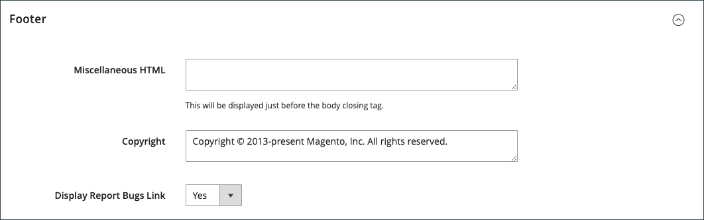

# Storefront-Branding

Eines der ersten Dinge, die Sie tun möchten, ist [Logo ändern](#upload-your-logo) in der Kopfzeile und [Favicon hochladen](#add-a-favicon) für den Browser. Als Nächstes sollten Sie [Willkommensnachricht hinzufügen](#change-the-welcome-message) und [den Copyright-Hinweis aktualisieren](#change-the-copyright-notice) in der Fußzeile. Diese Aufgaben sind ein paar einfache Designelemente, die Sie sofort erledigen können. Während Ihr Store in Entwicklung ist, können Sie [Anzeige zur Store-Demo aktivieren](#set-the-store-demo-notice), und entfernen Sie es, wenn Sie bereit zum Starten sind.

{width="600" zoomable="yes"}

## Logo hochladen

Die Größe und Position des Logos in der Kopfzeile wird durch das Store-Design bestimmt. Ihr Logo kann entweder als GIF-, PNG- oder JPG-Dateityp (JPEG) gespeichert und vom Administrator Ihres Stores hochgeladen werden.

{width="600"}

Das Logo-Bild befindet sich am folgenden Speicherort auf dem Server. Jede Bilddatei mit dem Namen `logo.svg` wird als Standard-Design-Logo verwendet.

Vollständiger Pfad - `app/design/frontend/[vendor]/[theme]/web/images/logo.svg`

Relativer Pfad -  `images/logo.svg`

Wenn Sie die Größe des Logos oder anderer im Design verwendeter Bilder nicht kennen, öffnen Sie die Seite in einem Browser, klicken Sie mit der rechten Maustaste auf das Bild und überprüfen Sie das Element.

>[!NOTE]
>
>Zusätzlich zum Logo in der Kopfzeile erscheint Ihr Logo auch auf [E-Mail-Vorlagen](../systems/email-templates.md#prepare-your-email-logo) und [PDF-Rechnungen](../stores-purchase/sales-documents.md) und anderen Verkaufsunterlagen. Die Logos für E-Mail-Vorlagen und Rechnungen haben unterschiedliche Größen und müssen separat hochgeladen werden.

Unterstützte Logodateiformate:

| Dateiformat | Beschreibung |
|--- |--- |
| PNG | (Portable Network Graphics) Diese neuere Alternative zum GIF-Format unterstützt bis zu 16 Millionen Farben (24 Bit). Das verlustfreie Komprimierungsformat liefert ein hochwertiges Bitmap-Bild mit scharfem Text, jedoch eine größere Dateigröße als einige Formate. Das PNG-Format unterstützt transparente Ebenen und ist für die Online-Anzeige und das Streaming konzipiert. |
| GIF | (Graphics Interchange Format) Ein weithin unterstütztes und älteres Bitmap-Format, das auf 256 Farben (8 Bit) begrenzt ist. Das GIF-Format unterstützt einfache Animationen und transparente Ebenen. |
| JPG (JPEG) | (Joint Fotografic Expert Group) Ein komprimiertes Bitmap-Format, das von den meisten Digitalkameras verwendet wird. Die verlustreiche Komprimierung führt zu Datenverlust, der manchmal als unscharfe Flecken im Text wahrgenommen werden kann. |

{style="table-layout:auto"}

1. Im _Admin_ Seitenleiste, navigieren Sie zu **[!UICONTROL Content]** > _[!UICONTROL Design]_>**[!UICONTROL Configuration]**.

   {width="700"}

1. Suchen Sie die Store-Ansicht, die Sie konfigurieren möchten, und klicken Sie auf **[!UICONTROL Edit]** im _[!UICONTROL Action]_Spalte.

1. Erweitern  die **[!UICONTROL Header]** Abschnitt.

   {width="600"}

1. Um ein neues Logo hochzuladen, klicken Sie auf **[!UICONTROL Upload]** und wählen Sie die Datei aus Ihrem System aus.

1. Geben Sie die **[!UICONTROL Logo Image Width]** und **[!UICONTROL Logo Image Height]** in Pixel.

1. Für **[!UICONTROL Logo Image Alt]** eingeben, geben Sie den Text ein, der angezeigt werden soll, wenn der Mauszeiger über das Bild bewegt wird.

1. Wenn Sie fertig sind, klicken Sie auf **[!UICONTROL Save Configuration]**.

## Favicon hinzufügen

_Favicon_ ist die kürzere für _Lieblingssymbol_ und bezieht sich auf das kleine Symbol auf der Registerkarte jeder Browser-Seite. Je nach Browser wird die Favicon auch in der Adressleiste direkt vor der URL angezeigt.

Ein Favicon ist in der Regel 16 x 16 Pixel oder 32 x 32 Pixel groß. [!DNL Commerce] akzeptiert ICO-, PNG-, APNG-, GIF- und JPG-Dateitypen (JPEG), obwohl nicht alle Browser diese Formate unterstützen. Das am weitesten unterstützte Dateiformat für eine Favicon ist ICO. Sie können andere Bilddateitypen verwenden, das Format wird jedoch möglicherweise nicht von allen Browsern unterstützt. Es gibt viele kostenlose Tools, die Sie verwenden können, um ein ICO-Bild zu erstellen oder ein Bild in dieses Format zu konvertieren.

{width="600"}

[!DNL Commerce] unterstützt die folgenden Dateiformate als Favicon:

| Dateiformat | Beschreibung |
|--- |--- |
| ICO | Dieses Bilddateiformat wurde für kleine Computersymbolbilder entwickelt. Das ICO-Format, das hauptsächlich unter Microsoft® Windows OS verwendet wird, kann Bilder mit bis zu 256 x 256 Pixel und 16 Millionen Farben (24 Bit) mit 8 Bit Transparenz enthalten. |
| PNG | (Portable Network Graphics) Diese neuere Alternative zum GIF-Format unterstützt bis zu 16 Millionen Farben (24 Bit). Das verlustfreie Komprimierungsformat liefert ein hochwertiges Bitmap-Bild mit scharfem Text, jedoch eine größere Dateigröße als einige Formate. Das PNG-Format unterstützt transparente Ebenen und ist für die Online-Anzeige und das Streaming konzipiert. |
| APNG | (Animierte Portable Network Graphics) Ein Dateiformat ähnlich dem PNG, das einfache Animationen unterstützt. |
| GIF | (Graphics Interchange Format) Ein weithin unterstütztes und älteres Bitmap-Format, das auf 256 Farben (8 Bit) begrenzt ist. Das GIF-Format unterstützt einfache Animationen und transparente Ebenen. |
| JPG (JPEG) | (Joint Fotografic Expert Group) Ein komprimiertes Bitmap-Format, das von den meisten Digitalkameras verwendet wird. Die verlustreiche Komprimierung führt zu Datenverlust, der manchmal als unscharfe Flecken im Text wahrgenommen werden kann. |

{style="table-layout:auto"}

### Schritt 1: Erstellen einer Funktion

1. Erstellen Sie mit dem Bildeditor Ihrer Wahl ein 16 x 16- oder 32 x 32-Bildbild Ihres Logos.

1. (Optional) Verwenden Sie eines der verfügbaren Online-Tools, um die Datei in das .ico-Format zu konvertieren und die Datei auf Ihrem Computer zu speichern.

### Schritt 2: Hochladen der Funktion in Ihren Speicher

1. Im _Admin_ Seitenleiste, navigieren Sie zu **[!UICONTROL Content]** > _[!UICONTROL Design]_>**[!UICONTROL Configuration]**.

1. Suchen Sie im Raster nach der Store-Ansicht, die Sie konfigurieren möchten, und klicken Sie auf **[!UICONTROL Edit]** im _[!UICONTROL Action]_Spalte.

1. under _[!UICONTROL Other Settings]_, erweitern  die **[!UICONTROL HTML Head]**Abschnitt.

   {width="600"}

1. Wenn Sie die aktuelle Favicon entfernen möchten, klicken Sie auf die _Löschen_ () in der linken unteren Ecke des Bildes.

1. Klicks **[!UICONTROL Upload]** und öffnen Sie die von Ihnen vorbereitete Favicon-Datei.

   {width="400"}

1. Wenn Sie fertig sind, klicken Sie auf **[!UICONTROL Save Configuration]**.

### Schritt 3: Cache aktualisieren

1. Wenn Sie aufgefordert werden, den Cache zu aktualisieren, klicken Sie auf die **[!UICONTROL Cache Management]** in der Nachricht am oberen Rand des Arbeitsbereichs.

1. Wählen Sie in der Liste die **[!UICONTROL Page Cache]** Kontrollkästchen, das markiert ist `Invalidated`.

1. Satz **[!UICONTROL Actions]** nach `Refresh` und klicken **[!UICONTROL Submit]**.

1. Um die neue Favicon anzuzeigen, kehren Sie zu Ihrer Storefront zurück und aktualisieren Sie den Browser.

## Willkommensnachricht ändern

Die Willkommensnachricht in der Kopfzeile wird um den Namen des Kunden erweitert, der angemeldet ist. Bevor Sie Ihren Store starten, müssen Sie die Standardeinstellung ändern _Willkommen_ Text für jede Store-Ansicht.

{width="600"}

1. Im _Admin_ Seitenleiste, navigieren Sie zu **[!UICONTROL Content]** > _[!UICONTROL Design]_>**[!UICONTROL Configuration]**.

1. Suchen Sie im Raster nach der Store-Ansicht, die Sie konfigurieren möchten, und klicken Sie auf **[!UICONTROL Edit]** im _[!UICONTROL Action]_Spalte.

1. under _[!UICONTROL Other Settings]_, erweitern  die **[!UICONTROL Header]**Abschnitt.

1. Für **[!UICONTROL Welcome Text]** eingeben, geben Sie den Begrüßungstext ein, der in der Kopfzeile Ihres Stores angezeigt werden soll.

   {width="600"}

1. Wenn Sie fertig sind, klicken Sie auf **[!UICONTROL Save Configuration]**.

1. Wenn Sie dazu aufgefordert werden, den Seiten-Cache zu aktualisieren, klicken Sie auf das **[!UICONTROL Cache Management]** -Link am oberen Rand des Arbeitsbereichs und befolgen Sie die Anweisungen zum Aktualisieren des Caches.

## Urheberrechtshinweis ändern

Ihr Store zeigt in der Fußzeile jeder Seite einen Copyright-Hinweis an. Als Best Practice sollte der Urheberrechtshinweis das aktuelle Jahr enthalten und Ihr Unternehmen als rechtmäßigen Eigentümer des Inhalts der Website identifizieren.

{width="600"}

Die `&copy;` -Zeichencode wird zum Einfügen des Copyright-Symbols verwendet, wie in den folgenden Beispielen gezeigt:

- Beispiel für ein langes Format

  `Copyright &copy; 2013-present Luma, Inc. All rights reserved.`

- Beispiel für ein kurzes Format

  `&copy; 2021 Luma, Inc. All rights reserved.`

**_So aktualisieren Sie den Copyright-Hinweis:_**

1. Im _Admin_ Seitenleiste, navigieren Sie zu **[!UICONTROL Content]** > _[!UICONTROL Design]_>**[!UICONTROL Configuration]**.

1. Suchen Sie im Raster nach der Store-Ansicht, die Sie konfigurieren möchten, und klicken Sie auf **[!UICONTROL Edit]** im _[!UICONTROL Action]_Spalte.

1. under _Andere Einstellungen_, erweitern die **[!UICONTROL Footer]** Abschnitt.

   {width="600"}

1. Für **[!UICONTROL Copyright]**, geben Sie den Copyright-Hinweis ein, der in der Fußzeile jeder Seite angezeigt werden soll.

   Verwenden Sie die `&copy;` Zeichencode zum Einfügen eines Copyright-Symbols.

1. Wenn Sie fertig sind, klicken Sie auf **[!UICONTROL Save Configuration]**.

## Festlegen des Demohinweises zum Store

Wenn Ihr Store online ist, sich aber noch im Aufbau befindet, können Sie oben auf der Seite einen Demohinweis zum Geschäft anzeigen, um den Benutzern mitzuteilen, dass der Store noch nicht für Unternehmen geöffnet ist. Wenn Sie bereit sind, _live gehen_, entfernen Sie einfach die Nachricht. Es ähnelt dem Spiegeln des im Fenster hängenden Zeichens _Geschlossen_ nach _Öffnen_. Das Format des Demohinweises wird durch das Design Ihres Stores bestimmt.

{width="600"}

1. Im _Admin_ Seitenleiste, navigieren Sie zu **[!UICONTROL Content]** > _[!UICONTROL Design]_>**[!UICONTROL Configuration]**.

1. Suchen Sie im Raster nach der Store-Ansicht, die Sie konfigurieren möchten, und klicken Sie auf **[!UICONTROL Edit]** im _[!UICONTROL Action]_Spalte.

1. under _[!UICONTROL Other Settings]_, erweitern  die **[!UICONTROL HTML Head]**Abschnitt.

   {width="600"}

1. Scrollen Sie nach unten nach unten und legen Sie die **[!UICONTROL Display Demo Store Notice]** nach Ihren Wünschen.

1. Wenn Sie fertig sind, klicken Sie auf **[!UICONTROL Save Configuration]**.

1. Wenn Sie aufgefordert werden, den Cache zu aktualisieren, klicken Sie auf **[!UICONTROL Cache Management]** in der Systemmeldung und befolgen Sie die Anweisungen zum Aktualisieren des Caches.
