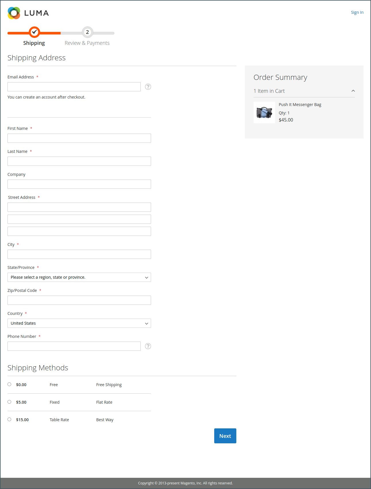
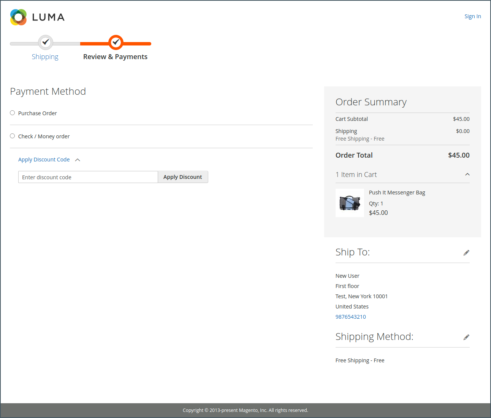

# Was ist die Storefront?

Innerhalb Ihrer Adobe Commerce- oder Magento Open Source-Implementierung ist die Storefront der externe, öffentlich zugängliche Teil Ihres Stores. Es stellt die Inhalte und funktionalen Komponenten bereit, die Ihre Kunden zum Einkaufen und Kaufen verwenden.

Der Weg, den Kundinnen und Kunden zu einem Verkauf gehen, wird manchmal als _Weg zum Kauf_ bezeichnet, und Ihre Storefront enthält die Komponenten, mit denen Kundinnen und Kunden diesen Weg abschließen können. Die folgenden Abschnitte bieten einen Überblick über die grundlegenden Seitentypen, die einen strategischen Wert bieten - die Orte, die Kundinnen und Kunden normalerweise beim Einkaufen in Ihrem Geschäft besuchen. Berücksichtigen Sie bei der Überprüfung verschiedene Store-Funktionen, die in jedem Schritt der Kunden-Journey verwendet werden können.

## Commerce-Storefront

Mit der Einführung der [!DNL **Commerce-Storefront mit Edge Delivery Services**] bietet Adobe eine leistungsstarke, skalierbare und zuverlässige Storefront, die modernste Technologie nutzt, um eine überlegene Geschwindigkeit und ein besseres Benutzererlebnis zu bieten.

- **Verbesserte Leistung**: Das Hosten von Storefronts auf Edge Delivery Services sorgt für schnellere Ladezeiten und eine verbesserte Site-Leistung, was zu höheren Konversionsraten und besseren SEO-Rankings führen kann.

- **Skalierbarkeit**: Die Architektur unterstützt eine nahtlose Skalierung, um erhöhten Traffic und größere Produktkataloge zu bewältigen, ohne die Leistung zu beeinträchtigen.

- **Flexibilität**: Die Storefront ist in hohem Maße anpassbar, sodass Unternehmen das Einkaufserlebnis an ihre individuellen Bedürfnisse anpassen können.

- **Verbessertes Benutzererlebnis**: Funktionen wie erweitertes Caching, Echtzeit-Updates und die Bereitstellung personalisierter Inhalte tragen zu einem reibungsloseren und ansprechenderen Einkaufserlebnis bei.

### Wichtigste Funktionen

Die Commerce Storefront powered by Edge Delivery Services bietet mehrere wichtige Funktionen, die sowohl für Händler als auch für Entwickler von Vorteil sind. Diese Funktionen ermöglichen es Unternehmen, ansprechende Einkaufserlebnisse zu schaffen und gleichzeitig die Flexibilität zu behalten, ihre Storefronts entsprechend ihren Anforderungen anzupassen und zu skalieren.

Weitere Informationen und Anleitungen zum Einrichten und Optimieren Ihrer Commerce-Storefront finden Sie in der [Dokumentation zur Adobe Commerce-Storefront](https://experienceleague.adobe.com/en/docs/commerce).

>[!BEGINTABS]

>[!TAB Händler]

Die Commerce Storefront powered by Edge Delivery Services bietet ein intuitives, dokumentbasiertes Authoring-Erlebnis, das es Händlern erleichtert, Inhalte zu erstellen und zu verwalten. Mithilfe bekannter Tools wie Microsoft Word oder Google Docs können Händler umfangreiche Inhalte erstellen, während sie die Versionskontrolle behalten und mit Team-Mitgliedern zusammenarbeiten.

- **Vereinfachte Inhaltserstellung**: Erstellen und bearbeiten Sie Inhalte mit gängigen dokumentbasierten Authoring-Tools wie Microsoft Word oder Google Docs.
- **Echtzeitvorschau**: Änderungen mit Live-Vorschaufunktionen werden vor der Veröffentlichung sofort angezeigt.
- **Versionskontrolle**: Inhaltsänderungen verfolgen und einfach zu vorherigen Versionen zurückkehren.
- **Kollaborativer Workflow**: Mehrere Team-Mitglieder können gleichzeitig mit integrierten Prüfungsprozessen an Inhalten arbeiten.
- **Wiederverwendung von Inhalten**: Erstellen Sie Inhaltsblöcke, die auf mehreren Seiten wiederverwendet werden können, um die Konsistenz zu gewährleisten.

>[!TAB Entwickler]

Die Headless-Implementierung ermöglicht es Entwickelnden, die Frontend-Präsentationsebene von der Backend-Commerce-Funktionalität zu entkoppeln, was flexible, benutzerdefinierte Storefronts ermöglicht, die mit modernen Technologien erstellt wurden, während die robusten Backend-Services von Commerce genutzt werden.

- **API-First-Architektur**: Erstellen Sie benutzerdefinierte Frontend-Erlebnisse mit modernen Frameworks und nutzen Sie dabei Commerce-Backend-Services.
- **Zusammensetzbare Komponenten**: Erstellen und stellen Sie modulare, wiederverwendbare Komponenten bereit, die in verschiedene Seiten-Layouts assembliert werden können.
- **Erweiterbare Plattform**: Benutzerdefinierte Funktionalität über APIs und Webhooks hinzufügen, ohne den Kern-Code zu ändern.
- **Moderne Entwicklungstools**: Verwenden Sie standardmäßige Entwicklungstools und -Workflows für eine schnellere Implementierung und Bereitstellung.

>[!ENDTABS]

>[!NOTE]
>
>Während die Commerce-Storefront zahlreiche Vorteile bietet, unterstützt Adobe weiterhin die ursprüngliche Luma-basierte Storefront. Unternehmen, die derzeit Luma verwenden, können den Betrieb ohne Unterbrechung fortsetzen und haben die Möglichkeit, in ihrem eigenen Tempo zur neuen Storefront zu wechseln. Die restlichen Abschnitte auf dieser Seite basieren auf Luma-Beispielen.

## Startseite

Wusstest du, dass die meisten Leute nur ein paar Sekunden auf einer Seite verbringen, bevor sie sich entscheiden, zu bleiben oder woanders hinzugehen? Es dauert nicht lange, einen Eindruck zu machen. Studien zeigen, dass Menschen auch Fotos lieben, vor allem von anderen Menschen. Unabhängig vom Design sollte alles auf Ihrer Startseite Besucher auf den nächsten Schritt im Verkaufsprozess führen. Die Idee ist, ihre Aufmerksamkeit in einem zusammenhängenden Fluss von einem Punkt des Interesses zum nächsten zu lenken.

{width="700"}

## Katalogseite

Katalogseiten-Listen enthalten in der Regel kleine Produktbilder und kurze Beschreibungen und können als Liste oder als Raster formatiert werden. Sie können Blöcke, Videos und schlüsselwortreiche Beschreibungen hinzufügen und auch spezielle Designs für eine Promotion oder Staffel erstellen. Sie können eine spezielle Kategorie erstellen, um einen Lifestyle oder eine Marke zu präsentieren, die eine kuratierte Sammlung von Produkten aus verschiedenen Kategorien ist.

Die ursprüngliche Produktbeschreibung gibt Käufern in der Regel genügend Informationen, die eine genauere Betrachtung rechtfertigen. Personen, die wissen, was sie möchten, können das Produkt zum Warenkorb hinzufügen und gehen. Kunden, die einkaufen, während sie bei ihren Konten angemeldet sind, profitieren von einem personalisierten Einkaufserlebnis.

{width="700"}

## Suchergebnisse

Wussten Sie, dass Personen, die die -Suche verwenden, mit fast doppelt so hoher Wahrscheinlichkeit einen Kauf tätigen wie Personen, die nur auf die Navigation angewiesen sind? Diese Käufer sind möglicherweise _vorqualifiziert_.

### [!DNL Live Search]

Mit [[!DNL Live Search]](https://experienceleague.adobe.com/en/docs/commerce/live-search/overview) für Adobe Commerce bietet Ihr Store ein schnelles, extrem relevantes und intuitives Sucherlebnis und ist ohne zusätzliche Kosten für Adobe Commerce verfügbar.

{width="700"}

### Standardkatalogsuche

Bei [Standardkatalogsuche](../catalog/search.md) enthält Ihr Store oben rechts ein Suchfeld und in der Fußzeile einen Link zur erweiterten Suche. Alle Suchbegriffe, die Käufer einreichen, werden gespeichert, sodass Sie genau sehen können, wonach sie suchen. Sie können Vorschläge unterbreiten und Synonyme und häufige Rechtschreibfehler eingeben. Zeigen Sie dann eine bestimmte Seite an, wenn ein Suchbegriff eingegeben wird.

{width="700"}

## Produktseite

Auf der Produktseite ist viel los! Das erste, was Sie auf der Produktseite bemerken, ist das Hauptbild mit einem hochauflösenden Zoom und einer Miniaturbildergalerie. Zusätzlich zu den Preisen und der Verfügbarkeit gibt es einen Abschnitt mit Registerkarten mit weiteren Informationen und einer Liste von verwandten Produkten.

{width="700"}

## Warenkorb

Der Warenkorb zeigt die Bestellsumme an, einschließlich Rabattgutscheine, geschätzter Versandkosten und Steuern. Diese Funktionen machen es zu einem großartigen Ort, um Vertrauensabzeichen und Siegel anzuzeigen. Sie können die Warenkorbseite auch als Gelegenheit für ein endgültiges Angebot verwenden. Sie können beispielsweise Crosssell-Artikel einrichten, die als Impulskaufoptionen erscheinen, wenn bestimmte Produkte im Warenkorb sind.

{width="700"}

## Checkout-Seite

Der Checkout-Prozess besteht aus zwei Schritten:

1. Lieferinformationen

   Der erste Schritt des Checkout-Prozesses besteht darin, dass der Kunde die Informationen zur Versandadresse ausfüllt und die Versandmethode wählt. Wenn der Kunde über ein Konto verfügt, wird die Lieferadresse automatisch eingegeben, kann aber bei Bedarf geändert werden.
Wenn ein Gastkunde eine E-Mail-Adresse eingibt, die als zuvor registriert erkannt wird, wird die Anmeldeaufforderung angezeigt, wenn das Feld [!UICONTROL Enable Guest Checkout Login] in der Store-Konfiguration auf `Yes` gesetzt ist (siehe [[!UICONTROL Checkout Options]](../configuration-reference/sales/checkout.md#checkout-options) im _Configuration Reference Guide_). Diese Einstellung kann jedoch Kundeninformationen für nicht authentifizierte Benutzer verfügbar machen.

   {width="700"}

1. Prüf- und Zahlungsinformationen

   Der zweite Schritt des Checkout-Prozesses besteht darin, dass der Kunde die Zahlungsmethode auswählt und optional einen Rabattcode anwendet.

   >[!NOTE]
   >
   >Obwohl [!DNL Commerce] die Konfiguration mehrerer Gutscheincodes ermöglicht, kann ein Kunde nur einen Gutscheincode auf den Warenkorb anwenden. (Weitere Informationen finden Sie [Gutscheincodes](../merchandising-promotions/price-rules-cart-coupon.md#coupon-codes).)

   {width="700"}

Die Fortschrittsleiste am oberen Seitenrand folgt jedem Schritt des Checkout-Prozesses und die _Bestellzusammenfassung_ zeigt die Informationen an, die bis zu diesem Zeitpunkt eingegeben wurden.

>[!NOTE]
>
>Die Ausnahme einer zweistufigen Kasse gilt für virtuelle und/oder herunterladbare Produkte. Wenn sich nur diese Produktarten im Warenkorb befinden, wird der Checkout automatisch in einen einstufigen Vorgang umgewandelt, da keine Versandinformationen erforderlich sind.
