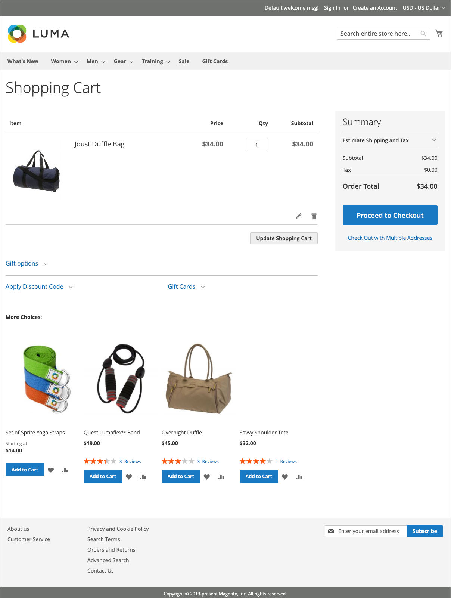

# Was ist die Storefront?

Innerhalb Ihrer Adobe Commerce- oder Magento Open Source-Implementierung ist die Storefront der externe, öffentlich zugängliche Teil Ihres Stores. Es stellt die Inhalte und funktionalen Komponenten bereit, die Ihre Kunden zum Einkaufen und Kaufen verwenden.

Der Weg, den Kunden zu einem Verkauf gehen, wird manchmal als _Zu kaufender Pfad_ und Ihre Storefront enthält die Komponenten, mit denen Kunden diesen Pfad abschließen können. Die folgenden Abschnitte bieten einen Überblick über die grundlegenden Seitentypen, die einen strategischen Wert bieten - die Orte, die Kundinnen und Kunden normalerweise beim Einkaufen in Ihrem Geschäft besuchen. Berücksichtigen Sie bei der Überprüfung verschiedene Store-Funktionen, die in jeder Phase des Kunden-Journey verwendet werden können.

## Startseite

Wussten Sie, dass die meisten Menschen nur ein paar Sekunden auf einer Seite verbringen, bevor sie sich entscheiden, zu bleiben oder woanders hinzugehen? Es dauert nicht lange, einen Eindruck zu hinterlassen. Studien zeigen, dass Menschen auch Fotos lieben, vor allem von anderen Menschen. Unabhängig vom gewählten Design sollte alles auf Ihrer Startseite Besucher zum nächsten Schritt im Verkaufsprozess führen. Die Idee ist, ihre Aufmerksamkeit in einem zusammenhängenden Fluss von einem Punkt des Interesses zum nächsten zu lenken.

{width="700"}

## Katalogseite

Katalogseiten-Listen enthalten in der Regel kleine Produktbilder und Kurzbeschreibungen und können als Liste oder als Raster formatiert werden. Sie können Blöcke, Videos und schlüsselwortreiche Beschreibungen hinzufügen und auch spezielle Designs für eine Promotion oder Saison erstellen. Sie können eine spezielle Kategorie erstellen, um einen Lifestyle oder eine Marke zu präsentieren, die aus einer kuratierten Sammlung von Produkten aus verschiedenen Kategorien besteht.

Die ursprüngliche Produktbeschreibung gibt Käufern in der Regel genügend Informationen, um sie genauer zu betrachten. Wer weiß, was er will, kann das Produkt in den Warenkorb legen und loslegen. Kunden, die bei ihrer Anmeldung einkaufen, profitieren von einem personalisierten Einkaufserlebnis.

{width="700"}

## Suchergebnisse

Wussten Sie, dass Personen, die die Suche verwenden, mit fast doppelt so hoher Wahrscheinlichkeit einen Kauf tätigen wie Personen, die nur auf die Navigation angewiesen sind? Diese Kunden könnten Sie als Kunden betrachten _vorqualifiziert_.

### [!DNL Live Search]

mit [[!DNL Live Search]](https://experienceleague.adobe.com/docs/commerce-merchant-services/live-search/overview.html) Für Adobe Commerce bietet Ihr Store ein schnelles, extrem relevantes und intuitives Sucherlebnis und steht Adobe Commerce ohne zusätzliche Kosten zur Verfügung.

{width="700"}

### Standardkatalogsuche

mit [Standardkatalogsuche](../catalog/search.md), enthält Ihr Store oben rechts ein Suchfeld und in der Fußzeile einen Link zur erweiterten Suche. Alle Suchbegriffe, die Käufer einreichen, werden gespeichert, sodass Sie genau sehen können, wonach sie suchen. Sie können Vorschläge unterbreiten und Synonyme und häufige Rechtschreibfehler eingeben. Zeigen Sie dann eine bestimmte Seite an, wenn ein Suchbegriff eingegeben wird.

{width="700"}

## Produktseite

Auf der Produktseite ist viel los! Das erste, was Sie auf der Produktseite bemerken, ist das Hauptbild mit einem hochauflösenden Zoom und einer Miniaturbildgalerie. Zusätzlich zu den Preisen und der Verfügbarkeit gibt es einen Abschnitt mit Registerkarten mit weiteren Informationen und einer Liste der zugehörigen Produkte.

{width="700"}

## Warenkorb

In den Warenkorb können Sie die Bestellsumme, Rabattgutscheine und geschätzte Versand- und Steuerkosten sowie einen großartigen Ort zur Anzeige Ihrer Vertrauensabzeichen und Siegel bestimmen. Es ist auch eine ideale Gelegenheit, ein letztes Element anzubieten. Als Crosssell können Sie bestimmte Artikel auswählen, die als Impulskauf angeboten werden sollen, sobald ein bestimmter Artikel im Warenkorb erscheint.

{width="700"}

## Kasse

Der Checkout-Prozess besteht aus zwei Schritten:

1. Lieferinformationen

   Der erste Schritt des Checkout-Prozesses besteht darin, dass der Kunde die Informationen zur Lieferadresse ausfüllt und die Versandmethode wählt. Wenn der Kunde über ein Konto verfügt, wird die Lieferadresse automatisch eingegeben, kann aber bei Bedarf geändert werden.
Wenn ein Gast-Kunde eine E-Mail-Adresse eingibt, die als zuvor registriert erkannt wird, wird die Anmeldeaufforderung angezeigt, wenn der [!UICONTROL Enable Guest Checkout Login] -Feld in der Store-Konfiguration auf festgelegt `Yes` (siehe [[!UICONTROL Checkout Options]](../configuration-reference/sales/checkout.md#checkout-options) in der _Konfigurationshandbuch_). Diese Einstellung kann jedoch Kundeninformationen für nicht authentifizierte Benutzer verfügbar machen.

   {width="700"}

1. Prüf- und Zahlungsinformationen

   Der zweite Schritt des Checkout-Prozesses besteht darin, dass der Kunde die Zahlungsmethode auswählt und optional einen Rabattcode anwendet.

   >[!NOTE]
   >
   >obwohl [!DNL Commerce] Ermöglicht die Konfiguration mehrerer Gutscheincodes. Ein Kunde kann nur einen Gutscheincode auf den Warenkorb anwenden. (Siehe [Couponcodes](../merchandising-promotions/price-rules-cart-coupon.md#coupon-codes) für weitere Informationen.)

   {width="700"}

Die Fortschrittsleiste am oberen Seitenrand folgt jedem Schritt des Checkout-Prozesses und der _Bestellzusammenfassung_ Zeigt die bis zu diesem Zeitpunkt eingegebenen Informationen an.

>[!NOTE]
>
>Die Ausnahme für einen zweistufigen Checkout gilt für virtuelle und/oder herunterladbare Produkte. Wenn sich nur diese Produktarten im Warenkorb befinden, wird der Checkout automatisch in einen einstufigen Vorgang umgewandelt, da keine Versandinformationen erforderlich sind.
