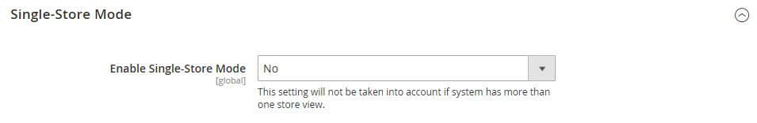

# Site-, Speicher- und Anzeigebereich

Jede Adobe Commerce- und Magento Open Source-Installation verfügt über [Hierarchie](../stores-purchase/stores.md) von Websites, Stores und Store-Ansichten. Der Begriff _Umfang_ bestimmt, wo in der Hierarchie eine Datenbankentität - z. B. ein Produkt, ein Attribut oder eine Kategorie - für ein Inhaltselement oder eine Konfigurationseinstellung gilt. Websites, Stores und Store-Ansichten haben 1:n-Beziehungen zwischen übergeordneten und untergeordneten Elementen. Eine einzelne Installation kann über mehrere Websites verfügen und jede Website kann über mehrere Stores und Store-Ansichten verfügen.

>[!NOTE]
>
>Weitere Informationen finden Sie unter [Mehrere Websites oder Stores](https://experienceleague.adobe.com/docs/commerce-operations/configuration-guide/multi-sites/ms-overview.html?lang=de) in der [!DNL Commerce] Entwicklerdokumentation.

## Websites

Installationen beginnen mit einer einzelnen [Website](../stores-purchase/stores.md#add-websites), die standardmäßig _Haupt-Website_ heißt. Sie können auch mehrere Websites für eine einzelne Installation einrichten, jede mit einer eigenen IP-Adresse und Domain.

## Stores

Eine einzelne Website kann mehrere [Stores](../stores-purchase/stores.md#add-stores) mit jeweils einem eigenen Hauptmenü haben. Die Stores nutzen den Produktkatalog gemeinsam, können jedoch eine andere Auswahl an Produkten und ein anderes Design haben. Alle Geschäfte auf derselben Website teilen sich den Admin und den Checkout.

## Ansichten speichern

Jedes Geschäft, das Kunden zur Verfügung steht, wird entsprechend einer bestimmten _[Ansicht](../stores-purchase/store-views.md)_ präsentiert. Anfänglich hat ein Store nur eine Standardansicht. Es können zusätzliche Store-Ansichten hinzugefügt werden, um verschiedene Sprachen oder für andere Zwecke zu unterstützen. Kunden können die Sprachauswahl in der Kopfzeile verwenden, um die Store-Ansicht zu ändern.

Beachten Sie beim Arbeiten mit Websites, Stores und Store-Ansichten Folgendes:

- Commerce-Instanzen haben ein kaskadierendes Modell: globale →-Website → Store → Store-Ansicht.
- Jede Website verfügt über mindestens eine standardmäßige Store- und Store-Ansicht.
- Jede Shop-Ansicht kann eine andere Basis-URL haben.
- Die Hauptfunktion einer Website ist die Konfiguration von Funktionen auf oberster Ebene.
- Die Hauptfunktion eines Stores ist die Konfiguration der Stammkategorie.
- Die Hauptfunktion einer Store-Ansicht ist die Konfiguration von Übersetzungsinformationen und Währungssymbolen.

## Bereichseinstellungen

Wenn Ihre Adobe Commerce- oder Magento Open Source-Installation eine Hierarchie von Websites, Stores oder Ansichten aufweist, können Sie den Kontext oder _Umfang_ einer Konfigurationseinstellung festlegen. Dem Kontext vieler Datenbankentitäten kann auch ein bestimmter Bereich zugewiesen werden, um zu bestimmen, wie sie in der Speicherhierarchie verwendet werden. Weitere Informationen finden Sie unter [Produktbereich](../catalog/introduction.md#product-scope) und [Preisbereich](../catalog/catalog-price-scope.md).

Einige Konfigurationseinstellungen, z. B. die Postleitzahl, haben einen globalen Gültigkeitsbereich, da im gesamten System derselbe Wert verwendet wird. Der Umfang [Website](../stores-purchase/stores.md#add-websites) gilt für alle Stores unterhalb dieser Ebene in der Hierarchie, einschließlich aller Stores und ihrer Ansichten. Jedes Element mit dem Bereich [Store-Ansicht](../stores-purchase/store-views.md) kann für jede Store-Ansicht, die normalerweise zur Unterstützung mehrerer Sprachen verwendet wird, anders festgelegt werden. Informationen zum Überschreiben der Standardwerte der Konfigurationseinstellungen finden Sie unter [Festlegen des Umfangs](../configuration-reference/scope-change.md#set-the-scope).

Sofern der Store nicht im [Einzelspeichermodus](#single-store-mode) ausgeführt wird, wird der Umfang der einzelnen Konfigurationseinstellungen in kleinem Text unter der Feldbeschriftung angezeigt. Wenn Ihre Installation mehrere Websites, Stores oder Ansichten umfasst, wählen Sie die [Store-Ansicht](../stores-purchase/store-views.md), für die die Einstellungen gelten, bevor Sie Änderungen vornehmen.

{width="550"}

| Umfang | Beschreibung |
|--- |--- |
| [!UICONTROL Global] | Systemweite Einstellungen und Ressourcen, die während der Installation verfügbar sind. |
| [!UICONTROL Website] | Einstellungen und Ressourcen, die auf die aktuelle Website beschränkt sind. Jede Website verfügt über einen Standardspeicher. |
| [!UICONTROL Store] | Einstellungen und Ressourcen, die auf den aktuellen Store beschränkt sind. Jeder Store verfügt über eine standardmäßige Stammkategorie (Hauptmenü) und eine standardmäßige Store-Ansicht. |
| [!UICONTROL Store View] | Einstellungen und Ressourcen, die auf die aktuelle Store-Ansicht beschränkt sind. |

{style="table-layout:auto"}

## Einzelspeichermodus

Wenn Ihre Commerce-Installation nur über eine einzige Store- und Store-Ansicht verfügt, können Sie die Anzeige vereinfachen, indem Sie alle Store-Ansichtsoptionen und Bereichsindikatoren deaktivieren. Der Einzelspeichermodus wird überschrieben, wenn Sie [weitere Store-Ansichten hinzufügen](../stores-purchase/store-views.md) später.

{width="550"}

1. Navigieren Sie in _Admin_-Seitenleiste zu **[!UICONTROL Stores]** > _[!UICONTROL Settings]_>**[!UICONTROL Configuration]**.

1. Scrollen Sie unter **[!UICONTROL General]** nach unten zum Seitenende und erweitern Sie den **[!UICONTROL Single-Store Mode]**.

1. Legen Sie **[!UICONTROL Enable Single-Store Mode]** auf `Yes` fest.

   {width="400"}

1. Klicken Sie auf **[!UICONTROL Save Config]**.

1. Wenn Sie aufgefordert werden, den Cache zu aktualisieren, führen Sie die folgenden Schritte aus:

   - Klicken Sie oben auf der Seite in der Systemmeldung auf den Link **[!UICONTROL Cache Management]** .

     {width="600" zoomable="yes"}

   - Aktivieren Sie das Kontrollkästchen **[!UICONTROL Page Cache]** .

   - Klicken Sie bei **[!UICONTROL Actions]** Einstellung auf `Refresh` auf **[!UICONTROL Submit]**
