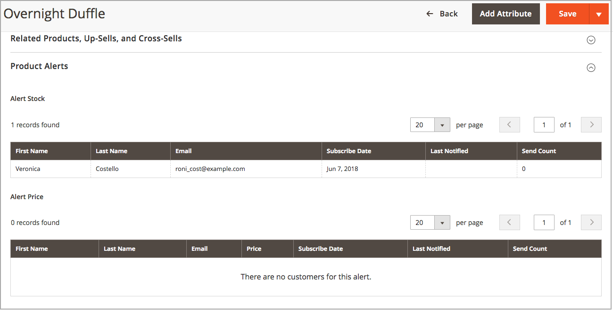

# Produktwarnungen

Kunden können zwei Arten von Warnungen per E-Mail abonnieren: Preisänderungswarnungen und Warnungen auf Lager. Für jeden Warnhinweistyp können Sie bestimmen, ob Kunden sich anmelden können, die verwendete E-Mail-Vorlage auswählen und den Absender der E-Mail identifizieren.

{width="600" zoomable="yes"}

## Preisänderungswarnungen

Wenn Preisänderungswarnungen aktiviert sind, benachrichtigen Sie mich mit einem _Benachrichtigung, wenn der Preisrückgang_ -Link auf jeder Produktseite angezeigt wird. Kunden können auf den Link klicken, um Warnhinweise zum Produkt zu abonnieren. Die Gäste werden aufgefordert, ein Konto bei Ihrem Geschäft zu öffnen. Wenn sich der Preis ändert oder das Produkt Sonderangebote erhält jeder, der sich für den Warnhinweis angemeldet hat, eine E-Mail-Warnung.

## In-Stock-Warnhinweise

Der Warnhinweis auf Lager erstellt einen Link mit dem Namen _Benachrichtigen Sie mich, wenn dieses Produkt vorrätig ist_ für jedes Produkt, das nicht vorrätig ist. Kunden können auf den Link klicken, um den Warnhinweis zu abonnieren. Wenn das Produkt wieder auf Lager ist, erhalten Kunden eine E-Mail-Benachrichtigung, dass das Produkt verfügbar ist. Produkte mit Warnhinweisen verfügen im Bereich &quot;Produktinformationen&quot;über die Registerkarte _Produktwarnungen_ , auf der die Kunden aufgelistet sind, die sich für einen Warnhinweis angemeldet haben.

{width="600" zoomable="yes"}

## Produktwarnungen einrichten

1. Wechseln Sie in der Seitenleiste _Admin_ zu **[!UICONTROL Stores]** > _[!UICONTROL Settings]_>**[!UICONTROL Configuration]**.

1. Erweitern Sie im linken Bedienfeld den Wert **[!UICONTROL Catalog]** und wählen Sie unter &quot;**[!UICONTROL Catalog]**&quot;.

1. Klicken Sie auf , um den Abschnitt _[!UICONTROL Product Alerts]_zu erweitern, und führen Sie die folgenden Schritte aus:

   {width="600" zoomable="yes"}

   - Um Ihren Kunden Preisänderungswarnungen anzubieten, setzen Sie **[!UICONTROL Allow Alert When Product Price Changes]** auf `Yes`.

   - Setzen Sie **[!UICONTROL Price Alert Email Template]** auf die Vorlage, die Sie für die Preiswarnbenachrichtigungen verwenden möchten.

   - Um Warnhinweise anzubieten, wenn nicht vorrätige Produkte wieder verfügbar sind, setzen Sie **[!UICONTROL Allow Alert When Product Comes Back in Stock]** auf `Yes`.

     >[!NOTE]
     >
     >Die Meldung _Benachrichtigen Sie mich, wenn dieses Produkt auf Lager ist_ wird nur angezeigt, wenn **[!UICONTROL Display Out of Stock Products]** auf `Yes` gesetzt ist (in der Konfiguration unter [!UICONTROL Catalog] > [!UICONTROL Inventory]).

   - Legen Sie **[!UICONTROL Stock Alert Email Template]** auf die Vorlage fest, die Sie für Warnungen zum Produktbestand verwenden möchten.

   - Setzen Sie **[!UICONTROL Alert Email Sender]** auf den [store contact](../getting-started/store-details.md#store-email-addresses){target="_blank"} , den Sie als Absender des E-Mail-Warnhinweises anzeigen möchten. Weiterführende Informationen zu [E-Mail-Adressen speichern](../configuration-reference/general/store-email-addresses.md){target="_blank"} finden Sie im Benutzerhandbuch zum Kern-Design.

1. Klicken Sie nach Abschluss des Vorgangs auf **[!UICONTROL Save Config]**.

## E-Mail-Vorlagen für Produktwarnungen konfigurieren

Konfigurieren, hinzufügen oder ändern Sie anschließend die E-Mail-Vorlage für Ihren Preiswarnhinweis. Sie können Ihre Preiswarnungs-Konfigurationen nach der Erstellung zusätzlicher Vorlagen bearbeiten.

Weitere Informationen zur Verwendung von E-Mail-Nachrichten finden Sie unter [Nachrichtenvorlagen](../systems/email-template-custom.md#message-templates) im _Administratorsystemhandbuch_.

1. Wechseln Sie in der Seitenleiste _Admin_ zu **[!UICONTROL Marketing]** > _[!UICONTROL Communications]_>**[!UICONTROL Email Templates]**.

1. Klicken Sie auf **[!UICONTROL Add New Template]**.

1. Wählen Sie unter _Standardvorlage laden_ die **[!UICONTROL Template]** aus, die Sie anpassen möchten.

   Sie können die in Ihrem Design enthaltene Warnhinweisvorlage auswählen. Oder Sie können die Vorlagen `Price Alert` oder `Stock Alert` unter _[!UICONTROL Magento_PriceAlert]_auswählen.

1. Klicken Sie auf **[!UICONTROL Load Template]**.

1. Geben Sie einen **[!UICONTROL Template Name]** ein.

   Sie können diesen Namen in der Konfiguration _Preiswarnungen_ auswählen.

1. Lesen Sie den vorhandenen Inhalt durch und nehmen Sie bei Bedarf Änderungen für Folgendes vor:

   | Feld | Beschreibung |
   | ----- | ----- |
   | [!UICONTROL Template Subject] | Dieser Text wird in der Betreffzeile einer E-Mail angezeigt. |
   | [!UICONTROL Template Content] | Dieser Text wird im vollständigen Inhalt der gesendeten E-Mail angezeigt. |

1. Um generierte Informationen aus [!DNL Commerce] -Daten hinzuzufügen, verwenden Sie die Option **[!UICONTROL Insert Variable]** , um eine Liste der verfügbaren Variablen zu verwenden.

1. Klicken Sie auf **[!UICONTROL Save Template]**.

## Ausführungseinstellungen für Produktwarnungen

Mit diesen Einstellungen können Sie festlegen, wie oft [!DNL Commerce] nach Änderungen sucht, für die Warnungen gesendet werden müssen. Sie können auch Empfänger, Absender und Vorlagen für E-Mails auswählen, die gesendet werden, wenn das Senden von Warnungen fehlschlägt.

{width="600" zoomable="yes"}

1. Wechseln Sie in der Seitenleiste _Admin_ zu **[!UICONTROL Stores]** > _[!UICONTROL Settings]_>**[!UICONTROL Configuration]**.

1. Erweitern Sie im linken Bedienfeld den Wert **[!UICONTROL Catalog]** und wählen Sie unter &quot;**[!UICONTROL Catalog]**&quot;.

1. Erweitern Sie  im Abschnitt **[!UICONTROL Product Alerts Run Settings]** .

1. Um zu bestimmen, wie oft Produktanwarnungen gesendet werden, setzen Sie **[!UICONTROL Frequency]** auf einen der folgenden Werte:

   - `Daily`
   - `Weekly`
   - `Monthly`

1. Um die Tageszeit zu bestimmen, zu der Produktwarnungen gesendet werden, setzen Sie **[!UICONTROL Start Time]** auf die Stunde, Minute und Sekunde.

   >[!NOTE]
   >
   >Produktwarnungen werden vom Verbraucher &quot;product_alert&quot;gesendet.

1. Geben Sie für &quot;**[!UICONTROL Error Email Recipient]**&quot; die E-Mail-Adresse der Person ein, die kontaktiert werden soll, wenn ein Fehler auftritt.

1. Wählen Sie für den Wert &quot;**[!UICONTROL Error Email Sender]**&quot;die Store-Identität aus, die als Absender der Fehlerbenachrichtigung angezeigt wird.

1. Setzen Sie **[!UICONTROL Error Email Template]** auf die Transaktions-E-Mail-Vorlage, die für die Fehlerbenachrichtigung verwendet werden soll.

1. Klicken Sie nach Abschluss des Vorgangs auf **[!UICONTROL Save Config]**.
