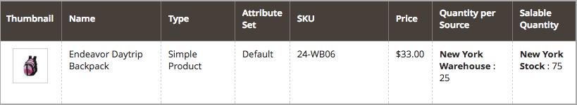

# Konfigurieren [!DNL Inventory Management] Auftragsrückständen

Nachbestellungen ermöglichen es Ihrem Geschäft, weiterhin Produkte zu verkaufen, nachdem die Menge null erreicht hat oder effektiv nicht vorrätig ist. Wenn es sich bei einer Kundenbestellung um eine Nachbestellung handelt, werden die Gelder sofort autorisiert und erfasst, der Verarbeitungsstatus der Bestellung ändert sich nicht und der Versand bleibt solange zurückgestellt, bis Lagerbestand verfügbar ist.

Abhängig von Ihrem Geschäft und Ihren Verkäufen können Sie Nachbestellungen auf den folgenden Ebenen aktivieren oder deaktivieren:

- **[!UICONTROL Global]** - Alle Produkte in Ihrem Katalog auf Site-Ebene

- **[!UICONTROL Product]** - Bestimmte Produkte überschreiben die Einstellungen für Site, Quelle und Lager

## Hintergrundeinstellungen verstehen

Es wird dringend empfohlen, bestimmte Schwellenwerte und Einstellungen so zu konfigurieren, dass Rückstände optimal unterstützt werden.

### Schwellenwert für nicht vorrätige Artikel

Verwenden Sie einen negativen Wert für diesen Schwellenwert, um die maximale Anzahl von Produkten festzulegen, die nachbestellt werden können, bevor das Produkt wirklich als nicht vorrätig angesehen wird. Dieser Betrag erhöht die verkaufsfähige Menge. Der auf Produktebene festgelegte Wert überschreibt jeden auf globaler Ebene festgelegten Wert.

Die Formel für die verkaufsfähige Menge ist `(Quantity - (Out-of-Stock Threshold))`.

Im Folgenden finden Sie ein Beispiel:

- Menge: 25
- Für Menge unten benachrichtigen: 10
- Nur noch x Schwellenwert: 5
- Schwellenwert für nicht vorrätige Artikel: -50

Die Verkaufsmenge für dieses Produkt ist `75 (25 - (-50))`.

{width="600" zoomable="yes"}

{width="600" zoomable="yes"}

Wenn Kunden die verfügbaren 25 Produkte kaufen, gehen neue Bestellungen als Nachbestellungen ein. Da die Verkaufsmenge des Produkts auf 5 reduziert wird (70 Artikel wurden verkauft), zeigt die _Produkt_-Seite eine `Only 5 left` an der Storefront an. Wenn die verkaufsfähige Menge `0` erreicht, wird das Produkt als `Out of Stock` in der Storefront angezeigt.

>[!NOTE]
>
>Wenn ein Kunde einen Auftrag mit _[!UICONTROL backorder qty]_&#x200B;aufgibt, zieht [!DNL Inventory Management] die Menge automatisch von der verkaufsfähigen Menge ab. Wenn ein Auftrag nicht versendet und storniert wird, wird die Menge auf die aggregierte virtuelle Verkaufsmenge zurückgesetzt. Die **_stornierte Bestellmenge wird keiner der Quellen zugeordnet_**&#x200B;sondern an die Gesamtzahl der zum Verkauf verfügbaren Produkte zurückgegeben (_[!UICONTROL Salable Quantity]_ Spalte im Produktraster).

<!--### Notify for Quantity Below JIRA MDVA-8099 MDVA-33783

The _Notify for Quantity Below_ configuration option is configurable at the global, source, and product levels. When it is enabled, the system sends an email notification when the product quantity reaches a level at or below the configured value. For this example, a notification is triggered when the product has a quantity of 10 or less. When backorders are enabled, _Notify for Quantity Below_ is determined by the Salable Quantity (`Salable Quantity = Quantity - (Out-of-Stock Threshold)`). -->

### Bestandsstatus

Produkte müssen beim Aktivieren von Auftragsrückständen auf den Status `In Stock` gesetzt werden. Sie können diesen Wert auf der Seite _Produkt_ festlegen. Bei Händlern mit mehreren Quellen muss mindestens eine Quelle als `In Stock` markiert sein. Greifen Sie auf die Seite _Produkt“ und das Raster_ Quellen _zu und legen Sie den Status_.

## Globale Konfiguration der Nachbestellungen

Diese Schritte ermöglichen Rückbestellungen für alle Produkte auf Site-Ebene.

1. Navigieren Sie in _Admin_-Seitenleiste zu **[!UICONTROL Stores]** > _[!UICONTROL Settings]_>**[!UICONTROL Configuration]**.

1. Legen Sie **[!UICONTROL Store View]** auf `Default Config` fest.

1. Erweitern Sie im linken Bereich **[!UICONTROL Catalog]** und wählen Sie **[!UICONTROL Inventory]**.

1. Erweitern Sie  **[!UICONTROL Product Stock Options]**.

1. Deaktivieren Sie **[!UICONTROL Backorders]** das Kontrollkästchen **[!UICONTROL Use system value]** und wählen Sie eine Option aus:

   | Option | Beschreibung |
   | -- | -- |
   | `No Backorders` | Keine Rückstände akzeptieren, wenn das Produkt nicht vorrätig ist. |
   | `Allow Qty Below 0` | Rückstände annehmen, wenn die Menge unter null fällt. |
   | `Allow Qty Below 0 and Notify Customer` | Rückstände zu akzeptieren, wenn die Menge unter null fällt, und dem Kunden mitzuteilen, dass die Bestellung noch aufgegeben werden kann. |

1. Deaktivieren Sie **[!UICONTROL Out-of-Stock Threshold]** das Kontrollkästchen **[!UICONTROL Use system value]** und geben Sie einen anderen Betrag ein.

   | Wert | Beschreibung |
   | -- | -- |
   | Positiver Betrag | Geben Sie bei deaktivierter Nachbestellung einen positiven Wert ein. |
   | Null | Wenn Nachbestellungen aktiviert sind, ermöglicht die Eingabe von `0` unendliche Nachbestellungen. |
   | Negativer Betrag | Bei aktivierten Rückständen wird die Eingabe eines negativen Werts empfohlen. Der Betrag wird der Verkaufsmenge hinzugefügt. Geben Sie beispielsweise `-50` ein, um Bestellungen bis zu diesem Betrag zuzulassen. |

1. Klicken Sie auf **[!UICONTROL Save Config]**.

## Konfigurieren von Nachbestellungen für ein Produkt

Konfigurationen auf Produktebene überschreiben globale Konfigurationen. Möglicherweise möchten Sie Nachbestellungen auf Produktebene konfigurieren, um die Einstellungen auf globaler Store- oder Quellebene zu überschreiben. Ihr Store unterstützt beispielsweise global Auftragsrückstände. Mit Produkteinstellungen können Sie Auftragsrückstände deaktivieren oder den Schwellenwert für nicht vorrätige Artikel ändern, ohne andere Produkte und Quellen zu beeinflussen.

1. Navigieren Sie in der _Admin_-Seitenleiste zu **[!UICONTROL Catalog]** > **[!UICONTROL Products]**.

1. Öffnen Sie ein Produkt im **[!UICONTROL Edit]**-Modus und blättern Sie auf der Seite nach unten zum Bereich _[!UICONTROL Sources]_.

   Bei Produkten, die ohne [!DNL Inventory Management] konfiguriert wurden, wird die Registerkarte nicht angezeigt. Die Schaltfläche `Advanced Inventory` wird unter dem Feld _[!UICONTROL Quantity]_&#x200B;angezeigt.

1. Klicken Sie auf **[!UICONTROL Advanced Inventory]**.

   Diese Aktion zeigt eine Seite mit produktspezifischen Konfigurationen an. Jede Einstellung, die als `global` aufgeführt ist, zeigt die aktuelle globale Einstellung für den Store an.

1. Deaktivieren Sie **[!UICONTROL Backorders]** das Kontrollkästchen **[!UICONTROL Use Config Setting]** und wählen Sie eine Option aus:

   | Option | Beschreibung |
   | -- | -- |
   | `No Backorders` | Keine Rückstände akzeptieren, wenn das Produkt nicht vorrätig ist. |
   | `Allow Qty Below 0` | Rückstände annehmen, wenn die Menge unter null fällt. |
   | `Allow Qty Below 0 and Notify Customer` | Rückstände zu akzeptieren, wenn die Menge unter null fällt, und dem Kunden mitzuteilen, dass die Bestellung noch aufgegeben werden kann. |

1. Deaktivieren Sie **[!UICONTROL Out-of-Stock Threshold]** das Kontrollkästchen **[!UICONTROL Use Config Setting]** und geben Sie einen Betrag ein:

   | Wert | Beschreibung |
   | -- | -- |
   | Positiver Betrag | Geben Sie bei deaktivierter Nachbestellung einen positiven Wert ein. |
   | Null | Wenn Nachbestellungen aktiviert sind, ermöglicht die Eingabe von `0` unendliche Nachbestellungen. |
   | Negativer Betrag | Bei aktivierten Rückständen wird die Eingabe eines negativen Werts empfohlen. Der Betrag wird der Verkaufsmenge hinzugefügt. Geben Sie beispielsweise `-50` ein, um Bestellungen bis zu diesem Wert zuzulassen. |

   {width="600" zoomable="yes"}

1. Klicken Sie auf **[!UICONTROL Done]** und dann auf **[!UICONTROL Save]**.
