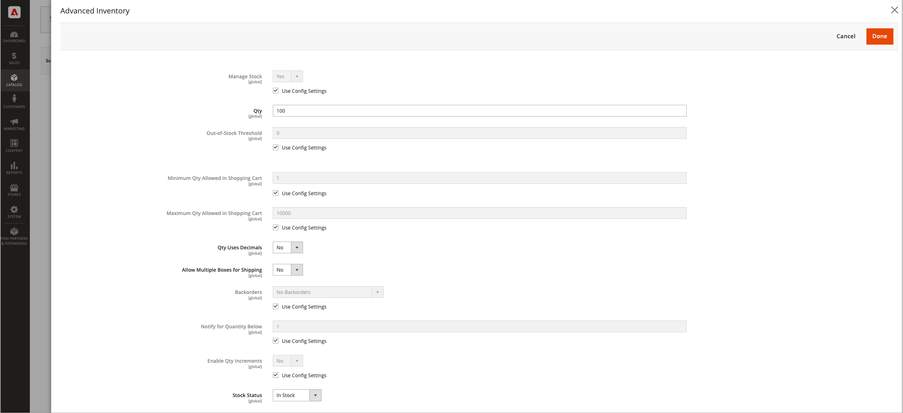

# Konfigurieren von [!DNL Inventory Management] -Rückständen

Rückaufträge ermöglichen es Ihrem Geschäft, Produkte weiter zu verkaufen, nachdem die Menge null erreicht oder praktisch nicht vorrätig ist. Wenn eine Kundenbestellung ein Rückstand ist, werden die Mittel sofort genehmigt und erfasst, der Bearbeitungsstatus der Bestellung ändert sich nicht und der Versand bleibt solange auf Lager, bis ein Lager verfügbar ist.

Abhängig von Ihrem Store und Ihrem Vertrieb können Sie die Rückorder auf den folgenden Ebenen aktivieren oder deaktivieren:

- **[!UICONTROL Global]** - Alle Produkte in Ihrem Katalog auf Site-Ebene

- **[!UICONTROL Product]** - Bestimmte Produkte überschreiben Einstellungen für Site, Quelle und Lager

## Hintergrundeinstellungen verstehen

Es wird dringend empfohlen, bestimmte Schwellenwerte und Einstellungen so zu konfigurieren, dass Rückstände optimal unterstützt werden.

### Schwellenwert für nicht auf Lager

Verwenden Sie einen negativen Wert für diese Schwelle, um die maximale Menge von Produkten festzulegen, die zurückbestellt werden können, bevor das Produkt tatsächlich als nicht vorrätig betrachtet wird. Dieser Betrag erhöht die Verkaufsmenge. Der auf Produktebene festgelegte Wert setzt alle Werte außer Kraft, die auf globaler Ebene festgelegt wurden.

Die Formel für die Verkaufsmenge lautet `(Quantity - (Out-of-Stock Threshold))`.

Im Folgenden finden Sie ein Beispiel:

- Menge: 25
- Meldung für die nachstehende Menge: 10
- Nur X linke Schwelle: 5
- Nicht vorrätiger Schwellenwert: -50

Die Verkaufsmenge für dieses Produkt ist `75 (25 - (-50))`.

{width="600" zoomable="yes"}

{width="600" zoomable="yes"}

Wenn Kunden die 25 verfügbaren Produkte kaufen, werden neue Bestellungen als Rückbestellungen erfasst. Da sich die Verkaufsmenge des Produkts auf 5 verringert (70 Artikel wurden verkauft), zeigt die Seite _Produkt_ eine Meldung `Only 5 left` auf der Storefront an. Wenn die Verkaufsmenge `0` erreicht, wird das Produkt in der Storefront als `Out of Stock` angezeigt.

>[!NOTE]
>
>Wenn ein Kunde eine Bestellung mit _[!UICONTROL backorder qty]_aufgibt, subtrahiert [!DNL Inventory Management] automatisch die Menge von der verkaufbaren Menge. Wenn eine Bestellung nicht versandt und storniert wird, kehrt die Menge zur aggregierten virtuellen Verkaufsmenge zurück. Die **_stornierte Bestellmenge wird keiner der Quellen_**zugeordnet, sondern wird an die Gesamtzahl der zum Verkauf stehenden Produkte zurückgegeben (_[!UICONTROL Salable Quantity]_ Spalte im Produktraster).

<!--### Notify for Quantity Below JIRA MDVA-8099 MDVA-33783

The _Notify for Quantity Below_ configuration option is configurable at the global, source, and product levels. When it is enabled, the system sends an email notification when the product quantity reaches a level at or below the configured value. For this example, a notification is triggered when the product has a quantity of 10 or less. When backorders are enabled, _Notify for Quantity Below_ is determined by the Salable Quantity (`Salable Quantity = Quantity - (Out-of-Stock Threshold)`). -->

### Lagerstatus

Produkte müssen beim Aktivieren von Rückständen auf den Status `In Stock` gesetzt werden. Sie können diesen Wert auf der Seite _Produkt_ festlegen. Bei Händlern mit mehreren Quellen muss mindestens eine Quelle als `In Stock` gekennzeichnet sein. Greifen Sie über die Seite _Produkt_ auf den Status zu und legen Sie ihn fest und weisen Sie das Raster _Quellen_ zu.

## Globale Konfiguration von Rückständen

Diese Schritte ermöglichen Rückläufe für alle Produkte auf Site-Ebene.

1. Wechseln Sie in der Seitenleiste _Admin_ zu **[!UICONTROL Stores]** > _[!UICONTROL Settings]_>**[!UICONTROL Configuration]**.

1. Setzen Sie **[!UICONTROL Store View]** auf `Default Config`.

1. Erweitern Sie im linken Bereich den Wert **[!UICONTROL Catalog]** und wählen Sie **[!UICONTROL Inventory]** aus.

1. Erweitern Sie  **[!UICONTROL Product Stock Options]**.

1. Deaktivieren Sie für **[!UICONTROL Backorders]** das Kontrollkästchen **[!UICONTROL Use system value]** und wählen Sie eine Option aus:

   | Option | Beschreibung |
   | -- | -- |
   | `No Backorders` | Nicht akzeptieren von Rückständen, wenn das Produkt nicht vorrätig ist. |
   | `Allow Qty Below 0` | Zu akzeptieren Rückstände, wenn die Menge unter null fällt. |
   | `Allow Qty Below 0 and Notify Customer` | Nachbestellungen zu akzeptieren, wenn die Menge unter null fällt, und den Kunden darüber zu informieren, dass die Bestellung noch aufgegeben werden kann. |

1. Deaktivieren Sie für **[!UICONTROL Out-of-Stock Threshold]** das Kontrollkästchen **[!UICONTROL Use system value]** und geben Sie einen anderen Betrag ein.

   | Wert | Beschreibung |
   | -- | -- |
   | Positiver Betrag | Geben Sie bei deaktivierten Rückständen einen positiven Wert ein. |
   | Null | Wenn Rückorder aktiviert sind, ermöglicht die Eingabe von `0` unendliche Rückstände. |
   | Negativer Betrag | Bei aktivierten Rückständen wird die Eingabe eines negativen Werts empfohlen. Der Betrag wird der Verkaufsmenge hinzugefügt. Geben Sie beispielsweise `-50` ein, um Bestellungen bis zu diesem Betrag zuzulassen. |

1. Klicken Sie auf **[!UICONTROL Save Config]**.

## Konfigurieren von Rückständen für ein Produkt

Konfigurationen auf Produktebene überschreiben globale Konfigurationen. Möglicherweise möchten Sie Rückorder auf Produktebene konfigurieren, um die Einstellungen auf globaler Store- oder Quellebene zu überschreiben. Ihr Store unterstützt beispielsweise möglicherweise global Backorder. Mit den Produkteinstellungen können Sie Rückstände deaktivieren oder den Schwellenwert für &quot;Nicht auf Lager&quot;ändern, ohne andere Produkte und Quellen zu beeinträchtigen.

1. Wechseln Sie in der Seitenleiste _Admin_ zu **[!UICONTROL Catalog]** > **[!UICONTROL Products]**.

1. Öffnen Sie ein Produkt im Modus **[!UICONTROL Edit]** und scrollen Sie die Seite nach unten zum Bereich _[!UICONTROL Sources]_.

   Bei Produkten, die ohne [!DNL Inventory Management] konfiguriert wurden, wird die Registerkarte nicht angezeigt. Die Schaltfläche `Advanced Inventory` wird unter dem Feld _[!UICONTROL Quantity]_angezeigt.

1. Klicken Sie auf **[!UICONTROL Advanced Inventory]**.

   Diese Aktion zeigt eine Seite mit produktspezifischen Konfigurationen an. Jede Einstellung, die als &quot;`global`&quot;aufgeführt ist, zeigt die aktuelle globale Einstellung für den Store an.

1. Deaktivieren Sie für **[!UICONTROL Backorders]** das Kontrollkästchen **[!UICONTROL Use Config Setting]** und wählen Sie eine Option aus:

   | Option | Beschreibung |
   | -- | -- |
   | `No Backorders` | Nicht akzeptieren von Rückständen, wenn das Produkt nicht vorrätig ist. |
   | `Allow Qty Below 0` | Zu akzeptieren Rückstände, wenn die Menge unter null fällt. |
   | `Allow Qty Below 0 and Notify Customer` | Nachbestellungen zu akzeptieren, wenn die Menge unter null fällt, und den Kunden darüber zu informieren, dass die Bestellung noch aufgegeben werden kann. |

1. Deaktivieren Sie für **[!UICONTROL Out-of-Stock Threshold]** das Kontrollkästchen **[!UICONTROL Use Config Setting]** und geben Sie einen Betrag ein:

   | Wert | Beschreibung |
   | -- | -- |
   | Positiver Betrag | Geben Sie bei deaktivierten Rückständen einen positiven Wert ein. |
   | Null | Wenn Rückorder aktiviert sind, ermöglicht die Eingabe von `0` unendliche Rückstände. |
   | Negativer Betrag | Bei aktivierten Rückständen wird die Eingabe eines negativen Werts empfohlen. Der Betrag wird der Verkaufsmenge hinzugefügt. Geben Sie beispielsweise `-50` ein, um Bestellungen bis zu diesem Betrag zuzulassen. |

   {width="600" zoomable="yes"}

1. Klicken Sie auf **[!UICONTROL Done]** und dann auf **[!UICONTROL Save]**.
