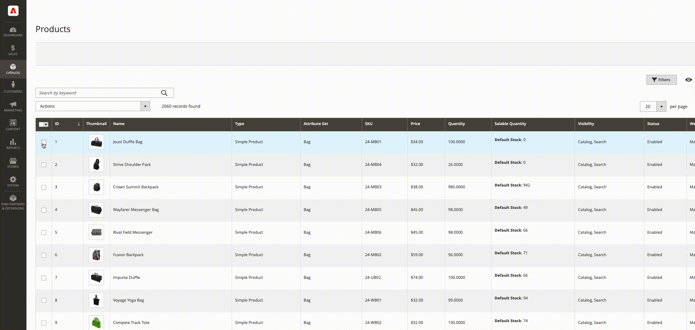

# Massenzuweisung und Aufhebung der Zuweisung von Quellen

Verwenden Sie das Tool _Quellen zuweisen_, um eine oder mehrere Quellen zu Ihren Produkten hinzuzufügen. Das Tool hilft beim Erstellen und Zuweisen benutzerdefinierter Quellen zu Ihrem Standard- oder benutzerdefinierten Lager und beim Vorbereiten neuer Standorte und Inventare.

Nach dem Hinzufügen neuer benutzerdefinierter Quellen können Sie [Lagermengen pro Produkt](quantities-assign-per-product.md) oder für mehrere Produkte über den Administrator oder mithilfe der [Importfunktion](inventory-import-export.md) hinzufügen.

## Zuweisen von Quellen und Mengen

1. Navigieren Sie in der _Admin_-Seitenleiste zu **[!UICONTROL Catalog]** > **[!UICONTROL Products]**.

1. Wählen Sie die Produkte aus, für die Sie die Quellen ändern möchten.

   Suchen Sie nach den Produkten und aktivieren Sie diese Kontrollkästchen.

1. Klicken Sie oben auf das **[!UICONTROL Actions]** und wählen Sie **[!UICONTROL Assign Inventory Source]** aus.

1. Klicken Sie im Bestätigungsdialogfeld auf **[!UICONTROL OK]** .

1. Aktivieren Sie die Kontrollkästchen für alle Quellen, die Sie den Produkten hinzufügen möchten.

1. Klicken Sie auf **[!UICONTROL Assign Sources]**.

   {width="600" zoomable="yes"}

Die Quellen werden den Produkten mit einer Lagermenge von 0 hinzugefügt. Sie können [Lagermengen](quantities-assign-per-product.md) pro Quelle hinzufügen.

## Zuordnung von Quellen und Mengen aufheben

Wenn Sie die Zuweisung einer Quelle zu einem Produkt aufheben, geben Sie an, dass das Produkt nicht mehr an diesem Speicherort vorrätig ist. Dieser Prozess löscht alle Inventardaten für eine Quelle, die dem Produkt derzeit zugewiesen ist. Wenn Sie das vorhandene Inventar an einen neuen Speicherort verschieben möchten, sollten Sie die Option _Inventar übertragen_ verwenden.

{{$include /help/_includes/unassign-source.md}}

Es wird dringend empfohlen, alle Bestellungen und Sendungen für diese Produkte abzuschließen, bevor Sie die Quelle entfernen.

1. Navigieren Sie in der _Admin_-Seitenleiste zu **[!UICONTROL Catalog]** > **[!UICONTROL Products]**.

1. Wählen Sie die Produkte aus, deren Quellen Sie ändern möchten.

   Suchen Sie nach den Produkten und aktivieren Sie diese Kontrollkästchen.

1. Klicken Sie oben auf das **[!UICONTROL Actions]** und wählen Sie **[!UICONTROL Unassign Inventory Source]** aus.

1. Klicken Sie im Bestätigungsdialogfeld auf **[!UICONTROL OK]** .

1. Wählen Sie die Quelle aus, die Sie aus den Produkten entfernen möchten.

   Auf der Seite wird ein Warnhinweis angezeigt, mit dem beim Aufheben der Zuweisung alle spezifischen Quell- und Mengendaten aus dem Produkt entfernt werden.

1. Klicken Sie auf **[!UICONTROL Unassign Sources]**.

   {width="600" zoomable="yes"}
