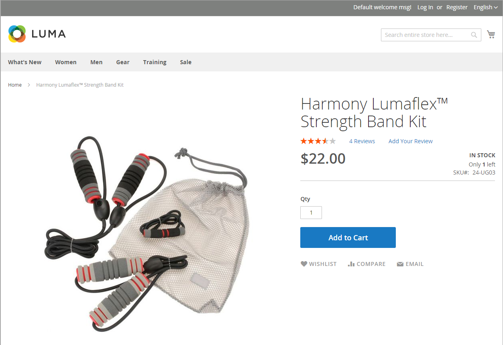

# Konfigurieren von [!DNL Inventory Management]

Das Modul [!DNL Inventory Management] unterstützt Inventarkonfigurationseinstellungen auf Produkt- und globaler Ebene und bietet außerdem zusätzliche Einstellungen, die sich auf die Quellverfügbarkeit, Storefront-Produkte und den Versand von Bestellungen auswirken. Die Konfigurationseinstellungen gelten für:

- Der gesamte Katalog: Gehen Sie zu **[!UICONTROL Stores]** > _[!UICONTROL Settings]_>**[!UICONTROL Configuration]**. Erweitern Sie dann **[!UICONTROL Catalog]**im linken Bereich und wählen Sie **[!UICONTROL Inventory]**aus.

- Bestimmte Produkte: Gehen Sie zu &quot;**[!UICONTROL Catalog]**&quot;> &quot;**[!UICONTROL Products]**&quot;. Öffnen Sie dann das Produkt im Bearbeitungsmodus und klicken Sie im Abschnitt _[!UICONTROL Sources]_auf **[!UICONTROL Advanced Inventory]**.

Ihr Katalog kann so konfiguriert werden, dass er Bestandsdaten in Ihrer Storefront anzeigt, aktive Warenkörbe verwaltet und vieles mehr. Zeigen Sie die Verfügbarkeit jedes Elements als _Auf Lager_ oder _Nicht auf Lager_ an und den verfügbaren Bestand, wenn der Bestand niedrig ist.

Die &quot;Nicht vorrätig&quot;-Schwelle gibt an, wann ein Produkt neu angeordnet werden soll, von der &quot;Verkaufte Menge&quot;für ein Lager abgezogen und auf die Unterstützung von aktivierten oder deaktivierten Rückständen eingestellt werden kann. Lassen Sie für Ihren Store Aufstockungen zu, indem Sie eine maximale Anzahl von Bestellungen für alle oder bestimmte Produkte festlegen.

Eine andere Möglichkeit, den Schwellenwert für die Lagerverfügbarkeit zu nutzen, besteht darin, Produkte zu verwalten, die stark nachgefragt sind. Wenn Sie neue Kunden erfassen möchten, anstatt an Käufer mit hoher Menge zu verkaufen, können Sie eine Höchstmenge festlegen, um zu verhindern, dass ein einzelner Käufer Ihren gesamten Bestand ausnimmt.

## Konfigurationsoptionen

[!DNL Commerce] Stores und Produkte unterstützen die folgenden Konfigurationen zum Verwalten von Produkten, Inventaren, Benachrichtigungen und mehr. [!DNL Commerce] bietet zusätzliche Konfigurationseinstellungen für Massenaktionen und den Algorithmus &quot;Distance Priority&quot;.

| Option | Beschreibung |
|--|--|
| [!UICONTROL Manage Stock] | Ermöglicht [!DNL Commerce] die Verwaltung des gesamten Bestands. Legen Sie fest, ob die Bestandskontrolle für dieses Produkt oder alle Produkte in [!DNL Commerce] verwendet wird. Zeigt weitere Optionen an, wenn auf &quot;`Yes`&quot;festgelegt. |
| [!UICONTROL Only X left Threshold] | Legt eine Menge fest, die benachrichtigt wird, wenn ein bestimmter Betrag zum Kauf verfügbar bleibt. Dieser Betrag wird auf Lagerebene nachverfolgt. |
| [!UICONTROL Out-of-Stock Threshold] | Ihre Sicherheitsvorräte, die Menge an Trigger und die Meldung von Nichtvorräten, um das Risiko von Lagervorräten zu verringern. Dieser Wert wirkt sich auf Rückstände aus. Optionen: **[!UICONTROL No Backorders]**: Akzeptiert keine Rückstände, wenn das Produkt nicht vorrätig ist. **[!UICONTROL Allow Qty Below 0]**: Akzeptiert Rückstände, wenn die Menge unter null fällt. **[!UICONTROL Allow Qty Below 0 and Notify Customer]**: Akzeptiert Rückaufträge, wenn die Menge unter null fällt, benachrichtigt Kunden jedoch darüber, dass Bestellungen weiterhin aufgegeben werden können.  **[!UICONTROL Backorders disabled]**: Es wird empfohlen, einen positiven Wert über 0 einzugeben, z. B. 5 oder 25.  **[!UICONTROL Backorders enabled]**: Geben Sie einen negativen Schwellenwert für die maximal zulässige Anzahl von Rückständen ein, z. B. -5 oder -25. Der Wert 0 dient als unendlicher Bestand. Ein positiver Wert wird ignoriert und als 0 behandelt. |
| [!UICONTROL Minimum Qty Allowed in Shopping Cart] | Legt die Mindestmenge des Produkts fest, das in einer Bestellung erworben werden kann. |
| [!UICONTROL Maximum Qty Allowed in Shopping Cart] | Legt die maximale Menge des Produkts fest, die in einer Bestellung erworben werden kann. |
| [!UICONTROL Qty Uses Decimals] | Ermöglicht Dezimalmengen anstelle von Ganzzahlen für die Menge eines Produkts. Diese Einstellung ist hilfreich für Produkte, die nach Gewicht, Volumen oder Länge verkauft werden. Wird auf der Ebene von Source angegeben und auf der Ebene des Lagers basierend auf zugewiesenen Quellen berechnet. |
| [!UICONTROL Allow Multiple Boxes for Shipping] | Bestimmt, ob Teile eines Produkts separat ausgeliefert werden können. Diese Option ist sichtbar, wenn **[!UICONTROL Qty Uses Decimals]** = `Yes`. |
| [!UICONTROL Backorders] | Gibt an, ob Rückläufe zulässig sind. Wird auf der Ebene von Source angegeben und auf der Ebene des Lagers basierend auf zugewiesenen Quellen berechnet. Wenn diese Option aktiviert ist, um Rückstände zuzulassen, wird empfohlen, einen negativen Wert für den Schwellenwert für &quot;Nicht vorrätig&quot;(siehe [Konfigurieren von Rückläufen](backorders.md)) festzulegen. Optionen: **[!UICONTROL No Backorders]**: Akzeptiert keine Rückstände, wenn das Produkt nicht vorrätig ist. **[!UICONTROL Allow Qty Below 0]**: Akzeptiert Rückstände, wenn die Menge unter null fällt. **[!UICONTROL Allow Qty Below 0 and Notify Customer]**: Akzeptiert Rückaufträge, wenn die Menge unter null fällt, benachrichtigt Kunden jedoch darüber, dass Bestellungen weiterhin aufgegeben werden können. |
| [!UICONTROL Notify for Quantity Below] | Legt die Menge fest, die Trigger eine Meldung über die Menge unter und warnt vor einem niedrigen Lagerbestand. Dieser Betrag wird von der Verkaufsmenge abgezogen, nicht von der Bestandsmenge. |
| [!UICONTROL Enable Qty Increments] | Bestimmt, ob das Produkt in Mengenschritten verkauft werden kann. Wenn diese Option aktiviert ist, geben Sie die Menge der Produkte an, die in einem inkrementellen Schritt erworben werden müssen. Inkrementierungen legen fest, wie viele Produktelemente als einzelnes Produkt und als untergeordnetes Element konfigurierbarer, gruppierter und gebündelter Produkte erworben werden müssen. |
| [!UICONTROL Automatically Return Credit Memo Item to Stock] | [!DNL Inventory Management] verwendet diesen Wert nicht. Wenn Sie eine Rückgabe oder ein Kreditmemo abschließen, wird die Produktmenge automatisch an die betroffene Quellmenge zurückgegeben. Siehe [Konfigurieren von Produktoptionen](product-options.md). |

## Zurückfallen und Vererbung der Konfiguration

Konfigurationen überschreiben oder gelten im folgenden Vererbungspfad: Der Abschnitt Produkt _[!UICONTROL Sources]_überschreibt die globale Speicherkonfiguration für_[!UICONTROL Inventory]_ Produkt _[!UICONTROL Advanced Options]_.

Wenn [!DNL Commerce] nach benutzerdefinierten Einstellungen sucht, die angewendet werden sollen, folgt dies der folgenden Reihenfolge:

1. Prüft im Abschnitt _[!UICONTROL Sources]_auf Produktebene nach benutzerdefinierten Einstellungen. Es sind einige Einstellungen verfügbar.

1. Überprüft die Einstellungen für Produkt _[!UICONTROL Advanced Inventory]_.

1. Wenn für die Produkteinstellungen `Use Config Settings` ausgewählt ist, wird auf der globalen Konfigurationsseite für den _Bestand_ -Store nach einem Wert gesucht.

Sie können beispielsweise Backorder in Ihrem Store unterschiedlich konfigurieren, mit einer ähnlichen Konfiguration wie die folgende:

- _Global:_ Aktivieren Sie Backorders für den Store, setzen Sie den Schwellenwert für &quot;Nicht auf Lager&quot; auf `-50`

- _Produkt:_ Deaktivieren Sie Rückstände für ein bestimmtes Produkt, setzen Sie den Schwellenwert für &quot;Nicht vorrätig&quot;auf `10`
