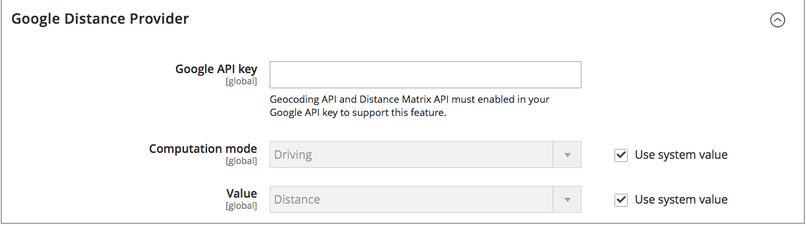

# Konfigurieren des Distance Priority Algorithm

Der Distance Priority Algorithm vergleicht den Standort der Versandzieladresse mit den Quellorten, um die nächstgelegene Quelle für die Erfüllung von Sendungen zu ermitteln. Die Entfernung kann durch die physische Entfernung oder die Zeit bestimmt werden, die auf Reisen von einem Ort zum anderen verbracht wird, unter Verwendung von Datenbankdaten oder Fahr-, Fuß- oder Fahrradrichtungen. Verwenden Sie diesen [Source-Auswahlalgorithmus](selection-reservations.md) um die Quelle zu empfehlen, die Versandzieladressen am nächsten liegt.

>[!NOTE]
>
>Wenn Sie den Distance Priority Algorithm verwenden, wird die Eingabe der vollständigen Straßenadresse und GPS-Koordinaten für Ihre [Quellen](sources-add.md) empfohlen.

Sie haben zwei Möglichkeiten, die Entfernung und die Zeit zu berechnen, um die nächstgelegene Quelle für die Sendungserfüllung zu finden:

- **Google MAP** - Verwendet [Google Maps Platform][1]-Services zur Berechnung der Entfernung und Zeit zwischen der Versandzieladresse und den Quellorten. Diese Option verwendet den Breiten- und Längengrad der Quelle (GPS-Koordinaten) und kann je nach Berechnungsmodus die Straßenadresse verwenden. Bei aktivierter [Geocoding-API][2] und [Distanzmatrix-API][3] ist ein Google-API-Schlüssel erforderlich, für den Sie möglicherweise Gebühren über Google anfallen.

- **Offline-Berechnung** - Berechnet die Entfernung anhand heruntergeladener und importierter Geocode-Daten mithilfe von Postleitzahlen und GPS-Koordinaten, um die Quelle zu ermitteln, die der Versandzieladresse am nächsten liegt. Um diese Option zu konfigurieren, benötigen Sie möglicherweise die Unterstützung eines Entwicklers, um Geocodes zunächst über Befehlszeilenanweisungen herunterzuladen und zu importieren.

>[!NOTE]
>
>Konfigurieren Sie für Websites mit mehreren Shops in mehreren Ländern das [Standard-Steuerziel](../stores-purchase/tax-class.md#default-tax-destination){target="_blank"} für jedes Land.

## Verwenden von Google Maps

Sie benötigen kein Google-Konto, um zu beginnen. Der Prozess umfasst bei Bedarf die Erstellung von Google-Konten und -Projekten. Diese Option erfordert ein Rechnungskonto und eine Zahlungsmethode, die Ihrem Google-Konto hinzugefügt werden, um Konfigurationen abzuschließen und den Algorithmus zu verwenden.
Es wird jedoch empfohlen, den Google MAP-entfernungsbasierten Algorithmus im Vergleich zur Offline-Berechnung als fortschrittlicher und präziser zu verwenden.

### Schritt 1: Google-API-Schlüssel erstellen

Der -Schlüssel stammt aus der [Google Maps-][1] und sollte [Geocoding-][2] und [Distance Matrix-][3] aktiviert haben. Weitere Informationen finden Sie unter [Konfigurieren des Abstandsprioritätsalgorithmus](distance-priority-algorithm.md).

1. Besuchen Sie [Google Maps Platform][1] und klicken Sie auf **[!UICONTROL Get Started]**.

1. Um die Plattform zu aktivieren, wählen Sie **[!UICONTROL Maps, Routes, and Places]** und klicken Sie auf **[!UICONTROL Continue]**.

   {width="350" zoomable="yes"}

1. Melden Sie sich mit einem Google-Konto an oder erstellen Sie ein Konto.

1. Einrichten eines Projekts:

   - Projekt auswählen oder neuen Projektnamen eingeben.

   - Um die Bedingungen zu akzeptieren, wählen Sie `Yes` aus.

   - Klicken Sie auf **[!UICONTROL Next]**.

1. Geben Sie ein Rechnungskonto ein oder erstellen Sie eines. Sie können überspringen und später ein Abrechnungskonto hinzufügen.

   Für die Nutzung dieses Dienstes ist ein Abrechnungskonto erforderlich.

1. Um Ihre Google Cloud Platform-Optionen zu öffnen und zu konfigurieren, klicken Sie auf **[!UICONTROL Console]**.

   - Öffnen Sie Ihr Projekt.

   - Erweitern Sie das Menü und klicken Sie auf **[!UICONTROL APIs & Services]** > **[!UICONTROL Library]**.

     {width="350" zoomable="yes"}

   - Suchen Sie nach [Geocoding API][2] und [Distance Matrix API][3]. Wählen Sie jeden Service aus und aktivieren Sie ihn.

1. Erweitern Sie das Menü, klicken Sie auf **[!UICONTROL APIs & Services]** > **[!UICONTROL Credentials]** und kopieren Sie den Google-API-Schlüssel.

   {width="350" zoomable="yes"}

### Schritt 2: Google-MAP-Provider konfigurieren

1. Navigieren Sie in _Admin_-Seitenleiste zu **[!UICONTROL Stores]** > _[!UICONTROL Settings]_>**[!UICONTROL Configuration]**.

1. Erweitern Sie im linken Bereich **[!UICONTROL Catalog]** und wählen Sie **[!UICONTROL Inventory]**.

1. Erweitern Sie  den Abschnitt _[!UICONTROL Distance Provider for Distance Based SSA]_und legen Sie **[!UICONTROL Provider]**auf `Google MAP` fest.

   {width="350" zoomable="yes"}

1. Erweitern Sie  den Abschnitt _[!UICONTROL Google Distance Provider]_und konfigurieren Sie die Einstellungen:

   - Geben Sie **[!UICONTROL Google API Key]** den aus Ihrem Google-Konto kopierten Schlüssel ein.

   - Wählen Sie **[!UICONTROL Computation mode]** eine Konfiguration aus.

     >[!NOTE]
     >
     >Wenn bei Verwendung dieses Versandalgorithmus Routen und Daten für eine Sendung nicht in den ausgewählten Berechnungsmodus (Fahren, Radfahren oder Gehen) zurückkehren, verwendet die SSA standardmäßig die Source-Priorität. Es wird empfohlen[ die Priorität für Quellen pro ](stocks-prioritize-sources.md) festzulegen.

     | Option | Beschreibung |
     | ----- | ----- |
     | `Driving` | (Standard) Fordert die Standard-Fahrtrichtung über das Straßennetz an. |
     | `Walking` | Anfragen Anleitungen zu Fußgängerwegen und Bürgersteigen (falls vorhanden). |
     | `Bicycling` | Fragen Sie nach Radwegen mit Fahrradwegen und bevorzugten Straßen (sofern verfügbar). Der [Distance Matrix Service][4] ist nur in den USA und einigen kanadischen Städten verfügbar. |

   - Wählen Sie **[!UICONTROL Value]** einen Werttyp aus:

     | Option | Beschreibung |
     | ----- | ----- |
     | `Distance` | (Standard) Gibt die Entfernung zwischen Punkten in Metriken (Kilometer und Meter) oder in imperialen Metriken (Meilen und Fuß) zurück. |
     | `Time to Destination` | Gibt die benötigte Zeit für die Fahrt von den Quellorten zur Versandadresse in Stunden und Minuten zurück. |

   {width="350" zoomable="yes"}

1. Klicken Sie abschließend auf **[!UICONTROL Save Config]**.

## Offline-Berechnung verwenden

Offline-Berechnungen verwenden Länder-Codes, um die Entfernung zwischen dem Versandziel und den Quelladressen zu bestimmen. Für diese Option ist möglicherweise die Unterstützung von Entwicklern bei der Konfiguration erforderlich. Verwenden Sie einen [!DNL Inventory Management] CLI-Befehl zum Herunterladen und Importieren von Daten aus [geonames.org][5].

>[!NOTE]
>
>Importierte Geocodes von [geonames.org][5] haben für einige Länder, wie Kanada und Irland, Einschränkungen. Weitere Informationen finden [ unter „GeoNames-][6]&quot;.

### Schritt 1: Geocodes herunterladen und importieren

Vollständige Befehlszeilenkonfiguration zum Herunterladen und Importieren von Geocodes für Länder, die an Quellspeicherorte gesendet werden sollen und in denen sich Quellspeicherorte befinden. Für diesen Schritt ist möglicherweise die Unterstützung eines Entwicklers erforderlich, um Hilfe bei Befehlszeilenaufgaben zu erhalten. Siehe [Geocodes importieren](cli.md#import-geocodes).

Führen Sie diese Befehle immer dann aus, wenn Sie weitere Geocodes hinzufügen möchten.

### Schritt 2: Berechnung festlegen

1. Navigieren Sie in _Admin_-Seitenleiste zu **[!UICONTROL Stores]** > _[!UICONTROL Settings]_>**[!UICONTROL Configuration]**.

1. Erweitern Sie im linken Bereich **[!UICONTROL Catalog]** und wählen Sie **[!UICONTROL Inventory]**.

1. Erweitern Sie  den Abschnitt _[!UICONTROL Distance Provider for Distance Based SSA]_.

1. Deaktivieren Sie das Kontrollkästchen **[!UICONTROL Use system value]** und setzen Sie **[!UICONTROL Provider]** auf `Offline Calculation`.

   {width="350" zoomable="yes"}

1. Klicken Sie abschließend auf **[!UICONTROL Save Config]**.

[1]: https://cloud.google.com/maps-platform/
[2]: https://developers.google.com/maps/documentation/geocoding/start
[3]: https://developers.google.com/maps/documentation/distance-matrix/start
[4]: https://developers.google.com/maps/documentation/javascript/distancematrix#travel_modes
[5]: https://www.geonames.org/
[6]: https://download.geonames.org/export/zip/readme.txt
