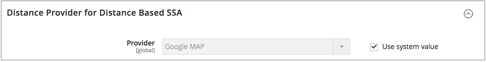

# Konfigurieren des Distance Priority-Algorithmus

Der Entfernungsprioritätenalgorithmus vergleicht den Speicherort der Lieferzieladresse mit den Quellspeicherorten, um die nächstgelegene Quelle für die Durchführung von Sendungen zu bestimmen. Die Entfernung kann anhand von Daten aus der Datenbank oder von Fahren, Spaziergängen oder Fahrradfahrten von einem Ort zum anderen bestimmt werden. Verwenden Sie diesen [Source-Auswahlalgorithmus](selection-reservations.md), um die nächstgelegene Quelle für Versandzieladressen zu empfehlen.

>[!NOTE]
>
>Wenn Sie den Distance Priority Algorithm verwenden, wird empfohlen, die vollständige Straßenadresse und GPS-Koordinaten für Ihre [Quellen](sources-add.md) einzugeben.

Sie haben zwei Möglichkeiten, die Entfernung und die Zeit zu berechnen, um die nächstgelegene Quelle für die Erfüllung des Versands zu ermitteln:

- **Google MAP** - Verwendet die Dienste [Google Maps Platform][1] , um den Abstand und die Uhrzeit zwischen der Lieferzieladresse und den Quellspeicherorten zu berechnen. Diese Option verwendet den Breiten- und Längengrad (GPS-Koordinaten) der Quelle und kann die Straßenadresse je nach Berechnungsmodus verwenden. Bei aktivierter [Geocoding API][2] und [Distance Matrix API][3] ist ein Google-API-Schlüssel erforderlich, und es können Gebühren über Google anfallen.

- **Offline-Berechnung** - Berechnet die Entfernung mithilfe heruntergeladener und importierter Geocode-Daten mithilfe von ZIP-/Postleitzahlen und GPS-Koordinaten, um die nächstgelegene Quelle für die Lieferzieladresse zu bestimmen. Um diese Option zu konfigurieren, benötigen Sie möglicherweise Hilfe von Entwicklern, um Geocodes zunächst mithilfe von Befehlszeilenanweisungen herunterzuladen und zu importieren.

>[!NOTE]
>
>Für Websites mit mehreren Stores mit mehreren Ländern konfigurieren Sie für jedes Land das Standardsteuerziel [1}.](../stores-purchase/tax-class.md#default-tax-destination){target="_blank"}

## Verwenden von Google-Maps

Sie benötigen zum Einstieg kein Google-Konto. Der Prozess umfasst bei Bedarf die Erstellung von Google-Konten und -Projekten. Diese Option erfordert ein Rechnungskonto und eine Zahlungsmethode, die Ihrem Google-Konto hinzugefügt werden, um Konfigurationen abzuschließen und den Algorithmus zu verwenden.
Es wird jedoch empfohlen, den entfernungsbasierten Algorithmus von Google MAP im Vergleich zur Offline-Berechnung weiter auszubauen und präziser zu gestalten.

### Schritt 1: Erstellen des Google-API-Schlüssels

Der Schlüssel stammt von der [Google Maps Platform][1] und sollte die [Geocoding API][2] und die [Distance Matrix API][3] aktiviert haben. Weitere Informationen finden Sie unter [Konfigurieren des Distance Priority Algorithm](distance-priority-algorithm.md).

1. Besuchen Sie [Google Maps Platform][1] und klicken Sie auf **[!UICONTROL Get Started]**.

1. Um die Plattform zu aktivieren, wählen Sie **[!UICONTROL Maps, Routes, and Places]** und klicken Sie auf **[!UICONTROL Continue]**.

   {width="350" zoomable="yes"}

1. Melden Sie sich mit einem Google-Konto an oder erstellen Sie ein Konto.

1. Einrichten eines Projekts:

   - Wählen Sie ein Projekt aus oder geben Sie einen neuen Projektnamen ein.

   - Um die Bedingungen zu akzeptieren, wählen Sie `Yes` aus.

   - Klicken Sie auf **[!UICONTROL Next]**.

1. Geben Sie ein Abrechnungskonto ein oder erstellen Sie eines. Sie können das Rechnungskonto überspringen und später hinzufügen.

   Für die Verwendung dieses Dienstes ist ein Rechnungskonto erforderlich.

1. Um Ihre Google Cloud Platform-Optionen zu öffnen und zu konfigurieren, klicken Sie auf **[!UICONTROL Console]**.

   - Öffnen Sie Ihr Projekt.

   - Erweitern Sie das Menü und klicken Sie auf **[!UICONTROL APIs & Services]** > **[!UICONTROL Library]**.

     {width="350" zoomable="yes"}

   - Suchen Sie nach [Geocoding API][2] und der [Entfernungsmatrix-API][3]. Wählen Sie die einzelnen Dienste aus und aktivieren Sie sie.

1. Erweitern Sie das Menü, klicken Sie auf **[!UICONTROL APIs & Services]** > **[!UICONTROL Credentials]** und kopieren Sie den Google-API-Schlüssel.

   {width="350" zoomable="yes"}

### Schritt 2: Konfigurieren des Google MAP-Anbieters

1. Wechseln Sie in der Seitenleiste _Admin_ zu **[!UICONTROL Stores]** > _[!UICONTROL Settings]_>**[!UICONTROL Configuration]**.

1. Erweitern Sie im linken Bereich den Wert **[!UICONTROL Catalog]** und wählen Sie **[!UICONTROL Inventory]** aus.

1. Erweitern Sie  den Abschnitt _[!UICONTROL Distance Provider for Distance Based SSA]_und legen Sie **[!UICONTROL Provider]**auf `Google MAP` fest.

   {width="350" zoomable="yes"}

1. Erweitern Sie den Abschnitt _[!UICONTROL Google Distance Provider]_um  und konfigurieren Sie die Einstellungen:

   - Geben Sie für &quot;**[!UICONTROL Google API Key]**&quot;den Schlüssel ein, der aus Ihrem Google-Konto kopiert wurde.

   - Wählen Sie für **[!UICONTROL Computation mode]** eine Konfiguration aus.

     >[!NOTE]
     >
     >Wenn dieser Algorithmus für den Versand verwendet wird und Routen und Daten nicht für den ausgewählten Berechnungsmodus (Fahren, Fahren, Fahren oder Gehen) für eine Sendung zurückgegeben werden, verwendet die SSA standardmäßig die Source-Priorität. Es wird empfohlen, die [Priorität für Quellen pro Lager](stocks-prioritize-sources.md) festzulegen.

     | Option | Beschreibung |
     | ----- | ----- |
     | `Driving` | (Standard) Fordert Standardfahrtanweisungen über das Straßennetz an. |
     | `Walking` | Wünsche für Wanderungen mit Fußgängerwegen und Bürgersteigen (sofern verfügbar). |
     | `Bicycling` | Erkundigen Sie sich über Fahrradwege und bevorzugte Straßen (sofern verfügbar). Der Dienst [Distance Matrix Service][4] ist nur in den USA und einigen kanadischen Städten verfügbar. |

   - Wählen Sie für &quot;**[!UICONTROL Value]**&quot;einen Werttyp aus:

     | Option | Beschreibung |
     | ----- | ----- |
     | `Distance` | (Standard) Gibt die Entfernung zwischen Punkten in Metriken (Kilometer und Meter) oder dem Kaiserreich (Meilen und Fuß) zurück. |
     | `Time to Destination` | Gibt die erforderliche Zeit zurück, um von den Quell-Standorten in Stunden und Minuten zur Lieferadresse zu gelangen. |

   {width="350" zoomable="yes"}

1. Klicken Sie nach Abschluss des Vorgangs auf **[!UICONTROL Save Config]**.

## Offline-Berechnung verwenden

Offline-Berechnungen verwenden Ländercodes, um den Abstand zwischen dem Versandziel und den Quelladressen zu ermitteln. Diese Option erfordert möglicherweise Hilfe von Entwicklern bei der Konfiguration. Verwenden Sie den Befehl [!DNL Inventory Management] CLI , um Daten von [geonames.org][5] herunterzuladen und zu importieren.

>[!NOTE]
>
>Importierte Geocodes von [geonames.org][5] haben Einschränkungen für einige Länder, z. B. Kanada und Irland. Weitere Informationen finden Sie unter [Dateien mit Postleitzahlen für GeoNames][6] .

### Schritt 1: Herunterladen und Importieren von Geocodes

Vollständige Befehlszeilenkonfiguration zum Herunterladen und Importieren von Geocode-Ländern zum Versand an und zur Verwendung von Quellspeicherorten. Dieser Schritt erfordert möglicherweise Hilfe von Entwicklern für Hilfe bei Befehlszeilenaufgaben. Siehe [Geocodes importieren](cli.md#import-geocodes).

Führen Sie diese Befehle jedes Mal aus, wenn Sie weitere Geocodes hinzufügen möchten.

### Schritt 2: Berechnung festlegen

1. Wechseln Sie in der Seitenleiste _Admin_ zu **[!UICONTROL Stores]** > _[!UICONTROL Settings]_>**[!UICONTROL Configuration]**.

1. Erweitern Sie im linken Bereich den Wert **[!UICONTROL Catalog]** und wählen Sie **[!UICONTROL Inventory]** aus.

1. Erweitern Sie  im Abschnitt _[!UICONTROL Distance Provider for Distance Based SSA]_.

1. Heben Sie die Auswahl des Kontrollkästchens **[!UICONTROL Use system value]** auf und setzen Sie **[!UICONTROL Provider]** auf `Offline Calculation`.

   {width="350" zoomable="yes"}

1. Klicken Sie nach Abschluss des Vorgangs auf **[!UICONTROL Save Config]**.

[1]: https://cloud.google.com/maps-platform/
[2]: https://developers.google.com/maps/documentation/geocoding/start
[3]: https://developers.google.com/maps/documentation/distance-matrix/start
[4]: https://developers.google.com/maps/documentation/javascript/distancematrix#travel_modes
[5]: https://www.geonames.org/
[6]: https://download.geonames.org/export/zip/readme.txt
