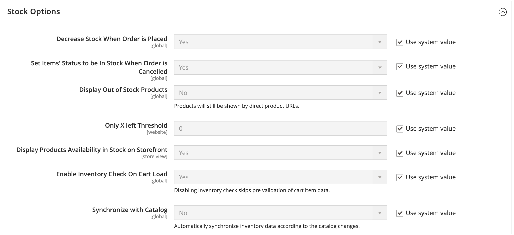

# Konfigurieren [!DNL Inventory Management] globalen Optionen

Konfigurieren Sie die standardmäßigen Konfigurationsoptionen für Produkte und Lager für Ihre Websites. Einige dieser Einstellungen können pro Produkt über „Konfigurieren von [&quot; überschrieben ](product-options.md). Informationen zum Konfigurieren der Distanzprioritätseinstellungen finden Sie [Konfigurieren des Distanzprioritätsalgorithmus](distance-priority-algorithm.md).

## Globale Konfiguration von Produkt- und Lageroptionen

1. Navigieren Sie in _Admin_-Seitenleiste zu **[!UICONTROL Stores]** > _[!UICONTROL Settings]_>**[!UICONTROL Configuration]**.

1. Erweitern Sie im linken Bereich **[!UICONTROL Catalog]** und wählen Sie **[!UICONTROL Inventory]**.

1. Erweitern Sie  den Abschnitt **[!UICONTROL Stock Options]** und legen Sie die Optionen fest:

   {width="600" zoomable="yes"}

   - Um die verfügbare Menge bei der Auftragserteilung anzupassen, setzen Sie **[!UICONTROL Decrease Stock When Order is Placed]** auf `Yes`.

   - Um Artikel im Falle einer Stornierung an Lager zurückzusenden, **[!UICONTROL Set Items' Status to be in Stock When Order in Cancelled]** Sie auf `Yes`.

   - Um weiterhin Produkte im Katalog anzuzeigen, die nicht mehr vorrätig sind, setzen Sie **[!UICONTROL Display Out of Stock Products]** auf `Yes`.

   - Wenn [Preiswarnhinweise](alert-setup.md) aktiviert sind, können sich Kunden anmelden, um benachrichtigt zu werden, wenn das Produkt wieder auf Lager ist.

   - Um den Beginn für die Anzeige des letzten verbleibenden Lagerbestands auf der Produktseite festzulegen, geben Sie einen Betrag für **[!UICONTROL Only X left Threshold]** ein.

     Die Meldung erscheint, wenn die Lagermenge den Schwellenwert erreicht. Wenn Sie beispielsweise auf `3` setzen, wird die `Only 3 left` angezeigt, wenn die Lagermenge drei erreicht. Die Nachricht wird so angepasst, dass sie die Menge auf Lager widerspiegelt, bis die Menge null erreicht.

   - Um die Meldung „Auf Lager“ oder „Nicht vorrätig“ auf der Produktseite anzuzeigen, setzen Sie **[!UICONTROL Display Products Availability In Stock on Storefront]** auf `Yes`.

   - Um den Bestand zu überprüfen, wenn ein Produkt in den Warenkorb geladen wird, setzen Sie **[!UICONTROL Enable Inventory Check On Cart Load]** auf `Yes`. Wenn diese Option deaktiviert ist, wird die Bestandsprüfung übersprungen. Durch Deaktivieren dieser Option wird der Checkout beschleunigt, insbesondere wenn sich viele Artikel im Warenkorb befinden. Wenn Sie jedoch die Vorab-Validierung überspringen, können Kundinnen und Kunden später im Checkout-Prozess Fehler „Nicht vorrätig“ sehen.

   - Um die Konsistenz zwischen Inventar und Katalog zu wahren, setzen Sie **[!UICONTROL Synchronize with Catalog]** auf `Yes`. Wenn diese Option aktiviert ist, werden die Inventardaten entsprechend den Katalogänderungen angepasst (z. B. entferntes Produkt, geänderte Produkt-SKU und geänderter Produkttyp).

1. Erweitern Sie  den Abschnitt **[!UICONTROL Product Stock Options]** und legen Sie die Optionen fest:

   - Um die [Bestandskontrolle](enable.md) für Ihren Katalog zu aktivieren, legen Sie **[!UICONTROL Manage Stock]** auf `Yes` fest.

     {width="600" zoomable="yes"}

   - Legen Sie **[!UICONTROL Backorders]** auf eine der folgenden Einstellungen fest:

     | Option | Beschreibung |
     | ----- | ----- |
     | `No Backorders` | [Nachbestellungen](backorders.md) werden nicht akzeptiert, wenn das Produkt nicht vorrätig ist. |
     | `Allow Qty Below 0` | Nachbestellungen werden akzeptiert, wenn die Menge unter null fällt. |
     | `Allow Qty Below 0 and Notify Customer` | Nachbestellungen werden akzeptiert, wenn die Menge unter null fällt, und das System benachrichtigt den Kunden, dass die Bestellung noch aufgegeben werden kann. |

   - Geben Sie die **[!UICONTROL Maximum Qty Allowed in Shopping Cart]** ein.

   - Geben Sie einen Betrag für die **[!UICONTROL Out-of-Stock Threshold]** ein:

     | Wert | Beschreibung |
     | ----- |-----|
     | Positiver Betrag | Geben Sie bei deaktivierter Nachbestellung einen positiven Betrag ein. |
     | Null | Wenn Nachbestellungen aktiviert sind, ermöglicht die Eingabe von `0` unendliche Nachbestellungen. |
     | Negativer Betrag | Bei aktivierten Auftragsrückständen wird die Eingabe eines negativen Betrags empfohlen. Der Betrag wird der Verkaufsmenge hinzugefügt. Geben Sie beispielsweise `-50` ein, um Bestellungen bis zu diesem Betrag zuzulassen. |

   - Geben Sie die **[!UICONTROL Minimum Qty Allowed in Shopping Cart]** für die ausgewählte Gruppe und die Beträge ein.

   - Geben Sie **[!UICONTROL Notify for Quantity Below]** den Lagerbestand ein, der Trigger darüber informiert, dass der Artikel nicht vorrätig ist.

   - Um Mengenschritte für das Produkt zu aktivieren, setzen Sie **[!UICONTROL Enable Qty Increments]** auf `Yes`. Geben Sie **[!UICONTROL Qty Increments]** die Anzahl der Artikel ein, die zur Erfüllung der Anforderung gekauft werden müssen.

     Beispielsweise kann ein Artikel, der in Schritten von sechs verkauft wird, in Mengen von `6`, `12`, `18` usw. gekauft werden.

   - **[!UICONTROL Automatically Return Credit Memo Item to Stock]** ist [!DNL Inventory Management] auf `No` festgelegt. Wenn Sie eine Gutschrift übermitteln, geben Sie ein und wählen Sie aus, um Lager an die Quellen zurückzugeben.

1. Erweitern Sie  den Abschnitt **[!UICONTROL Admin bulk operations]** und legen Sie die Optionen fest:

   {width="600" zoomable="yes"}

   - **[!UICONTROL Run asynchronously]** für die asynchrone Ausführung von Massenvorgängen für Massenproduktaktionen

     Zu diesen Vorgängen gehören [ „Zuordnung und Aufhebung der Zuweisung von ](bulk-assignment.md)&quot; und [Übertragung von Inventar zur Quelle](inventory-transfer.md). Sie erfasst Massenaktionen bis zur asynchronen Batch-Größe und führt diese Aktionen aus. Diese Option ist standardmäßig deaktiviert. Es wird empfohlen, vor der Aktivierung Ihre Leistung mit Massenaktionen zu überprüfen.

     >[!NOTE]
     >
     >Zum Konfigurieren und Unterstützen _asynchroner Warteschlangenmanager_ müssen Sie einen Befehl über die Befehlszeile eingeben. Für diesen Schritt ist möglicherweise die Unterstützung eines Entwicklers erforderlich. Siehe [Starten von Nachrichtenwarteschlangen-](https://experienceleague.adobe.com/docs/commerce-operations/configuration-guide/cli/start-message-queues.html?lang=de) im _Konfigurationshandbuch_.

   - Wenn aktiviert, legen Sie die **[!UICONTROL Asynchronous batch size]** fest. Die standardmäßige Batch-Größe ist 100. Wenn Massenprozesse diesen Wert erreichen, wird er vom System Trigger.

1. Klicken Sie abschließend auf **[!UICONTROL Save Config]**.
