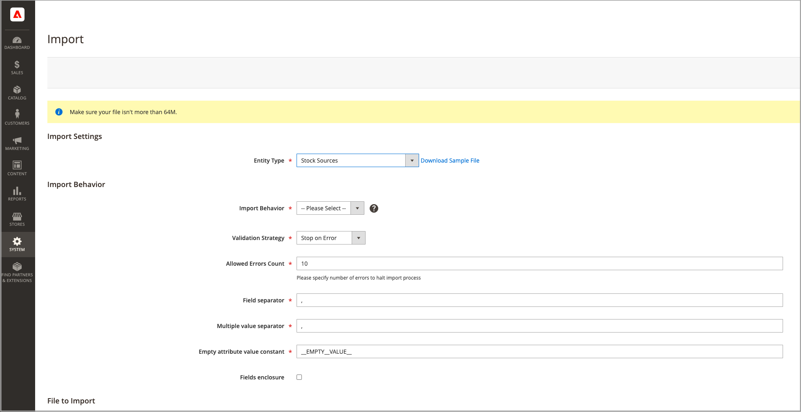

# Inventar importieren und exportieren

Bei Katalogen mit vielen Produkten verwenden Sie die nativen Import- und Exportfunktionen mit erweiterten [!DNL Inventory Management], um Quellen und Mengen nach SKU zu aktualisieren. Mit diesen Optionen können Sie neue Quellen hinzufügen und Lagermengen für alle oder eine bestimmte Quelle aktualisieren. Sie können beispielsweise Produkte für eine Quelle in Deutschland exportieren, ohne die Produktinformationen für Quellen in Frankreich, England oder den USA zu beeinflussen.

- [!DNL Commerce] weist Ihren Produkten automatisch die Standard-Source zu, wenn Sie [!DNL Commerce] aktualisieren oder neue Produkte importieren. Wenn Sie Produkte importieren, denen eine benutzerdefinierte Quelle zugewiesen wurde, wird die standardmäßige Source weiterhin mit der Menge 0 hinzugefügt. Verwenden Sie diese Importanweisungen, um Quellen und Mengen zu aktualisieren.

- Händler aus einer Hand verwenden den Import, um nur die Produktmengen zu aktualisieren. Alle vorhandenen und hinzugefügten Produkte werden der Standard-Source zugewiesen.

- Händler mit mehreren Quellen verwenden den -Import, um mehrere Quellen und Mengen pro Zeile und SKU hinzuzufügen.

Um Aktualisierungen zu importieren, exportieren Sie zunächst eine CSV-Datei für eine bestimmte oder alle Quellen. Bearbeiten Sie die CSV-Datei und fügen Sie für jede Quelle und Menge eine Zeile pro SKU hinzu. Sie benötigen den Quellcode, wenn Sie eine Quelle hinzufügen und Lagermengen hinzufügen. Mit Import/Export-Funktionen können Sie keine Lager hinzufügen oder aktualisieren.

## CSV-Dateiinhalt

Die Export-Import-Datei enthält je nach Quelle die folgenden Informationen:

- `source_code` - Der Code für Quellen in [!DNL Commerce]. Für jede Quelle und SKU gibt es eine Zeile.
- `sku` - Die SKU für das Produkt in [!DNL Commerce]. Die SKU muss mit einem Produkt in Ihrem Store übereinstimmen, um [!DNL Inventory Management] Daten ordnungsgemäß zu aktualisieren.
- `status` - 0 für Nicht vorrätig. 1 für Auf Lager. Dieser Wert muss 1 sein, um Stock aus dieser Quelle zu kaufen.
- `quantity`: Die Gesamtmenge des für diese SKU und Quelle verfügbaren Bestands.

Verwenden Sie eine CSV-Datei, um schnell mehrere Produkte und zugewiesene Quellen zu aktualisieren und etwaige Ungenauigkeiten in den Inventardatensätzen zu aktualisieren und zu korrigieren, anstatt jeweils eine über die Anwendungsschnittstelle. Für eine Basisdatei zuerst exportieren und nach Bedarf aktualisieren.

{width="600" zoomable="yes"}

## Exportieren von Produktdaten für alle Quellen

1. Navigieren Sie in _Admin_-Seitenleiste zu **[!UICONTROL System]** > _[!UICONTROL Data Transfer]_>**[!UICONTROL Export]**.

1. Wählen Sie **[!UICONTROL Entity Type]** &quot;`Stock Sources`&quot;.

   Der Export extrahiert nur Daten für Produkte mit einer SKU.

1. Klicken Sie auf **[!UICONTROL Continue]**.

   Die Datei generiert und lädt zum Öffnen und Bearbeiten herunter.

Nachdem Sie die Bestandsmengen und Produktdaten aktualisiert haben, importieren Sie die Datei wieder in [!DNL Commerce].

{width="350" zoomable="yes"}

## Exportieren von Produktdaten für eine bestimmte Quelle

1. Navigieren Sie in _Admin_-Seitenleiste zu **[!UICONTROL System]** > _[!UICONTROL Data Transfer]_>**[!UICONTROL Export]**.

1. Wählen Sie **[!UICONTROL Entity Type]** &quot;`Stock Sources`&quot;.

   Der Export extrahiert nur Daten für Produkte mit einer SKU.

1. Verwenden Sie den **[!UICONTROL Entity Attributes]**, um die exportierten Produkte nach einer bestimmten Quelle zu filtern.

   Geben Sie `source_code` den Code für die Quelle in das Filterfeld ein.

1. Klicken Sie auf **[!UICONTROL Continue]**.

   Die Datei generiert und lädt zum Öffnen und Bearbeiten herunter.

Nachdem Sie die Bestandsmengen und Produktdaten aktualisiert haben, importieren Sie die Datei wieder in [!DNL Commerce].

## Importieren von Produktdaten

1. Navigieren Sie in _Admin_-Seitenleiste zu **[!UICONTROL System]** > _[!UICONTROL Data Transfer]_>**[!UICONTROL Import]**.

1. Wählen Sie **[!UICONTROL Entity Type]** &quot;`Stock Sources`&quot;.

   Der Export extrahiert nur Daten für Produkte mit einer SKU.

1. Wählen Sie Konfigurationen für die **[!UICONTROL Import Behavior]** aus.

1. Wählen Sie die zu importierende CSV-Datei aus.

1. Klicken Sie auf **[!UICONTROL Check Data]** und schließen Sie den Import ab.

{width="600" zoomable="yes"}
