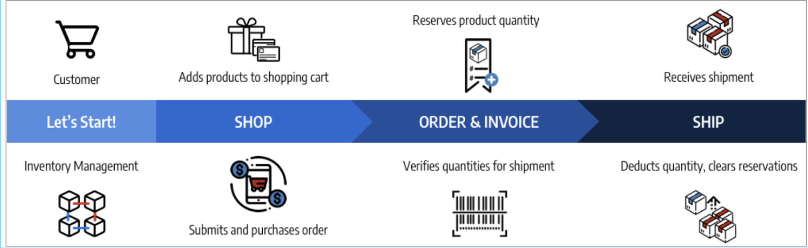

# Bestellstatus und -reservierung

[!DNL Inventory Management] unterstützt die teilweise und vollständige Rechnungsstellung, Zahlungen, Versand und Stornierungen pro Bestellung. Bei der Verwaltung einer Bestellung durch Verarbeitung, Rechnungsstellung, Sendung und möglicherweise Rückerstattung gibt [!DNL Commerce] automatisch Reservierungen ein oder ändert diese, um die Verkaufsmenge für einen Lager (oder Verkaufskanal) und die Lagerbestandsmenge pro Quelle zu aktualisieren. Sie müssen nicht aktiv auf Reservierungen zugreifen oder diese eingeben. Die Durchführung von Aktionen zur Erfüllung, Stornierung oder Rückerstattung einer Bestellung macht dies für Sie.

Diese Reservierungen passen immer Ihre Verkaufsmenge an, mit positiven oder negativen Beträgen, um die Mengen zu erhöhen oder zu verringern. Das Ergebnis ist eine Aktualisierung Ihres eigenen Bestands und Ihrer Verkaufsmengen für eine aktuelle Produktverfügbarkeit.

Weitere Informationen zu Bestellungen und Sendungen finden Sie unter [Verwalten von Bestellungen und Sendungen](shipments.md).

## Bestellverwaltungsoptionen

Je nach Lagerstatus und Kundenanfragen können Sie Bestellungen mit Teilzahlungen und Stornierungen, Teillieferungen aus mehreren Quellen oder für Rückbestellungen oder Kreditkarten aktualisieren, um zurückgegebene Produkte zurückzuerstatten.

### Sendungen

Nach Rechnungsstellung können Teillieferungen oder Vollsendungen bis zur vollständigen Bestellungserfüllung durchgeführt werden. Jede Sendung konvertiert Reservierungen, wobei der Betrag von der Produktmenge pro Quelle abgezogen wird. Die Reservierungsentschädigung wird zur Aktualisierung der Verkaufsmenge für Ihr Lager verwendet. Bei Teillieferungen zieht jede Lieferung diesen Betrag von Ihrer Produktmenge und Reservierung ab. Alle nicht versandten Produktreservierungen bleiben bis zum Versand vorhanden, sodass Ihr Verkaufsbetrag aktuell ist und Sie die Kontrolle über den Produktbestand und die Unterstützung mehrerer Quelllieferungen und -rückaufträge erhalten.

### Abgebrochene Bestellungen

Wenn ein Kunde seine Bestellung vor dem Versand (teilweise oder vollständig) storniert, wird eine neue Reservierung eingetragen, um den Lagerbestand auf die verkaufbare Menge zurückzugeben. Die Reservierungen heben einander praktisch ab, ohne dass die Menge von irgendwelchen Quellen abgezogen wird. Andere Kunden können diese Produktmengen aktiv über die entsprechenden Lager und Vertriebskanäle erwerben.

### Erstattete Aufträge

Wenn ein Kunde eine Rückerstattung anfordert, geben Sie das Kreditvermerk für die Teil- oder Vollmengen des Produkts aus. Wenn Sie die zurückgegebenen Produkte erhalten, geben Sie ein Kreditmemo ein, um die Mittel bereitzustellen und die Produktbeträge zu aktualisieren. Bei der Auswahl der Option Zurück zu Lager fügt [!DNL Commerce] die Mengen wieder zu den Produkten und Quellen hinzu, die die Bestellungen und Reservierungsausgleichszahlungen versandt haben, um die Verkaufsmengen für das dazugehörige Lager zu aktualisieren.

## Bestelltypen

Einfache Bestellungen beginnen mit einem Warenkorb, zahlen weiter und enden mit einem zufrieden gestellten Versand. In diesen Bestellungen verarbeitet [!DNL Inventory Management] einfach Reservierungen gegen die Verfügbarkeit (oder die Verkaufsmenge) im Warenkorb und beim Checkout und zieht sie beim Versand von dem Inventar ab.

{width="600" zoomable="yes"}

Eine kompliziertere Bestellung kann teilweise Annullierungen, Teillieferungen und Erstattungen zur Folge haben. In diesen Fällen wirken sich die Vorbehalte auf das verfügbare Inventar aus, um die Mengen für Annullierungen und Erstattungen hinzuzufügen und die Mengen bei Bestellung und Versand zu verringern.

{width="600" zoomable="yes"}

Verfügbarkeitsreservierungen und Bestandsänderungen erfolgen je nach Bestellstatus.

## Status und Reservierungen

In den folgenden Tabellen werden die Reihenfolge und der Status des Guthabens mit Buchungsänderungen detailliert beschrieben, die von [!DNL Commerce] eingegeben wurden, um Ihr Inventar zu verwalten.

| Bestellstatus | Beschreibung | Reservierung für veräußerbare Menge |
|--|--|--|
| [!UICONTROL Open] | Neu und kürzlich gesendet, keine Verarbeitung | Die Reservierung wird gespeichert, wenn die Bestellung für das Lager eingereicht wird. |
| [!UICONTROL Canceled] | Teilweise oder vollständig vor Zahlung storniert | Die Reservierungsvergütung wird so eingestellt, dass die Restmenge teilweise oder vollständig auf die verkaufbare Lagermenge zurückgesetzt wird. |
| [!UICONTROL On Hold] | Zahlung und Versand nicht verarbeitet oder fakturiert | Die Reservierung bleibt vorhanden. |
| [!UICONTROL Suspected Fraud] | Nicht verarbeitet aufgrund von Betrug | Wenn die Reservierung genehmigt wurde oder noch geprüft wird, bleibt sie bestehen. Wenn die Reservierung abgelehnt wird, bleibt die Reservierung bestehen, bis der Händler entscheidet, sie zu genehmigen oder zu stornieren. Bei Stornierung wird die Reservierungsvergütung so eingestellt, dass die gesamte Menge auf die verkaufbare Lagermenge zurückgesetzt wird. |
| [!UICONTROL Pending] | Zahlungsaufschub | Die Reservierung bleibt erhalten. |
| [!UICONTROL Processing] | Zahlungsverarbeitung, nicht eingegangen | Die Reservierung bleibt erhalten. |
| [!UICONTROL Pending Payment] | Nicht eingegangene Zahlung | Die Reservierung bleibt erhalten. |
| [!UICONTROL Payment Review] | Für die Verarbeitung und Fertigstellung der Zahlung wird eine Überprüfung durchgeführt | Die Reservierung bleibt erhalten. |
| [!UICONTROL Complete] | Bezahltes und vollständig versandtes Material | Der Reservierungsbetrag wird von der Produktmenge für die ausgewählte Quelle abgezogen, wenn er teilweise oder vollständig in Rechnung gestellt wird. Die Reservierungsvergütung wird zur Aktualisierung der Verkaufsmenge angegeben. |
| [!UICONTROL Closed] | Erstattet oder archiviert | Bei Archivierung gibt es keine Mengenänderung. Bei teilweiser oder vollständiger Rückerstattung wird der Reservierungsausgleich verbucht und umgerechnet, um die Erzeugnismengen je Quelle und Verkaufsmenge je Lager hinzuzufügen. |

| Status des Credit Memos | Beschreibung | Reservierung für veräußerbare Menge |
|--|--|--|
| [!UICONTROL Open] | Die Erstattung ist fällig, nicht abgeschlossen | Es gibt keine Änderung bei den Vorbehalten. |
| [!UICONTROL Refunded] | Abgeschlossen, zurückgegebene Mittel | Bei teilweiser oder vollständiger Rückerstattung wird der Reservierungsausgleich verbucht und umgerechnet, um die Erzeugnismengen je Quelle und Verkaufsmenge je Lager hinzuzufügen. |

## Beispiel für eine komplexe Reihenfolge

Blake Sanders bestellt Fahrräder und Kleidung für ihren Familienurlaub und Spaß. In Ihrem Biking Adventures-Geschäft sehen sie einige große Verkaufszahlen mit Lagern und Quellen aus den USA, Kanada und Europa.

Sie kaufen zwei große Parkbikes für ihre kleinen Kinder, ein BMX-Fahrrad für ihren Teenager, ein schönes Mountainbike für sich selbst und ein modernes deutsches Langlaufrad für ihren Ehepartner. Der Laden hatte einen Verkauf an süßen Hemden, also kauften sie etwas für die ganze Familie zum Spielen. Siehe die nachstehende Liste der Urlaubskäufe, die entsprechenden SKUs und die Reservierungen für die verkaufbaren Lagermengen.

{width="600" zoomable="yes"}

Sie zeigen ihrer Familie, was sie gefunden haben, aber nehmen einige Änderungen vor. Bevor die Zahlung abgeschlossen ist, stornieren sie zwei der 33-BikeFun SKUs (Kinder mochten sie nicht). Dies ist eine teilweise Stornierung aufgrund einer ausstehenden Zahlung, sodass kein Kreditmemo erforderlich. Um aktualisiert zu werden, wird [!DNL Commerce] wieder zum verkaufbaren Mengenbestand für Kanada hinzugefügt. Die Bestellung wird bezahlt, und alle Produkte werden versandt, rechtzeitig für den Urlaub ankommen. [!DNL Commerce] aktualisiert die Verkaufsmenge und die Quellmengen der Versandlager für die versandten Erzeugnisse.

Aber das Hemd passte nicht ganz zu ihrem Ehepartner. Blake verlangt eine Rückerstattung und sendet sein Hemd zurück. Die Erstellung des Credit Memos fügt dem Lager- und Versandlager von Kanada ein 54-BikeLife-Shirt hinzu.

- **Lieferbare Produkte** - Mit gekauften und gelieferten Produkten aktualisiert [!DNL Commerce] den Bestand. Reservierungsausgleichszahlungen, die in vorrätige Vorratsumsätze von der versandten Quelle umgerechnet werden. Die verfügbare Verkaufsmenge wird für den Bestand aktualisiert.

- **Abgebrochene Produkte** - Durch Abbruch des Lagers entfernt [!DNL Commerce] die Reservierung für dieses Produkt. Die Reservierungsentschädigung wird in die Lagerposition eingetragen, um die verkaufbaren Mengen für die teilweise Stornierung von zwei Hemden wieder einzutragen. Dies wirkt sich nicht auf die Lagerbestandsmenge auf der Quellebene aus.

- **Kreditkarte/erstattetes Produkt** - Durch Rückgabe des Lagers muss es wieder zu den Mengen hinzugefügt werden. Bei der Ausstellung des Kreditmemo können Sie auswählen, ob Sie wieder auf Lager sind. [!DNL Commerce] fügt die Lagerbestandsmenge der versandten Quelle für das Produkt zurück. Die Reservierungsentschädigung dient dazu, die verbleibenden Reservierungen zu löschen. Die verkaufbare Menge wird mit der aktualisierten Menge neu berechnet.

{width="600" zoomable="yes"}
