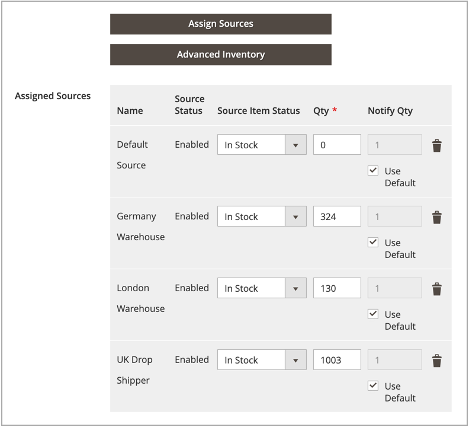

# Mengen je Erzeugnis zuweisen

Aktualisieren Sie nach dem Hinzufügen von [Quellen](sources-assign-per-product.md) die Lagerbestandsmengen für Ihr Produkt. Diese Werte verfolgen die verfügbaren Lagerbestände.

Um den Bestand einer Quelle vor Sendungen zu verbergen, ohne die Quelle zu entfernen, setzen Sie _[!UICONTROL Source Item Status]_auf `Out of Stock`. Die SSA- und Versandoptionen greifen nur auf Quellen zu, die als `In Stock` mit verfügbarer Lagerbestandsmenge aufgeführt sind.

Alle aktualisierten Mengen und Quellen werden im Produktraster angezeigt.

## Mengen aktualisieren

1. Wechseln Sie in der Seitenleiste _Admin_ zu **[!UICONTROL Catalog]** > **[!UICONTROL Products]**.

1. Suchen und öffnen Sie ein Produkt im Bearbeitungsmodus.

1. Erweitern Sie  im Abschnitt **[!UICONTROL Sources]** .

1. Setzen Sie **[!UICONTROL Source Item Status]** auf `In Stock`.

1. Um die Menge für das Lager zu aktualisieren, geben Sie einen Betrag für **[!UICONTROL Qty]** ein.

1. Führen Sie einen der folgenden Schritte aus, um eine Meldung für die Lagerbestandsmengen festzulegen:

   - Benutzerdefinierte Menge benachrichtigen - Deaktivieren Sie das Kontrollkästchen **[!UICONTROL Use Default]** und geben Sie einen Betrag in **[!UICONTROL Notify Qty]** ein.
   - Standardmäßige Menge benachrichtigen - Aktivieren Sie das Kontrollkästchen **[!UICONTROL Use Default]** . [!DNL Commerce] überprüft und verwendet die Einstellung in _[!UICONTROL Advanced Inventory]_oder der globalen Store-Konfiguration.

   {width="350" zoomable="yes"}

1. Führen Sie einen der folgenden Schritte aus, um zu speichern:

   - Klicken Sie auf **[!UICONTROL Save]**.

   - Wählen Sie im Menü **[!UICONTROL Save]** () die Option **[!UICONTROL Save & Close]**.

Das Produktraster wird mit einer Liste aller Quellen und der zugehörigen Mengen aktualisiert. Bewegen Sie bei Produkten mit mehr als fünf zugewiesenen Quellen den Mauszeiger über die Spalte &quot;_[!UICONTROL Quantity per Source]_&quot;, um die vollständige Liste anzuzeigen.

{width="600" zoomable="yes"}
