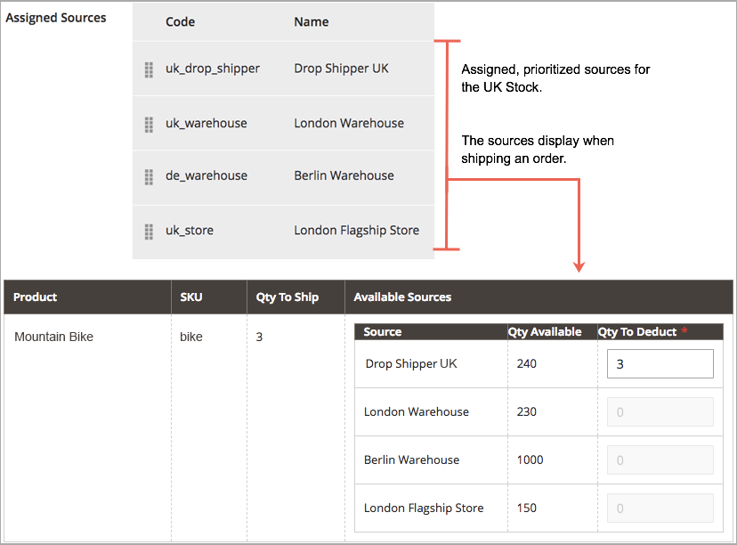

# Source-Algorithmen und -Reservierungen

Das Herz von [!DNL Inventory Management] verfolgt jedes verfügbare Produkt virtuell und direkt in Ihren Lagern und Geschäften. Die Source Selection Algorithm- und Reservierungssysteme laufen im Hintergrund, halten Ihre Verkaufsmengen auf dem neuesten Stand, checkout frei von Kollisionen und empfohlenen Versandoptionen.

>[!NOTE]
>
>Informationen zum programmgesteuerten Arbeiten mit dem [!DNL Inventory Management] -System finden Sie in der [Entwicklerdokumentation](https://developer.adobe.com/commerce/php/development/framework/inventory-management/) .

## Source-Auswahlalgorithmus

Der Source Selection Algorithm (SSA) analysiert und ermittelt die beste Übereinstimmung für Quellen und Versand anhand der Prioritätsreihenfolge der in einem Lager konfigurierten Quellen. Während des Bestellversands stellt der Algorithmus eine empfohlene Liste von Quellen, verfügbaren Mengen und Mengen bereit, die je nach ausgewähltem Algorithmus abgezogen werden sollen. [!DNL Inventory Management] bietet einen Prioritätsalgorithmus und unterstützt Erweiterungen für neue Optionen.

Mit mehreren Quellen Standorte, globalen Kunden und Betreibern mit verschiedenen Versandoptionen und -gebühren kann es schwierig sein, Ihren tatsächlichen Bestand zu kennen und die beste Versandoption zu finden. SSA erledigt die Arbeit für Sie von der Bestandsaufzeichnung über alle Quellen bis zur Berechnung und Abgabe von Empfehlungen für Sendungen.

**Inventar verfolgen** - Unter Verwendung von Lagern und Quellen prüft die SSA den Vertriebskanal eingehender Produktanfragen und bestimmt den verfügbaren Bestand:

- Berechnet die aggregierte virtuelle Verkaufsmenge aller zugewiesenen Quellen pro Bestand: Aggregate Menge - Nicht vorrätiger Schwellenwert pro Quelle
- Zieht den Schwellenwert für Nichtvorräte von der Verkaufsmenge ab, um eine Überbewertung zu verhindern
- Reserviert Lagerbestände bei der Auftragseinsendung, abgezogen vom Lagerbestand bei der Auftragsverarbeitung und beim Versand
- Unterstützt Backorder mit erweiterten Optionen für negative Schwellenwerte

**Sendungen verwalten** - Der Algorithmus hilft bei der Verarbeitung und dem Versand von Bestellungen. Sie können den Algorithmus ausführen, um Empfehlungen zu den besten Quellen für den Versand des Produkts abzurufen, oder die Auswahl überschreiben, um:

- Versand von Teilsendungen, Versand nur einiger Produkte von bestimmten Standorten und Abschluss der vollständigen Bestellung später
- Versand der gesamten Bestellung aus einer Quelle
- Versand aus verschiedenen Quellen in unterschiedlichen Mengen unterbrechen, sodass ein ausgeglichener Lagerbestand für alle Lagerhäuser und Geschäfte erhalten bleibt

SSA ist erweiterbar für den Drittanbieter-Support und benutzerdefinierte Algorithmen zur Empfehlung kosteneffizienter Sendungen.

>[!NOTE]
>
>SSA funktioniert bei virtuellen und herunterladbaren Produkten unterschiedlich, was möglicherweise keine Versandkosten verursacht. In diesen Fällen führt das System den Algorithmus implizit aus, wenn Rechnungen erstellt werden, und verwendet immer die vorgeschlagenen Ergebnisse. Sie können diese Ergebnisse nicht für virtuelle und herunterladbare Produkte anpassen.

### Source-Prioritätsalgorithmus

Benutzerdefinierte Lager enthalten eine zugewiesene Liste von Quellen, um verfügbare Produktbestände über Ihre Storefront zu verkaufen und zu versenden. Der Source Priority Algorithm verwendet die Reihenfolge der zugewiesenen Quellen auf dem Lager, um bei der Rechnungsstellung und beim Versand der Bestellung Produktabzüge pro Quelle zu empfehlen.

Wenn der Algorithmus ausgeführt wird:

- Durchläuft die konfigurierte Reihenfolge der Quellen auf der Lagerposition, beginnend am Anfang
- Empfiehlt eine Menge zum Versand und eine Quelle pro Produkt basierend auf der Bestellung in der Liste, der verfügbaren Menge und der bestellten Menge
- Fahren Sie die Liste so lange hinunter, bis der Bestellversand abgeschlossen ist.
- Überspringt deaktivierte Quellen, wenn sie in der Liste gefunden werden

Zum Konfigurieren, Zuweisen und Sortieren von Quellen zu einem benutzerdefinierten Lager. Siehe [Priorisieren von Quellen für einen Lagerbestand](stocks-prioritize-sources.md).

Im folgenden Beispiel werden die zugeordneten Quellen in der Reihenfolge, die verfügbare Menge, die empfohlene Quelle und die empfohlene Menge zum Abzug und zum Versand beschrieben. Die wichtigste Quelle ist ein Drop Shipper im Vereinigten Königreich mit einer verfügbaren Menge von 240.

{width="600" zoomable="yes"}

### Distance Priority Algorithm

Der Entfernungsprioritätenalgorithmus vergleicht den Speicherort der Lieferzieladresse mit den Quellspeicherorten, um die nächstgelegene Quelle für die Durchführung von Sendungen zu bestimmen. Die Entfernung kann anhand der tatsächlichen Entfernung oder der auf Reisen von einem Ort zum anderen verbrachten Zeit anhand importierter Datenbankstandorte oder der Anweisungen der Google (Fahren, Gehen oder Fahrradfahren) bestimmt werden.

Sie haben zwei Möglichkeiten, die Entfernung und die Zeit zu berechnen, um die nächstgelegene Quelle für die Erfüllung des Versands zu ermitteln:

- **Google MAP** - Verwendet die Dienste [Google Maps Platform][1] , um den Abstand und die Uhrzeit zwischen der Lieferzieladresse und den Quellspeicherorten (Adresse und GPS-Koordinaten) zu berechnen. Diese Option verwendet den Breiten- und Längengrad der Quelle. Bei aktivierter [Geocoding API][2] und [Distance Matrix API][3] ist ein Google-API-Schlüssel erforderlich. Für diese Option ist ein Google-Abrechnungsplan erforderlich, für den möglicherweise Gebühren über Google anfallen.

- **Offline-Berechnung** - Berechnet die Entfernung mithilfe heruntergeladener und importierter Geocode-Daten, um die nächstgelegene Quelle für die Lieferzieladresse zu bestimmen. Bei dieser Option werden die Ländercodes der Lieferadresse und -quelle verwendet. Um diese Option zu konfigurieren, benötigen Sie möglicherweise Hilfe von Entwicklern, um Geocodes zunächst über eine Befehlszeile herunterzuladen und zu importieren.

Wählen Sie zum Konfigurieren Konfigurationen aus und führen Sie zusätzliche Schritte wie den Google-API-Schlüssel oder das Herunterladen von Versanddaten durch. Siehe [Konfigurieren des Distance Priority Algorithm](distance-priority-algorithm.md).

### Benutzerdefinierte Algorithmen

[!DNL Commerce] unterstützt benutzerdefinierte Entwicklung und Erweiterungen, um alternative Algorithmen zur Priorisierung von Quellen hinzuzufügen. Sie können beispielsweise einen Prioritätsalgorithmus auf Grundlage der geografischen Daten und einen anderen auf der Grundlage der Lagerkosten oder eines Kundenattributs verwenden. Wenn sich die Kosten für Lagerbestände ändern, kann Ihre Implementierung die Algorithmen einfach ändern, um die niedrigsten Kosten zu gewährleisten.

## Reservierungen

Anstatt die Lagerbestandsmengen sofort abzuziehen oder hinzuzufügen, halten Reservierungen Lagerbestände, bis Bestellungen verschickt oder storniert werden. Reservierungen funktionieren vollständig im Backend, um Ihre Verkaufsmenge automatisch auf Lagerebene zu aktualisieren.

>[!NOTE]
>
>Für die Reservierungsfunktion muss der Benutzer der `inventory.reservations.updateSalabilityStatus`-Nachrichtenwarteschlange kontinuierlich ausgeführt werden. Verwenden Sie den Befehl `bin/magento queue:consumers:list` , um zu überprüfen, ob er ausgeführt wird. Wenn der Benutzer der Nachrichtenwarteschlange nicht aufgeführt ist, starten Sie ihn: `bin/magento queue:consumers:start inventory.reservations.updateSalabilityStatus`.

### Bestellreservierung

Reservierungen werden für die Lagerbestandsmengen vorgenommen, die bei der Bestellung von der Verkaufsmenge abgezogen werden. Die Reservierungen beziehen sich auf die Lagerbestände und werden bis zur Rechnungsstellung, zum Versand, zur Stornierung usw. mit den entsprechenden Mengen angerechnet. Beim Versand der Bestellung können Sie die SSA-Empfehlungen verwenden oder manuell Mengenabzüge pro Quelle eingeben. Bei Versand werden die Reservierungen automatisch abgerechnet und die Menge abgezogen. Die verkaufbare Menge berechnet für den Bestand eine aktualisierte Menge und alle Reservierungsbeträge, die im System verbleiben.

Das folgende Diagramm hilft, den Vorgang der Reservierung während einer Bestellung und bis zum Versand zu definieren.

{width="600" zoomable="yes"}

Ein Kunde sendet eine Bestellung. [!DNL Commerce] überprüft die aktuelle Lagerbestandsverkaufsmenge. Wenn ausreichend Lagerbestand vorhanden ist, wird durch eine Reservierung ein vorübergehender Lagerbestand für die Produkt-SKU (für diesen Bestand) angelegt und die verkaufbare Menge neu berechnet.

Nachdem Sie die Bestellung fakturiert haben, bestimmen Sie die Produktmengen, die von Ihren Quellen abgezogen und versandt werden sollen. Die Sendung wird verarbeitet und von einer oder mehreren ausgewählten Quellen an den Kunden versandt. Die Mengen werden automatisch von der ursprünglichen Lagerbestandsmenge abgezogen und die Reservierungen sind eindeutig. Vollständige Details und Beispiele finden Sie unter [Über Bestellstatus und Reservierungen](order-status.md).

## Reservierungsberechnungen

Das System erstellt eine Reservierung für jedes Produkt, wenn die folgenden Ereignisse eintreten:

- Ein Kunde oder Händler gibt eine Bestellung auf.
- Ein Kunde oder Händler storniert eine Bestellung ganz oder teilweise.
- Der Händler stellt eine Lieferung für ein physisches Produkt her.
- Der Händler erstellt eine Rechnung für ein virtuelles oder herunterladbares Produkt.
- Der Händler gibt ein Kreditmemo aus.

Reservierungen sind nur angehängte Vorgänge, ähnlich wie ein Ereignisprotokoll. Der ersten Reservierung wird ein negativer Mengenwert zugewiesen. Alle nachfolgenden Reservierungen, die bei der Verarbeitung der Bestellung erstellt wurden, sind positive Werte. Wenn die Bestellung abgeschlossen ist, beträgt die Summe aller Reservierungen für das Produkt 0.

Bevor das System eine Reservierung als Antwort auf eine neue Bestellung vornehmen kann, bestimmt es, ob genügend verkaufbare Artikel vorhanden sind, um die Bestellung zu erfüllen. Der folgende Mengenfaktor wird in die Berechnung einbezogen:

- **StockItem quantity**. Die StockItem-Menge ist der aggregierte Lagerbestand aus allen physischen Quellen für den aktuellen Absatzkanal. Nehmen wir ein Beispiel, bei dem die Baltimore-Quelle 20 Einheiten eines Produkts hat, die Austin-Quelle 25 Einheiten desselben Produkts und die Reno-Quelle 10 hat. Wenn alle diese Quellen mit Lager A verknüpft sind, beträgt die Lagerpositionen-Anzahl für dieses Produkt 55 (20 + 25 + 10). (Wenn Artikel versandt werden, aktualisiert der Inventarindexer die für jede Quelle verfügbaren Mengen.)

- **Ausstehende Reservierungen**. Das System umfasst alle ursprünglichen Vorbehalte, die nicht ausgeglichen wurden. Diese Zahl ist immer negativ. Wenn Kunde A eine Reservierung für zehn Artikel hat und Kunde B eine Reservierung 5 für Artikel hat, dann ausstehende Reservierungen für die Gesamtsumme -15.

Daher kann der Händler eine eingehende Bestellung ausführen, solange der Kunde weniger als 40 Einheiten (55 + -15) bestellt.

Wenn Sie die Verarbeitung einer Bestellung abgeschlossen haben (Complete, Cancelled, Closed), sollten alle Vorbehalte im Rahmen dieser Bestellung auf `0` aufgelöst werden. Dadurch werden alle Verkaufsmengen gelöscht.

>[!NOTE]
>
>Rückaufträge (mit nicht vorrätigen Schwellenwerten) und Benachrichtigungen für &quot;Menge unter dem Schwellenwert&quot;wirken sich ebenfalls auf die Berechnung der Verkaufsmengen aus, fallen jedoch nicht unter dieses Thema. Weitere Informationen zu diesen Einstellungen finden Sie unter [Konfigurieren [!DNL Inventory Management]](./configuration.md).

## Reservierungsobjekte

Eine Reservierung enthält folgende Informationen:

| Parameter | Datentyp | Beschreibung |
| --- | --- | --- |
| `reservation_id` | Ganzzahl | Eine systemgenerierte ID |
| `stock_id` | Ganzzahl | Die Kennung des Lagers, dem das Produkt zugewiesen ist |
| `sku` | Zeichenfolge | Die SKU des Produkts |
| `quantity` | Float | Die Anzahl der Artikel in dieser Reservierung |
| `metadata` | Zeichenfolge | Der Ereignistyp, der Objekttyp und die Objekt-ID für diese Reservierung. Beispiel: `{"event_type":"order_placed","object_type":"order",| "object_id":"8"}` |

{style="table-layout:auto"}

Die Metadaten &quot;`event_type`&quot; können die folgenden Werte aufweisen:

- `order_placed`
- `order_canceled`
- `shipment_created`
- `creditmemo_created`
- `invoice_created`

Derzeit muss der Metadatenobjekttyp `order` und die Objekt-ID die Bestell-ID sein.

In zukünftigen Versionen kann es möglich sein, eine Reservierung zu erstellen, wenn ein Kunde einem Warenkorb einen Artikel hinzufügt. Jeder Artikel kann für eine feste Zeitdauer reserviert werden, z. B. 15 Minuten, sodass der Kunde Artikel reservieren kann, während er weiterhin einkauft. Wenn diese Art der Reservierung aktiviert ist, können die Metadaten zusätzliche Arten von Informationen enthalten.

## Reservierungslebenszyklus

Das folgende Beispiel zeigt die Reihenfolge der Reservierungen, die für eine einfache Bestellung generiert wurden.

1. Der Kunde tätigt eine Bestellung für 25 Einheiten des Produkts `SKU-1`. Die Reservierung enthält folgende Informationen:

   ```text
   reservation_id = 1
   stock_id = 1
   sku = SKU-1
   quantity = -25
   event_type = order_placed
   ```

1. Der Kunde verschickt eine Rechnung für 20 Artikel, was im Wesentlichen die Stornierung von 5 der bestellten Einheiten zur Folge hat.

   ```text
   reservation_id = 2
   stock_id = 1
   sku = SKU-1
   quantity = 5
   event_type = order_canceled
   ```

1. Der Händler versendet die gekauften 20 Einheiten.

   ```text
   reservation_id = 3
   stock_id = 1
   sku = `SKU-1`
   quantity = 20
   event_type = shipment_created
   ```

Die drei `quantity` -Werte summieren sich bis zu 0 (-25 + 5 + 20). Das System ändert keine bestehenden Vorbehalte.

## Entfernen von verarbeiteten Vorbehalten

Der Cron-Auftrag `inventory_cleanup_reservations` führt SQL-Abfragen aus, um die Tabelle der Reservierungsdatenbank zu löschen. Er wird standardmäßig täglich um Mitternacht ausgeführt, Sie können jedoch die Zeiten und die Häufigkeit konfigurieren. Der Cron-Auftrag führt ein Skript aus, das die Datenbank abfragt, um vollständige Reservierungssequenzen zu finden, in denen die Summe der Mengenwerte 0 beträgt. Wenn alle Reservierungen für ein bestimmtes Produkt, das am selben Tag (oder zu einer anderen konfigurierten Zeit) entstanden ist, ausgeglichen wurden, löscht der Cron-Job alle Reservierungen auf einmal.

Der Cron-Auftrag `inventory_reservations_cleanup` ist nicht derselbe wie der Benutzer der Nachrichtenwarteschlange `inventory.reservations.cleanup`. Der Verbraucher löscht asynchron die Reservierungen durch Produkt-SKU, nachdem ein Produkt entfernt wurde, während der Cron-Auftrag die gesamte Reservierungstabelle löscht. Der Verbraucher ist erforderlich, wenn Sie in der Store-Konfiguration die Option &quot;[**Mit Katalog synchronisieren**](../configuration-reference/catalog/inventory.md) stock&quot;aktivieren. Siehe [Verwalten von Nachrichtenwarteschlangen](https://experienceleague.adobe.com/docs/commerce-operations/configuration-guide/message-queues/manage-message-queues.html) im _Konfigurationshandbuch_.

Oft können alle anfänglichen Vorbehalte, die an einem einzigen Tag erhoben werden, nicht an diesem Tag ausgeglichen werden. Diese Situation kann auftreten, wenn ein Kunde eine Bestellung direkt vor Beginn des Cron-Auftrags aufgibt oder den Kauf mit einer Offline-Zahlungsmethode, wie einer Banküberweisung, tätigt. Die vergüteten Reservierungssequenzen bleiben in der Datenbank, bis sie alle ausgeglichen werden. Diese Vorgehensweise wirkt sich nicht auf Reservierungsberechnungen aus, da die Summe für jede Reservierung 0 beträgt.

>[!NOTE]
>
>Es gibt CLI-Befehle, mit denen Sie Reservierungsinkonsistenzen erkennen und verwalten können (siehe die [[!DNL Inventory Management] CLI-Referenz](cli.md)).

### Aktualisierungen der Reservierung

Sobald Änderungen an Bestellungen und Produktmengen abgeschlossen sind, fügt [!DNL Commerce] automatisch Reservierungsausgleichszahlungen ein. Sie müssen keine Ausgleichszahlungen über den Admin oder den Code eingeben, um diese Datenspeicher zu aktualisieren oder zu löschen. Die Reservierungen werden nur durch eingegebene Reservierungen beeinflusst, um eine bestimmte Menge festzuhalten oder einen Reservierungsbetrag zu löschen (Ausgleich der Reservierungen).

So funktionieren sie:

- **Gesendete Bestellung** - Wenn eine Bestellung für mehrere Produkte eingereicht wird, wird eine Reservierung für diesen Betrag eingegeben. Wenn Sie z. B. fünf Rucksäcke von einer US-Website bestellen, wird eine Reservierung von `-5` für diese SKU und dieses Lager vorgenommen. Die Verkaufsmenge wird um 5 verringert.

- **Abgebrochene Bestellung** - Wenn eine Bestellung (ganz oder teilweise) storniert wird, wird dieser Betrag durch eine Reservierung der Ausgleichszahlungen gelöscht. Wenn Sie z. B. drei Rucksäcke abbrechen, wird eine +3-Reservierung für diese SKU und das Lager angezeigt, wodurch der Besitz gelöscht wird. Die Verkaufsmenge wird um 3 erhöht.

- **Versandauftrag** - Wenn eine Bestellung (ganz oder teilweise) ausgeliefert wird, wird ein Entschädigungsvorbehalt eingerichtet, um diesen Betrag zu löschen. Beispielsweise gibt der Versand von zwei Rucksäcken eine +2-Reservierung für diese SKU und Lager ein, wodurch der Besitz gelöscht wird. Die Produktmenge wird für den Versand direkt um 2 verringert. Die berechnete verkaufbare Menge wird ebenfalls um den reduzierten Lagerbestand aktualisiert, ist jedoch von der Reservierung nicht mehr betroffen.

{width="600" zoomable="yes"}

Alle Reservierungen müssen durch Ausgleichszahlungen gedeckt werden, wenn die Bestellungen vollständig erfüllt sind, Produkte storniert werden, Kreditkarten ausgestellt werden usw. Wenn die Reservierungen nicht durch die Ausgleichszahlungen abgewickelt werden, könnten die Mengen in Stasis gehalten werden (nicht zum Verkauf verfügbar und nie versandt).

>[!NOTE]
>
>Wenn Sie Reservierungen überprüfen möchten, stehen Ihnen eine Reihe von Befehlszeilenoptionen zur Verfügung. Sie können die Reservierungen nur über eine Befehlszeilenschnittstelle überprüfen. Die Verwendung von CLI-Befehlen erfordert möglicherweise Hilfe von Entwicklern. Siehe [[!DNL Inventory Management] CLI-Referenz](cli.md).

Wenn Sie alle Quellen aus einem Produkt für ein Lager mit ausstehenden Bestellungen entfernen, haben Sie möglicherweise Reservierungen.

{{$include /help/_includes/unassign-source.md}}

[1]: https://cloud.google.com/maps-platform/
[2]: https://developers.google.com/maps/documentation/geocoding/start
[3]: https://developers.google.com/maps/documentation/distance-matrix/start
