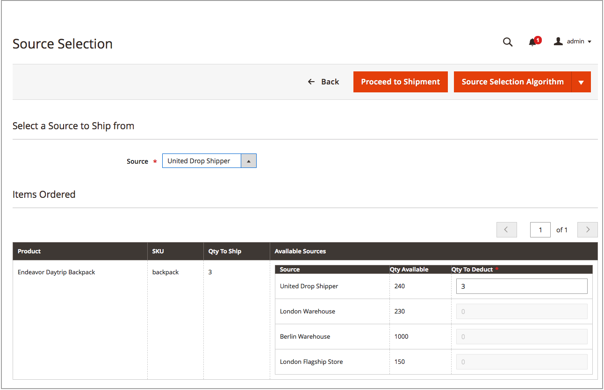

# Erstellen von Sendungen aus mehreren Quellen

Mit [!DNL Inventory Management], senden Sie einen oder mehrere Sendungen, da Sie über Inventar verfügen. Um bei Bedarf weitere Sendungen zu erstellen, wiederholen Sie diese Anweisungen unter Verwendung empfohlener oder manuell eingegebener Mengen und Quellen. In diesen Anweisungen wird beschrieben, wie Händler mit mehreren Quellen Sendungen senden. Einzelquellenhändler senden Sendungen ohne diese zusätzlichen Schritte (siehe [Erstellen einer Sendung](../stores-purchase/shipments.md#create-a-shipment){target="_blank"} im Benutzerhandbuch zur Kernbenutzeroberfläche).

Verwenden Sie beim Erstellen von Sendungen den Quellauswahlalgorithmus für berechnete Empfehlungen. Befolgen Sie diese Empfehlungen und verwenden Sie sie oder legen Sie die Beträge pro Quelle fest, indem Sie benutzerdefinierte Sendungen generieren. Sie kontrollieren Ihren ausgehenden Bestand für jede Bestellung, legen die abzugsfähigen Mengen fest, senden einen oder mehrere Sendungen und liefern Lagerbestände und Rückstände, da Bestand verfügbar ist. Geben Sie für jeden Zeileneintrag in der Reihenfolge einen Abzugsbetrag von der Quellmenge an.

Sie können Teilsendungen an folgende Empfänger senden:

- Aufstockung bei Bestandsaufnahme

- Bestandsabzüge über Quellen hinweg

Bei der Verschiffung werden die von Ihnen eingenommenen Lagerbestandsmengen abgesetzt. In der Tat konvertieren Reservierungen in tatsächliche Mengenabzüge.

## Erstellen einer Sendung

1. Im _Admin_ Seitenleiste, navigieren Sie zu **[!UICONTROL Sales]** > **[!UICONTROL Orders]**.

1. Suchen Sie die Reihenfolge und öffnen Sie sie im Ansichtsmodus.

1. Wenn die Bestellung bezahlt und in Rechnung gestellt wird und versandbereit ist, klicken Sie auf **[!UICONTROL Ship]**.

1. Füllen Sie die Quellauswahl für den Versand von Produkten pro Quelle aus:

   - Um Empfehlungen zum Versand anzuzeigen, klicken Sie auf **[!UICONTROL Source Selection Algorithm]** und wählen Sie einen Algorithmus aus.

     | Algorithmus | Beschreibung |
     |--|--|
     | [Quellpriorität](source-priority-algorithm.md) | Empfiehlt Sendungen aus Quellen entsprechend den Bestellungen der dem Lager zugewiesenen Quellen. |
     | [Distance Priority](distance-priority-algorithm.md) | Empfiehlt Sendungen aus Quellen, die der Lieferadresse am nächsten sind, auf der Grundlage der physischen Entfernung oder der kürzesten Lieferzeit. |

     >[!IMPORTANT]
     >
     >Bei Verwendung des Distance Priority-Algorithmus für Versand und Routen und Daten werden für die ausgewählte [Berechnungsmodus](distance-priority-algorithm.md) (Fahren, Radfahren oder Gehen) für eine Sendung verwendet wird, wird der SSA standardmäßig auf die Quellpriorität gesetzt. Es wird empfohlen, auch die [Priorität für Quellen je Bestand](stocks-prioritize-sources.md).

   - Für  **[!UICONTROL Select a Source to Ship from]**, wählen Sie eine Quelle aus, um eine Sendung zu versenden.

   - Behalten Sie für jeden Zeileneintrag den empfohlenen Betrag bei oder geben Sie einen bestimmten Betrag in das Feld **[!UICONTROL Qty to Deduct]**. Dieser Wert gibt den Betrag an, der vom Bestand der ausgewählten Quelle abgezogen wird.

   - Klicken **[!UICONTROL Proceed to Shipment]**.

     {width="350" zoomable="yes"}

1. Überprüfen Sie die _[!UICONTROL New Shipment]_und geben Sie bei Bedarf zusätzliche Änderungen ein.

   Die _[!UICONTROL Inventory]_zeigt die Quelle, den Versand von Produkten, die bestellte Gesamtmenge und die versandfähige Menge an.

   {width="350" zoomable="yes"}

1. Klicks **[!UICONTROL Submit Shipment]** zu beenden.
