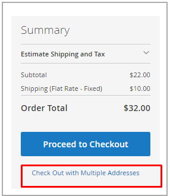

# Bestellungen und Sendungen verwalten

[!DNL Inventory Management] enthält zusätzliche Funktionen und Optionen für die Verwaltung der Lagermengen während des Versandprozesses. Wenn Sie Lieferungen prüfen und ausführen, Bestellungen stornieren und Gutschriften ausstellen, werden die verkäuflichen Produktmengen und Lagerbestände automatisch aktualisiert.

Diese Informationen enthalten Einzelheiten zu [!DNL Inventory Management]. Weitere Informationen finden Sie unter dem [Bestellungen](../stores-purchase/orders.md){target="_blank"} im _Handbuch zu Vertriebs- und Kauferlebnissen_.

## Bestellungen

[!DNL Commerce] unterstützt Standardbestellungen mit mehreren Adressen und Einzelbestellungen ohne zusätzliche Konfigurationen. Wenn Kunden oder Mitarbeiter Bestellungen eingeben, verfolgt [!DNL Inventory Management] den Lagerbestand mithilfe von Reservierungen für die Verkaufsmenge, wobei für fakturierte und versendete Produkte die Lagermenge abgezogen wird.

### Bestellungen mit mehreren Adressen

Bei Bestellungen mit mehreren Adressen wird eine Reihe von Einzelbestellungen generiert - eine für jede eingegebene Zieladresse. Während des Checkouts wählen Kunden jeden Satz von Produkten aus, die pro Adresse während des Checkouts als Einzelbestellungen entsprechend der Zieladresse zugeordnet sind. Jede Bestellung enthält die zugehörigen Produkte pro Adresse.

[!DNL Commerce] verwaltet den Bestand für diese Bestellungen mit mehreren Adressen genau wie Einzelbestellungen. Sie ermöglicht Empfehlungen oder Überschreibungen des Source-Auswahlalgorithmus während des Versands, Teillieferungen, Stornierungen von Aufträgen und Rückerstattungen mit Lageraktualisierungen.

{width="350" zoomable="yes"}

### Erstattungen

Wenn Sie eine [Gutschrift](../stores-purchase/credit-memo-create.md){target="_blank"} eingeben, um eine Rückerstattung auszustellen, können Sie die Produktmenge an die abgezogene Quelle zurücksenden. Die Bestellinformationen umfassen die Lagerquelle, aus der das Produkt versandt wurde. Es wird empfohlen, die zurückgegebene Produktmenge durch eine Gutschrift zu belegen, wenn Sie das zurückgegebene Produkt erhalten.

{width="350" zoomable="yes"}

### Nicht versendete Bestellungen stornieren

Wenn eine Bestellung noch nicht versendet wurde und storniert wird (ganz oder teilweise), gibt [!DNL Inventory Management] den Warenbestand automatisch auf die verkaufbare Menge zurück. Bis zur Rechnungsstellung und dem Versand werden die gekauften Produkte für die verkaufbare Menge reserviert, nicht von der tatsächlichen Menge abgezogen. Zum Zeitpunkt der Rechnungsstellung und des Versands der Bestellung wandelt das System die Reservierung in einen Bestandsabzug um.

Hinter den Kulissen gibt [!DNL Inventory Management] automatisch eine Ausgleichsreservierung ein, wodurch die Sperrung der Produktmenge aufgehoben wird. Die Menge kehrt zur aggregierten virtuellen Verkaufsmenge zurück.

## Sendungen

Wenn [!DNL Inventory Management] aktiviert ist, können Sie Teilsendungen oder komplette Lieferungen aus einer oder mehreren Quellen versenden, um Bestellungen zu erfüllen. Sie steuern Ihren ausgehenden Bestand für jede Bestellung, legen die abzuziehenden Beträge fest, versenden eine oder mehrere Lieferungen und liefern Lagerbestände und Nachbestellungen, sobald der Bestand verfügbar ist. Geben Sie für jeden Einzelposten im Auftrag einen Betrag ein, der von der Bezugsmenge abgezogen werden soll. Generieren Sie eine Lieferung pro Quelle, da Sie Lagerbestand haben, bis die gesamte Bestellung erfüllt ist.

### Teillieferungen

Bei Händlern mit mehreren Bezugsquellen generiert [!DNL Commerce] für jede ausgewählte Bezugsquelle eine Lieferung. Im allgemeinen Workflow können Sie eine Quelle auswählen, die abzuziehende Produktmenge festlegen, um die Bestellung zu erfüllen, und mit der Lieferung fortfahren. Erstellen Sie nach Abschluss des Vorgangs zusätzliche Lieferungen für jede Bezugsquelle, bis Sie die Bestellung ausgeführt haben.

Einzelhändler können auch Teilsendungen durchführen, um Nachbestellungen oder Lagerbestände zu unterstützen, wenn Bestellungen für beliebte Artikel eingehen.

### Auswahlalgorithmus für Recommendations und Source

Der [Source Selection Algorithm](selection-reservations.md) (SSA) bietet Empfehlungen für Teil- und Vollsendungen. Sie können beim Erstellen von Lieferrechnungen für einen Auftrag auf Source-Auswahlalgorithmen zugreifen. Führen Sie auf der Seite Versand jederzeit den Source-Prioritäts- oder Distanzprioritätsalgorithmus aus, um die besten Optionen für den Abgleich von Bestellmengen und verfügbaren Quellen zu ermitteln. Das System unterstützt den Versand einer vollständigen Bestellung aus einer Quelle und die Aufteilung der Bestellung in mehrere Teillieferungen aus mehreren Quellen. Sie können auf diese Optionen für die sofortige Erfüllung und gestaffelte Sendungen zugreifen, um kleinere Mengen im Laufe der Zeit zu versenden.

Um eine Bestellung abzuschließen und zu versenden, muss sie eine Zahlung abgeschlossen haben und in Rechnung gestellt werden. Derzeit können Sie die SSA für Empfehlungen erneut ausführen und aus einer oder mehreren Quellen versenden oder die SSA-Empfehlungen mit manuell eingestellten Quellen und Mengen überschreiben, um die Lieferung zu erfüllen.

- Es wird empfohlen, die SSA erneut auszuführen, um die Empfehlungen für jede Sendung zu überprüfen.

- Wenn Sie die Auswahl ändern möchten, können Sie manuelle Quellabzüge überschreiben.

### Lieferungen und Reservierungen

Wenn Lieferungen entstehen, werden Reservierungen für Produkte gelöscht und die Produktmenge wird abgezogen. Die Lagerbestandsmenge pro Lager wird auf der Grundlage der Lieferdetails aktualisiert. Wenn Sie beispielsweise Lieferungen für zehn Produkte aus zwei Quellen versenden, werden für diese Quellen jeweils 10 Mengen abgezogen. Die verkaufsfähige Menge wird automatisch für zugehörige Lager aktualisiert, um Kunden und Mitarbeitern die neuesten Produktmengen zur Verfügung zu stellen. Und die Reservierungen sind vollständig geklärt, nicht mehr auf die verkaufsfähige Menge angerechnet.
