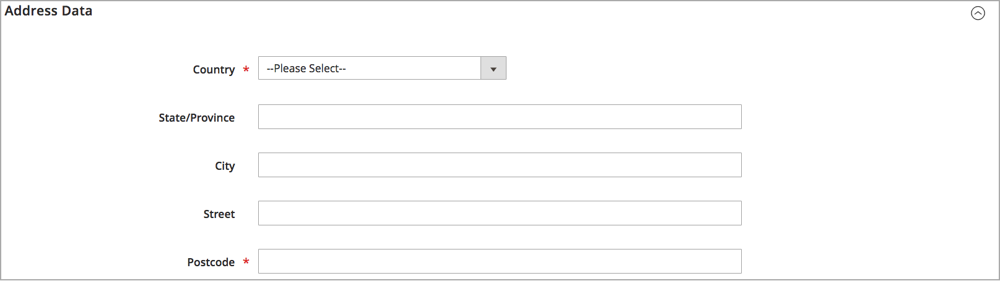

# Quelle hinzufügen

Verwalten Sie die Inventar- und Bestellabwicklung von mehreren Standorten aus mit benutzerdefinierten Quellen. Erstellen Sie für jeden Standort eine Quelle, z. B. Lager, stationäre Läden, Vertriebszentren und Ablieferer. Zuweisen von Quellen und Aktualisieren von Mengen pro Produkt

Wenn Sie die standardmäßige Source bearbeiten, können Sie alle Konfigurationen mit Ausnahme von Name und Code bearbeiten. Es wird empfohlen, dass Händler aus einer Hand Informationen hinzufügen, die ihrem Standort entsprechen.

## Hinzufügen einer Inventarquelle

1. Navigieren Sie in _Admin_-Seitenleiste zu **[!UICONTROL Stores]** > _[!UICONTROL Inventory]_>**[!UICONTROL Sources]**.

1. Klicken Sie auf **[!UICONTROL Add New Source]**.

   

1. Erweitern Sie  den Abschnitt **[!UICONTROL General]** und führen Sie folgende Schritte aus:

   - Geben Sie eine eindeutige **[!UICONTROL Name]** ein, um die Lagerquelle zu identifizieren.

   - Eindeutige **[!UICONTROL Code]** eingeben.

     Der Code unterstützt Groß- und Kleinbuchstaben, Zahlen, Bindestriche und Unterstriche. Der Code ist eine eindeutige ID, die bei der Zuweisung zu Stock-Daten und beim Export/Import von Daten verwendet wird.

   - Wenn diese Bestandsquelle einsatzbereit ist, setzen Sie **[!UICONTROL Is Enabled]** auf `Yes`.

   - Geben Sie einen kurzen **[!UICONTROL Description]** für diesen Speicherort ein, um einen schnellen Überblick oder zusätzliche Details zu erhalten.

   - Für **[!UICONTROL Latitude]** und **[!UICONTROL Longitude]** geben Sie die GPS-Koordinaten (Global Positioning System) des Standorts der Einrichtung ein.

     Um die GPS-Koordinaten mit [Google Maps](https://www.google.com/maps) zu finden, geben Sie die Adresse in das Suchfeld ein. Klicken Sie mit der rechten Maustaste auf die Markierung auf der Karte und wählen Sie **[!UICONTROL What's here?]**. Die GPS-Koordinaten werden im Detailfeld unter der Straßenadresse angezeigt.

     

   - Wenn diese Lagerquelle ein Abholort ist, setzen Sie **[!UICONTROL Use as Pickup Location]** auf `Yes`.

     Die standardmäßige Source kann nicht als Abholort für Abholaufträge in Geschäften verwendet werden.

1. Erweitern Sie  den Abschnitt **[!UICONTROL Contact Info]** und führen Sie folgende Schritte aus:

   - Geben Sie **[!UICONTROL Contact Name]** den vollständigen Namen des primären Kontakts an der Position ein.

   - Geben Sie eine **[!UICONTROL Email]** Adresse für die Kontaktaufnahme mit dem Standort ein.

   - Geben Sie **[!UICONTROL Phone]** die Vorwahl und Telefonnummer ein.

   - Geben Sie **[!UICONTROL Fax]** die Vorwahl und Telefonnummer des Faxgeräts ein, sofern verfügbar.

     

1. Erweitern Sie  den Abschnitt **[!UICONTROL Address Data]** und führen Sie folgende Schritte aus:

   - Wählen Sie die **[!UICONTROL Country]** aus.

   - Geben Sie **[!UICONTROL State/Province]** die Standardabkürzung für das Bundesland oder die Provinz ein.

   - Geben Sie die **[!UICONTROL City]** ein.

   - Geben Sie die physische **[!UICONTROL Street]** ein.

   - Geben Sie **[!UICONTROL Postcode]** die Postleitzahl ein.

     

1. Wenn Sie die Quelle im vorherigen Schritt als Abruftabelle festgelegt haben, erweitern Sie  den Abschnitt **[!UICONTROL Pickup Location]** und geben Sie beschreibende Informationen zum Speicherort an:

   - Geben Sie die **[!UICONTROL Frontend Name]** des Abholorts ein.

   - Geben Sie eine **[!UICONTROL Frontend Description]** des Abholorts ein. Verwenden Sie dieses Textfeld, um Geschäftszeiten, den Standort relativ zu anderen Sehenswürdigkeiten oder andere nützliche Informationen anzuzeigen, die dem Kunden bei der Auswahl des richtigen Abholorts helfen.

     

   Weitere Informationen zum Konfigurieren von E-Mail-Benachrichtigungen bei Verwendung einer Quelle als Abholort finden Sie unter [Verkaufs-E](../configuration-reference/sales/sales-emails.md) im _Konfigurationshandbuch_.

1. Führen Sie einen der folgenden Schritte aus, um Ihre Arbeit zu speichern:

   - Um Ihre Arbeit zu speichern und mit der Bearbeitung fortzufahren, klicken Sie auf **[!UICONTROL Save & Continue]**.

   - Um Ihre Arbeit zu speichern und zur Seite „Quellen verwalten“ zurückzukehren, klicken Sie auf den Abwärtspfeil () und wählen Sie **[!UICONTROL Save & Close]**.

   - Um Ihre Arbeit am aktuellen Quelldatensatz zu speichern und eine neue Quelle einzugeben, wählen Sie **[!UICONTROL Save & New]** aus.

## Schaltflächenleiste

| Schaltfläche | Beschreibung |
|--|--|
| [!UICONTROL Back] | Kehrt zur Seite Quellen verwalten zurück. |
| [!UICONTROL Reset] | Stellt alle Felder im Formular auf ihre Werte zum Zeitpunkt des letzten Speicherns zurück. |
| [!UICONTROL Save & Continue] | Speichert alle Änderungen und lässt das Formular zur weiteren Bearbeitung geöffnet. Klicken Sie auf den Abwärtspfeil, um weitere Optionen anzuzeigen:  **[!UICONTROL Save & Close]**- Speichert Änderungen am aktuellen Datensatz, schließt das Formular und kehrt zur Seite „Quellen verwalten“ zurück. **[!UICONTROL Save & New]** - Speichert Änderungen, schließt den aktuellen Datensatz und öffnet ein neues leeres Formular. |

## Feldbeschreibungen

| Feld | Beschreibung |
|--|--|
| **[!UICONTROL General]** | |
| [!UICONTROL Name] | (Erforderlich) Ein eindeutiger Name, der die Inventarquelle für Admin-Benutzerinnen und -Benutzer identifiziert. |
| [!UICONTROL Code] | (Erforderlich) Ein eindeutiger alphanumerischer Code, der vom System zur Identifizierung der Inventarquelle verwendet wird. Geben Sie den Code in Groß- oder Kleinbuchstaben und/oder Zahlen ohne Leerzeichen ein. Bei Bedarf kann anstelle eines Leerzeichens ein Bindestrich oder ein Unterstrich verwendet werden. Der Code kann nach der Erstellung der Quelle nicht bearbeitet werden. Es handelt sich um eine eindeutige ID, die verwendet wird, wenn Sie Lagerbeständen Quellen zuweisen und Produktdaten exportieren und/oder importieren. |
| [!UICONTROL Is Enabled] | Legt fest, ob die Bestandsquelle verwendet werden kann. Optionen: Ja / Nein |
| [!UICONTROL Description] | Eine kurze Beschreibung des Lagerplatzes der Bestandsquelle. Enthalten Details, die für Ihre Admin-Benutzer hilfreich sind. |
| [!UICONTROL Latitude] | Gibt die Breitenkoordinate der Inventarquelle für GPS an. Geben Sie den Wert als Zahl ein, gefolgt von einem Plus- oder Minuszeichen nach Bedarf. Das Gradsymbol und die Buchstaben sind nicht erlaubt. Beispiel: Latitude 32.7555 |
| [!UICONTROL Longitude] | Gibt die Längenkoordinate der Inventarquelle für GPS an. Geben Sie den Wert als Zahl ein, gefolgt von einem Plus- oder Minuszeichen nach Bedarf. Das Gradsymbol und die Buchstaben sind nicht erlaubt. Beispiel: `-97.3308` |
| **[!UICONTROL Contact Info]** | |
| [!UICONTROL Contact Name] | Der Name des primären Kontakts am Lagerort der Lagerquelle. |
| [!UICONTROL Email] | Die E-Mail des primären Kontakts. |
| [!UICONTROL Phone] | Die Ortsvorwahl und Telefonnummer des Hauptansprechpartners in dem von Ihnen bevorzugten Format. Beispiel: `(123) 456-7890` oder `123-456-7890` |
| [!UICONTROL Fax] | Die Vorwahl und Faxnummer des Hauptkontakts. |
| **[!UICONTROL Address Data]** | |
| [!UICONTROL Country] | (Erforderlich) Das Land, in dem sich die Bestandsquelle befindet. |
| [!UICONTROL State/Province] | Das Bundesland oder die Provinz, in dem bzw. der sich die Bestandsquelle befindet. |
| [!UICONTROL City] | Die Stadt, in der sich die Bestandsquelle befindet. |
| [!UICONTROL Street] | Die Straßenadresse der Inventarquelle. |
| [!UICONTROL Postcode] | (Erforderlich) Die Postleitzahl der Bestandsquelle. |
| **[!UICONTROL Pickup Location]** | |
| [!UICONTROL Frontend Name] | Der Name des Abholorts für die Quelle, der auf der Storefront angezeigt wird. |
| [!UICONTROL Frontend Description] | Die Beschreibung des Abholspeicherorts für die Quelle, die auf der Storefront angezeigt wird. Es kann angehängte Bilder enthalten. |
