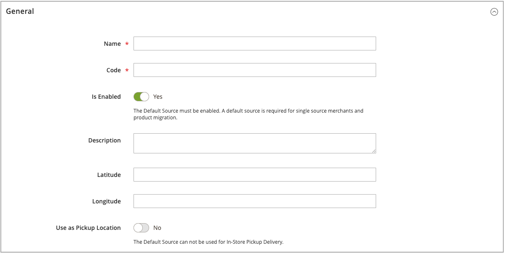

# Quelle hinzufügen

Verwalten Sie Inventar- und Auftragserfüllung von mehreren Standorten mit benutzerdefinierten Quellen. Erstellen Sie für jeden Standort eine Quelle, z. B. Lagerhäuser, Bausteine- und Mörtelgeschäfte, Vertriebszentren und Spediteure. Zuweisen von Quellen und Aktualisieren von Mengen pro Produkt

Beim Bearbeiten der Standardquelle können Sie alle Konfigurationen mit Ausnahme von Name und Code bearbeiten. Es wird empfohlen, Einzelquell-Händler Informationen hinzuzufügen, die ihrem Standort entsprechen.

## Hinzufügen einer Inventarquelle

1. Im _Admin_ Seitenleiste, navigieren Sie zu **[!UICONTROL Stores]** > _[!UICONTROL Inventory]_>**[!UICONTROL Sources]**.

1. Klicken **[!UICONTROL Add New Source]**.

   

1. Erweitern  die **[!UICONTROL General]** und führen Sie folgende Schritte aus:

   - Geben Sie eine eindeutige **[!UICONTROL Name]**.

   - Eindeutige Eingabe **[!UICONTROL Code]**.

     Der Code unterstützt Groß- und Kleinbuchstaben, Zahlen, Gedankenstriche und Unterstriche. Der Code ist eine eindeutige ID, die beim Zuweisen zu Lager- und Export-/Import-Daten verwendet wird.

   - Wenn diese Inventarquelle einsatzbereit ist, legen Sie **[!UICONTROL Is Enabled]** nach `Yes`.

   - Kurzbeschreibung eingeben **[!UICONTROL Description]** für diesen Ort, um kurze Informationen oder zusätzliche Details zu erhalten.

   - Für **[!UICONTROL Latitude]** und **[!UICONTROL Longitude]**, geben Sie die GPS-Koordinaten (Global Positioning System) der Anlage an.

     So suchen Sie die GPS-Koordinaten mit [Google Maps][1], geben Sie die Adresse in das Suchfeld ein. Klicken Sie mit der rechten Maustaste auf die Markierung auf der Karte und wählen Sie **[!UICONTROL What's here?]**. Die GPS-Koordinaten werden im Detailfeld unter der Straßenadresse angezeigt.

     

   - Wenn diese Inventarquelle ein Abholort ist, legen Sie **[!UICONTROL Use as Pickup Location]** nach `Yes`.

     Die Standardquelle kann nicht als Abholort für In-Store-Abholaufträge verwendet werden.

1. Erweitern  die **[!UICONTROL Contact Info]** und führen Sie folgende Schritte aus:

   - Für **[!UICONTROL Contact Name]**, geben Sie den vollständigen Namen des Hauptkontakts an.

   - Geben Sie eine **[!UICONTROL Email]** Adresse zur Kontaktaufnahme mit dem Standort.

   - Für **[!UICONTROL Phone]**, geben Sie den Ortscode und die Telefonnummer ein.

   - Für **[!UICONTROL Fax]**, geben Sie gegebenenfalls die Ortsnummer und Telefonnummer des Faxgeräts an.

     

1. Erweitern  die **[!UICONTROL Address Data]** und führen Sie folgende Schritte aus:

   - Wählen Sie die **[!UICONTROL Country]**.

   - Für **[!UICONTROL State/Province]** die Standardabkürzung für das Bundesland oder die Bundesrepublik Deutschland.

   - Geben Sie die **[!UICONTROL City]**.

   - Physische Daten eingeben **[!UICONTROL Street]** Adresse.

   - Für **[!UICONTROL Postcode]**, geben Sie die Postleitzahl ein.

     

1. Wenn Sie die Quelle im vorherigen Schritt als Pickup-Position festlegen, erweitern Sie  die **[!UICONTROL Pickup Location]** und beschreibende Informationen zum Standort bereitstellen:

   - Geben Sie die **[!UICONTROL Frontend Name]** des Abholorts.

   - Geben Sie einen **[!UICONTROL Frontend Description]** des Abholorts. Verwenden Sie dieses Textfeld, um Store-Stunden, den Standort relativ zu anderen Wahrzeichen oder andere nützliche Informationen anzuzeigen, die dem Kunden bei der Auswahl des richtigen Pickup-Standorts helfen.

     

   Weitere Informationen zum Konfigurieren von E-Mail-Benachrichtigungen bei der Verwendung einer Quelle als Abmeldeort finden Sie unter [Verkaufs-E-Mails](../configuration-reference/sales/sales-emails.md) im _Konfigurationshandbuch_.

1. Führen Sie einen der folgenden Schritte aus, um Ihre Arbeit zu speichern:

   - Um Ihre Arbeit zu speichern und die Bearbeitung fortzusetzen, klicken Sie auf **[!UICONTROL Save & Continue]**.

   - Um Ihre Arbeit zu speichern und zur Seite Quellen verwalten zurückzukehren, klicken Sie auf den Abwärtspfeil () und wählen Sie **[!UICONTROL Save & Close]**.

   - Um Ihre Arbeit am aktuellen Quelldatensatz zu speichern und eine neue Quelle einzugeben, wählen Sie **[!UICONTROL Save & New]**.

## Schaltflächenleiste

| Schaltfläche | Beschreibung |
|--|--|
| [!UICONTROL Back] | Kehrt zur Seite Quellen verwalten zurück. |
| [!UICONTROL Reset] | Setzt alle Felder im Formular zum Zeitpunkt der letzten Speicherung auf ihre Werte zurück. |
| [!UICONTROL Save & Continue] | Speichert alle Änderungen und behält das Formular für die weitere Bearbeitung offen. Klicken Sie auf den Abwärtspfeil, um weitere Optionen anzuzeigen: **[!UICONTROL Save & Close]**- Speichert Änderungen am aktuellen Datensatz, schließt das Formular und kehrt zur Seite Quellen verwalten zurück. **[!UICONTROL Save & New]** - Speichert Änderungen, schließt den aktuellen Datensatz und öffnet ein neues leeres Formular. |

## Feldbeschreibungen

| Feld | Beschreibung |
|--|--|
| **[!UICONTROL General]** | |
| [!UICONTROL Name] | (Erforderlich) Ein eindeutiger Name, der die Inventarquelle für Admin-Benutzer angibt. |
| [!UICONTROL Code] | (Erforderlich) Ein eindeutiger alphanumerischer Code, der vom System zur Identifizierung der Inventarquelle verwendet wird. Geben Sie den Code in Groß- oder Kleinbuchstaben und/oder Zahlen ohne Leerzeichen ein. Bei Bedarf können Bindestriche oder Unterstriche anstelle von Leerzeichen verwendet werden. Der Code kann nach der Erstellung der Quelle nicht mehr bearbeitet werden. Es handelt sich dabei um eine eindeutige ID, die verwendet wird, wenn Sie Ressourcen zuweisen und Produktdaten exportieren und/oder importieren. |
| [!UICONTROL Is Enabled] | Bestimmt, ob die Inventarquelle zur Verwendung verfügbar ist. Optionen: Ja/Nein |
| [!UICONTROL Description] | Eine kurze Beschreibung der Position der Inventarquelle. Fügen Sie Details hinzu, die Ihren Admin-Benutzern hilfreich sind. |
| [!UICONTROL Latitude] | Gibt die Breitenkoordinate der Inventarquelle für GPS an. Geben Sie den Wert als Zahl ein, dem je nach Bedarf ein Plus- oder Minuszeichen vorangestellt wird. Das Symbol und die Buchstaben des Abschlusses sind nicht zulässig. Beispiel: Latitude 32.7555 |
| [!UICONTROL Longitude] | Gibt die Längenkoordinate der Inventarquelle für GPS an. Geben Sie den Wert als Zahl ein, dem je nach Bedarf ein Plus- oder Minuszeichen vorangestellt wird. Das Symbol und die Buchstaben des Abschlusses sind nicht zulässig. Beispiel: `-97.3308` |
| **[!UICONTROL Contact Info]** | |
| [!UICONTROL Contact Name] | Der Name des Hauptkontakts am Speicherort der Inventarquelle. |
| [!UICONTROL Email] | Die E-Mail des Hauptkontakts. |
| [!UICONTROL Phone] | Die Ortskennung und Telefonnummer des Hauptkontakts in dem von Ihnen bevorzugten Format. Beispiel: `(123) 456-7890` oder `123-456-7890` |
| [!UICONTROL Fax] | Die Ortskennung und Faxnummer des Hauptkontakts. |
| **[!UICONTROL Address Data]** | |
| [!UICONTROL Country] | (Erforderlich) Das Land, in dem sich die Inventarquelle befindet. |
| [!UICONTROL State/Province] | Das Bundesland oder die Provinz, in dem sich die Inventarquelle befindet. |
| [!UICONTROL City] | Die Stadt, in der sich die Inventarquelle befindet. |
| [!UICONTROL Street] | Die Straßenadresse der Inventarquelle. |
| [!UICONTROL Postcode] | (Erforderlich) Die Postleitzahl der Inventarquelle. |
| **[!UICONTROL Pickup Location]** | |
| [!UICONTROL Frontend Name] | Der Name des Abholorts für die Quelle, die auf der Storefront angezeigt wird. |
| [!UICONTROL Frontend Description] | Die Beschreibung der Abholposition für die Quelle, die auf der Storefront angezeigt wird. Er kann angehängte Bilder enthalten. |

[1]: https://www.google.com/maps
