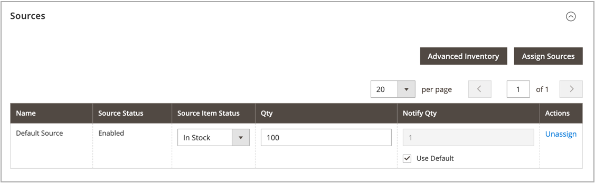

# Zuweisen von Quellen pro Produkt

Bevor Sie Mengen und Einstellungen ändern, müssen Sie [Quellen](sources-manage.md) den Produkten zuweisen.

{{$include /help/_includes/unassign-source.md}}

## Zuweisen von Quellen zu einem Produkt

1. Navigieren Sie in der _Admin_-Seitenleiste zu **[!UICONTROL Catalog]** > **[!UICONTROL Products]**.

1. Öffnen Sie ein Produkt im _Bearbeiten_-Modus.

1. Erweitern Sie  den Abschnitt **[!UICONTROL Sources]** .

   In diesem Abschnitt können Sie die Quelle ändern, Lagermengen aktualisieren und vieles mehr.

   >[!NOTE]
   >
   >Derzeit unterstützen nur einfache, konfigurierbare, virtuelle, herunterladbare und gruppierte Produkte mehrere Quellen. Bundle-Produkte können nur mit dem standardmäßigen Source und Stock erstellt und verwaltet werden.

   {width="600" zoomable="yes"}

1. Um eine Quelle hinzuzufügen, klicken Sie auf **[!UICONTROL Assign Sources]**.

1. Aktivieren Sie auf der Seite _[!UICONTROL Assign Sources]_&#x200B;das Kontrollkästchen neben jeder Quelle, die Sie für das Produkt zuweisen möchten.

   {width="600" zoomable="yes"}

1. Klicken Sie auf **[!UICONTROL Done]** , um die Quellen hinzuzufügen.

1. Führen Sie einen der folgenden Schritte aus, um zu speichern:

   - Klicken Sie auf **[!UICONTROL Save]**.
   - Wählen Sie im Menü _[!UICONTROL Save]_() die Option **[!UICONTROL Save & Close]**.

Aktualisieren Sie nach der Zuordnung von Quellen [Lagermenge](quantities-assign-per-product.md) für jede Produktquelle.

<!-- Last updated from includes: 2022-08-30 15:36:09 -->
