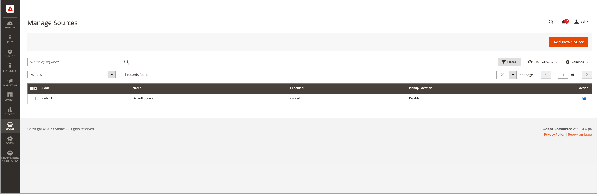

# Verwalten von Quellen

Quellen sind die physischen Orte, an denen das Produktinventar verwaltet und zur Auftragserfüllung versendet wird oder an denen Services verfügbar sind. Zu diesen Standorten können Lagerhäuser, stationäre Geschäfte, Verteilzentren, Abholstandorte und Verlader gehören. Sie ordnen diesen Quellen Lagermengen zu und aggregiert [!DNL Commerce] automatisch die gesamten verkaufsfähigen Produkte für Ihre Lager. Fügen Sie für große Unternehmen mehrere Quellen für alle Ihre Standorte hinzu: an verschiedenen geografischen Standorten nach Land und Kontinent, Standorte in einer Stadt, basierend auf der Art des Inventars, sogar basierend auf Dienstleistungen.

Es wird empfohlen, beim Erstellen einer Quelle bestimmte physische geografische Positionen anzugeben. Dadurch kann der _Distance Priority Algorithm_ den Standort der Versandzieladresse mit den verfügbaren Quellstandorten vergleichen, um die nächstgelegene Quelle für die Erfüllung von Sendungen zu ermitteln. Sie können Google Maps oder Offline-Berechnungen verwenden, die Geocodes verwenden. Weitere Informationen zu diesem _Distance Priority Algorithm_ finden Sie unter [Konfigurieren des Distance Priority Algorithm](distance-priority-algorithm.md).

Beginnen Sie mit einer _Standard-Source_ die Sie aktualisieren, aber nicht deaktivieren können. Diese Quelle wird von Einzelhändler und für die Produktmigration verwendet. Sie benötigen immer eine Standardquelle.

- **Standortinformationen** - Jede Quelle enthält den Namen, das Land, die physische Adresse des Standorts und eine Kontaktstelle.
- **Aktivieren von Ressourcen** - Sie können Quellen nach Bedarf aktivieren und deaktivieren. Aktivieren Sie eine Quelle nur, wenn sie Bestellungen und Auftragsrückstände akzeptiert und erfüllt.
- **Verfügbarer Bestand** - Weisen Sie Lagermengen für jede Quelle über die Produktseite zu und aktualisieren Sie sie. Die Lagermengen werden über die Quell- und Bestandszuordnung berechnet, bereitgestellt und reserviert.

Das folgende Diagramm veranschaulicht die Quellen für einen Fahrradhändler, der ein Mountainbike verkauft. Diese Quellen sind für Lager verfügbar und können von der SSA für Sendungen genutzt werden.

{width="600" zoomable="yes"}

Alle Stores beginnen mit einer standardmäßigen Source, die aktiviert bleiben muss:

- Alle neuen Produkte, die in [!DNL Commerce] importiert werden, benötigen eine Quelle und einen Lagerbestand, die automatisch für den sofortigen Zugriff auf [!DNL Inventory Management] zugewiesen werden.
- Händler, die nur eine Bezugsquelle haben, verwenden die standardmäßige Source als zentralen Lagerort und Versandort.

## Quellen bearbeiten

Sie können den Namen, die Adresse, den GPS-Standort und die Kontaktinformationen aktualisieren. Der Quell-Code ist ein geschützter Wert, der als eindeutige ID dient, die die Quelle mit Ihren Produktmengen und Lagerbeständen verknüpft.

Wenn Sie die standardmäßige Source bearbeiten, können Sie alle Konfigurationen mit Ausnahme des Namens und des Codes bearbeiten. Es wird empfohlen, dass Händler aus einer Hand Informationen hinzufügen, die ihrem Standort entsprechen.

Auf der _[!UICONTROL Manage Sources]_&#x200B;Seite werden alle verfügbaren Lagerplätze und Erfüllungseinrichtungen aufgelistet. Sie können neue Inventarquellen hinzufügen und vorhandene Standorte bearbeiten.

1. Navigieren Sie in _Admin_-Seitenleiste zu **[!UICONTROL Stores]** > _[!UICONTROL Inventory]_>**[!UICONTROL Sources]**.

1. Informationen zum Hinzufügen eines Inventarspeicherorts finden Sie unter [Hinzufügen einer neuen Source](sources-add.md).

1. Suchen Sie die Inventarquelle und öffnen Sie sie im _Bearbeiten_-Modus.

1. Informationen aktualisieren und Änderungen speichern.

   {width="600" zoomable="yes"}

## Schaltflächenleiste

| Schaltfläche | Beschreibung |
|--|--|
| [!UICONTROL Add New Source] | Öffnet das Formular „Neue Source&quot;, in das eine neue Lagerquelle, eine neue Erfüllung oder ein neuer Lagerort eingegeben wird. |

## Spaltenbeschreibungen für Quellen verwalten

| Spalte | Beschreibung |
|--|--|
| [!UICONTROL Code] | Ein eindeutiger alphanumerischer Code, der vom System zur Identifizierung der Inventarquelle verwendet wird. |
| [!UICONTROL Name] | Ein eindeutiger Name, der die Inventarquelle für Admin-Benutzerinnen und -Benutzer identifiziert. |
| [!UICONTROL Is Enabled] | Gibt an, ob die Bestandsquelle aktiv und verwendbar ist. |
| [!UICONTROL Pickup Location] | Gibt an, ob die Quelle als Abholort für den [Versand im Geschäft) aktiv &#x200B;](../stores-purchase/shipping-in-store-delivery.md). |
| [!UICONTROL Action] | Durch Klicken auf **[!UICONTROL Edit]** wird der Inventarquellendatensatz im Bearbeitungsmodus geöffnet. |

## Andere Spalten

| Spalte | Beschreibung |
|--- |--- |
| [!UICONTROL Latitude] | Gibt die Breitenkoordinate der Inventarquelle für GPS an. Geben Sie den Wert als Zahl ein, gefolgt von einem Plus- oder Minuszeichen nach Bedarf. Das Gradsymbol und die Buchstaben sind nicht erlaubt. Beispiel: `32.7555` |
| [!UICONTROL State/Province] | Das Bundesland, in dem sich die Quelle befindet. |
| [!UICONTROL Postcode] | Die Postleitzahl der Quelle. |
| [!UICONTROL Email] | Die E-Mail des primären Kontakts. |
| [!UICONTROL Longitude] | Gibt die Längenkoordinate der Inventarquelle für GPS an. Geben Sie den Wert als Zahl ein, gefolgt von einem Plus- oder Minuszeichen nach Bedarf. Das Gradsymbol und die Buchstaben sind nicht erlaubt. Beispiel: Längengrad -97,3308 |
| [!UICONTROL City] | Die Stadt, in der sich die Quelle befindet. |
| [!UICONTROL Phone] | Die Telefonnummer des primären Kontakts. |
| [!UICONTROL Country] | Das Land, in dem sich die Quelle befindet. |
| [!UICONTROL Street] | Die Straße und Adresse der Quelle. |
| [!UICONTROL Fax] | Die Vorwahl und Faxnummer des Hauptkontakts. |
