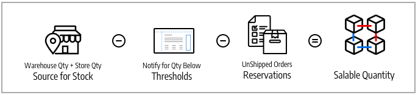

# Lager und Quellen

Verwalten Sie Ihr Inventar unabhängig von Lagerort, Produkt- oder Servicetyp oder Verkaufskanal. Erfüllen Sie Bestellungen und versenden Sie Produkte aus mehreren Lagern, stationären Geschäften, Vertriebszentren und Drop-Versand, um Bestellungen mit dem Schwerpunkt auf ausgewogenem Bestand, Versandkosten und mehr abzuschließen.

Diese Beschreibungen umfassen Produkte, Quellen und Lager für ein Fahrradunternehmen mit mehreren Versandstandorten und Websites in den USA und Europa.

## Quellen

[Quellen](sources-manage.md) sind die physischen Orte, an denen das Produktinventar verwaltet und zur Auftragserfüllung versendet wird oder an denen Services verfügbar sind. Zu diesen Standorten können Lagerhäuser, stationäre Läden, Vertriebszentren und Verlader gehören. [!DNL Commerce] verwendet die Mengen und verkaufbaren Mengen pro Lager und verwaltet die Lagerbestände automatisch für verwaltete Produkte und Bestellungen. Wenn Sie nur eine Quelle haben, werden Sie im _Einzel-Quelle_-Modus berücksichtigt. Wenn Sie mehrere Quellen haben, werden Sie im Modus _mehrere Quellen_ berücksichtigt.

Eine Quelle kann im Umfang der Lagerbestände in einem Lager Vorrang haben, jedoch nicht unbedingt in allen Lagern, da die Quelle in verschiedenen Lagern wiederverwendet werden kann. Die Anzahl der Lager und Quellen erhöht die Komplexität bei der Bestimmung des besten Lagers oder Speichers, um eine Bestellung zu erfüllen. Beispielsweise können Sie eine begrenzte Anzahl von Produkten von Ihren stationären Standorten mit einem umfangreichen Inventar in Ihren Lagern und Services an wichtigen Standorten mit begrenzter Verfügbarkeit zur Verfügung haben.

In diesem Beispiel verfügt der Händler über ein Mountainbike, das in Geschäften, Lagerhäusern und einem Drop-Shipper versendet werden kann.

{width="600" zoomable="yes"}

## Lager

[Stocks](stocks-manage.md) stellt ein virtuelles, aggregiertes Inventar von Produkten dar, die für Ihre Vertriebskanäle (Websites) zum Verkauf angeboten werden. Jedes Lager ordnet Ihre Vertriebskanäle den Quellen für verfügbare Lagerbestände und Verkaufsmengen zu. Abhängig von Ihrer Site-Konfiguration kann das Lager einem oder mehreren Vertriebskanälen und Quellen zugewiesen werden.

Sales Channel stellen Entitäten dar, die Ihren Bestand verkaufen, einschließlich Websites, Shop-Ansichten, B2B-Kundengruppen usw. Vertriebskanäle können nur einem Lager zugeordnet werden. Jedem Verkaufskanal kann nur ein Lager zugewiesen werden, und ein einzelnes Lager kann mehreren Websites zugewiesen werden. Über den Bestand können Sie die Priorisierung der beim Versand von Bestellungen verwendeten Quellen und den [Source-Auswahlalgorithmus](selection-reservations.md) ändern.

Sie beginnen mit einem Standardlager, das mit der standardmäßigen Source und Ihrer Website zugewiesen wird und am besten von Einzelhändler verwendet wird. Diesem Lager kann nur die Standard-Source zugewiesen werden. Händler, die mehrere Quellen nutzen, erstellen nach Bedarf benutzerdefinierte Lager für benutzerdefinierte Quellen und Websites.

{width="600" zoomable="yes"}

## Produktmengen

Die Menge ist die Anzahl der Produkte im aktiven Bestand, die zum Kauf verfügbar sind. Die Produktmenge erhöht sich und verringert sich, wenn Sie Lieferungen abschließen oder den Bestand anpassen. Das Hinzufügen von Produkten zu einem Warenkorb wirkt sich nicht auf diesen Betrag aus. Die Verkaufsmenge verfolgt die Verfügbarkeit des Produkts für einen Verkaufskanal und verwendet diesen Wert auch für die Ermittlung des verfügbaren Lagerbestands für den Kauf. Je nach Anzahl Ihrer Quellen können Sie die Produktmenge für eine der folgenden Aktionen anzeigen und verwalten:

- **Menge** - Bei Händlern mit einer einzigen Quelle verfolgen die _[!UICONTROL Quantity]_&#x200B;Spalte und der Wert die Menge des verfügbaren Lagerbestands.
- **Menge pro Source** - Bei Händlern mit mehreren Bezugsquellen verfolgen die _[!UICONTROL Quantity per Source]_&#x200B;und -werte den verfügbaren Lagerbestand nach Standort. Wenn Sie mehrere Quellen hinzufügen, ersetzt dieser Wert die Menge und listet alle Quellen und zugewiesenen Mengen auf.

Reservierungen verfolgen Lageranfragen für den gesamten Einkaufsprozess - Hinzufügen von Produkten zum Warenkorb, Abschließen des Checkouts und Verwalten von Rückerstattungen. Für verfügbare Lagerbestände und Lagerreservierungen reservieren Sie Lagerbestände pro Bestellung durch den Checkout-Prozess, abgezogen von der Verkaufsmenge. Reservierungen wandeln bei der Fakturierung und dem Versand von Produkten Mengenabzüge um.

Verkaufsmenge : Berechnet den virtuellen Bestand an Produkten (oder deren Verfügbarkeit) unter Verwendung konfigurierter Schwellenwerte, reservierter oder verkaufter Mengen und Mengen pro Quelle. Für jeden Bestand greift [!DNL Commerce] auf alle zugeordneten Quellen und Aggregate der zugehörigen Produktmengen zu. Mit diesem Basiswert werden dann alle Reservierungsbeträge und der _[!UICONTROL Notify for Quantity Below]_&#x200B;abgezogen.

{width="600" zoomable="yes"}

## Bestandskonfigurationen

Jedes Produkt, jede Quelle und jedes Lager umfasst mehrere Optionen zum Konfigurieren für Ihren Store auf globaler, Quell-, Lager- und Produktebene. Eine vollständige Liste dieser Optionen finden Sie unter [ von Inventory management](configuration.md).

Die folgenden Optionen sind für [!DNL Inventory Management] wichtig:

- **[!UICONTROL Out-of-Stock Threshold]** - Legt einen Betrag fest, der von der Verkaufsmenge abgezogen werden soll. Wenn Sie „Auftragsrückstände“ aktivieren, wird dieser Wert nicht von der Verkaufsmenge abgezogen.
- **[!UICONTROL Backorders]** - Legt fest, ob Produkte über einen Null-Bestand hinaus verkauft werden können, und speichert Bestellungen bis zur Wiederverfügbarkeit. Wenn Auftragsrückstände aktiviert sind, wird empfohlen, die [!UICONTROL Out-of-Stock Threshold] zu konfigurieren.

>[!NOTE]
>
>Der Schwellenwert für nicht vorrätige Artikel unterstützt negative und positive Beträge. Wenn Sie Nachbestellungen aktivieren, setzen Sie diesen Wert auf einen negativen Betrag für die maximale Anzahl von Produkten, die nachbestellt werden können, bevor das Produkt wirklich als nicht vorrätig angesehen wird.

## Inventory management-Demo

In diesem Video erfahren Sie mehr über Inventory management-Quellen und -Stocks:

>[!VIDEO](https://video.tv.adobe.com/v/343748?quality=12&learn=on)
