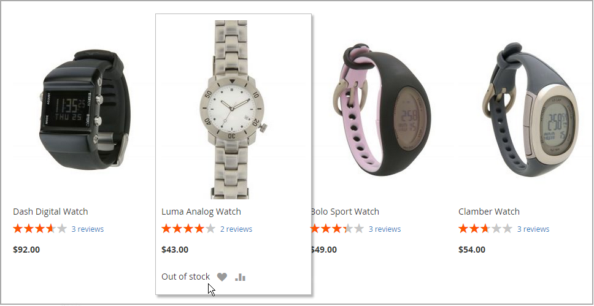

# Szenarien für Stock-Nachrichten

Sie können eine Kombination aus Konfigurationseinstellungen verwenden, um Nachrichten zur Verfügbarkeit von Lagern auf Produktseiten und in Listen von Produkten auf Katalogseiten zu steuern.

{width="600" zoomable="yes"}

## Stock-Nachrichten auf der Produktseite

Abhängig von der Kombination der Einstellungen „Stock verwalten“ und „Lagerverfügbarkeit“ gibt es für die Produktseite mehrere Varianten von Nachrichten.

### Beispiel 1: Verfügbarkeitsmeldung anzeigen

#### Szenario 1

Diese Kombination von Einstellungen führt dazu, dass die Verfügbarkeitsmeldung auf der Produktseite entsprechend der Lagerverfügbarkeit der einzelnen Produkte angezeigt wird.

| Aktienoptionen | Einstellung | Nachricht |
|--|--|--|
| [!UICONTROL Display product availability in stock in the frontend] | `Yes` | |
| [!UICONTROL Manage Stock] | `Yes` | |
| [!UICONTROL Stock Availability] | `In Stock` | _[!UICONTROL Availability: In Stock]_ |
| | `Out of Stock` | _[!UICONTROL Availability: Out of Stock]_ |

#### Szenario 2

Wenn das Lager nicht für ein Produkt verwaltet wird, kann diese Kombination von Einstellungen verwendet werden, um die Verfügbarkeitsmeldung auf der Produktseite anzuzeigen.

| Aktienoptionen | Einstellung | Nachricht |
|--|--|--|
| [!UICONTROL Display product availability in stock in the frontend] | `Yes` |  |
| [!UICONTROL Manage Stock] | `No` | _[!UICONTROL Availability: In Stock]_ |

### Beispiel 2: Verfügbarkeitsmeldung ausblenden

#### Szenario 1

Diese Kombination aus Konfigurations- und Produkteinstellungen verhindert, dass die Verfügbarkeitsmeldung auf der Produktseite angezeigt wird.

| Aktienoptionen | Einstellung | Nachricht |
|--|--|--|
| [!UICONTROL Display product availability in stock in the frontend] | `No` |  |
| [!UICONTROL Manage Stock] | `Yes` |  |
| [!UICONTROL Stock Availability] | `In Stock` | Keine |
|  | `Out of Stock` | Keine |

#### Szenario 2

Wenn Stock nicht für ein Produkt verwaltet wird, verhindert diese Kombination aus Konfiguration und Produkteinstellungen, dass die Verfügbarkeitsmeldung auf der Produktseite angezeigt wird.

| Aktienoptionen | Einstellung | Nachricht |
|--|--|--|
| [!UICONTROL Display product availability in stock in the frontend] | `No` |  |
| [!UICONTROL Manage Stock] | `No` | Keine |

## Stock-Nachrichten für Katalogseite

Je nach Produktverfügbarkeit und Konfigurationseinstellungen sind für die Kategorie- und Suchergebnislisten die folgenden Anzeigeoptionen möglich.

{width="600" zoomable="yes"}

### Beispiel 1: Produkt mit der Nachricht „Nicht vorrätig“ anzeigen

Diese Kombination von Konfigurationseinstellungen umfasst nicht vorrätige Produkte in den Kategorie- und Suchergebnislisten und zeigt eine Meldung „Nicht vorrätig“ an.

| Aktienoptionen | Einstellung | Nachricht |
|--|--|--|
| [!UICONTROL Display Out of Stock Products] | `Yes` |  |
| [!UICONTROL Display product availability in stock in the frontend] | `Yes` | _[!UICONTROL Out of stock]_ |
| [!UICONTROL Display Out of Stock Products] | `Yes` |  |
| [!UICONTROL Display product availability in stock in the frontend] | `No` | Keine |

### Beispiel 2: Produkt ohne Nachricht „Nicht vorrätig“ anzeigen

Diese Kombination von Konfigurationseinstellungen umfasst nicht vorrätige Produkte in den Kategorie- und Suchergebnislisten, zeigt jedoch keine Meldung an.

| Aktienoptionen | Einstellung | Nachricht |
|--|--|--|
| [!UICONTROL Display Out of Stock Products] | `Yes` | Keine |
| [!UICONTROL Display product availability in stock in the frontend] | `No` |  |

### Beispiel 3: Produkt ausblenden bis wieder auf Lager

Bei dieser Konfigurationseinstellung werden nicht mehr vorrätige Produkte vollständig aus der Kategorie- und Suchergebnisliste entfernt, bis sie wieder vorrätig sind.

| Aktienoptionen | Einstellung | Nachricht |
|--|--|--|
| [!UICONTROL Display Out of Stock Products] | `No` | Keine |
