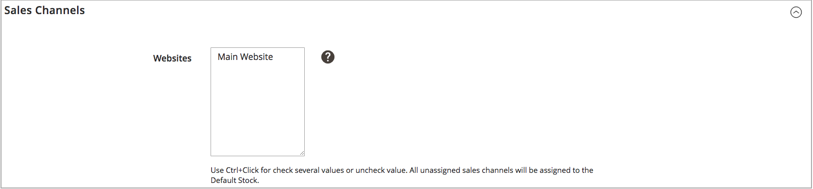

# Hinzufügen eines Lagers

Stocks ordnet Ihre Quellen den Vertriebskanälen (oder Websites) zu und stellt so einen direkten Link zu den Verkaufsmengen und Produktbeständen bereit.

Beim Erstellen eines benutzerdefinierten Lagers weisen Sie Websites und Quellen zu. Quellen können aktivierte und deaktivierte Quellen sein. Sie können beispielsweise ein Lager zu Ihrem Lager hinzufügen, um den Lagerort für die Verwaltung des Lagers zu öffnen und Lieferungen abzuschließen.

Nachdem Sie Quellen hinzugefügt haben, müssen Sie die Reihenfolge für die Quellen von oben (erste) bis unten (letzte) priorisieren. Diese Bestellung wirkt sich auf Empfehlungen während des Bestellversands aus.

{width="600" zoomable="yes"}

## Hinzufügen des Lagerbestands

1. Navigieren Sie in _Admin_-Seitenleiste zu **[!UICONTROL Stores]** > _[!UICONTROL Inventory]_>**[!UICONTROL Stock]**.

1. Klicken Sie auf **[!UICONTROL Add New Stock]**.

1. Erweitern Sie  den Abschnitt **[!UICONTROL General]** und geben Sie einen eindeutigen **[!UICONTROL Name]** ein, um den neuen Bestand zu identifizieren.

   {width="350" zoomable="yes"}

1. Erweitern Sie  den Abschnitt **[!UICONTROL Sales Channels]** und wählen Sie die **[!UICONTROL Websites]** aus, in der dieses Lager verfügbar ist.

   Für eine Multisite-Installation halten Sie die Strg-Taste (PC) oder die Befehlstaste (Mac) gedrückt und klicken auf jede Website.

   >[!NOTE]
   >
   >Wenn Sie eine Website oder einen Vertriebskanal auswählen, der einem anderen Lager zugewiesen ist, wird die Zuweisung für dieses Lager aufgehoben. Alle Sales Channel, die keinem benutzerdefinierten Lager zugewiesen sind, werden dem Standardlager zugewiesen.

   {width="350" zoomable="yes"}

1. Erweitern Sie  den Abschnitt &quot;**[!UICONTROL Sources]**&quot; und führen Sie folgende Schritte für alle Stock-Typen aus, die nicht dem Standard entsprechen:

   - Klicken Sie auf **[!UICONTROL Assign Sources]**.

   {width="350" zoomable="yes"}

   - Aktivieren Sie Kontrollkästchen für alle Quellen, die Sie dem Lager zuweisen möchten.

   >[!IMPORTANT]
   >
   >Wenn Sie dieselbe Quelle mehreren Lagern zuweisen, kann dies zu einem Überverkauf der Produkte führen, die dieser Quelle zugewiesen sind.

   - Klicken Sie auf **[!UICONTROL Done]**.

     Die hinzugefügten Quellen werden unter Zugewiesene Quellen angezeigt.

     {width="600" zoomable="yes"}

1. Verwenden Sie , um die Quellen per Drag-and-Drop von oben (erste) nach unten (letzte) in eine Priorität zu ziehen.

   Die Quellbestellung ist beim Versand von Bestellungen wichtig.

   {width="600" zoomable="yes"}

1. Wählen Sie im Menü _[!UICONTROL Save]_() die Option **[!UICONTROL Save & Close]**.

## Feldbeschreibungen

| Feld | Beschreibung |
|--|--|
| **[!UICONTROL General]** | |
| [!UICONTROL Name] | Name des Lagers. Beispiel: `UK Stock`, `US Stock` |
| **[!UICONTROL Sales Channels]** | |
| [!UICONTROL Websites] | Definiert den [Umfang](../getting-started/websites-stores-views.md#scope-settings) des Lagers, indem der Bestand bestimmten Websites als &quot;_&quot;_. Wählen Sie eine oder mehrere Websites pro Lager aus. Jede Website kann nur einem Lager zugewiesen werden. |
| **[!UICONTROL Sources]** | |
| [!UICONTROL Assign Sources] | Weist diesem Lager Lagerbestandsquellen zu. Benutzerdefinierte Quellen können nicht dem Standardbestand zugewiesen werden. |
| [!UICONTROL Assigned Sources] | Liste der zugewiesenen Quellen. Ziehen Sie die Quellen per Drag-and in eine nach Priorität sortierte Reihenfolge für die Auftragserfüllung und den Versand.  **[!UICONTROL Code]**- Eindeutige Code-ID für die Quelle. **[!UICONTROL Name]** - Namensbeschreibung für die Quelle. **[!UICONTROL Unassign]**- Entfernen Sie die zugewiesene Quelle aus dem Lager mithilfe . |
